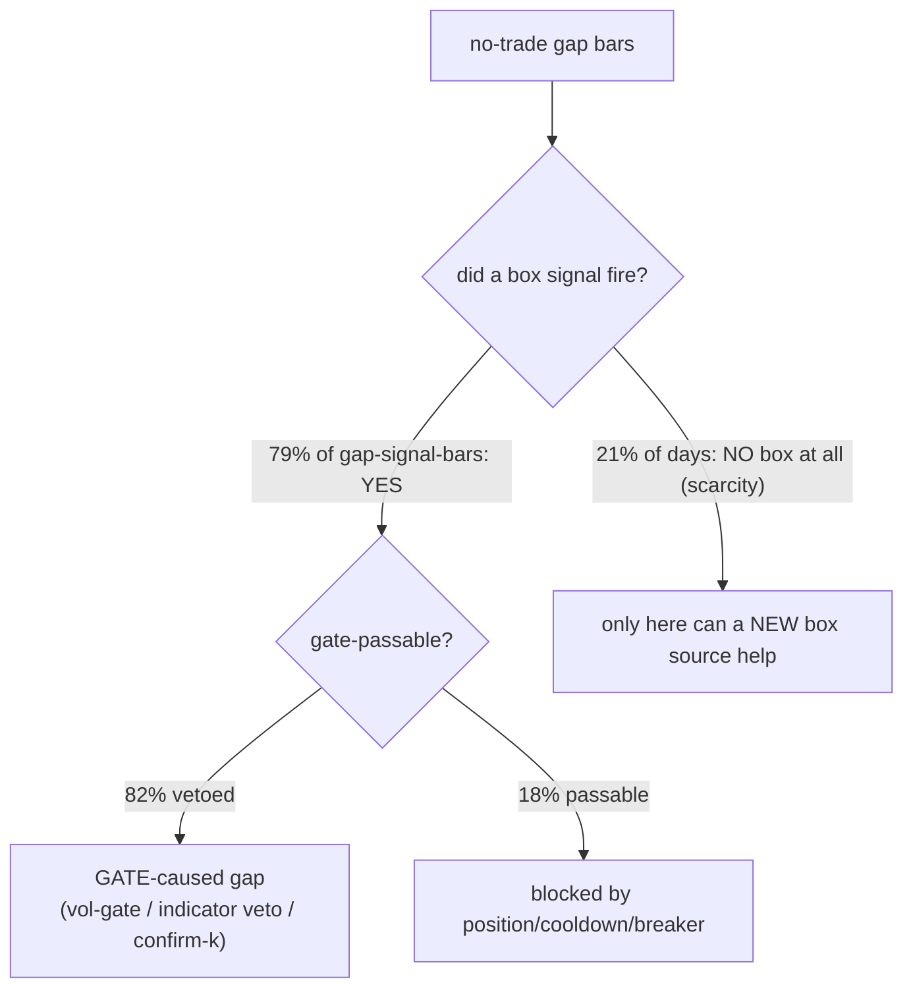

# Research note — "sleeping days" (no-trade gaps): diagnosis + the daily-boxes idea

*Investigation into the long stretches where the strategy takes no trade ("sleeping days"), prompted by the
idea of adding **daily boxes** (for L1 and L2) to fill them. **Status: PAUSED mid-brainstorm** — diagnosis done,
design fork open. This note is the resume point.*

---

## 0. TL;DR

The sleeping days are **gate-caused, not signal-caused.** On the deployed L1 champion, during the no-trade
gaps **82% of box signals fired but were vetoed** by the vol-gate + indicator committee; only **21% of trading
days have no box signal at all**. Therefore **adding more boxes (daily or otherwise) is a minor lever** — it
adds signal *supply* when the bottleneck is the *gate*, and the same gate would veto most new daily-box signals.
It cannot touch the *longest* gaps (which already have vetoed signals). The high-leverage levers are **L2** (the
layer that exists to trade L1's vetoed/dropped signals), **gate tuning / the `decision_pause` objective**, or a
**looser orthogonal gate** — not more box sources. **Open decision: which cause to target (see §6).**

---

## 1. The problem

The strategy has long stretches with **no entry**. The metric is `optimize/no_entry.py:no_entry_metrics` —
the max bar-distance between consecutive entries, converted to days (`bars × bar_hours / 24`). The optimizer
already exposes `--objective decision_pause`, which *minimizes* `max_no_entry_days_decision` (warmup-excluded)
as the 3rd objective instead of win-rate. So "fewer sleeping days" is an existing, optimizable goal.

---

## 2. Method

On the **deployed L1 champion** (`payload.run_l1_cached("4h")`, 2,119 4h bars, full research period):

1. Take the entry indices from the taken ledger; compute the gap list `(start, length)` between consecutive
   entries (+ leading gap).
2. For each gap window, count **raw box signals** (`sig_int != 0` — gate-independent) and how many of those
   would **pass the L1 gate** (`vol_gate ∧ ¬veto ∧ confirm`).
3. Classify each gap: **SCARCITY** (no raw signal), **VETO** (signals fired, none gate-passable), **MIXED**.
4. Calendar view: trading days with an entry, vs days with ≥1 raw box signal, vs days with none.

(Reproducible from `scratch/sleep_analysis.py` — uses `l1.sig_int / vol_gate / veto / confirm / ledger`.)

---

## 3. Findings (numbers)

| metric | value |
|---|--:|
| 4h bars / entries | 2,119 / 255 |
| **Longest no-trade gap** | **11.5 days** (69 bars) · trailing 2.7 d |
| Trading days with ≥1 entry | 207 / 431 (**48%**) → **224 zero-trade days** |
| Raw box signals *inside* no-trade gaps | **823** |
| …of those, gate-PASSABLE | **149 (18%)** |
| Trading days with **≥1 raw box signal** | 340 / 431 (79%) |
| Trading days with **NO box signal at all** (true scarcity) | **91 (21%)** |

Top no-trade gaps (scarcity vs veto):

| days | bars | raw box sigs | would-pass-gate | verdict |
|--:|--:|--:|--:|--|
| 11.5 | 69 | 38 | 1 | MIXED |
| 7.0 | 42 | 18 | 1 | MIXED |
| 5.8 | 35 | 5 | 0 | VETO |
| 5.2 | 31 | 5 | 0 | VETO |
| 4.8 | 29 | 13 | 1 | MIXED |
| 4.8 | 29 | 3 | 0 | VETO |

**The longest gaps all had box signals — they were vetoed, not absent.**

---

## 4. Diagnosis

**Gate-dominated.** Signals are plentiful (79% of days have one); the gate rejects 82% of the in-gap ones. The
worst gaps (11.5 d, 7 d) are gate-caused, not scarcity. So the sleeping-days problem is fundamentally about the
**selectivity of the gate**, not the **supply of signals**.

Caveat (makes gate-domination *stronger*, not weaker): the gap window includes time the strategy was **in a
position** (can't re-enter), so some of the "18% gate-passable" were also blocked by position-carry/cooldown —
i.e. even fewer than 18% were genuinely takeable. Signal supply is not the binding constraint.

---

## 5. Evaluation of the "daily boxes" idea

**Architectural note:** boxes are *already daily-anchored* — `box_lookup` keys **one box per market date**
(candle hour ≥ 18 → next day), and the 4h frame trades *within* the day against that day's box. There is no 1d
*decision* frame (TIMEFRAMES = 1m/2m/5m/15m/1h/2h/4h). So "daily boxes" most plausibly means **a second box
source derived from daily price structure** (different levels than the current boxes), feeding L1 and/or L2.

**Verdict on it as a sleeping-days fix:** *minor lever, wrong target.*
- It adds **signal supply**, which only addresses the **~21% genuine-scarcity** days.
- It **cannot touch the longest gaps** (those already have signals — they're vetoed).
- New daily-box signals **face the same gate** that already vetoes 82% of signals, so most would be vetoed too.
- Net expected dent in sleeping days: small, and concentrated on the least-painful (already-quiet) days.

It is *not useless* — on the 91 true-scarcity days a new orthogonal box source is the only thing that can
create a signal — but it is not where the leverage is.

---

## 6. The high-leverage levers (the open design fork)

1. **L2 gap-coverage (highest leverage).** L2 is *literally the layer that trades L1's dropped/vetoed signals* —
   the 82%-vetoed in-gap signals **are L2's input**. "Fix sleeping days" ≈ "make the combined L1+L2 book cover
   L1's gaps." **Not yet measured:** how much does the *combined* book already shrink the 11.5-day gap, and how
   much further could a wider L2 go? → the natural first step.
2. **Gate tuning / `decision_pause` objective.** Loosen vol-gate / veto / confirm-`k`, or run the existing
   `--objective decision_pause` mode to search parameter sets that trade more (PnL ↔ activity trade-off,
   governed by the DD≤25%·P/L feasibility cap, relaxable via `--dd-pnl-cap`).
3. **A looser/orthogonal second gate** for quiet regimes.
4. **Daily boxes** (§5) — minor, scarcity-only.

**Open clarifying questions (unanswered — resume here):**
- What is the *goal*: minimize the worst gap? raise % of days-with-a-trade? more exposure/PnL? (each → different fix)
- Confirm what "daily boxes" means (new daily-structure box source vs a daily decision frame).
- "for L2 and for L1": new signal into both layers, or L2 as the dedicated gap-filler?

---

## 7. Resume pointer

PAUSED mid-`brainstorming` (step: clarifying questions). To resume: re-open the §6 fork. **Recommended first
action: the L1+L2 combined gap analysis** (does L2 already shrink the 11.5-day gap, and by how much?) — that
single measurement decides whether the answer is "widen L2" (likely) vs "tune the gate" vs "daily boxes"
(unlikely). Analysis harness: `scratch/sleep_analysis.py` (extend it to run `engine.run_l2` + combine the books,
then recompute `no_entry_metrics` on the merged entry indices).

*Related: `docs/XINST_ES_L1_VERDICT.md`, `docs/PERFORMANCE.md` (`decision_pause` machinery),
`optimize/no_entry.py`.*
