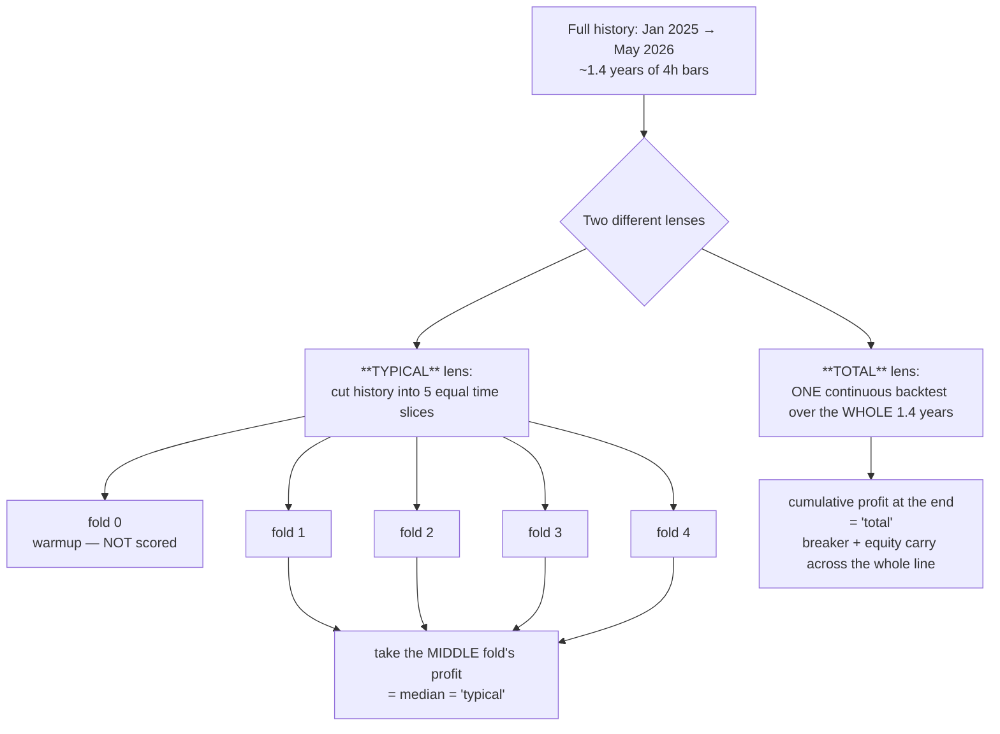

# Typical profit vs Total profit — what's the difference? 🍼

In the WS-I results you see two money columns per strategy: **"typical profit"** and **"total
profit over all history."** They measure *different things* and are **not** versions of the same
number. This doc explains exactly what each one is, why they differ, and how to read them together.

---

## 1. The one-paragraph answer

- **Total profit** = run the strategy **once, straight through the entire history** (Jan 2025 →
  May 2026, ~1.4 years) and read the final cumulative profit. It's the **headline** number — "how
  much money would this have made, start to finish."
- **Typical profit** = chop that same history into **5 equal time-slices ("folds")**, score the
  strategy **separately** on each, and report the **median** (middle) slice's profit. It answers a
  *different* question — "in a **normal stretch**, not a lucky one, what does a slice earn?" It's a
  **robustness / consistency** number, deliberately blind to the single best and single worst slice.

One is *cumulative over everything*; the other is *the middle of several independent chunks*.

---

## 2. Why two numbers at all?

Because a single big total can lie. A strategy can post a huge total profit on the back of **one
freak winning stretch** while losing or flat-lining the rest of the time — that's the classic
shape of an **overfit** strategy that won't repeat. The median-fold ("typical") number is the
antidote: if four independent slices all look healthy, the edge is more likely *real* and
*repeatable*, not a one-off.

So we optimise for **typical** (consistency) and report **total** (headline) — and we get nervous
when the two disagree wildly.

---

## 3. The real example — the 4h champion

Here are the **actual** numbers for the 4h winning strategy. Its 1.4-year history splits into 5
folds; fold 0 is a warm-up (used only to calibrate the volatility gate, never scored), folds 1–4
are scored:

                        
                        

                    

📊 each bar is the profit of one ~3-month slice. The green dashed line is their median — the
**typical** profit.

- Fold profits: **−$4,738 · $23,267 · $43,350 · $25,238**
- **Typical profit = median of those four = $24,253.** (The middle of the pack — it ignores the
  unlucky −$4.7k fold *and* the lucky $43k fold.)
- **Total profit = $56,040** — the single continuous run over all 1.4 years (including the warm-up
  period that the folds skip).

---

## 4. The trap: "shouldn't total = typical × 5?" — No.

Five folds, so you'd expect total ≈ 5 × typical, or at least total ≈ the sum of the folds. **Neither
holds**, and that's not a bug:

                            

                    

The sum of the four folds is **$87,117**, yet the total is only **$56,040**. Three
reasons they diverge:

1. **The warm-up fold is in the total but not the typical.** Fold 0 (Jan–Apr 2025) is excluded from
   the median calculation but *is* part of the one continuous full-history run. Its profit (good or
   bad) lands in the total only.
2. **The drawdown breaker carries state in the total run, but resets each fold.** In the single
   continuous run, one bad drawdown can trip the circuit-breaker and **lock out trades** that an
   isolated fold (starting fresh) would happily have taken. So the continuous run is usually *more
   conservative* than the folds added up.
3. **The volatility gate is calibrated differently.** Each fold freezes its gate threshold on the
   data *before that fold*; the full run freezes it once on 2025. Different gates → slightly
   different trades taken.

**Takeaway:** they're two camera angles on the same strategy, not a number and its multiple. Don't
try to reconcile them arithmetically.

---

## 5. How the two are computed (precise)

| | **Typical profit** | **Total profit** |
|---|---|---|
| Code | `median_pnl` from `score_walkforward()` | `full_pnl` from `backtest_metrics(window="full")` |
| Span | median of folds 1–4 (each ≈ 3 months) | the entire history in one run (~1.4 yr) |
| Breaker/equity | resets per fold | carries across the whole timeline |
| Gate threshold | frozen on each fold's own past | frozen once on 2025 |
| Question it answers | "is the edge **consistent**?" | "what's the **headline** total?" |
| Role in the search | **optimisation objective** (maximise) | **feasibility check** (DD ≤ 25% of it) |

---

## 6. Every timeframe's two numbers

| TF | TYPICAL (median fold) | TOTAL (full history) | total ÷ typical |
|---|--:|--:|--:|
| 4h | $24,253 | $56,040 | 2.3× |
| 2h | $15,132 | $55,836 | 3.7× |
| 1h | $12,284 | $33,280 | 2.7× |
| 15m | $10,538 | $33,676 | 3.2× |
| 5m | $9,943 | $36,710 | 3.7× |
| 2m | $4,474 | $18,857 | 4.2× |
| 1m | $1,876 | $7,681 | 4.1× |

The ratio wanders (some TFs ~2×, some higher) for exactly the reasons in §4 — it is **not**
meant to be 5×. A very high ratio with a low typical is a flag to inspect the per-fold spread for
one-lucky-fold overfitting.

---

## 7. How to read them together (cheat-sheet)

- **High typical + high total** → consistent *and* big. The best case. (4h: $24k typical, $56k total.)
- **Low/negative typical + high total** → ⚠️ probably **one lucky fold** carrying it. Treat with
  suspicion; check the per-fold bars before trusting.
- **High typical + modest total** → consistent but the breaker/warm-up dragged the continuous run;
  usually a *safe* sign (the strategy is steady, the breaker is protecting it).
- **Both low** → weak edge.

When in doubt, the **typical (median-fold)** number is the more trustworthy guide to whether an edge
will survive into the future; the **total** is the headline you'd quote for the full backtest.

---

_Generated by `docs/charts/build_profit_doc.py`. Fold numbers recomputed from `optimize/studies/wsh.db`
(the 4h champion); per-TF table from `optimize/results/wsi_leaderboard.csv`._
