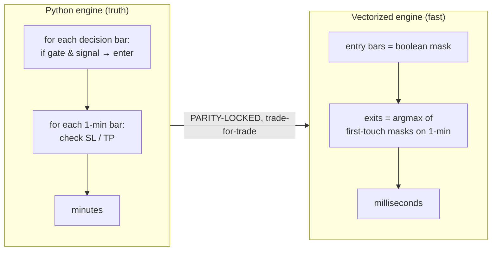
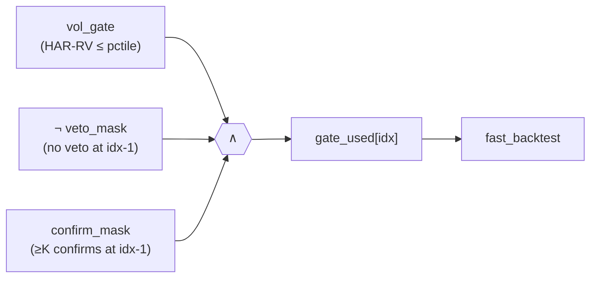

# Vectorization — turning the minute-loop backtest into numpy scans

## 0. Why
The verified engine (`engine.SimpleStrategy`) walks 1-minute bars in a Python loop — correct, but
~minutes per 1m-timeframe backtest. The optimiser needs **thousands** of backtests. The vectorized
engine (`optimize/fast_engine.py`) reproduces the **exact same trades** with numpy boolean scans
(`argmax` on first-touch masks), turning minutes into milliseconds. WS-I.7 extends this to the
indicator layer by folding confirm/veto into a **precomputed per-bar gate** — so adding indicators
costs almost nothing in the hot loop.


> 📊 **Interactive:** [`charts/engine_vs_fast.html`](charts/engine_vs_fast.html) — measured wall-clock
> for one real 4h backtest, Python engine vs vectorized (log scale).

## 1. The decision → exit pipeline (per trade)
```
 decision frame (any TF)         1-minute frame (exit resolution)
  Date, Close, signal             Date, High, Low, Close
        │                                  │
        ▼                                  │
  entry bar idx (idx≥1):                   │
    d = signal[idx-1] (post-flip)          │
    gated by gate[idx]                     │
    entry price ep = close[idx-1]          │
    entry time et = date[idx]              │
        │   e = searchsorted(m_dates, et)  │  (first 1-min bar ≥ entry time — no look-ahead)
        ▼                                  ▼
   ┌──────────────── exit, resolved on the 1-min slice [e:] ────────────────┐
   │ long:  t_slh = first( low  ≤ ep−sl_hard )     (hard SL, fill at line)   │
   │        t_tph = first( high ≥ ep+tp     )      (hard TP, fill at line)   │
   │        t_soft= 2nd of two consecutive closes ≤ ep−sl_soft (fill close) │
   │ short: mirrored.   flip: TP/SL priority swapped, soft on the TP side.  │
   │ pick EARLIEST hit; ties broken by priority order (hard-SL>hard-TP>soft)│
   └────────────────────────────────────────────────────────────────────────┘
        │  exit time xt, fill price → pnl_points
        ▼
   block re-entry until a decision bar with date > xt   (searchsorted advance)
```
`_first_true(mask) = argmax(mask) if mask.any() else -1` is the vectorized "first touch". The
"2 consecutive closes" soft rule is `breach[1:] & breach[:-1]` → first True + 1. (`fast_engine.py`.)

## 2. Where indicators plug in — the GATE (WS-I.7)
The engine already takes a per-decision-bar boolean `gate`. The indicator layer is folded **into that
gate** — no change to the hot exit loop:

All three are per-decision-bar boolean arrays, **aligned to the entry bar** (entry at `idx` reads the
just-closed signal bar `idx-1`):
- `runner.veto_mask(df, box, inds)` → `mask[idx] = (any enabled veto-capable indicator VETOes at idx-1)`.
- `runner.confirm_mask(df, box, inds, k)` → `mask[idx] = (#enabled confirm-capable CONFIRM at idx-1 ≥ K_eff)`,
  `K_eff = min(K, #confirm-capable-enabled)`; no confirmers ⇒ all-True.
- Alignment: `out[1:] = raw[:-1]`, `out[0] = True/identity` (bar 0 never enters).

```
 per-decision-bar vote arrays (from indicators, on closed bars)
   confirmers:  v1 v2 v3 ...   ── count CONFIRM per bar ──►  cc[j]   ── ≥K_eff ──►  ok_sig[j]
   vetoers:     u1 u2 ...       ── OR of VETO per bar ─────►  raw_veto[j]
                                                  shift +1 (align to entry bar idx = signal idx-1)
   gate_used = vol_gate ∧ ¬shift(raw_veto) ∧ shift(ok_sig)        → fed to fast_backtest
```

## 3. Step-by-step (one optimiser trial, `optimize/core.backtest_metrics`)
1. **Slice** the decision frame + 1-min frame to the window; align `vf` (HAR-RV forecast).
2. **Vol gate:** `gate = vf ≤ percentile(vf[:n_split], gate_pct)` (causal threshold; 0 ⇒ no gate).
3. **Indicators (if any in params):** `inds = library.from_specs(specs)`; if any enabled,
   `gate = base ∧ ¬veto_mask(d,box,inds) ∧ confirm_mask(d,box,inds,K)`.
4. **Signals:** `sig_int` (long/short/hold → +1/−1/0), precomputed once (param-independent).
5. **fast_backtest(...)** → completed trades (vectorized exits).
6. **Drawdown breaker overlay** (global-HWM, identical math to `strategy.build_payload`): apply
   `dd_limit`/`cooldown`; collect taken trades.
7. **Metrics:** pnl, max_dd, win, pf, exposure, per-year P/L, n_taken, …

## 4. Scope & faithfulness (what the fast path does and does NOT model)
- ✅ **Confirm/veto as an immediate-fill GATE** — exact: entry at `close[idx-1]`, fill price
  unchanged. This is what the optimiser searches.
- ❌ **Retrace/wait fill + live-carry resolver** — these change *entry price/time* and carry an armed
  setup across HOLD bars; they live in the **exact dashboard engine** only. The optimiser keeps them
  off; a chosen winner is re-validated on the dashboard (where retrace/wait apply).
- This is a deliberate, documented boundary — never a silent approximation.

## 5. Parity locks (the contract)
| Lock | What it proves | Result |
|---|---|---|
| `optimize/test_parity.py` | `core.backtest_metrics` (box only) == `strategy.build_payload` | **+$7,735 / $3,670 / 66** |
| `optimize/test_fast_parity.py` | `fast_backtest` == `SimpleStrategy` across normal/flip/gate/wide/tight | **OK** |
| `optimize/test_indicator_parity.py` | gate = vol∧¬veto∧confirm: `fast_backtest` == `SimpleStrategy` (5 indicator configs) + all-off==vol_gate | **OK** |

Determinism: same inputs + code ⇒ identical trades regardless of speed path. The vectorized engine is
only ever used because these locks hold.
