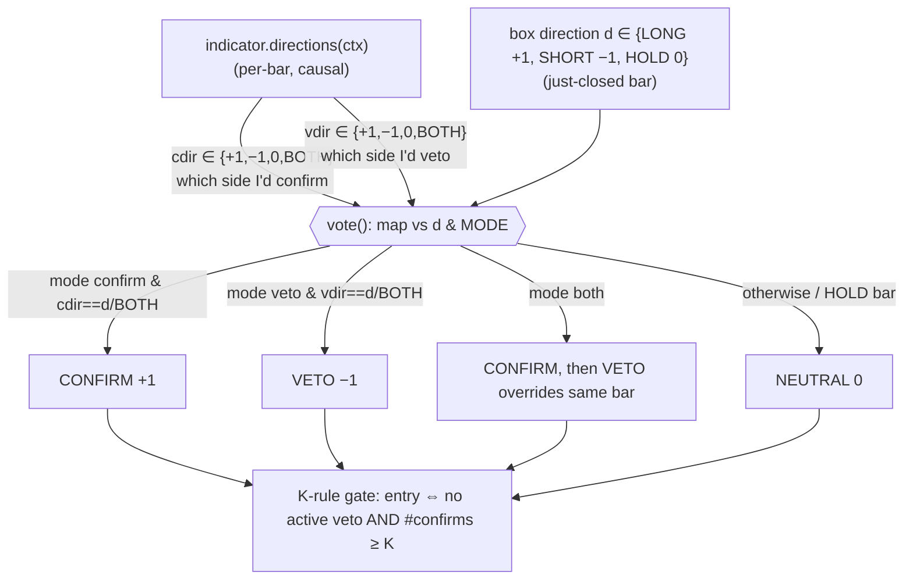
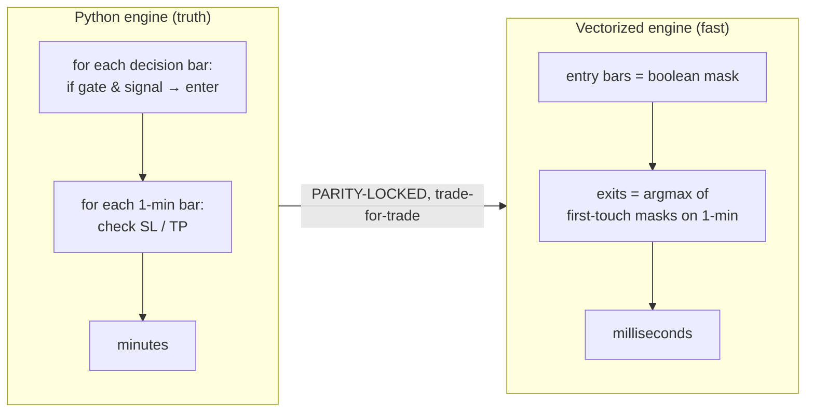
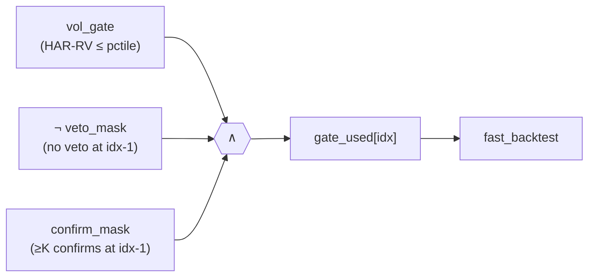
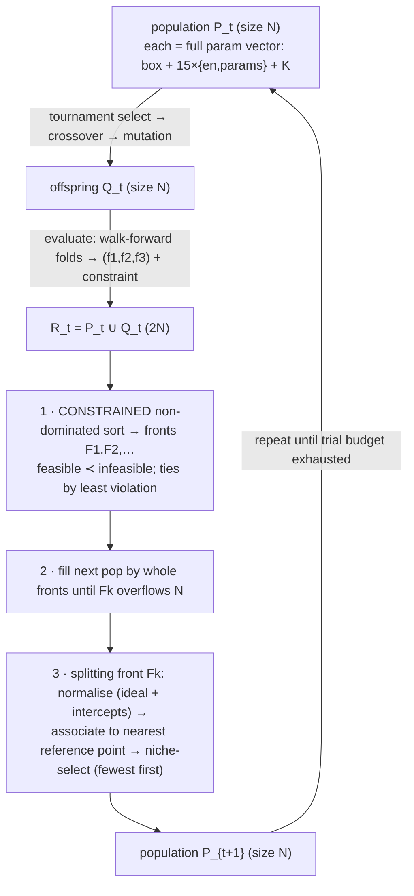

# WS-I — Mega Documentation (indicators · vectorization · NSGA-III)

> **Generated** by `docs/charts/build_megadoc.py` — combines `INDICATOR_LOGIC.md`, `VECTORIZATION.md`, `NSGA3.md` with the Plotly charts inlined (CDN plotly.js) and Mermaid diagrams. Mermaid renders on GitHub/VS Code; the inline Plotly renders in VS Code preview / mkdocs / a browser (a standalone-chart link is kept as a GitHub fallback).

**Contents:** [1 · Indicator logic](#indicator-logic--the-15-judges-golf) · [2 · Vectorization](#vectorization--turning-the-minute-loop-backtest-into-numpy-scans) · [3 · NSGA-III](#nsga-iii--many-objective-search-for-the-indicator-layer)

---


# Indicator Logic — the 15 judges (+ golf)

Every indicator is a **judge** over the box's per-bar direction. It never sets direction; it only
**confirms**, **vetoes**, or stays **neutral**. This doc gives the exact rule for each.

## 1. The vote model (shared by all)

<div>                        <script>window.PlotlyConfig = {MathJaxConfig: 'local'};</script>
        <script charset="utf-8" src="https://cdn.plot.ly/plotly-3.5.0.min.js" integrity="sha256-fHbNLP+GlIXN+efbQec78UkemUz3NJp7UmfGxC1tNxs=" crossorigin="anonymous"></script>                <div id="17cd0601-b799-4fe0-8837-44e91aac3dba" class="plotly-graph-div" style="height:460px; width:100%;"></div>            <script>                window.PLOTLYENV=window.PLOTLYENV || {};                                if (document.getElementById("17cd0601-b799-4fe0-8837-44e91aac3dba")) {                    Plotly.newPlot(                        "17cd0601-b799-4fe0-8837-44e91aac3dba",                        [{"marker":{"color":"#2e7d32"},"name":"confirm","x":["ema_trend","sma_trend","macd","vwap","keltner","obv","cci","rsi","stochastic","mfi","bollinger","adx","structure_trend","order_block","fvg"],"y":[360,264,469,720,558,518,242,477,285,412,0,0,407,186,305],"type":"bar"},{"marker":{"color":"#b71c1c"},"name":"veto","x":["ema_trend","sma_trend","macd","vwap","keltner","obv","cci","rsi","stochastic","mfi","bollinger","adx","structure_trend","order_block","fvg"],"y":[0,0,0,0,0,0,88,346,538,411,121,495,413,222,229],"type":"bar"},{"marker":{"color":"#9e9e9e"},"name":"neutral","x":["ema_trend","sma_trend","macd","vwap","keltner","obv","cci","rsi","stochastic","mfi","bollinger","adx","structure_trend","order_block","fvg"],"y":[469,565,360,109,271,311,499,6,6,6,708,334,9,421,295],"type":"bar"}],                        {"template":{"data":{"barpolar":[{"marker":{"line":{"color":"white","width":0.5},"pattern":{"fillmode":"overlay","size":10,"solidity":0.2}},"type":"barpolar"}],"bar":[{"error_x":{"color":"#2a3f5f"},"error_y":{"color":"#2a3f5f"},"marker":{"line":{"color":"white","width":0.5},"pattern":{"fillmode":"overlay","size":10,"solidity":0.2}},"type":"bar"}],"carpet":[{"aaxis":{"endlinecolor":"#2a3f5f","gridcolor":"#C8D4E3","linecolor":"#C8D4E3","minorgridcolor":"#C8D4E3","startlinecolor":"#2a3f5f"},"baxis":{"endlinecolor":"#2a3f5f","gridcolor":"#C8D4E3","linecolor":"#C8D4E3","minorgridcolor":"#C8D4E3","startlinecolor":"#2a3f5f"},"type":"carpet"}],"choropleth":[{"colorbar":{"outlinewidth":0,"ticks":""},"type":"choropleth"}],"contourcarpet":[{"colorbar":{"outlinewidth":0,"ticks":""},"type":"contourcarpet"}],"contour":[{"colorbar":{"outlinewidth":0,"ticks":""},"colorscale":[[0.0,"#0d0887"],[0.1111111111111111,"#46039f"],[0.2222222222222222,"#7201a8"],[0.3333333333333333,"#9c179e"],[0.4444444444444444,"#bd3786"],[0.5555555555555556,"#d8576b"],[0.6666666666666666,"#ed7953"],[0.7777777777777778,"#fb9f3a"],[0.8888888888888888,"#fdca26"],[1.0,"#f0f921"]],"type":"contour"}],"heatmap":[{"colorbar":{"outlinewidth":0,"ticks":""},"colorscale":[[0.0,"#0d0887"],[0.1111111111111111,"#46039f"],[0.2222222222222222,"#7201a8"],[0.3333333333333333,"#9c179e"],[0.4444444444444444,"#bd3786"],[0.5555555555555556,"#d8576b"],[0.6666666666666666,"#ed7953"],[0.7777777777777778,"#fb9f3a"],[0.8888888888888888,"#fdca26"],[1.0,"#f0f921"]],"type":"heatmap"}],"histogram2dcontour":[{"colorbar":{"outlinewidth":0,"ticks":""},"colorscale":[[0.0,"#0d0887"],[0.1111111111111111,"#46039f"],[0.2222222222222222,"#7201a8"],[0.3333333333333333,"#9c179e"],[0.4444444444444444,"#bd3786"],[0.5555555555555556,"#d8576b"],[0.6666666666666666,"#ed7953"],[0.7777777777777778,"#fb9f3a"],[0.8888888888888888,"#fdca26"],[1.0,"#f0f921"]],"type":"histogram2dcontour"}],"histogram2d":[{"colorbar":{"outlinewidth":0,"ticks":""},"colorscale":[[0.0,"#0d0887"],[0.1111111111111111,"#46039f"],[0.2222222222222222,"#7201a8"],[0.3333333333333333,"#9c179e"],[0.4444444444444444,"#bd3786"],[0.5555555555555556,"#d8576b"],[0.6666666666666666,"#ed7953"],[0.7777777777777778,"#fb9f3a"],[0.8888888888888888,"#fdca26"],[1.0,"#f0f921"]],"type":"histogram2d"}],"histogram":[{"marker":{"pattern":{"fillmode":"overlay","size":10,"solidity":0.2}},"type":"histogram"}],"mesh3d":[{"colorbar":{"outlinewidth":0,"ticks":""},"type":"mesh3d"}],"parcoords":[{"line":{"colorbar":{"outlinewidth":0,"ticks":""}},"type":"parcoords"}],"pie":[{"automargin":true,"type":"pie"}],"scatter3d":[{"line":{"colorbar":{"outlinewidth":0,"ticks":""}},"marker":{"colorbar":{"outlinewidth":0,"ticks":""}},"type":"scatter3d"}],"scattercarpet":[{"marker":{"colorbar":{"outlinewidth":0,"ticks":""}},"type":"scattercarpet"}],"scattergeo":[{"marker":{"colorbar":{"outlinewidth":0,"ticks":""}},"type":"scattergeo"}],"scattergl":[{"marker":{"colorbar":{"outlinewidth":0,"ticks":""}},"type":"scattergl"}],"scattermapbox":[{"marker":{"colorbar":{"outlinewidth":0,"ticks":""}},"type":"scattermapbox"}],"scattermap":[{"marker":{"colorbar":{"outlinewidth":0,"ticks":""}},"type":"scattermap"}],"scatterpolargl":[{"marker":{"colorbar":{"outlinewidth":0,"ticks":""}},"type":"scatterpolargl"}],"scatterpolar":[{"marker":{"colorbar":{"outlinewidth":0,"ticks":""}},"type":"scatterpolar"}],"scatter":[{"fillpattern":{"fillmode":"overlay","size":10,"solidity":0.2},"type":"scatter"}],"scatterternary":[{"marker":{"colorbar":{"outlinewidth":0,"ticks":""}},"type":"scatterternary"}],"surface":[{"colorbar":{"outlinewidth":0,"ticks":""},"colorscale":[[0.0,"#0d0887"],[0.1111111111111111,"#46039f"],[0.2222222222222222,"#7201a8"],[0.3333333333333333,"#9c179e"],[0.4444444444444444,"#bd3786"],[0.5555555555555556,"#d8576b"],[0.6666666666666666,"#ed7953"],[0.7777777777777778,"#fb9f3a"],[0.8888888888888888,"#fdca26"],[1.0,"#f0f921"]],"type":"surface"}],"table":[{"cells":{"fill":{"color":"#EBF0F8"},"line":{"color":"white"}},"header":{"fill":{"color":"#C8D4E3"},"line":{"color":"white"}},"type":"table"}]},"layout":{"annotationdefaults":{"arrowcolor":"#2a3f5f","arrowhead":0,"arrowwidth":1},"autotypenumbers":"strict","coloraxis":{"colorbar":{"outlinewidth":0,"ticks":""}},"colorscale":{"diverging":[[0,"#8e0152"],[0.1,"#c51b7d"],[0.2,"#de77ae"],[0.3,"#f1b6da"],[0.4,"#fde0ef"],[0.5,"#f7f7f7"],[0.6,"#e6f5d0"],[0.7,"#b8e186"],[0.8,"#7fbc41"],[0.9,"#4d9221"],[1,"#276419"]],"sequential":[[0.0,"#0d0887"],[0.1111111111111111,"#46039f"],[0.2222222222222222,"#7201a8"],[0.3333333333333333,"#9c179e"],[0.4444444444444444,"#bd3786"],[0.5555555555555556,"#d8576b"],[0.6666666666666666,"#ed7953"],[0.7777777777777778,"#fb9f3a"],[0.8888888888888888,"#fdca26"],[1.0,"#f0f921"]],"sequentialminus":[[0.0,"#0d0887"],[0.1111111111111111,"#46039f"],[0.2222222222222222,"#7201a8"],[0.3333333333333333,"#9c179e"],[0.4444444444444444,"#bd3786"],[0.5555555555555556,"#d8576b"],[0.6666666666666666,"#ed7953"],[0.7777777777777778,"#fb9f3a"],[0.8888888888888888,"#fdca26"],[1.0,"#f0f921"]]},"colorway":["#636efa","#EF553B","#00cc96","#ab63fa","#FFA15A","#19d3f3","#FF6692","#B6E880","#FF97FF","#FECB52"],"font":{"color":"#2a3f5f"},"geo":{"bgcolor":"white","lakecolor":"white","landcolor":"white","showlakes":true,"showland":true,"subunitcolor":"#C8D4E3"},"hoverlabel":{"align":"left"},"hovermode":"closest","mapbox":{"style":"light"},"paper_bgcolor":"white","plot_bgcolor":"white","polar":{"angularaxis":{"gridcolor":"#EBF0F8","linecolor":"#EBF0F8","ticks":""},"bgcolor":"white","radialaxis":{"gridcolor":"#EBF0F8","linecolor":"#EBF0F8","ticks":""}},"scene":{"xaxis":{"backgroundcolor":"white","gridcolor":"#DFE8F3","gridwidth":2,"linecolor":"#EBF0F8","showbackground":true,"ticks":"","zerolinecolor":"#EBF0F8"},"yaxis":{"backgroundcolor":"white","gridcolor":"#DFE8F3","gridwidth":2,"linecolor":"#EBF0F8","showbackground":true,"ticks":"","zerolinecolor":"#EBF0F8"},"zaxis":{"backgroundcolor":"white","gridcolor":"#DFE8F3","gridwidth":2,"linecolor":"#EBF0F8","showbackground":true,"ticks":"","zerolinecolor":"#EBF0F8"}},"shapedefaults":{"line":{"color":"#2a3f5f"}},"ternary":{"aaxis":{"gridcolor":"#DFE8F3","linecolor":"#A2B1C6","ticks":""},"baxis":{"gridcolor":"#DFE8F3","linecolor":"#A2B1C6","ticks":""},"bgcolor":"white","caxis":{"gridcolor":"#DFE8F3","linecolor":"#A2B1C6","ticks":""}},"title":{"x":0.05},"xaxis":{"automargin":true,"gridcolor":"#EBF0F8","linecolor":"#EBF0F8","ticks":"","title":{"standoff":15},"zerolinecolor":"#EBF0F8","zerolinewidth":2},"yaxis":{"automargin":true,"gridcolor":"#EBF0F8","linecolor":"#EBF0F8","ticks":"","title":{"standoff":15},"zerolinecolor":"#EBF0F8","zerolinewidth":2}}},"barmode":"stack","title":{"text":"Per-indicator votes on signalling bars (NQ 4h, default params)"},"xaxis":{"title":{"text":"indicator"}},"yaxis":{"title":{"text":"# decision bars (box has a direction)"}},"legend":{"title":{"text":"vote"}}},                        {"responsive": true}                    )                };            </script>        </div>


<sub>📊 standalone: [`charts/votes_distribution.html`](charts/votes_distribution.html)</sub>
- `BOTH` (sentinel) = direction-agnostic: matches whatever the box direction is (e.g. ADX "no trend"
  vetoes a long *or* a short).
- Votes are **raw per decision bar** (no smoothing). The global *wait* is a 1-min entry delay, not a
  vote debounce (see `ENTRY_TIMING_CHANGES.md`).
- **Stance helper** (`votes.stance_directions`): a bullish/bearish stance `s∈{+1,−1,0}` →
  `cdir = s`, `vdir = −s` (confirm that side, veto the other).
- **Zone helper** (`votes.rsi_directions`, used by RSI/Stochastic/MFI): `long_zone → (cdir +1, vdir −1)`,
  `short_zone → (cdir −1, vdir +1)`.

K-rule at the gate: **entry allowed ⇔ (no active veto) AND (#active confirms ≥ K)**.

---

## 2. Trend / moving-average family (stance: confirm the side, veto the other)
| Indicator | key | params | Bullish stance (+1) when | Bearish (−1) when |
|---|---|---|---|---|
| **EMA trend** | `ema_trend` | fast=20, slow=50 | `close > EMA_fast > EMA_slow` | `close < EMA_fast < EMA_slow` |
| **SMA trend** | `sma_trend` | fast=50, slow=200 | `close > SMA_fast > SMA_slow` | `close < SMA_fast < SMA_slow` |
| **MACD** | `macd` | fast=12, slow=26, signal=9 | histogram > 0 | histogram < 0 |
| **VWAP** | `vwap` | (session) | `close > VWAP` | `close < VWAP` |
| **Keltner** | `keltner` | n=20, m=2.0 | `close > Keltner mid (EMA)` | `close < mid` |
| **OBV** | `obv` | slope=20 | `OBV > SMA(OBV, slope)` | `OBV < SMA(OBV, slope)` |
Each maps via the stance helper → confirm its side, veto the opposite.

## 3. Momentum mean-reversion zones (RSI / Stochastic / MFI)
`rsi_directions(value, lower, upper)` — used by all three (Stoch on %K, MFI on money-flow):
```
 value ≥ upper           → SHORT zone   (cdir −1, vdir +1)   "overbought → fade"
 value ≤ lower           → LONG  zone   (cdir +1, vdir −1)   "oversold → bounce"
 50 < value < upper      → LONG  zone   (bullish momentum)
 lower < value < 50      → SHORT zone   (bearish momentum)
 value == 50 or NaN      → NEUTRAL
```
| Indicator | key | params |
|---|---|---|
| **RSI** | `rsi` | n=14, lower=30, upper=70 |
| **Stochastic** | `stochastic` | n=14, d=3, lower=20, upper=80 (votes on %K) |
| **MFI** | `mfi` | n=14, lower=20, upper=80 |

## 4. Breakout / strength
- **CCI breakout** (`cci`, n=20, threshold=100): `CCI ≥ +thr → +1` (confirm long), `CCI ≤ −thr → −1`
  (confirm short), else neutral. Stance helper (confirm side / veto other).

## 5. Veto-only family
- **Bollinger veto** (`bollinger`, n=20, k=2.0): pure veto on band-stretch —
  `close ≥ upper band → vdir +1` (veto a long), `close ≤ lower band → vdir −1` (veto a short);
  `cdir` always 0 (never confirms).
- **ADX veto** (`adx`, n=14, threshold=25): regime filter using ADX + ±DI —
  ```
  ADX <  thr (no trend)        → vdir = BOTH      (veto EITHER side)
  ADX ≥ thr and +DI > −DI      → cdir = +1        (trend up → confirm long)
  ADX ≥ thr and −DI > +DI      → cdir = −1        (trend down → confirm short)
  ```
  So ADX both vetoes (when choppy) and can confirm (when trending) depending on `mode`.

## 6. SMC family (Smart-Money-Concepts; stance helper)
- **Structure trend** (`structure_trend`, swing_l=2): swing-based market structure —
  higher-highs/higher-lows ⇒ +1 (uptrend), lower-highs/lower-lows ⇒ −1 (downtrend). (`smc.structure_trend`.)
- **Order block → breaker** (`order_block`, swing_l=2): an order-block / breaker **state machine**
  on (open,high,low,close) → +1 bullish OB regime / −1 bearish. (`smc.order_blocks`.)
- **FVG confirm** (`fvg`, lookback=3): active fair-value-gap direction — an unfilled bullish gap
  in the lookback ⇒ +1, bearish gap ⇒ −1. (`smc.fvg_active_direction`.)

## 7. Golf — N-candle engulfing (generation-only, not a vote)
Golf is a **generated structure** surfaced in the Phase-1 report (`n_golf`/`n_golf_bull`/
`n_golf_bear`), not a confirm/veto judge. For bar `t`, `N = golf_n`:
1. opposite colour to **all** N prior candles (bullish: current green, all prior red; bearish: mirror);
2. range engulf incl. wicks: `high[t] ≥ max(high[t−N:t])` and `low[t] ≤ min(low[t−N:t])`;
3. body filter: `|close−open| ≥ 0.70 × (prior combined high−low)`.
→ +1 bullish / −1 bearish / 0. Full spec: [[golf-engulfing]].

---

## 8. Defaults & parity
Every indicator defaults **disabled**; the registry is in `indicators/library.py` (`REGISTRY`), UI
metadata + param bounds in `SCHEMA`. With nothing enabled the gate == the vol gate exactly (box
parity). Primitives (SMA/EMA/RMA/RSI/ATR/MACD/Stochastic/CCI/Bollinger/Keltner/VWAP/MFI/OBV/ADX) are
hand-verified causal implementations in `indicators/classic.py` (no TA-Lib). See [[indicators-spec]]
(`INDICATORS.md`) for the verbose per-indicator narrative and `INDICATOR_DECISIONS.md` for the frozen
rules.


---


# Vectorization — turning the minute-loop backtest into numpy scans

## 0. Why
The verified engine (`engine.SimpleStrategy`) walks 1-minute bars in a Python loop — correct, but
~minutes per 1m-timeframe backtest. The optimiser needs **thousands** of backtests. The vectorized
engine (`optimize/fast_engine.py`) reproduces the **exact same trades** with numpy boolean scans
(`argmax` on first-touch masks), turning minutes into milliseconds. WS-I.7 extends this to the
indicator layer by folding confirm/veto into a **precomputed per-bar gate** — so adding indicators
costs almost nothing in the hot loop.


<div>                            <div id="d1cb07b0-768d-452f-8b7d-3ee1bad997fe" class="plotly-graph-div" style="height:460px; width:100%;"></div>            <script>                window.PLOTLYENV=window.PLOTLYENV || {};                                if (document.getElementById("d1cb07b0-768d-452f-8b7d-3ee1bad997fe")) {                    Plotly.newPlot(                        "d1cb07b0-768d-452f-8b7d-3ee1bad997fe",                        [{"marker":{"color":["#5472d3","#2e7d32"]},"text":["1019 ms","71.1 ms"],"textposition":"outside","x":["Python engine","vectorized (numpy)"],"y":[1018.519401550293,71.05040550231934],"type":"bar"}],                        {"template":{"data":{"barpolar":[{"marker":{"line":{"color":"white","width":0.5},"pattern":{"fillmode":"overlay","size":10,"solidity":0.2}},"type":"barpolar"}],"bar":[{"error_x":{"color":"#2a3f5f"},"error_y":{"color":"#2a3f5f"},"marker":{"line":{"color":"white","width":0.5},"pattern":{"fillmode":"overlay","size":10,"solidity":0.2}},"type":"bar"}],"carpet":[{"aaxis":{"endlinecolor":"#2a3f5f","gridcolor":"#C8D4E3","linecolor":"#C8D4E3","minorgridcolor":"#C8D4E3","startlinecolor":"#2a3f5f"},"baxis":{"endlinecolor":"#2a3f5f","gridcolor":"#C8D4E3","linecolor":"#C8D4E3","minorgridcolor":"#C8D4E3","startlinecolor":"#2a3f5f"},"type":"carpet"}],"choropleth":[{"colorbar":{"outlinewidth":0,"ticks":""},"type":"choropleth"}],"contourcarpet":[{"colorbar":{"outlinewidth":0,"ticks":""},"type":"contourcarpet"}],"contour":[{"colorbar":{"outlinewidth":0,"ticks":""},"colorscale":[[0.0,"#0d0887"],[0.1111111111111111,"#46039f"],[0.2222222222222222,"#7201a8"],[0.3333333333333333,"#9c179e"],[0.4444444444444444,"#bd3786"],[0.5555555555555556,"#d8576b"],[0.6666666666666666,"#ed7953"],[0.7777777777777778,"#fb9f3a"],[0.8888888888888888,"#fdca26"],[1.0,"#f0f921"]],"type":"contour"}],"heatmap":[{"colorbar":{"outlinewidth":0,"ticks":""},"colorscale":[[0.0,"#0d0887"],[0.1111111111111111,"#46039f"],[0.2222222222222222,"#7201a8"],[0.3333333333333333,"#9c179e"],[0.4444444444444444,"#bd3786"],[0.5555555555555556,"#d8576b"],[0.6666666666666666,"#ed7953"],[0.7777777777777778,"#fb9f3a"],[0.8888888888888888,"#fdca26"],[1.0,"#f0f921"]],"type":"heatmap"}],"histogram2dcontour":[{"colorbar":{"outlinewidth":0,"ticks":""},"colorscale":[[0.0,"#0d0887"],[0.1111111111111111,"#46039f"],[0.2222222222222222,"#7201a8"],[0.3333333333333333,"#9c179e"],[0.4444444444444444,"#bd3786"],[0.5555555555555556,"#d8576b"],[0.6666666666666666,"#ed7953"],[0.7777777777777778,"#fb9f3a"],[0.8888888888888888,"#fdca26"],[1.0,"#f0f921"]],"type":"histogram2dcontour"}],"histogram2d":[{"colorbar":{"outlinewidth":0,"ticks":""},"colorscale":[[0.0,"#0d0887"],[0.1111111111111111,"#46039f"],[0.2222222222222222,"#7201a8"],[0.3333333333333333,"#9c179e"],[0.4444444444444444,"#bd3786"],[0.5555555555555556,"#d8576b"],[0.6666666666666666,"#ed7953"],[0.7777777777777778,"#fb9f3a"],[0.8888888888888888,"#fdca26"],[1.0,"#f0f921"]],"type":"histogram2d"}],"histogram":[{"marker":{"pattern":{"fillmode":"overlay","size":10,"solidity":0.2}},"type":"histogram"}],"mesh3d":[{"colorbar":{"outlinewidth":0,"ticks":""},"type":"mesh3d"}],"parcoords":[{"line":{"colorbar":{"outlinewidth":0,"ticks":""}},"type":"parcoords"}],"pie":[{"automargin":true,"type":"pie"}],"scatter3d":[{"line":{"colorbar":{"outlinewidth":0,"ticks":""}},"marker":{"colorbar":{"outlinewidth":0,"ticks":""}},"type":"scatter3d"}],"scattercarpet":[{"marker":{"colorbar":{"outlinewidth":0,"ticks":""}},"type":"scattercarpet"}],"scattergeo":[{"marker":{"colorbar":{"outlinewidth":0,"ticks":""}},"type":"scattergeo"}],"scattergl":[{"marker":{"colorbar":{"outlinewidth":0,"ticks":""}},"type":"scattergl"}],"scattermapbox":[{"marker":{"colorbar":{"outlinewidth":0,"ticks":""}},"type":"scattermapbox"}],"scattermap":[{"marker":{"colorbar":{"outlinewidth":0,"ticks":""}},"type":"scattermap"}],"scatterpolargl":[{"marker":{"colorbar":{"outlinewidth":0,"ticks":""}},"type":"scatterpolargl"}],"scatterpolar":[{"marker":{"colorbar":{"outlinewidth":0,"ticks":""}},"type":"scatterpolar"}],"scatter":[{"fillpattern":{"fillmode":"overlay","size":10,"solidity":0.2},"type":"scatter"}],"scatterternary":[{"marker":{"colorbar":{"outlinewidth":0,"ticks":""}},"type":"scatterternary"}],"surface":[{"colorbar":{"outlinewidth":0,"ticks":""},"colorscale":[[0.0,"#0d0887"],[0.1111111111111111,"#46039f"],[0.2222222222222222,"#7201a8"],[0.3333333333333333,"#9c179e"],[0.4444444444444444,"#bd3786"],[0.5555555555555556,"#d8576b"],[0.6666666666666666,"#ed7953"],[0.7777777777777778,"#fb9f3a"],[0.8888888888888888,"#fdca26"],[1.0,"#f0f921"]],"type":"surface"}],"table":[{"cells":{"fill":{"color":"#EBF0F8"},"line":{"color":"white"}},"header":{"fill":{"color":"#C8D4E3"},"line":{"color":"white"}},"type":"table"}]},"layout":{"annotationdefaults":{"arrowcolor":"#2a3f5f","arrowhead":0,"arrowwidth":1},"autotypenumbers":"strict","coloraxis":{"colorbar":{"outlinewidth":0,"ticks":""}},"colorscale":{"diverging":[[0,"#8e0152"],[0.1,"#c51b7d"],[0.2,"#de77ae"],[0.3,"#f1b6da"],[0.4,"#fde0ef"],[0.5,"#f7f7f7"],[0.6,"#e6f5d0"],[0.7,"#b8e186"],[0.8,"#7fbc41"],[0.9,"#4d9221"],[1,"#276419"]],"sequential":[[0.0,"#0d0887"],[0.1111111111111111,"#46039f"],[0.2222222222222222,"#7201a8"],[0.3333333333333333,"#9c179e"],[0.4444444444444444,"#bd3786"],[0.5555555555555556,"#d8576b"],[0.6666666666666666,"#ed7953"],[0.7777777777777778,"#fb9f3a"],[0.8888888888888888,"#fdca26"],[1.0,"#f0f921"]],"sequentialminus":[[0.0,"#0d0887"],[0.1111111111111111,"#46039f"],[0.2222222222222222,"#7201a8"],[0.3333333333333333,"#9c179e"],[0.4444444444444444,"#bd3786"],[0.5555555555555556,"#d8576b"],[0.6666666666666666,"#ed7953"],[0.7777777777777778,"#fb9f3a"],[0.8888888888888888,"#fdca26"],[1.0,"#f0f921"]]},"colorway":["#636efa","#EF553B","#00cc96","#ab63fa","#FFA15A","#19d3f3","#FF6692","#B6E880","#FF97FF","#FECB52"],"font":{"color":"#2a3f5f"},"geo":{"bgcolor":"white","lakecolor":"white","landcolor":"white","showlakes":true,"showland":true,"subunitcolor":"#C8D4E3"},"hoverlabel":{"align":"left"},"hovermode":"closest","mapbox":{"style":"light"},"paper_bgcolor":"white","plot_bgcolor":"white","polar":{"angularaxis":{"gridcolor":"#EBF0F8","linecolor":"#EBF0F8","ticks":""},"bgcolor":"white","radialaxis":{"gridcolor":"#EBF0F8","linecolor":"#EBF0F8","ticks":""}},"scene":{"xaxis":{"backgroundcolor":"white","gridcolor":"#DFE8F3","gridwidth":2,"linecolor":"#EBF0F8","showbackground":true,"ticks":"","zerolinecolor":"#EBF0F8"},"yaxis":{"backgroundcolor":"white","gridcolor":"#DFE8F3","gridwidth":2,"linecolor":"#EBF0F8","showbackground":true,"ticks":"","zerolinecolor":"#EBF0F8"},"zaxis":{"backgroundcolor":"white","gridcolor":"#DFE8F3","gridwidth":2,"linecolor":"#EBF0F8","showbackground":true,"ticks":"","zerolinecolor":"#EBF0F8"}},"shapedefaults":{"line":{"color":"#2a3f5f"}},"ternary":{"aaxis":{"gridcolor":"#DFE8F3","linecolor":"#A2B1C6","ticks":""},"baxis":{"gridcolor":"#DFE8F3","linecolor":"#A2B1C6","ticks":""},"bgcolor":"white","caxis":{"gridcolor":"#DFE8F3","linecolor":"#A2B1C6","ticks":""}},"title":{"x":0.05},"xaxis":{"automargin":true,"gridcolor":"#EBF0F8","linecolor":"#EBF0F8","ticks":"","title":{"standoff":15},"zerolinecolor":"#EBF0F8","zerolinewidth":2},"yaxis":{"automargin":true,"gridcolor":"#EBF0F8","linecolor":"#EBF0F8","ticks":"","title":{"standoff":15},"zerolinecolor":"#EBF0F8","zerolinewidth":2}}},"yaxis":{"title":{"text":"wall-clock (ms, log)"},"type":"log"},"title":{"text":"One 4h backtest: Python engine vs vectorized (14\u00d7 faster)"}},                        {"responsive": true}                    )                };            </script>        </div>


<sub>📊 standalone: [`charts/engine_vs_fast.html`](charts/engine_vs_fast.html)</sub>

## 1. The decision → exit pipeline (per trade)
```
 decision frame (any TF)         1-minute frame (exit resolution)
  Date, Close, signal             Date, High, Low, Close
        │                                  │
        ▼                                  │
  entry bar idx (idx≥1):                   │
    d = signal[idx-1] (post-flip)          │
    gated by gate[idx]                     │
    entry price ep = close[idx-1]          │
    entry time et = date[idx]              │
        │   e = searchsorted(m_dates, et)  │  (first 1-min bar ≥ entry time — no look-ahead)
        ▼                                  ▼
   ┌──────────────── exit, resolved on the 1-min slice [e:] ────────────────┐
   │ long:  t_slh = first( low  ≤ ep−sl_hard )     (hard SL, fill at line)   │
   │        t_tph = first( high ≥ ep+tp     )      (hard TP, fill at line)   │
   │        t_soft= 2nd of two consecutive closes ≤ ep−sl_soft (fill close) │
   │ short: mirrored.   flip: TP/SL priority swapped, soft on the TP side.  │
   │ pick EARLIEST hit; ties broken by priority order (hard-SL>hard-TP>soft)│
   └────────────────────────────────────────────────────────────────────────┘
        │  exit time xt, fill price → pnl_points
        ▼
   block re-entry until a decision bar with date > xt   (searchsorted advance)
```
`_first_true(mask) = argmax(mask) if mask.any() else -1` is the vectorized "first touch". The
"2 consecutive closes" soft rule is `breach[1:] & breach[:-1]` → first True + 1. (`fast_engine.py`.)

## 2. Where indicators plug in — the GATE (WS-I.7)
The engine already takes a per-decision-bar boolean `gate`. The indicator layer is folded **into that
gate** — no change to the hot exit loop:

All three are per-decision-bar boolean arrays, **aligned to the entry bar** (entry at `idx` reads the
just-closed signal bar `idx-1`):
- `runner.veto_mask(df, box, inds)` → `mask[idx] = (any enabled veto-capable indicator VETOes at idx-1)`.
- `runner.confirm_mask(df, box, inds, k)` → `mask[idx] = (#enabled confirm-capable CONFIRM at idx-1 ≥ K_eff)`,
  `K_eff = min(K, #confirm-capable-enabled)`; no confirmers ⇒ all-True.
- Alignment: `out[1:] = raw[:-1]`, `out[0] = True/identity` (bar 0 never enters).

```
 per-decision-bar vote arrays (from indicators, on closed bars)
   confirmers:  v1 v2 v3 ...   ── count CONFIRM per bar ──►  cc[j]   ── ≥K_eff ──►  ok_sig[j]
   vetoers:     u1 u2 ...       ── OR of VETO per bar ─────►  raw_veto[j]
                                                  shift +1 (align to entry bar idx = signal idx-1)
   gate_used = vol_gate ∧ ¬shift(raw_veto) ∧ shift(ok_sig)        → fed to fast_backtest
```

## 3. Step-by-step (one optimiser trial, `optimize/core.backtest_metrics`)
1. **Slice** the decision frame + 1-min frame to the window; align `vf` (HAR-RV forecast).
2. **Vol gate:** `gate = vf ≤ percentile(vf[:n_split], gate_pct)` (causal threshold; 0 ⇒ no gate).
3. **Indicators (if any in params):** `inds = library.from_specs(specs)`; if any enabled,
   `gate = base ∧ ¬veto_mask(d,box,inds) ∧ confirm_mask(d,box,inds,K)`.
4. **Signals:** `sig_int` (long/short/hold → +1/−1/0), precomputed once (param-independent).
5. **fast_backtest(...)** → completed trades (vectorized exits).
6. **Drawdown breaker overlay** (global-HWM, identical math to `strategy.build_payload`): apply
   `dd_limit`/`cooldown`; collect taken trades.
7. **Metrics:** pnl, max_dd, win, pf, exposure, per-year P/L, n_taken, …

## 4. Scope & faithfulness (what the fast path does and does NOT model)
- ✅ **Confirm/veto as an immediate-fill GATE** — exact: entry at `close[idx-1]`, fill price
  unchanged. This is what the optimiser searches.
- ❌ **Retrace/wait fill + live-carry resolver** — these change *entry price/time* and carry an armed
  setup across HOLD bars; they live in the **exact dashboard engine** only. The optimiser keeps them
  off; a chosen winner is re-validated on the dashboard (where retrace/wait apply).
- This is a deliberate, documented boundary — never a silent approximation.

## 5. Parity locks (the contract)
| Lock | What it proves | Result |
|---|---|---|
| `optimize/test_parity.py` | `core.backtest_metrics` (box only) == `strategy.build_payload` | **+$7,735 / $3,670 / 66** |
| `optimize/test_fast_parity.py` | `fast_backtest` == `SimpleStrategy` across normal/flip/gate/wide/tight | **OK** |
| `optimize/test_indicator_parity.py` | gate = vol∧¬veto∧confirm: `fast_backtest` == `SimpleStrategy` (5 indicator configs) + all-off==vol_gate | **OK** |

Determinism: same inputs + code ⇒ identical trades regardless of speed path. The vectorized engine is
only ever used because these locks hold.


---


# NSGA-III — many-objective search for the indicator layer

## 0. The problem we're solving
We want strategy configurations (box params + which indicators + their params + K) that are **good on
three axes at once** — and no single weighting is "correct". So we search for the **Pareto front**:
the set of configs where you can't improve one objective without hurting another.

```
   Objectives (all MAXIMISED):
     f1 = median fold P/L         (profit, consistent across walk-forward folds)
     f2 = − worst-fold maxDD      (drawdown; maximise the negative = minimise DD)
     f3 = median fold win-rate    (% winning trades)
   Constraint (feasible region):
     full-period maxDD ≤ 25% × full-period P/L      (hard; infeasible trials ranked last)
```

## 1. Why NSGA-III (not NSGA-II)
NSGA-II keeps diversity with **crowding distance** — fine for 2 objectives, but in 3+ dimensions
crowding distance loses resolution and the front collapses toward a few regions. **NSGA-III**
replaces crowding with a set of **reference points** spread on a normalized hyperplane, and keeps the
population spread *evenly across those reference directions*. So with 3 objectives (P/L, DD, win-rate)
NSGA-III gives a well-distributed front instead of a clump.

```
   2 objectives (NSGA-II)             3 objectives (NSGA-III)
   f2                                  reference points on the simplex f1+f2+f3=1
   │   o   o                                 f3
   │ o   o   o   crowding distance           /\
   │o  o   o  o  keeps spacing              /  \   • • •   each • = a reference direction;
   └───────────── f1                       / •• \  • • •   niching keeps ≥1 solution near each
                                          /______\ • • •
                                          f1     f2
```

## 2. One generation, end to end


### 2a. Constrained non-dominated sorting (how feasibility enters)
```
   compare trial a vs b:
     both feasible      → a dominates b iff a ≥ b on all objectives and > on one
     one feasible       → the feasible one dominates
     both infeasible    → the one with SMALLER constraint violation dominates
   → feasible solutions are always preferred; the front you keep is feasible-first.
```
Here the constraint value is `full_dd − 0.25·full_pnl` (≤ 0 ⇒ feasible). Reported fronts are filtered
to feasible only.

### 2b. Reference points + niching (how NSGA-III keeps spread)
```
   normalize objectives to [0,1] via the ideal point (best per objective) and intercepts
   (worst on each axis of the extreme points) → all candidates live near the simplex.
   each candidate ── perpendicular distance ──► nearest reference direction (•)
   niche count ρ(•) = #already-selected associated to •
   fill: pick the reference point with the smallest ρ; take its closest unselected candidate;
         increment ρ; repeat. → no objective direction is starved.
```

## 3. How it's wired here (`optimize/optimizer.py`)
```
 study = create_study(directions=["maximize","maximize","maximize"],
                      sampler=NSGAIIISampler(seed, constraints_func=_constraints))
 objective(trial):
   suggest box params (sl_soft, sl_hard_delta, tp, gate_pct, dd_limit, cooldown, flip)
   suggest indicators: for each of 15 → en_<key> ∈ {F,T} + its schema params  (rectangular space)
   suggest K ∈ [1,5]                                  (clamped to #confirmers by confirm_mask)
   r = score_walkforward(...)        → median_pnl, worst_dd, median_win   (3 objectives)
   full = backtest_metrics(window=full)  → full_pnl, full_dd              (constraint)
   trial.set_user_attr("constraint", [full_dd − 0.25·full_pnl])
   return median_pnl, −worst_dd, median_win
 _constraints(trial) = trial.user_attrs["constraint"]   # ≤0 feasible
```
Search-space size ≈ **53 dimensions** (7 box + 15 enable flags + ~30 indicator params + K). A trial
is **pruned** (not scored) if any walk-forward fold has < `min_trades` (=5) trades — so the indicator
gate's heavy filtering means many raw trials are pruned; budget must be sized accordingly.

## 4. Walk-forward scoring per trial (what feeds the objectives)
```
 decision frame ── split into K equal-CALENDAR-time folds ──►  fold0 (warmup/causal gate ref, NOT scored)
                                                               fold1 … foldK-1 (scored, gate frozen on prior data)
 per scored fold: backtest_metrics (vectorized) → pnl, max_dd, win
   f1 = median(fold pnls)   f2 = −max(fold max_dds)   f3 = median(fold wins)
 constraint uses a separate FULL-window backtest (full_pnl, full_dd).
```
State isolation: each fold is an independent `backtest_metrics` call (no equity/breaker leakage).

## 5. Output
The result is the **feasible Pareto front** — many (P/L, DD, win-rate) trade-off points, each a full
config. No single winner is auto-picked: you choose the trade-off, then **re-validate that config on
the exact dashboard engine** (where retrace/wait + carry apply). Per-TF fronts + a cross-TF
leaderboard are written by the reporting step (I.10).

<div>                            <div id="d307bba3-b695-44c4-84a6-1aaa8e80bbf4" class="plotly-graph-div" style="height:460px; width:100%;"></div>            <script>                window.PLOTLYENV=window.PLOTLYENV || {};                                if (document.getElementById("d307bba3-b695-44c4-84a6-1aaa8e80bbf4")) {                    Plotly.newPlot(                        "d307bba3-b695-44c4-84a6-1aaa8e80bbf4",                        [{"hovertemplate":"P\u002fL $%{x:,.0f}\u003cbr\u003eDD $%{y:,.0f}\u003cextra\u003e\u003c\u002fextra\u003e","marker":{"color":"#2e7d32","opacity":0.8,"size":10},"mode":"markers","name":"feasible (DD\u226425%\u00b7P\u002fL)","x":[],"y":[],"type":"scatter"},{"hovertemplate":"P\u002fL $%{x:,.0f}\u003cbr\u003eDD $%{y:,.0f}\u003cextra\u003e\u003c\u002fextra\u003e","marker":{"color":"#b71c1c","opacity":0.8,"size":10},"mode":"markers","name":"infeasible","x":{"dtype":"f8","bdata":"kvp68OZl4EBgD+V2qXukwACFsM7eobHAQC4DiMTYw0DgSMu+kz3iwNjVAxMyh8NAgLe+7UgjxECAUPPWfMHMwGDhP8Avu6nAWDRrNIcYy8Cob0F393nDwJy9OVtb6dLAYMY1EBd0osBA0TsED86iQICWjnyQCtFAAAIaNtOwtcA4\u002fmaaG0bbwADCkq7W0bdAwEhGBirqo8BAb8xcxwOrQABHzCWeT6rA"},"y":{"dtype":"f8","bdata":"VPhSYgMx0EDAWE9T0Gq4QLitDJf0rcdAAAAAAADupkBU4nIkKyPmQAAAAAAAQr1AAEDuXemJ5EDAgbbkHlDYQND939ZeO71A3lrRVymY40BKEzmREbLkQPxsuRkpfN5A+P0r9r8qxkC4IBID2D3KQDDE8jctvuNAgKC+oWRp0EDUZvKLFnDlQABwEKnyDMNAaMxXcZzxyUDg9FEQbJ69QIBgAcLy681A"},"type":"scatter"},{"line":{"color":"#555","dash":"dash"},"mode":"lines","name":"DD = 25% \u00b7 P\u002fL","x":[0,33583.21685551586],"y":[0,8395.804213878964],"type":"scatter"}],                        {"template":{"data":{"barpolar":[{"marker":{"line":{"color":"white","width":0.5},"pattern":{"fillmode":"overlay","size":10,"solidity":0.2}},"type":"barpolar"}],"bar":[{"error_x":{"color":"#2a3f5f"},"error_y":{"color":"#2a3f5f"},"marker":{"line":{"color":"white","width":0.5},"pattern":{"fillmode":"overlay","size":10,"solidity":0.2}},"type":"bar"}],"carpet":[{"aaxis":{"endlinecolor":"#2a3f5f","gridcolor":"#C8D4E3","linecolor":"#C8D4E3","minorgridcolor":"#C8D4E3","startlinecolor":"#2a3f5f"},"baxis":{"endlinecolor":"#2a3f5f","gridcolor":"#C8D4E3","linecolor":"#C8D4E3","minorgridcolor":"#C8D4E3","startlinecolor":"#2a3f5f"},"type":"carpet"}],"choropleth":[{"colorbar":{"outlinewidth":0,"ticks":""},"type":"choropleth"}],"contourcarpet":[{"colorbar":{"outlinewidth":0,"ticks":""},"type":"contourcarpet"}],"contour":[{"colorbar":{"outlinewidth":0,"ticks":""},"colorscale":[[0.0,"#0d0887"],[0.1111111111111111,"#46039f"],[0.2222222222222222,"#7201a8"],[0.3333333333333333,"#9c179e"],[0.4444444444444444,"#bd3786"],[0.5555555555555556,"#d8576b"],[0.6666666666666666,"#ed7953"],[0.7777777777777778,"#fb9f3a"],[0.8888888888888888,"#fdca26"],[1.0,"#f0f921"]],"type":"contour"}],"heatmap":[{"colorbar":{"outlinewidth":0,"ticks":""},"colorscale":[[0.0,"#0d0887"],[0.1111111111111111,"#46039f"],[0.2222222222222222,"#7201a8"],[0.3333333333333333,"#9c179e"],[0.4444444444444444,"#bd3786"],[0.5555555555555556,"#d8576b"],[0.6666666666666666,"#ed7953"],[0.7777777777777778,"#fb9f3a"],[0.8888888888888888,"#fdca26"],[1.0,"#f0f921"]],"type":"heatmap"}],"histogram2dcontour":[{"colorbar":{"outlinewidth":0,"ticks":""},"colorscale":[[0.0,"#0d0887"],[0.1111111111111111,"#46039f"],[0.2222222222222222,"#7201a8"],[0.3333333333333333,"#9c179e"],[0.4444444444444444,"#bd3786"],[0.5555555555555556,"#d8576b"],[0.6666666666666666,"#ed7953"],[0.7777777777777778,"#fb9f3a"],[0.8888888888888888,"#fdca26"],[1.0,"#f0f921"]],"type":"histogram2dcontour"}],"histogram2d":[{"colorbar":{"outlinewidth":0,"ticks":""},"colorscale":[[0.0,"#0d0887"],[0.1111111111111111,"#46039f"],[0.2222222222222222,"#7201a8"],[0.3333333333333333,"#9c179e"],[0.4444444444444444,"#bd3786"],[0.5555555555555556,"#d8576b"],[0.6666666666666666,"#ed7953"],[0.7777777777777778,"#fb9f3a"],[0.8888888888888888,"#fdca26"],[1.0,"#f0f921"]],"type":"histogram2d"}],"histogram":[{"marker":{"pattern":{"fillmode":"overlay","size":10,"solidity":0.2}},"type":"histogram"}],"mesh3d":[{"colorbar":{"outlinewidth":0,"ticks":""},"type":"mesh3d"}],"parcoords":[{"line":{"colorbar":{"outlinewidth":0,"ticks":""}},"type":"parcoords"}],"pie":[{"automargin":true,"type":"pie"}],"scatter3d":[{"line":{"colorbar":{"outlinewidth":0,"ticks":""}},"marker":{"colorbar":{"outlinewidth":0,"ticks":""}},"type":"scatter3d"}],"scattercarpet":[{"marker":{"colorbar":{"outlinewidth":0,"ticks":""}},"type":"scattercarpet"}],"scattergeo":[{"marker":{"colorbar":{"outlinewidth":0,"ticks":""}},"type":"scattergeo"}],"scattergl":[{"marker":{"colorbar":{"outlinewidth":0,"ticks":""}},"type":"scattergl"}],"scattermapbox":[{"marker":{"colorbar":{"outlinewidth":0,"ticks":""}},"type":"scattermapbox"}],"scattermap":[{"marker":{"colorbar":{"outlinewidth":0,"ticks":""}},"type":"scattermap"}],"scatterpolargl":[{"marker":{"colorbar":{"outlinewidth":0,"ticks":""}},"type":"scatterpolargl"}],"scatterpolar":[{"marker":{"colorbar":{"outlinewidth":0,"ticks":""}},"type":"scatterpolar"}],"scatter":[{"fillpattern":{"fillmode":"overlay","size":10,"solidity":0.2},"type":"scatter"}],"scatterternary":[{"marker":{"colorbar":{"outlinewidth":0,"ticks":""}},"type":"scatterternary"}],"surface":[{"colorbar":{"outlinewidth":0,"ticks":""},"colorscale":[[0.0,"#0d0887"],[0.1111111111111111,"#46039f"],[0.2222222222222222,"#7201a8"],[0.3333333333333333,"#9c179e"],[0.4444444444444444,"#bd3786"],[0.5555555555555556,"#d8576b"],[0.6666666666666666,"#ed7953"],[0.7777777777777778,"#fb9f3a"],[0.8888888888888888,"#fdca26"],[1.0,"#f0f921"]],"type":"surface"}],"table":[{"cells":{"fill":{"color":"#EBF0F8"},"line":{"color":"white"}},"header":{"fill":{"color":"#C8D4E3"},"line":{"color":"white"}},"type":"table"}]},"layout":{"annotationdefaults":{"arrowcolor":"#2a3f5f","arrowhead":0,"arrowwidth":1},"autotypenumbers":"strict","coloraxis":{"colorbar":{"outlinewidth":0,"ticks":""}},"colorscale":{"diverging":[[0,"#8e0152"],[0.1,"#c51b7d"],[0.2,"#de77ae"],[0.3,"#f1b6da"],[0.4,"#fde0ef"],[0.5,"#f7f7f7"],[0.6,"#e6f5d0"],[0.7,"#b8e186"],[0.8,"#7fbc41"],[0.9,"#4d9221"],[1,"#276419"]],"sequential":[[0.0,"#0d0887"],[0.1111111111111111,"#46039f"],[0.2222222222222222,"#7201a8"],[0.3333333333333333,"#9c179e"],[0.4444444444444444,"#bd3786"],[0.5555555555555556,"#d8576b"],[0.6666666666666666,"#ed7953"],[0.7777777777777778,"#fb9f3a"],[0.8888888888888888,"#fdca26"],[1.0,"#f0f921"]],"sequentialminus":[[0.0,"#0d0887"],[0.1111111111111111,"#46039f"],[0.2222222222222222,"#7201a8"],[0.3333333333333333,"#9c179e"],[0.4444444444444444,"#bd3786"],[0.5555555555555556,"#d8576b"],[0.6666666666666666,"#ed7953"],[0.7777777777777778,"#fb9f3a"],[0.8888888888888888,"#fdca26"],[1.0,"#f0f921"]]},"colorway":["#636efa","#EF553B","#00cc96","#ab63fa","#FFA15A","#19d3f3","#FF6692","#B6E880","#FF97FF","#FECB52"],"font":{"color":"#2a3f5f"},"geo":{"bgcolor":"white","lakecolor":"white","landcolor":"white","showlakes":true,"showland":true,"subunitcolor":"#C8D4E3"},"hoverlabel":{"align":"left"},"hovermode":"closest","mapbox":{"style":"light"},"paper_bgcolor":"white","plot_bgcolor":"white","polar":{"angularaxis":{"gridcolor":"#EBF0F8","linecolor":"#EBF0F8","ticks":""},"bgcolor":"white","radialaxis":{"gridcolor":"#EBF0F8","linecolor":"#EBF0F8","ticks":""}},"scene":{"xaxis":{"backgroundcolor":"white","gridcolor":"#DFE8F3","gridwidth":2,"linecolor":"#EBF0F8","showbackground":true,"ticks":"","zerolinecolor":"#EBF0F8"},"yaxis":{"backgroundcolor":"white","gridcolor":"#DFE8F3","gridwidth":2,"linecolor":"#EBF0F8","showbackground":true,"ticks":"","zerolinecolor":"#EBF0F8"},"zaxis":{"backgroundcolor":"white","gridcolor":"#DFE8F3","gridwidth":2,"linecolor":"#EBF0F8","showbackground":true,"ticks":"","zerolinecolor":"#EBF0F8"}},"shapedefaults":{"line":{"color":"#2a3f5f"}},"ternary":{"aaxis":{"gridcolor":"#DFE8F3","linecolor":"#A2B1C6","ticks":""},"baxis":{"gridcolor":"#DFE8F3","linecolor":"#A2B1C6","ticks":""},"bgcolor":"white","caxis":{"gridcolor":"#DFE8F3","linecolor":"#A2B1C6","ticks":""}},"title":{"x":0.05},"xaxis":{"automargin":true,"gridcolor":"#EBF0F8","linecolor":"#EBF0F8","ticks":"","title":{"standoff":15},"zerolinecolor":"#EBF0F8","zerolinewidth":2},"yaxis":{"automargin":true,"gridcolor":"#EBF0F8","linecolor":"#EBF0F8","ticks":"","title":{"standoff":15},"zerolinecolor":"#EBF0F8","zerolinewidth":2}}},"title":{"text":"I.9 smoke (4h): full-period P\u002fL vs max DD \u2014 feasibility line"},"xaxis":{"title":{"text":"full-period P\u002fL ($)"}},"yaxis":{"title":{"text":"full-period max DD ($)"}}},                        {"responsive": true}                    )                };            </script>        </div>


<sub>📊 standalone: [`charts/nsga3_feasibility.html`](charts/nsga3_feasibility.html)</sub>

<div>                            <div id="93cea7ea-3c5b-423c-8fcf-d165f35fd5c0" class="plotly-graph-div" style="height:460px; width:100%;"></div>            <script>                window.PLOTLYENV=window.PLOTLYENV || {};                                if (document.getElementById("93cea7ea-3c5b-423c-8fcf-d165f35fd5c0")) {                    Plotly.newPlot(                        "93cea7ea-3c5b-423c-8fcf-d165f35fd5c0",                        [{"hovertemplate":"medP\u002fL $%{x:,.0f}\u003cbr\u003eworstDD $%{y:,.0f}\u003cbr\u003ewin %{z:.0f}%\u003cextra\u003e\u003c\u002fextra\u003e","marker":{"color":{"dtype":"i1","bdata":"AAAAAAAAAAAAAAAAAAAAAAAAAAAA"},"colorscale":[[0,"#b71c1c"],[1,"#2e7d32"]],"opacity":0.85,"size":5},"mode":"markers","x":{"dtype":"f8","bdata":"GPOOcaWQuEBA0GiU82SCwIA498kxXJZAgKY+g8OPrkCo8F6svMnBwGALahASr5fAsDfaR+lPt0AAWDlDFduMQDgOUIsXFrBAgEg\u002fwF7\u002ff8BgGda7hlOqwMi8dqcthb1AIKVbli5FpkCATwwGOt16QIB03QGG5ZBAAFsNmyFwtcCAOn66LSK3QAAYLMbPsG\u002fAAHEHbjD1ccDQwsJZ0vOrwAA8GPAWy4\u002fA"},"y":{"dtype":"f8","bdata":"VPhSYgMx0EAAAAAAAM+3QNDzXiZegsdAAAAAAAC0xEA8FcLvWe7dQAAAAAAAQr1AcNGJKQPa2UAgZtQKwEnTQAAAAAAAC8NASLLRB4jR40BsWm9G9iXSQOAl3g6aU9BA6Fx4c5EZxUBYYUQ00rvSQHB2USv48tpAAG72ddawwUDgJixyZCjOQGCDaT4xV7RA8DLloL1L0UA4fRQEW\u002fLGQIBGAFp9+MNA"},"z":{"dtype":"f8","bdata":"ZmZmZmbmTUAAAAAAAEBFQAAAAAAAQEFAAAAAAACgQ0DNzMzMzMxMQGZmZmZmpkZAAAAAAAAASUDMzMzMzIxSQGZmZmZmhkVAZmZmZmYmQ0AAAAAAADBWQGZmZmZmtlRAzczMzMwMRUBmZmZmZoZAQM3MzMzMLEZAZmZmZmbmMUAzMzMzMxNPQGZmZmZm9lVANDMzMzPTVEAAAAAAAKBCQDQzMzMzQ1FA"},"type":"scatter3d"}],                        {"template":{"data":{"barpolar":[{"marker":{"line":{"color":"white","width":0.5},"pattern":{"fillmode":"overlay","size":10,"solidity":0.2}},"type":"barpolar"}],"bar":[{"error_x":{"color":"#2a3f5f"},"error_y":{"color":"#2a3f5f"},"marker":{"line":{"color":"white","width":0.5},"pattern":{"fillmode":"overlay","size":10,"solidity":0.2}},"type":"bar"}],"carpet":[{"aaxis":{"endlinecolor":"#2a3f5f","gridcolor":"#C8D4E3","linecolor":"#C8D4E3","minorgridcolor":"#C8D4E3","startlinecolor":"#2a3f5f"},"baxis":{"endlinecolor":"#2a3f5f","gridcolor":"#C8D4E3","linecolor":"#C8D4E3","minorgridcolor":"#C8D4E3","startlinecolor":"#2a3f5f"},"type":"carpet"}],"choropleth":[{"colorbar":{"outlinewidth":0,"ticks":""},"type":"choropleth"}],"contourcarpet":[{"colorbar":{"outlinewidth":0,"ticks":""},"type":"contourcarpet"}],"contour":[{"colorbar":{"outlinewidth":0,"ticks":""},"colorscale":[[0.0,"#0d0887"],[0.1111111111111111,"#46039f"],[0.2222222222222222,"#7201a8"],[0.3333333333333333,"#9c179e"],[0.4444444444444444,"#bd3786"],[0.5555555555555556,"#d8576b"],[0.6666666666666666,"#ed7953"],[0.7777777777777778,"#fb9f3a"],[0.8888888888888888,"#fdca26"],[1.0,"#f0f921"]],"type":"contour"}],"heatmap":[{"colorbar":{"outlinewidth":0,"ticks":""},"colorscale":[[0.0,"#0d0887"],[0.1111111111111111,"#46039f"],[0.2222222222222222,"#7201a8"],[0.3333333333333333,"#9c179e"],[0.4444444444444444,"#bd3786"],[0.5555555555555556,"#d8576b"],[0.6666666666666666,"#ed7953"],[0.7777777777777778,"#fb9f3a"],[0.8888888888888888,"#fdca26"],[1.0,"#f0f921"]],"type":"heatmap"}],"histogram2dcontour":[{"colorbar":{"outlinewidth":0,"ticks":""},"colorscale":[[0.0,"#0d0887"],[0.1111111111111111,"#46039f"],[0.2222222222222222,"#7201a8"],[0.3333333333333333,"#9c179e"],[0.4444444444444444,"#bd3786"],[0.5555555555555556,"#d8576b"],[0.6666666666666666,"#ed7953"],[0.7777777777777778,"#fb9f3a"],[0.8888888888888888,"#fdca26"],[1.0,"#f0f921"]],"type":"histogram2dcontour"}],"histogram2d":[{"colorbar":{"outlinewidth":0,"ticks":""},"colorscale":[[0.0,"#0d0887"],[0.1111111111111111,"#46039f"],[0.2222222222222222,"#7201a8"],[0.3333333333333333,"#9c179e"],[0.4444444444444444,"#bd3786"],[0.5555555555555556,"#d8576b"],[0.6666666666666666,"#ed7953"],[0.7777777777777778,"#fb9f3a"],[0.8888888888888888,"#fdca26"],[1.0,"#f0f921"]],"type":"histogram2d"}],"histogram":[{"marker":{"pattern":{"fillmode":"overlay","size":10,"solidity":0.2}},"type":"histogram"}],"mesh3d":[{"colorbar":{"outlinewidth":0,"ticks":""},"type":"mesh3d"}],"parcoords":[{"line":{"colorbar":{"outlinewidth":0,"ticks":""}},"type":"parcoords"}],"pie":[{"automargin":true,"type":"pie"}],"scatter3d":[{"line":{"colorbar":{"outlinewidth":0,"ticks":""}},"marker":{"colorbar":{"outlinewidth":0,"ticks":""}},"type":"scatter3d"}],"scattercarpet":[{"marker":{"colorbar":{"outlinewidth":0,"ticks":""}},"type":"scattercarpet"}],"scattergeo":[{"marker":{"colorbar":{"outlinewidth":0,"ticks":""}},"type":"scattergeo"}],"scattergl":[{"marker":{"colorbar":{"outlinewidth":0,"ticks":""}},"type":"scattergl"}],"scattermapbox":[{"marker":{"colorbar":{"outlinewidth":0,"ticks":""}},"type":"scattermapbox"}],"scattermap":[{"marker":{"colorbar":{"outlinewidth":0,"ticks":""}},"type":"scattermap"}],"scatterpolargl":[{"marker":{"colorbar":{"outlinewidth":0,"ticks":""}},"type":"scatterpolargl"}],"scatterpolar":[{"marker":{"colorbar":{"outlinewidth":0,"ticks":""}},"type":"scatterpolar"}],"scatter":[{"fillpattern":{"fillmode":"overlay","size":10,"solidity":0.2},"type":"scatter"}],"scatterternary":[{"marker":{"colorbar":{"outlinewidth":0,"ticks":""}},"type":"scatterternary"}],"surface":[{"colorbar":{"outlinewidth":0,"ticks":""},"colorscale":[[0.0,"#0d0887"],[0.1111111111111111,"#46039f"],[0.2222222222222222,"#7201a8"],[0.3333333333333333,"#9c179e"],[0.4444444444444444,"#bd3786"],[0.5555555555555556,"#d8576b"],[0.6666666666666666,"#ed7953"],[0.7777777777777778,"#fb9f3a"],[0.8888888888888888,"#fdca26"],[1.0,"#f0f921"]],"type":"surface"}],"table":[{"cells":{"fill":{"color":"#EBF0F8"},"line":{"color":"white"}},"header":{"fill":{"color":"#C8D4E3"},"line":{"color":"white"}},"type":"table"}]},"layout":{"annotationdefaults":{"arrowcolor":"#2a3f5f","arrowhead":0,"arrowwidth":1},"autotypenumbers":"strict","coloraxis":{"colorbar":{"outlinewidth":0,"ticks":""}},"colorscale":{"diverging":[[0,"#8e0152"],[0.1,"#c51b7d"],[0.2,"#de77ae"],[0.3,"#f1b6da"],[0.4,"#fde0ef"],[0.5,"#f7f7f7"],[0.6,"#e6f5d0"],[0.7,"#b8e186"],[0.8,"#7fbc41"],[0.9,"#4d9221"],[1,"#276419"]],"sequential":[[0.0,"#0d0887"],[0.1111111111111111,"#46039f"],[0.2222222222222222,"#7201a8"],[0.3333333333333333,"#9c179e"],[0.4444444444444444,"#bd3786"],[0.5555555555555556,"#d8576b"],[0.6666666666666666,"#ed7953"],[0.7777777777777778,"#fb9f3a"],[0.8888888888888888,"#fdca26"],[1.0,"#f0f921"]],"sequentialminus":[[0.0,"#0d0887"],[0.1111111111111111,"#46039f"],[0.2222222222222222,"#7201a8"],[0.3333333333333333,"#9c179e"],[0.4444444444444444,"#bd3786"],[0.5555555555555556,"#d8576b"],[0.6666666666666666,"#ed7953"],[0.7777777777777778,"#fb9f3a"],[0.8888888888888888,"#fdca26"],[1.0,"#f0f921"]]},"colorway":["#636efa","#EF553B","#00cc96","#ab63fa","#FFA15A","#19d3f3","#FF6692","#B6E880","#FF97FF","#FECB52"],"font":{"color":"#2a3f5f"},"geo":{"bgcolor":"white","lakecolor":"white","landcolor":"white","showlakes":true,"showland":true,"subunitcolor":"#C8D4E3"},"hoverlabel":{"align":"left"},"hovermode":"closest","mapbox":{"style":"light"},"paper_bgcolor":"white","plot_bgcolor":"white","polar":{"angularaxis":{"gridcolor":"#EBF0F8","linecolor":"#EBF0F8","ticks":""},"bgcolor":"white","radialaxis":{"gridcolor":"#EBF0F8","linecolor":"#EBF0F8","ticks":""}},"scene":{"xaxis":{"backgroundcolor":"white","gridcolor":"#DFE8F3","gridwidth":2,"linecolor":"#EBF0F8","showbackground":true,"ticks":"","zerolinecolor":"#EBF0F8"},"yaxis":{"backgroundcolor":"white","gridcolor":"#DFE8F3","gridwidth":2,"linecolor":"#EBF0F8","showbackground":true,"ticks":"","zerolinecolor":"#EBF0F8"},"zaxis":{"backgroundcolor":"white","gridcolor":"#DFE8F3","gridwidth":2,"linecolor":"#EBF0F8","showbackground":true,"ticks":"","zerolinecolor":"#EBF0F8"}},"shapedefaults":{"line":{"color":"#2a3f5f"}},"ternary":{"aaxis":{"gridcolor":"#DFE8F3","linecolor":"#A2B1C6","ticks":""},"baxis":{"gridcolor":"#DFE8F3","linecolor":"#A2B1C6","ticks":""},"bgcolor":"white","caxis":{"gridcolor":"#DFE8F3","linecolor":"#A2B1C6","ticks":""}},"title":{"x":0.05},"xaxis":{"automargin":true,"gridcolor":"#EBF0F8","linecolor":"#EBF0F8","ticks":"","title":{"standoff":15},"zerolinecolor":"#EBF0F8","zerolinewidth":2},"yaxis":{"automargin":true,"gridcolor":"#EBF0F8","linecolor":"#EBF0F8","ticks":"","title":{"standoff":15},"zerolinecolor":"#EBF0F8","zerolinewidth":2}}},"title":{"text":"I.9 smoke (4h): the 3 objectives (green=feasible)"},"scene":{"xaxis":{"title":{"text":"median fold P\u002fL ($)"}},"yaxis":{"title":{"text":"worst-fold DD ($)"}},"zaxis":{"title":{"text":"median win-rate (%)"}}}},                        {"responsive": true}                    )                };            </script>        </div>


<sub>📊 standalone: [`charts/nsga3_objectives_3d.html`](charts/nsga3_objectives_3d.html)</sub>

## 6. Practical notes (from the 4h smoke)
- Feasibility (full-period DD ≤ 25% P/L) is reachable — the box winner sits ≈ 20%; a 200-trial 4h
  smoke reached a 29% near-miss with ~90% of trials pruned (min_trades × indicator gate).
- ⇒ the full sweep needs a **large trial budget per timeframe** (thousands) to populate a feasible
  front over the 53-dim space; NSGA-III's reference-point niching then spreads the survivors.
- Determinism: seeded sampler ⇒ reproducible search; studies persist to SQLite (`wsh3_<tf>`,
  resumable).
