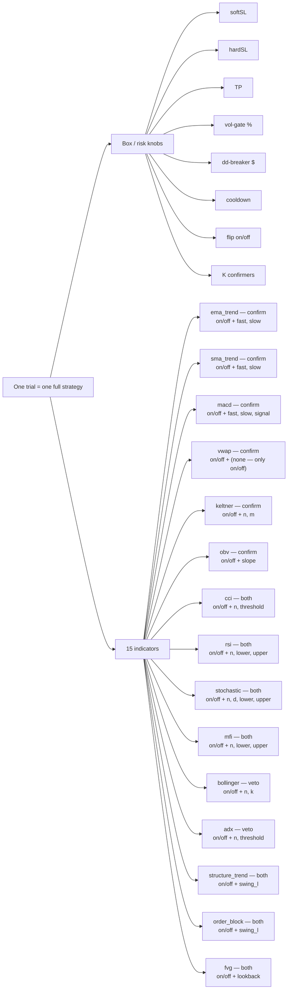
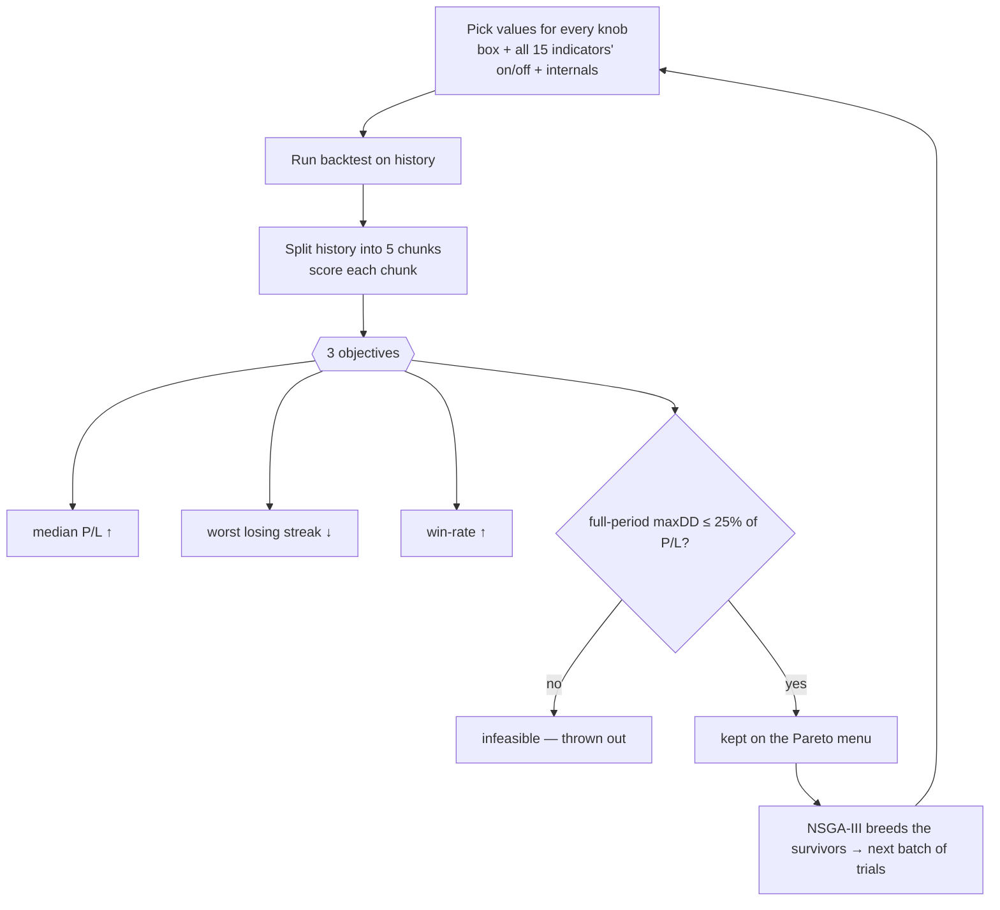

# WS-I — What was *actually* tested? 🍼🔬

> You asked: *"the indicators were tested on/off, but were their own internal params (EMA period, Keltner m/n, …) ever changed?"* — **Short answer: yes, both were searched.** Read on.

---

## 1. The one-line answer

Every indicator had **two kinds of knob searched at the same time**:

1. **A switch** — use this indicator, yes or no? (`on/off`)
2. **Its own internal dials** — *and when it was on, its internal settings were tuned too* (e.g. EMA's `fast`/`slow` lengths, Keltner's `n` window and `m` multiplier, MACD's `fast`/`slow`/`signal`).

So it was **not** "15 on/off switches with frozen defaults." It was **15 switches + 29 internal dials**, all moved together by the search.

**Proof in the winners:** the 4h champion runs `ema_trend` at `fast=244, slow=373` — nowhere near the textbook default `20/50`. The 1m champion runs `ema_trend` at `fast=3, slow=311`. If internals had been frozen, every champion would show the same default numbers. They don't.

---

## 2. The full search space (one picture)

Each trial = pick a value for **every** box knob **and** every indicator's switch **and** its internals. One trial is one complete strategy.

---

## 3. The internal dials behind each switch

Every indicator's switch hides this many tunable internal dials (only **vwap** has none — there is nothing to tune on it):

                        
                        

                    

📊 standalone copies of these charts live in `docs/charts/` once exported.

### Exact ranges the search was allowed to explore

| indicator | role | internal params (range / default) |
|---|---|---|

| **ema_trend** | confirm | `fast` 2–400 (def 20); `slow` 2–400 (def 50) |
| **sma_trend** | confirm | `fast` 2–400 (def 50); `slow` 2–400 (def 200) |
| **macd** | confirm | `fast` 2–100 (def 12); `slow` 2–200 (def 26); `signal` 1–100 (def 9) |
| **vwap** | confirm | _none — on/off only_ |
| **keltner** | confirm | `n` 2–200 (def 20); `m` 0.5–5.0 (def 2.0) |
| **obv** | confirm | `slope` 2–200 (def 20) |
| **cci** | both | `n` 2–200 (def 20); `threshold` 20–300 (def 100) |
| **rsi** | both | `n` 2–100 (def 14); `lower` 1–49 (def 30); `upper` 51–99 (def 70) |
| **stochastic** | both | `n` 2–100 (def 14); `d` 1–50 (def 3); `lower` 1–49 (def 20); `upper` 51–99 (def 80) |
| **mfi** | both | `n` 2–100 (def 14); `lower` 1–49 (def 20); `upper` 51–99 (def 80) |
| **bollinger** | veto | `n` 2–200 (def 20); `k` 0.5–5.0 (def 2.0) |
| **adx** | veto | `n` 2–100 (def 14); `threshold` 5–60 (def 25) |
| **structure_trend** | both | `swing_l` 1–20 (def 2) |
| **order_block** | both | `swing_l` 1–20 (def 2) |
| **fvg** | both | `lookback` 1–50 (def 3) |

role: **confirm** = adds a yes-vote; **veto** = can block a trade; **both** = can do either. `K` = how many confirmers must agree before a trade is allowed (also searched, 1–5).

---

## 4. Did the internals really move? (yes — see the winners)

`ema_trend` and `macd` were the most-picked indicators. Here are the **actual tuned values the winning strategy used on each timeframe**, against the textbook default (dotted red). If internals were frozen, every bar would sit on the dotted line — they're all over the place.

                            

                    

                            

                    

---

## 5. How one trial was judged (the loop)

---

## 6. ⚠️ Correcting the "apply directly" assumption

You said you can take the winning parameters and apply them directly. **Half-true — mind this gap:**

- ✅ The **box knobs** (softSL/hardSL/TP/gate/dd/cooldown/flip/K) are in the leaderboard CSV.
- ⚠️ The **indicator internal values** (the EMA periods etc.) were **NOT** in that CSV — the CSV only lists *which* indicators are on. The tuned internals lived only in the search database on the server.
- ✅ **Now fixed:** I extracted the full recipes (box **+** every enabled indicator's tuned internals) into `optimize/results/wsi_champions_full.json` and laid them out in §7 below. *Those* are what you apply directly.

Also remember: a champion is just the **highest-P/L** feasible point. The full per-TF **menu** (`optimize/results/<tf>_wsi_pareto.csv`) trades P/L against risk — but note that menu, too, currently carries only the on/off list, not internals (ask if you want the internals dumped for the whole front).

---

## 7. The full winning recipes (box + tuned indicator internals)

Everything you need to reproduce each per-TF champion, including the internal values:

### 4h  —  median fold P/L $24,253

**Box / risk knobs** — softSL `139.2` · hardSL `153.11` · TP `183.22` · vol-gate `83.59%` · dd-breaker `$1,305` · cooldown `0` · flip `False` · **K=`1`** (need K agreeing confirmers)

| indicator | tuned internal params |
|---|---|
| **ema_trend** | `fast=244`, `slow=373` |
| **macd** | `fast=14`, `slow=143`, `signal=81` |
| **keltner** | `n=138`, `m=3.5` |
| **rsi** | `n=53`, `lower=40`, `upper=65` |
| **stochastic** | `n=39`, `d=35`, `lower=23`, `upper=52` |
| **mfi** | `n=39`, `lower=12`, `upper=57` |
| **adx** | `n=81`, `threshold=8` |
| **order_block** | `swing_l=18` |

### 2h  —  median fold P/L $15,132

**Box / risk knobs** — softSL `82.55` · hardSL `153.67` · TP `36.46` · vol-gate `75.81%` · dd-breaker `$4,512` · cooldown `1` · flip `True` · **K=`1`** (need K agreeing confirmers)

| indicator | tuned internal params |
|---|---|
| **ema_trend** | `fast=92`, `slow=231` |
| **macd** | `fast=64`, `slow=85`, `signal=93` |
| **vwap** | _(no internal params — vwap)_ |
| **obv** | `slope=50` |
| **mfi** | `n=88`, `lower=22`, `upper=76` |
| **bollinger** | `n=108`, `k=2.1` |
| **order_block** | `swing_l=12` |

### 1h  —  median fold P/L $12,284

**Box / risk knobs** — softSL `13.03` · hardSL `101.8` · TP `84.48` · vol-gate `55.98%` · dd-breaker `$1,071` · cooldown `1` · flip `True` · **K=`2`** (need K agreeing confirmers)

| indicator | tuned internal params |
|---|---|
| **ema_trend** | `fast=65`, `slow=89` |
| **macd** | `fast=49`, `slow=19`, `signal=57` |
| **vwap** | _(no internal params — vwap)_ |
| **obv** | `slope=130` |
| **rsi** | `n=100`, `lower=22`, `upper=65` |
| **mfi** | `n=93`, `lower=10`, `upper=73` |
| **bollinger** | `n=17`, `k=1.9000000000000001` |
| **adx** | `n=9`, `threshold=8` |
| **structure_trend** | `swing_l=11` |

### 15m  —  median fold P/L $10,538

**Box / risk knobs** — softSL `32.17` · hardSL `36.46` · TP `31.35` · vol-gate `84.77%` · dd-breaker `$3,747` · cooldown `2` · flip `False` · **K=`1`** (need K agreeing confirmers)

| indicator | tuned internal params |
|---|---|
| **sma_trend** | `fast=279`, `slow=34` |
| **macd** | `fast=5`, `slow=26`, `signal=41` |
| **vwap** | _(no internal params — vwap)_ |
| **keltner** | `n=193`, `m=1.1` |
| **cci** | `n=89`, `threshold=215` |
| **stochastic** | `n=29`, `d=7`, `lower=22`, `upper=81` |
| **structure_trend** | `swing_l=6` |

### 5m  —  median fold P/L $9,943

**Box / risk knobs** — softSL `19.45` · hardSL `37.98` · TP `21.39` · vol-gate `91.92%` · dd-breaker `$4,015` · cooldown `23` · flip `False` · **K=`3`** (need K agreeing confirmers)

| indicator | tuned internal params |
|---|---|
| **ema_trend** | `fast=22`, `slow=95` |
| **macd** | `fast=64`, `slow=169`, `signal=7` |
| **cci** | `n=104`, `threshold=20` |
| **mfi** | `n=39`, `lower=29`, `upper=71` |
| **structure_trend** | `swing_l=6` |
| **order_block** | `swing_l=3` |

### 2m  —  median fold P/L $4,474

**Box / risk knobs** — softSL `12.74` · hardSL `13.8` · TP `21.92` · vol-gate `86.05%` · dd-breaker `$4,316` · cooldown `18` · flip `False` · **K=`2`** (need K agreeing confirmers)

| indicator | tuned internal params |
|---|---|
| **ema_trend** | `fast=143`, `slow=258` |
| **obv** | `slope=86` |
| **bollinger** | `n=14`, `k=1.3` |
| **adx** | `n=61`, `threshold=11` |
| **order_block** | `swing_l=14` |

### 1m  —  median fold P/L $1,876

**Box / risk knobs** — softSL `9.94` · hardSL `23.65` · TP `5.35` · vol-gate `52.21%` · dd-breaker `$1,874` · cooldown `0` · flip `False` · **K=`1`** (need K agreeing confirmers)

| indicator | tuned internal params |
|---|---|
| **ema_trend** | `fast=3`, `slow=311` |
| **macd** | `fast=38`, `slow=59`, `signal=94` |
| **vwap** | _(no internal params — vwap)_ |
| **obv** | `slope=84` |
| **cci** | `n=108`, `threshold=85` |
| **stochastic** | `n=5`, `d=29`, `lower=38`, `upper=91` |
| **mfi** | `n=91`, `lower=20`, `upper=97` |
| **fvg** | `lookback=20` |

---

## 8. The honest caveats

- **Sampled, not exhaustive.** The space is astronomically large (continuous internals × on/off × box knobs). 3,000 trials/TF *samples* it intelligently (NSGA-III breeding) — it does not try every combo. Good combos may remain unfound.
- **n=1 history (2025→2026).** Candidate generation, not proof. Re-validate any chosen recipe on the exact dashboard engine before trusting it.
- **Some tuned internals look extreme** (e.g. an EMA `fast=3` on 1m, or `signal=94` on MACD). That's a sign of fitting to one history — sanity-check before use, especially on the fast timeframes.
