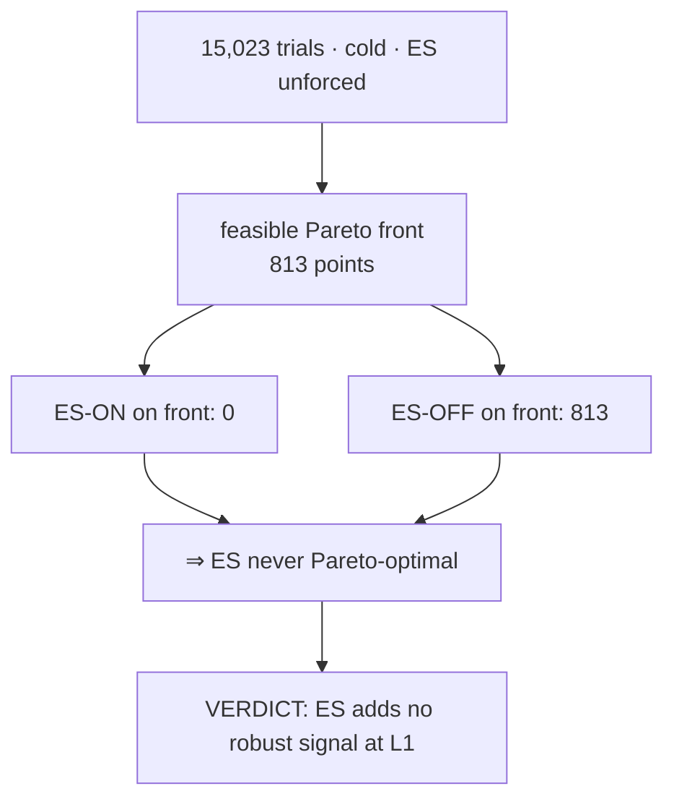

# Does ES help NQ? — the verdict (wshes1, L1 cross-instrument run)

*Answer to the question the whole cross-instrument workstream was built to settle: when ES is offered to the
optimizer as a fair, unforced option on NQ's full decision set, does it improve the strategy? **No.***

---

## 0. TL;DR

**ES does not help NQ at L1.** Given a cold, unforced, 15,023-trial NSGA-III search over the full NQ signal set,
the optimizer put **zero ES-on solutions on the 813-point Pareto front**, drove `es_enabled` → False on its own,
and the best ES-off champion **dominates** the best ES-on candidate on every objective. ES's only "win" (higher
full-period P/L) is a non-robust, overfit artifact. **Recommendation: drop ES as an L1 contributor.**

---

## 1. The experiment (why this run is trustworthy)

| design choice | why it makes the answer fair |
|---|---|
| **L1, full NQ signal set** | hundreds of trades ⇒ ES-on trials complete and compete (fixes `l2es1`, where L2's thin residual pruned 97/98 ES-on trials before scoring) |
| **ES searchable, NOT forced** | `es_enabled` is a categorical the optimizer flips freely — it keeps ES only if ES earns its place |
| **cold start (`--no-warm-start`)** | no champion seeding biases the search |
| **15,023 trials (~150/dim)** | well past the "fake signal" threshold for the ~100-dim space |
| **walk-forward objective** | scores *median fold P/L* + *worst-fold DD* — rewards robustness across regimes, exposes overfitting |

Run: `optimizer.py 4h --contributors ES --ind-1min --no-warm-start --study-prefix wshes1`, 16-worker pool,
Postgres study `wshes1_4h`, finished 2026-06-28 01:58. ES committee = the 10 cheap indicators (SMC + stochastic
+ adx excluded for fold-scored cost).

---

## 2. The numbers

| | trials | feasible | best median-fold P/L | worst-fold DD | win % | full-period P/L |
|---|--:|--:|--:|--:|--:|--:|
| **ES-OFF** | 14,672 | 11,225 | **$41,000** | **$11,824** | **64.2** | $104,205 |
| **ES-ON** | 351 | 13 | $28,668 | $14,302 | 57.1 | $137,851 |

- **Pareto front = 813 points, 100% ES-OFF.** Not one ES-on solution is Pareto-optimal.
- Only **2.3%** of trials kept ES on, and **96% of those were infeasible** (ES tended to break the DD≤25%·P/L
  constraint — it *added risk faster than reward*).
- Overall champion (best feasible median-fold P/L): **ES-OFF**, `bollinger` (veto) + `macd` (confirm).

---

## 3. Why ES-ON's higher full-period P/L is a trap

ES-on's best full-period P/L ($137,851) *exceeds* the champion's ($104,205) — but that is exactly the
overfitting signature the walk-forward is built to catch:

- its **median fold P/L is lower** ($28,668 vs $41,000) → the full-period gain is **concentrated in one
  regime/fold**, not consistent;
- its **worst-fold DD is higher** ($14,302 vs $11,824) and **win-rate lower** (57% vs 64%) → worse risk and hit
  rate.

A strategy that makes more total money but is less consistent across folds and drawier is **less robust**, not
better. The objective (median fold P/L) correctly ranks it below the ES-off champion, and the Pareto front
agrees: ES-on is dominated.

This is the verdict criterion we set in advance: *ES is useful only if ES-on beats ES-off on the robust metric
and populates the front.* It fails both — it only "wins" on the non-robust number. **Clean NO.**

---

## 4. What this does and doesn't say

- ✅ **At L1, as a confirm/veto/topology contributor on this NQ box strategy, ES does not help.** The machinery
  works (ES was fully searched, both topologies, both state defs, both encodings); the optimizer simply found NQ
  alone is better.
- ❌ It does **not** say ES is worthless *forever* — it says ES adds nothing under *this* contribution model
  (committee + topology gate). A fundamentally different use (e.g. a learned π(state) policy that fuses NQ+ES
  continuously, or a Kalman/Bayesian state estimate — see the mega-goal) is a different question this run
  doesn't answer.

---

## 5. Recommendation

1. **Drop ES as an L1/L2 contributor** for production — it doesn't earn its place.
2. The cross-instrument *substrate* (registry, loader, alignment, committee, topology combine, the searchable
   block) stays — it's instrument-agnostic and is the foundation for the mega-goal's state-feature layer; the
   verdict is about ES's *value under the committee model*, not the substrate.
3. If we revisit cross-instrument signal later, do it through the **learned-policy / signal-fusion** path
   (the mega-goal), not the discrete vote-committee — that's where correlated markets like ES could still add
   value in a form this experiment didn't test.

---

## 6. Artifacts

- Study: Postgres `wshes1_4h` (15,023 trials, preserved).
- Standard report: `optimize/reports/WS-ES1_RESULTS.md`.
- Pareto front + leaderboard: `optimize/results/wshes1/` (`wshes1_4h_pareto.{png,csv}`, `wshes1_leaderboard.csv`).
- Prior failed-by-construction attempt: `l2es1` (L2 residual — pruned ES out; preserved in Postgres, superseded
  by this run). See `docs/PERFORMANCE.md §9` for why L2 couldn't answer it.
