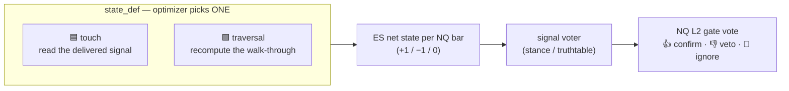
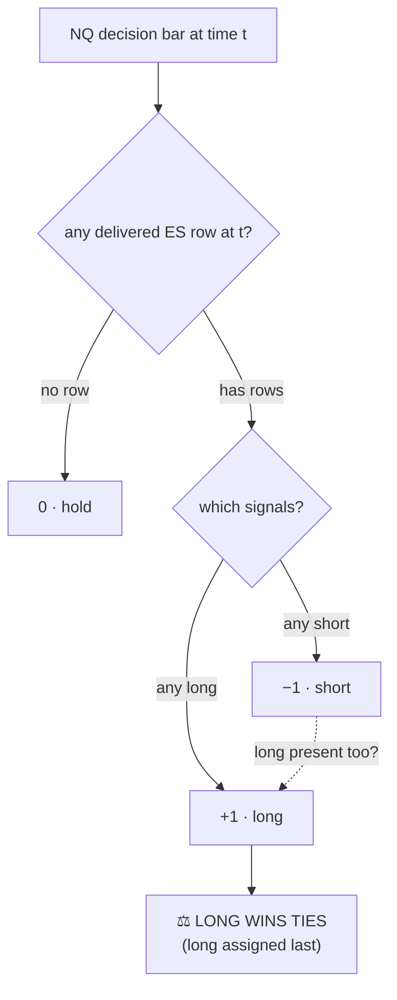
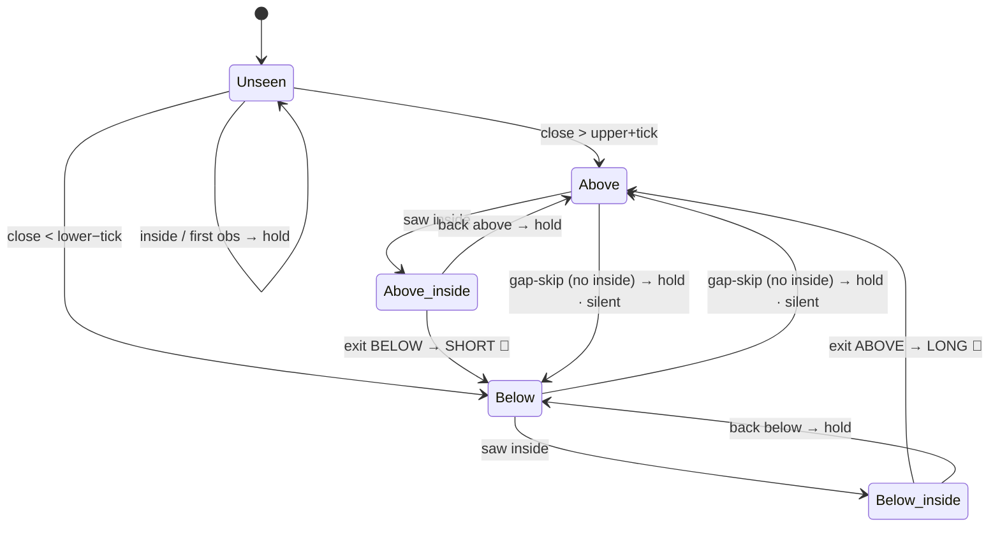
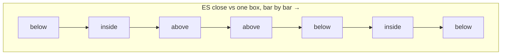
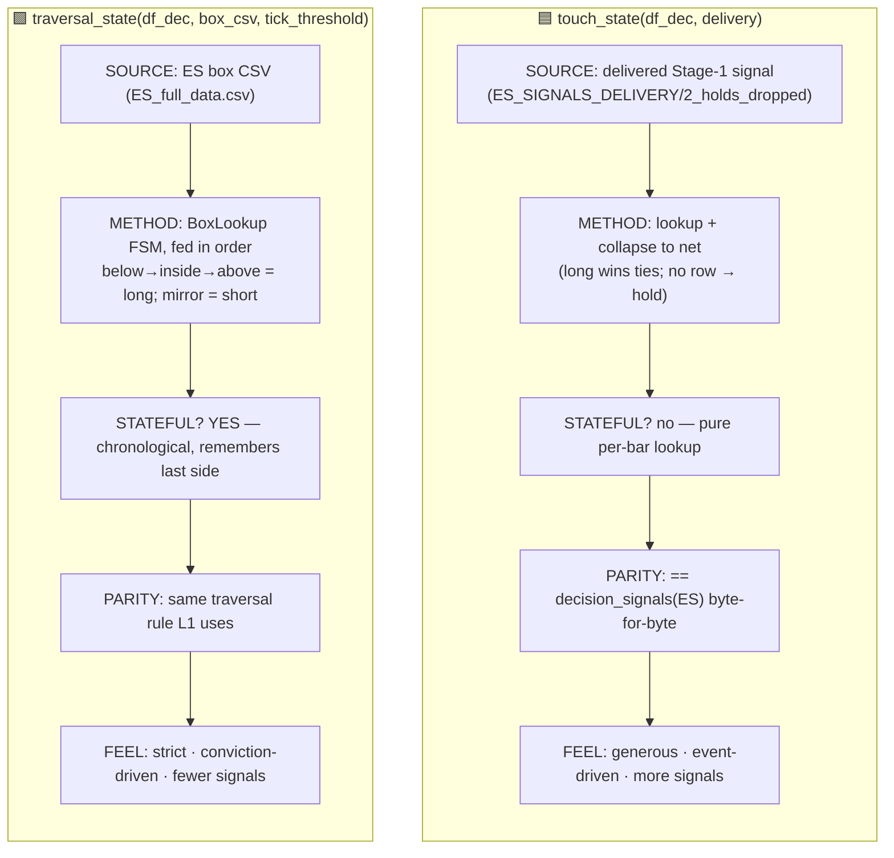

# ES net state — **touch** vs **traversal**, explained in detail

*What the two `state_def` options in the cross-instrument ES contributor actually compute, why they differ,
and when each fires. Source: `optimize/l2/contributors/state.py` + `box_lookup.py`.*

---

## 0. What both produce (the common output)

Both definitions answer the **same question** — *"what is ES's net directional state on this NQ decision
bar?"* — and return the **same shape**: one integer per NQ decision bar.

| value | meaning |
|---|---|
| **+1** | ES is **long** (bullish) on this bar |
| **−1** | ES is **short** (bearish) on this bar |
| **0** | ES is **hold** (no opinion) on this bar |

That per-bar state is then handed to the **signal voter** (the `stance` or `truthtable` encoding), which
turns *(NQ box direction, ES state)* into a **confirm / veto / ignore** vote for NQ's L2 gate.

The two are **different lenses on the same ES price action**. They can disagree materially on the same bar
— that disagreement is the whole point: the optimizer is allowed to choose whichever lens makes ES most
useful to NQ (Spec §12).

---

## 1. 🟦 TOUCH — "did ES *deliver* a Stage-1 signal on this bar?"

**Touch reads a pre-computed answer.** ES already has its own Stage-1 signal pipeline whose output is
written to disk under `ES_SIGNALS_DELIVERY/2_holds_dropped`. Each delivered row says *"on this datetime, ES
touched a box edge and emitted a long (or short) signal."* Touch just **looks that up** per NQ decision bar
and collapses it to one net value.

The collapse rule (mirrors NQ L1's *one-entry-per-candle* + `decision_signals`):

- A bar is **long** if **any** delivered row at that timestamp is long.
- **short** if any is short.
- If a bar somehow carries both, **long wins the tie** (long is written last — `state.py:37`).
- A bar with **no delivered row** is **hold**.

> **Verified property:** touch is **byte-for-byte equal** to `optimize.signals.decision_signals(ES)` — it is
> exactly ES's own delivered Stage-1 decision, re-indexed onto NQ's decision-bar grid. Nothing is
> recomputed; it is a **lookup + collapse**.

**Character:** *generous / event-driven.* Every delivered touch counts. More non-zero bars, looser
confirmation. It says **"ES's signal engine fired here."**

---

## 2. 🟩 TRAVERSAL — "did ES's price *walk all the way through* a box?"

**Traversal recomputes the state live**, bar by bar, with a small **state machine** (`box_lookup.BoxLookup`,
the same engine L1 uses). It is **stateful** — bars must be fed in chronological order, because the signal
depends on *where price has been*, not just where it is now.

A signal fires **only on a completed traversal THROUGH a box** — price enters one side, is seen **inside**,
and exits the **opposite** side:

- **below → inside → above = LONG 🔺** (price came **up through** the box)
- **above → inside → below = SHORT 🔻** (price came **down through** the box)

Everything else is **hold**: first sightings, same-side repeats, transient pokes inside that exit the same
side, and — crucially — **gap-skips** (jumping `above → below` with **no** intervening `inside`) update the
remembered side **silently** and do **not** fire.

Where `above` / `inside` / `below` are decided relative to the box edges **with a tick tolerance**
(`box_lookup.py:230`): `close > upper + tick → above`, `close < lower − tick → below`, else `inside`.

**Character:** *strict / conviction-driven.* It requires a full penetration with an inside observation.
Fewer non-zero bars, higher-conviction confirmation. It says **"ES decisively traversed the level."**

---

## 3. Why they diverge — the same price path, two readings

Consider ES price moving around one box over consecutive bars. Watch where each definition emits a signal:

| bar | side | 🟩 **traversal** | why | 🟦 **touch** (illustrative) |
|---|---|---|---|---|
| 1 | below | hold | first obs, sets state=below | hold (no delivered row) |
| 2 | inside | hold | inside seen (arming) | maybe **long** if ES delivered here |
| 3 | above | **LONG 🔺** | below→inside→above = full up-traversal | hold |
| 4 | above | hold | same-side repeat | hold |
| 5 | below | hold | **gap-skip** above→below, no inside → silent | maybe **short** if ES delivered here |
| 6 | inside | hold | inside seen (re-arming from below) | … |
| 7 | below | hold | dipped in, exited same side | … |

The takeaways:

- **Traversal** fires **once**, decisively, at bar 3 — and deliberately **stays silent** on the bar-5
  gap-skip (a jump with no inside is treated as noise, not a signal).
- **Touch** can light up on **any** bar where ES's Stage-1 engine delivered a row (here bars 2 and 5) —
  more frequent, driven by ES's own delivery logic rather than a through-the-box rule.
- So on the **same** bars the two can read **long, hold, or short differently** — which is exactly why the
  optimizer is given the choice.

---

## 4. Side-by-side summary

| | 🟦 **touch** | 🟩 **traversal** |
|---|---|---|
| One-liner | *"ES delivered a signal here"* | *"ES walked all the way through the box"* |
| Input | delivered signal rows | raw box CSV + price |
| Computation | lookup of a precomputed result | live state machine |
| Memory | none (per-bar) | yes (needs chronological order) |
| Fires on | every delivered touch | only complete through-box traversals |
| Gap-skips | n/a | **ignored** (silent state update) |
| Signal density | higher | lower |
| Conviction | lower per signal | higher per signal |

---

## 5. How this plugs into the optimizer / dashboard

- `state_def` is a **searched categorical** in the ES contributor block (`touch` | `traversal`) — the
  optimizer tries both and keeps whichever scores better (`l2opt._suggest_contributor`).
- In the **manual dashboard backtester** (L2 tab → *Cross-instrument contributors (ES)* → **ES state**) you
  pick one explicitly and Run to see the effect on the L2 book.
- Both are **causal / look-ahead-safe**: each bar's state uses only ES bars that had already closed at that
  NQ decision moment (proven by the look-ahead guard test in the contributors suite).

> **Bottom line:** *touch* = ES's **delivered** signal, re-indexed (loose, frequent). *traversal* = a
> **recomputed through-the-box walk** (strict, sparse). Same output shape (+1/−1/0), different philosophy;
> the optimizer chooses, the dashboard lets you feel the difference by hand.
