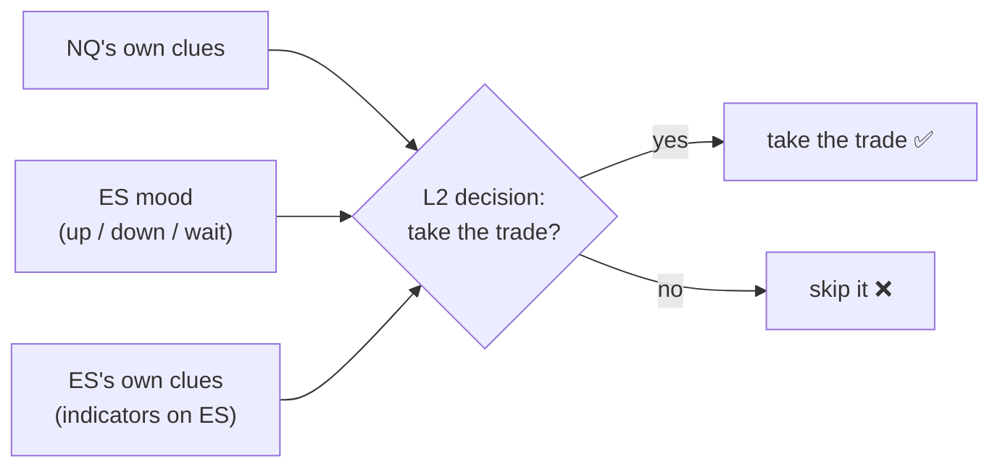
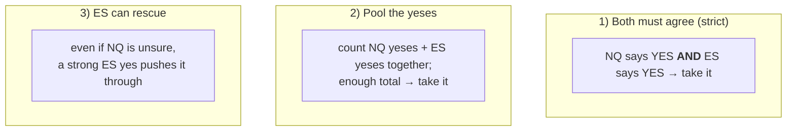
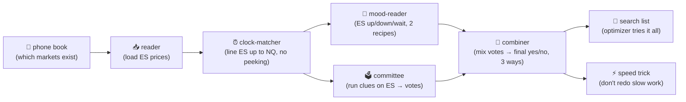

# The Cross-Instrument Helper — Explained Like You're 5 (BABY language)

*A detailed-but-simple report of what we built: teaching NQ's second robot to also peek at ES before it trades.*

---

## 1. The one-sentence version

We taught NQ's trading robot to also **peek at ES** (a cousin market that moves a lot like NQ) before it
takes a trade — and to **figure out by itself** the best way to use that peek. If the peek doesn't help, the
robot is allowed to just ignore it.

---

## 2. Who's who (the cast)

| Name | Baby words |
|---|---|
| **NQ** | The market we actually buy and sell. |
| **L1** | The **first** robot. It spots trade ideas from price "boxes". |
| **L2** | The **second** robot. It picks up the ideas L1 threw away and decides which are worth taking. **This is the robot we upgraded.** |
| **ES** | A **cousin** market that wiggles a lot like NQ. We had already written down ES's signals. |
| **Optimizer** | A **search robot** that tries thousands of settings and keeps the best one. |

---

## 3. The idea, in baby words

Before today, **L2 only listened to NQ's own clues**. Now L2 can **also ask ES**: *"Hey ES, what do you think?"*

ES can answer in **two ways**:
1. **Its mood** — ES is going up (*long*), going down (*short*), or just waiting (*hold*).
2. **Its own clues** — the same kind of measuring sticks we put on NQ, but measured on ES.

Each answer becomes an extra **voter**. A voter can say one of three things:
- 👍 **CONFIRM** — "yes, take this trade."
- 👎 **VETO** — "no, skip it."
- 🤷 **IGNORE** — "I have no opinion."

---

## 4. The big rule: the robot decides, not us

We do **not** hand-write "ES going up means buy." That would be guessing. Instead the **search robot tries
every way** of listening to ES — should ES-up confirm or veto? should we trust ES's mood, its clues, both,
or neither? — and keeps the combination that **makes the most money with the least risk**. It can even
choose to **switch ES off** entirely if ES turns out to be useless.

---

## 5. The three ways ES and NQ team up (the robot picks one)

- **Both must agree** — safest, fewest trades.
- **Pool the yeses** — ES's yeses and NQ's yeses go in one basket.
- **ES can rescue** — ES can save a trade NQ wasn't sure about.

A "no" from **anyone** (NQ *or* ES) can always stop a trade — a veto is a veto.

---

## 6. The promise we kept: turning ES OFF changes NOTHING

The scariest thing about touching an old, working machine is **breaking it**. So we made an iron rule:

> **If ES is switched off, the robot behaves EXACTLY like before — down to the last cent.**

We have a **"golden test"** — 6 checkpoints with the old, known money numbers. Every time we changed
something, we re-ran it. It matched **6 out of 6, every single time**. The old machine is untouched; ES is
a brand-new bolt-on that only does something when you turn it on.

---

## 7. No cheating with the future (no peeking)

A trading robot must **never** use information it couldn't have known at the time. ES's answer at any moment
only uses ES bars that had **already finished**. We even wrote a **"try-to-cheat" test**: it shoves ES's
future around and checks the past answers don't move. They don't. No peeking is possible.

---

## 8. What we actually built (the pieces), in baby terms

- **Phone book (registry):** ES is entry #1. QQQ and SQQQ can be added later with **no new code**.
- **Reader:** loads ES's candles and levels.
- **Clock-matcher:** lines up each ES bar with the right NQ moment, **without peeking ahead**.
- **Mood-reader:** turns ES into up/down/wait. Two recipes exist; the robot picks which.
- **Committee:** runs the same indicators we use on NQ, but on ES, and turns them into votes.
- **Combiner:** mixes everyone's votes into the final yes/no, the **three ways** from §5.
- **Search list:** lets the optimizer try every ES setting.
- **Speed trick:** the slow "read ES once" work is now done **once and reused**, not redone every time — and
  we **proved** it gives the *exact same answers* (just faster).

---

## 9. How careful we were (the testing)

We wrote each tiny piece **test-first** (write the test, watch it fail, then make it pass). Tally so far:

| Check | Result |
|---|---|
| Feature tests (all the pieces above) | **46 / 46 pass** |
| Golden checkpoints (old machine unchanged) | **6 / 6 match** |
| Full project sweep (earlier milestone) | **375 / 375 pass** |
| "No peeking" cheat test | can't cheat ✅ |
| Speed trick gives identical answers | proven ✅ |

Nothing old broke. Everything new is covered.

---

## 10. What's left

- *(optional)* a **dashboard** to play with ES by hand and see it react.
- The **big one**: actually **run the search** and answer the real question —
  **does listening to ES make NQ's L2 more money?** The machine is built and ready; it just needs to run,
  and that takes a while (the search is big).

---

## 11. The dream (where this is going, later — not yet)

Today the robot still uses **one fixed rule** for the whole stretch of time. The long-term dream is a robot
that looks at the **whole picture** (all markets' clues = the "state") and decides, **trade by trade**:
should I enter? which direction? where do I put the stop and the target? and when do I get out?

Teaching it to listen to ES is the **first brick** of that bigger house. We built the brick so the house can
go on top of it later, without tearing anything down.

---

*Plain-language companion to the technical spec
`docs/superpowers/specs/2026-06-26-cross-instrument-l2-state-feature-layer-design.md` and the build plans under
`docs/superpowers/plans/2026-06-26-xinst-l2-*`.*
