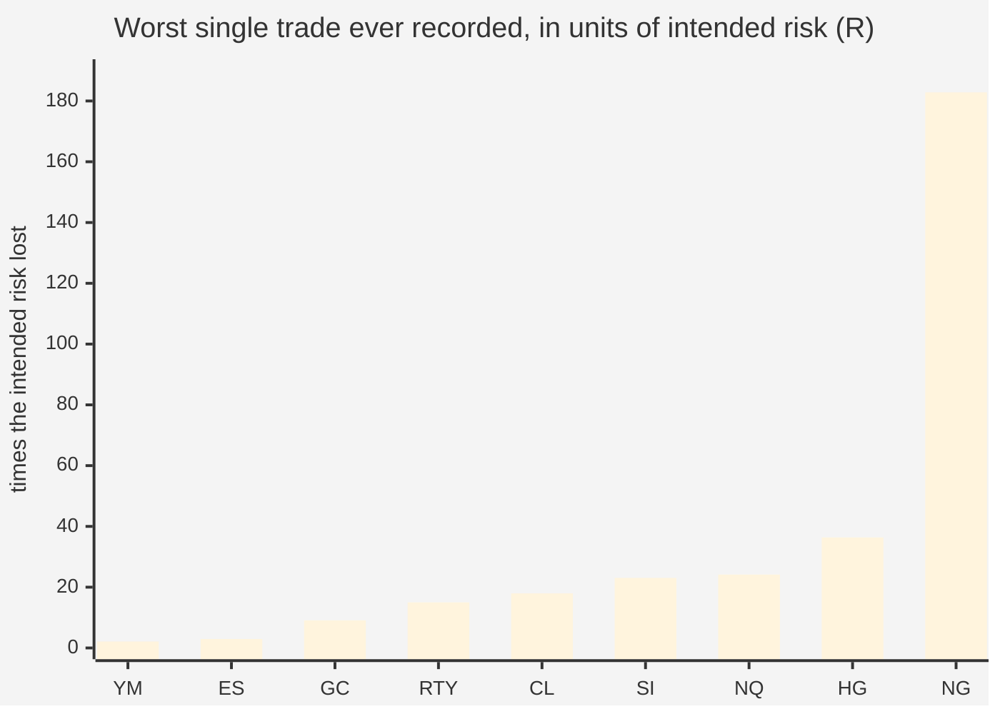
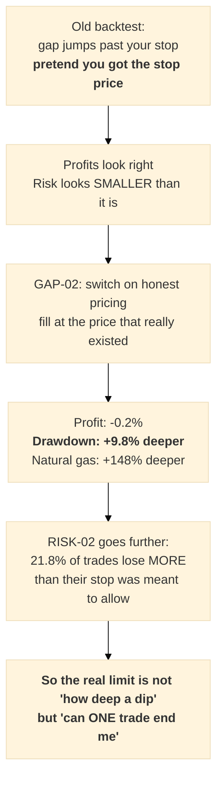

# Plain-language glossary — what `f`, `R`, `P(ruin)` and `P(dd≥50%)` actually mean

**Date:** 2026-07-29 · Companion to [RISK-02](../superpowers/RISK-02-ruin-bound-honest-fills.md)

Everything below uses **one worked example account of $100,000**, so every symbol turns into dollars.

---

## 1. `f` — "how much of my money do I put at risk on one trade?"

`f` is a **fraction of your whole account that you deliberately agree to lose if one trade goes
against you**. It is a decision, not a measurement.

| `f` | on a $100,000 account you are risking… |
|---|---|
| 0.3% | **$300** per trade |
| 0.4% | **$400** per trade |
| 1.0% | **$1,000** per trade |
| 4.0% | **$4,000** per trade |

**How it turns into a position size.** You don't choose "how many contracts" directly — you choose `f`,
and the contract count follows from where your stop-loss sits:

> NQ's champion stop is **109.7 points**. One NQ contract is worth **$20 per point**.
> So one contract puts **109.7 × $20 = $2,194** at risk.
> If you want to risk only $1,000 (f = 1%), you can afford **less than one contract** — which in
> practice means either a bigger account or you don't take that trade.

That is the whole job of `f`: it converts "I have $100,000" into "I may buy N contracts."

## 2. `R` — "how did this trade do, compared to what I was willing to lose?"

`R` measures a finished trade **in units of its own intended risk**:

```
R  =  the trade's profit or loss (in points)  ÷  that strategy's hard stop (in points)
```

| the trade… | `R` | on $100,000 at f = 1% ($1,000 risked) |
|---|---|---|
| hit its stop-loss exactly as designed | **−1** | lost **$1,000** — exactly as planned |
| made twice what it risked | **+2** | made **$2,000** |
| made half what it risked | **+0.5** | made **$500** |
| **gapped straight past the stop** | **−46** | lost **$46,000** |
| the worst one we found (natural gas) | **−183** | lost **$183,000** — *more than the whole account* |

**Why we bother converting to `R`.** Our nine markets are on wildly different scales — a natural-gas
stop is **0.001** and a Dow stop is **10.2**. You cannot average those together. But "how many times my
intended risk did I lose?" means the same thing in every market, so once everything is in `R` we can
pool all 54 strategies into one pile and study the whole book at once.

**The key idea in one line:** `R = −1` is a stop-loss doing its job. **Anything past −1 is the stop
failing to hold**, and that is what this whole investigation turned out to be about.

## 3. `P(ruin)` — "what are the chances I get wiped out completely?"

`P(ruin)` is the probability that, over a simulated run of 1,000 trades, the account **hits zero at
least once**. Not "went down a lot." **Gone. Game over. You cannot place trade number 501.**

We compute it by dealing 1,000 random trades from our real history, 4,000 separate times, and counting
how many of those 4,000 lifetimes ended in a wipe-out.

> `P(ruin) = 1.67%` means: **about 1 in every 60 traders following this plan is wiped out.**

## 4. `P(dd≥50%)` — "what are the chances I lose half my money?"

"dd" is **drawdown** — how far you are below your best-ever balance.

> Your account grows $100,000 → $150,000, then falls to $75,000.
> Your drawdown is **50%**, measured from the $150,000 peak, not from where you started.

`P(dd≥50%)` is the probability that at some point during those 1,000 trades you are **at least half
below your own high-water mark.** You are not wiped out and you might recover — but almost nobody keeps
trading a system that has halved their money.

**Ruin vs drawdown, side by side:**

| | `P(dd≥50%)` | `P(ruin)` |
|---|---|---|
| what happens | account halves | account hits **zero** |
| can you continue? | yes, painfully | **no** |
| we allow | under 5% | **0%** |

## 5. So what are "NG 0.3%" and "most markets 1.0%"?

Those are **values of `f`** — the recommended risk per trade, *chosen separately for each market*.

| market | recommended `f` | on $100,000, risk per trade |
|---|---|---|
| **NG** (natural gas) | **0.3%** | **$300** |
| NQ, GC, SI, HG, CL, RTY | **1.0%** | **$1,000** |
| ES | 1.5% | $1,500 |
| YM (Dow) | 2.0% | $2,000 |

**Why natural gas gets a third of everyone else's size.** Because in natural gas the stop-loss doesn't
reliably stop anything. The worst NG trade lost **183×** its intended risk. Multiply that by the size
you chose:

| your `f` on NG | what that one trade costs you |
|---|---|
| 0.3% | 0.3% × 183 = **55% of the account** — brutal, but you survive |
| **0.547%** | 0.547% × 183 = **100%** — ***exactly wiped out*** |
| 1.0% | 1.0% × 183 = **183%** — wiped out, and you owe money |

That break-even number **0.547% is what we call `f_survive`**: the largest size at which the worst trade
we have *actually already seen* does not end you. It is simply `1 ÷ 183`.

Every other market's worst trade was between **−2.1×** and **−36.4×**, so they can all safely carry 1%
or more. **Natural gas alone is why the whole book was being held to 0.4%** — and that is why splitting
it out lets everything else trade 2.5× bigger.



*Eight markets sit near the floor. Natural gas is off the scale — and one market off the scale set the
speed limit for all nine.*

---

## 6. What was RISK-01? (in baby language)

**The question it tried to answer:** *"How much money should we bet on each trade?"*

**When:** 22 July 2026. **Its maths was correct.** Its *ingredients* were wrong — it was handed the
wrong shopping list, so it cooked the wrong meal perfectly.

Four things were wrong with what it was fed:

1. **It studied strategies we don't use.** We swapped our official strategy list on 14 July. RISK-01
   read the **old, retired list** and called it "what we currently run."
2. **It only looked at 8 of our 54 strategies** — Nasdaq and gold only.
3. **It skipped natural gas completely** — the single most dangerous market we own, and the one the
   issue had specifically asked to treat separately.
4. **It ignored our "close the trade by end of day" rule.** That rule matters enormously: on one Nasdaq
   strategy, **213 of 541 trades** end because of it.

**Its answer:** risk **0.25%–0.5%** per trade, ceiling **1%**.
**How it held up:** the 0.25–0.5% range was right. **The 1% ceiling was dangerous** — at 1% about
**1 in 60** accounts is wiped out entirely.

## 7. What was GAP-02? (in baby language)

**The problem it fixed: our backtest used to cheat.**

Imagine you own natural gas and you've left a stop-loss instruction: *"if it falls to $3.00, sell me
out."* Friday it closes at $3.05. Over the weekend bad news lands, and Monday it **opens at $2.80** —
it never traded at $3.00 at all; it jumped clean over your instruction.

- **The old backtest pretended you sold at $3.00.** The price you asked for.
- **Reality sells you at $2.80.** The first price that actually existed.

That difference is a **gap**, and the old code quietly gave us the good price every single time.

**What GAP-02 did:** turned on honest pricing and re-measured all 54 strategies, before vs after.

| | change |
|---|---|
| profit | **−0.2%** — basically unchanged |
| worst losing streak (drawdown) | **+9.8% deeper** |
| natural gas drawdown | **+148% deeper** |

**What it means in one sentence:** we were never making less money than we thought — **we were taking
more risk than we thought.** The profits were real; the safety was not.

**Its own flaw (found 29 July):** GAP-02 measured the **same retired strategy list** RISK-01 used. Its
*direction* still holds — it compares before-vs-after on the same strategies, so honest fills genuinely
do deepen drawdowns — but the exact figures (+9.8%, +148%) describe the old book, not the one we run.


