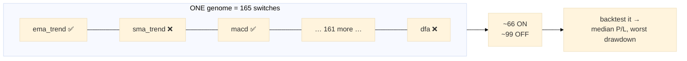
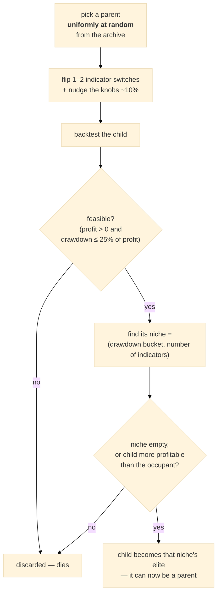

# How the search actually explores indicator combinations

**Date:** 2026-07-29 · Answers: *"is it testing 66 or the 165? A stable set, or different combinations
each time? Is it Darwinian — scale up what profits, kill what loses?"*

Short answer: **you are right that it tries different combinations, and right that it is evolutionary —
but wrong in one specific and important way about "invest more effort in the profitable direction".**
It deliberately does the opposite. Details below.

---

## 1. What one "creature" (genome) looks like

Every candidate strategy carries **all 165 indicators**, each as a single on/off switch:

```python
en = {k: (rng.random() < 0.4) for k in library.REGISTRY}     # map_elites.py:83
```

So the answer to *"66 or 165?"* is **both, and neither**:

| | |
|---|---|
| how many indicators are **in** the genome | **165** — every one, always |
| how many are switched **ON** at any moment | **~66** (because each is on with probability 0.4) |
| how many are **ignored** | none — an "off" indicator is an active decision, and one mutation can turn it on |

**It is not a stable set with the rest ignored.** It is a 165-bit combination, and the search moves
through *different combinations*. The space is 2¹⁶⁵ possible subsets.



## 2. How a child is made — mutation

```python
for _ in range(rng.choice([1, 1, 2])):        # map_elites.py:88-91
    en[rng.choice(list(library.REGISTRY))] ^= True     # flip ONE switch
```

A child is its parent with **1 or 2 switches flipped**. Nothing else about the indicator set changes.
The continuous knobs (stop, target, gate…) get a separate Gaussian nudge of ~10% of their range.

So the walk through combination-space is **local**: neighbours differ by one or two indicators.

## 3. Is it Darwinian? Yes — with one crucial difference

Your instinct is right that it is evolution, not enumeration. But the selection rule is unusual:

```python
parent = rng.choice(list(archive.values()))["geno"]        # map_elites.py:137
```

**Parents are chosen UNIFORMLY AT RANDOM from the archive — not in proportion to profit.**

That is the key departure from your description of *"the more profitable ones we scale in that direction
and invest more effort in"*. Classical evolution (and gradient descent) does exactly that. **MAP-Elites
deliberately refuses to.** Its own docstring says why:

> *"Every other algorithm returns ONE best point and can collapse into a single basin (the superset
> paradox). MAP-Elites instead keeps an ARCHIVE of the best solution PER NICHE, so it is rewarded for
> diversity and structurally cannot collapse."*

So a mediocre-but-unusual strategy gets chosen as a parent **exactly as often** as the best one. It is
buying insurance against tunnel-vision, at the cost of concentrating less on winners.

### What "dies" and what survives

```python
if cur is None or m["median_pnl"] > cur["fitness"]:        # map_elites.py:116
    archive[cell] = {...}
```

* **an empty niche accepts any feasible child** — colonising new territory is free;
* **an occupied niche only accepts something better *in that same niche***;
* infeasible children (drawdown > 25% of profit, or negative profit) are **discarded outright**.

So "killing the losers" is true — but the comparison is **local to a niche**, not global. A strategy with
modest profit is never killed by a more profitable one that lives in a *different* niche.



## 4. Your gradient-descent analogy — closer than you may think

> *"something like gradient descent, but instead of talking about the value, we are talking about what
> formulas we are finding values for in the first place"*

**That distinction is exactly right, and it is the actual architecture of the system.** There are two
different search problems:

| | *which* formula | *what values* |
|---|---|---|
| question | which indicators should vote? | what stop, target, gate? |
| type | **discrete** (on/off, 2¹⁶⁵ options) | **continuous** (real numbers in a range) |
| MAP-Elites | mutation flips switches | Gaussian nudge |
| two-stage | **Stage A** does this | **Stage B** does this (CMA-ES / Gaussian-process) |

`two_stage.py` splits them explicitly — Stage A picks the indicator set, then Stage B tunes the knobs for
each shortlisted set. Your mental model maps onto that design precisely.

**One correction:** it is *not* gradient descent. There is **no gradient** anywhere — no derivative of
profit with respect to "turn `macd` on" exists, because the space is discrete and the backtest is not
differentiable. It is a **random-mutation hill-climber with an archive**: propose blindly, keep what
wins its niche. That is why it needs thousands of evaluations where gradient descent needs dozens.

## 5. ⚠️ Why this matters right now — the 18→165 defect (#81)

The probability `0.4` and the "flip 1–2 bits" step were chosen when the registry held **18** indicators.
Nothing re-derived them when it became **165**.

I simulated the genome dynamics — no backtests, purely which combinations get *reached* in a standard
400-evaluation run:

| registry size | archive spans | reaches the champion region (3–10 indicators)? |
|---|---|---|
| **18** (as designed) | n_indicators **0 … 15** | ✅ **yes** |
| **165** (today) | n_indicators **50 … 83** | ❌ **never** |

> **On the honesty of that simulation.** My first version randomised the drawdown-bucket axis, which
> fabricated up to 9× more archive cells than a real run has. I re-ran it two ways with that removed —
> a single collapsed drawdown bucket (fewest possible cells) and a drawdown bucket that rises with
> indicator count (the realistic correlation). **Both give identical spans**, and they barely moved from
> the flawed version (2…14 → 0…15, and 51…84 → 50…83). The defect is robust to how the second axis is
> modelled, because it is driven by the *indicator-count* axis alone.

**Why.** Bootstrap genomes start at ~66 ON. Each mutation moves the count by ±1. To reach a 5-indicator
champion you need ~60 consecutive downward steps, while parents are drawn uniformly from an archive that
is filling up around 66. The search never travels that far.

**Consequence:** MAP-Elites currently cannot find strategies shaped like the ones we actually deploy —
our champions use **3–10** indicators. It is exploring a region of the space we would never trade.

```mermaid
%%{init: {'theme':'base'}}%%
xychart-beta
    title "Indicator counts the archive actually reaches (400 evaluations)"
    x-axis ["min reached", "max reached", "champions use (low)", "champions use (high)"]
    y-axis "number of indicators enabled" 0 --> 90
    bar [0, 15, 3, 10]
    bar [50, 83, 3, 10]
```



*First series = 18-indicator registry (overlaps the champion range). Second = today's 165 (does not come
close).*

## 6. What a fix looks like

The bug is that a **probability** was used where a **target count** was meant:

* `p = 0.4` meant "about 7 indicators" in an 18-indicator world. It now means "about 66".
* Better: sample the *number* of enabled indicators directly (e.g. uniformly 1–15, matching real
  champions), then choose which ones — so the genome shape is independent of registry size.
* Mutation should flip a *fraction* of the genome, not a fixed 1–2 bits, or it gets weaker every time the
  library grows.
* The archive's second axis (number of indicators) went from ≤19 columns to ≤166, so the same evaluation
  budget spreads ~9× thinner. Either cap/bin that axis or scale the budget with it.

## 7. Honest limits of this analysis

* The simulation reproduces the **genome dynamics only** — parent choice, mutation, niche placement. It
  does **not** run backtests, so it says where the search *can travel*, not what it would *find*.
* The drawdown axis is modelled, not measured (it is data-driven in reality). Two models — collapsed and
  complexity-correlated — give the same answer, so the conclusion does not rest on that choice.
* Feasibility filtering would make the real picture **worse**, not better: infeasible children are
  discarded, so fewer mutations survive to become parents.

## 8. Summary

| your question | answer |
|---|---|
| testing 66 or 165? | all **165** are in the genome; **~66** are ON at a time |
| stable set, or different combinations? | **different combinations** — a local walk through 2¹⁶⁵ subsets |
| Darwinian — kill losers? | **yes**, but only *within a niche*; infeasible children die outright |
| invest more effort in the profitable direction? | ⚠️ **no — deliberately not.** Parents are picked **uniformly at random**, to avoid collapsing into one basin |
| like gradient descent on *which formula* rather than *which values*? | **the right distinction** (and `two_stage.py` splits exactly those two) — but there is **no gradient**; it is blind mutation plus selection |
