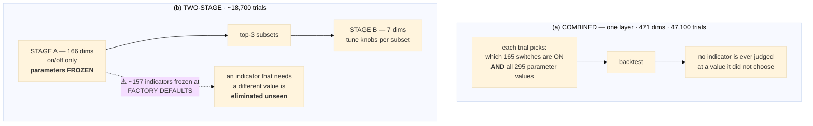
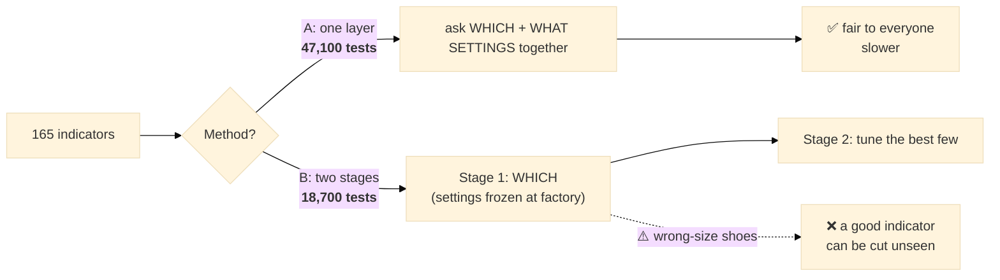

# Why the optimizer does not "use all 165 indicators" — three languages
# ‏لماذا لا يستخدم المُحسِّن الـ165 مؤشرًا كلها — بثلاث لغات

**Date:** 2026-07-29 · Companion to [03 — how MAP-Elites searches](./03-HOW-MAP-ELITES-SEARCHES.md)
**Contents:** [Part 1 — Professional English](#part-1--professional-english) ·
[Part 2 — Baby English](#part-2--baby-english) · [Part 3 — العربية](#part-3--العربية)

---

# ⚠️ THE ANSWER IN ONE LINE

> **We DO search all 165. We never *use* all 165 — because "which few should vote together" IS the
> question being asked.**

Those are two different things, and conflating them is what makes the design look wrong:

| | |
|---|---|
| **searching** all 165 | every indicator gets its own on/off dimension, sampled in **every single trial**. Nothing is excluded from consideration. |
| **using** all 165 | one specific candidate out of 2¹⁶⁵ — and a *bad* one (see §3). |

A strategy is **a subset**. The optimizer's job is to find which subset. Turning everything on is not
"more thorough" — it is one particular answer, and a poor one.

---

# PART 1 — PROFESSIONAL ENGLISH

## 1.1 What a single trial actually contains

`optimize/optimizer.py:76-77`, executed for **every** indicator on **every** trial:

```python
enabled = trial.suggest_categorical(f"en_{key}", [False, True])
params  = {p["name"]: _suggest_param(trial, f"{key}_{p['name']}", p) for p in meta["params"]}
```

Every one of the 165 indicators contributes:

* **one on/off dimension**, and
* **one dimension per internal parameter** (295 in total across the library).

Measured search space for the current registry:

```
dimensions: base 5c+3cat+3i = 11  |  indicators 165 on/off + 295 params  →  TOTAL 471 dims
trials/dim 100  →  RECOMMENDED 47,100 trials
```

So the claim *"we are not searching all the indicators"* is not accurate: **all 165 are searched, jointly
with their values, in one combined space.** What varies between trials is which subset is switched ON.

## 1.2 Why a candidate is a subset rather than the whole library

The strategy's decision rule is **K-of-N confirmation**: an entry requires at least `k` enabled
indicators to agree. That makes the *size* of the enabled set a strategic variable, not an accounting
detail. Four consequences of enabling everything:

1. **The decision rule degenerates.** With `k=3` out of 165 voters, at almost any bar *some* three
   indicators agree, so the gate stops filtering and the strategy approaches "always enter".
2. **Warm-up is set by the slowest member.** The strategy cannot trade until every enabled indicator has
   its required history. One long-lookback indicator delays the entire book.
3. **Compute cost.** The full library on the one-minute frame is the 22.4-second worst case measured in
   the budget work (#62) — per evaluation.
4. **Redundancy dilutes.** Many indicators are near-duplicates (several moving-average trends, several
   oscillators). Adding a correlated voter does not add information; it adds weight to one view.

Empirically, our deployed champions use **3–10** indicators — never dozens.

## 1.3 "Why not start with all 165 ON and eliminate downward?"

This is backward elimination, and it is a legitimate strategy in general. It is a poor fit here:

* **The starting point is almost certainly infeasible.** Feasibility requires `full_pnl > 0` and
  `full_dd ≤ 25% · full_pnl`. An all-on, effectively-always-entering configuration fails that, so the
  first evaluation returns **no gradient of information** — it is simply rejected.
* **It is the most expensive point in the space** to evaluate (all 165 computed), so the search pays its
  highest per-trial cost exactly where the signal is weakest.
* **Removal is as blind as addition.** Dropping one of 165 changes little; you would need ~155 successful
  removals to reach a realistic champion — the same distance problem MAP-Elites has today (#81), just
  travelled in the opposite direction.

Forward/random subset search reaches the 3–10 region far more directly, provided the genome is *shaped*
for it — which is exactly the bug in #81, where a 0.4 enable probability now produces ~66-indicator
genomes instead of ~7.

## 1.4 The two search architectures we have

### (a) Combined — one layer

The main optimizer (NSGA-III). Structure and values are searched **in the same trial**, so an indicator
is never judged at a parameter setting it did not choose.

* dimensions **471** · recommended **47,100 trials**
* no premature elimination
* this is what produced every deployed champion

### (b) Two-stage — structure, then values

`optimize/two_stage.py`. **Stage A** searches only the on/off flags (+ flip) with indicator parameters
frozen; **Stage B** takes the top-`k` subsets and tunes the continuous knobs for each.

* Stage A **166 dims** → 16,600 trials at 100/dim
* Stage B **7 continuous dims** × top-3 → 2,100 trials
* **total ≈ 18,700 trials — about 2.5× cheaper than combined**
* ⚠️ current default is **500 trials** (200 + 3×100), which is the under-budget defect in #81

**The cost of the split:** Stage A judges each indicator at *frozen* parameters, and for the ~157
indicators absent from the warm-start champion those are the **schema factory defaults**
(`two_stage.py:83-86`, `self.champ.get(..., p["default"])`). An indicator that would win at period 7 and
lose at the default period 14 is eliminated **before its values are ever explored**. Formally Stage A
ranks by `f(subset, frozen_params)`, a *lower bound* on `max_params f(subset, params)` — and the bias
favours whichever indicators happen to work at their factory settings.



## 1.5 How to choose

| | combined | two-stage |
|---|---|---|
| trials | **47,100** | **~18,700** |
| relative cost | 1× | **~0.4×** |
| premature elimination | **none** | **yes** — at frozen parameters |
| best when | the answer must be trustworthy (champion selection) | fast exploration, or a first pass to narrow the field |

**Recommendation:** combined for anything that will be deployed; two-stage as a pre-filter whose
shortlist is *never* treated as a final elimination.

---

# PART 2 — BABY ENGLISH

## 2.1 The confusion, cleared up

**We DO look at all 165. We just don't USE all 165.**

Think of hiring:

> You have **165 job applicants**. You want to build a team of **5**.
> You **interview all 165** — nobody is skipped.
> But you **hire 5**.
>
> Hiring all 165 is not "being more thorough". It is just **a different team — a terrible one.**

That is exactly what the optimizer does. Every indicator is looked at, every single time. Only a few get
the job.

## 2.2 Every test looks at every indicator

In every single test the computer runs, it asks about **all 165**:

- *"should this one be switched ON or OFF?"* — 165 questions
- *"if ON, what settings should it use?"* — 295 more questions

That is **471 questions per test**, and we run **47,100 tests**.

**Nobody is excluded. Ever.**

## 2.3 Why not just switch everything ON?

Four reasons — and they are practical, not theoretical:

**1. The rule stops working.**
The strategy says *"enter only if at least 3 indicators agree"*. With 165 indicators switched on, you can
almost always find 3 that agree — about anything. So the filter stops filtering, and the strategy just
buys constantly.

**2. You must wait for the slowest one.**
Each indicator needs some history before it can speak. If one needs 200 days, **the whole strategy waits
200 days** before it can trade at all.

**3. It is slow.**
Computing all 165 on the one-minute data takes **22.4 seconds** — for *one* test. Times 47,100 tests.

**4. Many of them say the same thing.**
We have several moving-average indicators and several oscillators. They mostly agree with each other.
Adding a fifth one that says the same thing is not new information — it is **the same opinion, shouted
louder**.

> **Our real, live strategies use between 3 and 10 indicators.** Never dozens.

## 2.4 "So why not start with all 165 ON and remove the bad ones?"

A fair idea. It does not work well here:

- **The starting point is broken.** All-on ≈ "buy everything", which fails our safety rule immediately.
  So the very first test tells you **nothing** — it is just rejected.
- **It is the slowest possible starting point** (all 165 computed), so you pay the most where you learn
  the least.
- **You would need ~155 removals** to get down to a real strategy. Removing one at a time from 165 is
  just as slow as adding one at a time from zero — the same long walk, in the other direction.

## 2.5 The two methods, in plain terms

**Method A — "one layer" (combined).** Ask everything at once: *which* indicators AND *what settings*, in
the same test.

- **47,100 tests**
- Nobody is unfairly eliminated
- **This is what built the strategies we actually trade**

**Method B — "two stages".** First decide *which* indicators (with their settings frozen), then tune the
settings for the best few.

- **~18,700 tests — about 2.5× cheaper**
- ⚠️ **But it can throw away a good indicator by mistake.**

**Why B can make that mistake:** in Stage 1, 157 of the 165 indicators are tested at their **factory
settings** — never adjusted for our market. Imagine judging a runner while making them wear the wrong
size shoes: they lose, so you cut them, and you never find out they were the fastest in the right shoes.



## 2.6 Which should you pick?

| | Method A (one layer) | Method B (two stages) |
|---|---|---|
| tests needed | **47,100** | **~18,700** |
| speed | slower | **~2.5× faster** |
| fairness | **fair to every indicator** | can cut a good one by mistake |
| use it for | **anything you will actually trade** | quick exploration only |

---

# PART 3 — العربية

## ٣.٠ الإجابة في سطر واحد

> **نحن نبحث في الـ165 كلها. لكننا لا *نستخدمها* كلها — لأنّ السؤال نفسه هو: أيّ مجموعة صغيرة منها
> ينبغي أن تصوّت معًا؟**

| | |
|---|---|
| **البحث** في الـ165 | لكل مؤشر بُعده الخاص (تشغيل/إيقاف)، ويُختبر في **كل تجربة دون استثناء** |
| **استخدام** الـ165 | مرشّح واحد فقط من بين ٢¹⁶⁵ احتمالًا — ومرشّح **سيّئ** (انظر ٣٫٣) |

الاستراتيجية **مجموعة جزئية**. ومهمة المُحسِّن أن يجد أيّ مجموعة. تشغيل كل شيء ليس «دقّة أعلى»، بل هو
إجابة واحدة بعينها، وهي رديئة.

## ٣.١ ماذا تحتوي التجربة الواحدة فعليًا؟

في `optimize/optimizer.py:76-77`، ولكل مؤشر، وفي **كل** تجربة:

```python
enabled = trial.suggest_categorical(f"en_{key}", [False, True])
params  = {p["name"]: _suggest_param(trial, f"{key}_{p['name']}", p) for p in meta["params"]}
```

فكل مؤشر من الـ165 يساهم بـ **بُعد تشغيل/إيقاف**، و**بُعد لكل معامل داخلي** (٢٩٥ معاملًا في المكتبة).

```
الأبعاد: أساسية ١١  |  المؤشرات ١٦٥ تشغيل/إيقاف + ٢٩٥ معاملًا  ←  المجموع ٤٧١ بُعدًا
١٠٠ تجربة لكل بُعد  ←  الموصى به ٤٧٬١٠٠ تجربة
```

⇒ القول بأننا «لا نبحث في كل المؤشرات» **غير دقيق**: كلها تُبحث، ومعها قيمها، في فضاء واحد مشترك.

## ٣.٢ تشبيه التوظيف (بلغة مبسّطة)

> لديك **١٦٥ متقدّمًا لوظيفة**، وتريد فريقًا من **٥**.
> أنت **تقابل الـ١٦٥ جميعًا** — لا يُستثنى أحد.
> لكنك **توظّف ٥**.
>
> توظيف الـ١٦٥ كلهم ليس «اجتهادًا أكبر»، بل هو **فريق مختلف — وفريق سيّئ جدًا**.

## ٣.٣ لماذا لا نشغّل كل شيء؟

**١. القاعدة تفقد معناها.** القاعدة هي «ادخل إذا اتفق ٣ مؤشرات على الأقل». ومع ١٦٥ مؤشرًا مشغّلًا يمكنك
دائمًا أن تجد ٣ متفقة على أيّ شيء ⇒ يتوقف المرشّح عن الترشيح وتصبح الاستراتيجية «ادخل دائمًا».

**٢. تنتظر الأبطأ.** كل مؤشر يحتاج تاريخًا قبل أن «يتكلّم». فإن احتاج أحدها ٢٠٠ يومًا، **تنتظر
الاستراتيجية كلها ٢٠٠ يوم** قبل أول صفقة.

**٣. التكلفة الحسابية.** حساب المكتبة كاملة على إطار الدقيقة = **٢٢٫٤ ثانية** لتقييم واحد (#62)، مضروبة
في ٤٧٬١٠٠ تجربة.

**٤. التكرار يُميّع القرار.** كثير من المؤشرات شبه متطابقة (عدة متوسطات متحركة، عدة مذبذبات). إضافة
مصوّت مرتبط بغيره لا تضيف معلومة، بل **تضيف صوتًا أعلى للرأي نفسه**.

⇒ أبطالنا المنشورون فعليًا يستخدمون **٣ إلى ١٠** مؤشرات، لا العشرات.

## ٣.٤ «ولماذا لا نبدأ بالـ165 كلها ثم نحذف؟»

فكرة وجيهة (تُسمّى الحذف التراجعي)، لكنها لا تناسبنا:

* **نقطة البداية غير مقبولة أصلًا.** الشرط أن يكون الربح موجبًا والهبوط ≤ ٢٥٪ منه. وحالة «كل شيء مشغّل»
  ≈ «ادخل دائمًا» تسقط فورًا ⇒ التجربة الأولى **لا تعطي أي معلومة**، تُرفض فحسب.
* **وهي أغلى نقطة حسابيًا** (١٦٥ مؤشرًا تُحسب) ⇒ تدفع أعلى تكلفة حيث الإشارة أضعف.
* **ستحتاج ~١٥٥ عملية حذف ناجحة** للوصول إلى استراتيجية واقعية — وهي المسافة الطويلة نفسها، لكن في
  الاتجاه المعاكس.

## ٣.٥ الطريقتان المتاحتان

### (أ) الطبقة الواحدة (المدمجة) — المُحسِّن الرئيسي

يبحث في **البنية والقيم في التجربة نفسها**، فلا يُحكَم على مؤشر بقيمةٍ لم يخترها.

* **٤٧١ بُعدًا · ٤٧٬١٠٠ تجربة**
* **لا إقصاء مبكر**
* ⭐ **وهي التي أنتجت كل أبطالنا المنشورين**

### (ب) المرحلتان — البنية أولًا ثم القيم

* المرحلة أ: **١٦٦ بُعدًا** ← ١٦٬٦٠٠ تجربة · المرحلة ب: **٧ أبعاد** × أفضل ٣ ← ٢٬١٠٠ تجربة
* **المجموع ≈ ١٨٬٧٠٠ تجربة — أرخص بنحو ٢٫٥ مرة**
* ⚠️ الإعداد الحالي **٥٠٠ تجربة فقط** — وهو خلل نقص الميزانية في #81

⚠️ **ثمن التقسيم:** في المرحلة أ تُجمَّد معاملات المؤشرات، و**١٥٧ مؤشرًا** منها تُجمَّد عند **القيم
المصنعية الافتراضية** (`two_stage.py:83-86`). فالمؤشر الذي كان سيفوز عند الفترة ٧ ويخسر عند الافتراضية
١٤ **يُستبعَد قبل أن تُجرَّب قيمه إطلاقًا**.

> **تشبيه:** كأنك تحكم على عدّاء وهو ينتعل حذاءً بمقاس خاطئ — يخسر فتستبعده، ولا تعرف أبدًا أنه كان
> الأسرع بالحذاء الصحيح.

## ٣.٦ أيّهما تختار؟

| | (أ) الطبقة الواحدة | (ب) المرحلتان |
|---|---|---|
| التجارب | **٤٧٬١٠٠** | **≈١٨٬٧٠٠** |
| السرعة | أبطأ | **أسرع ~٢٫٥×** |
| الإنصاف | **منصف لكل مؤشر** | قد يستبعد مؤشرًا جيدًا خطأً |
| متى؟ | **لأي شيء سيُتداول فعلًا** | استكشاف سريع فقط |

**التوصية:** الطبقة الواحدة لاختيار الأبطال؛ والمرحلتان كمُرشِّح أوّلي **لا تُعامَل قائمته المختصرة
كإقصاء نهائي أبدًا**.

---

## Appendix — every number here, and where it comes from

| claim | source |
|---|---|
| 471 dims = 165 on/off + 295 params + 11 execution | `optimizer.search_dims()`, printed in every run's plan line |
| 47,100 trials | `recommended_trials()` = 471 × `TRIALS_PER_DIM` (100) |
| Stage A 166 dims → 16,600 | 165 `en_` flags + flip, at the same 100/dim rule |
| Stage B 7 continuous dims × top-3 → 2,100 | `two_stage.run()` docstring + `cont_space()` |
| two-stage total ≈ 18,700 (2.5× cheaper) | 16,600 + 2,100 vs 47,100 |
| current two-stage default 500 | `two_stage.run(stage_a_trials=200, stage_b_trials=100, top_k=3)` — see #81 |
| indicators frozen at factory defaults | `two_stage.py:83-86` `self.champ.get(..., p["default"])` |
| deployed champions use 3–10 indicators | `optimize/results/best_champions_full*.json` |
| full library = 22.4s worst case on 1-minute | #62 budget work, `bench_worstcase.py` |
