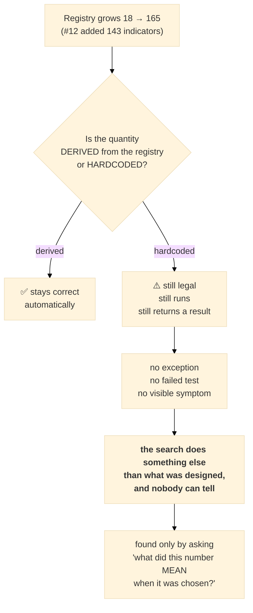
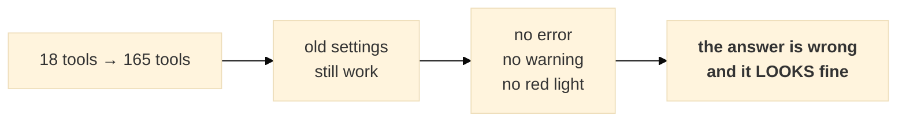

# The silent scaling debt: five constants that broke when 18 indicators became 165
# ‏الدَّين الصامت للتوسّع: خمسة ثوابت انكسرت حين صارت ١٨ مؤشرًا ١٦٥

**Date:** 2026-07-30 · **Issues:** #2 #12 #80 #81 #85 #88 #89 #90
**Contents:** [Part 1 — Professional English](#part-1--professional-english) ·
[Part 2 — Baby English](#part-2--baby-english) · [Part 3 — العربية](#part-3--العربية)

---

# THE PATTERN, IN ONE SENTENCE

> **A number that was correct for 18 indicators became silently wrong for 165 — five separate times —
> and not one of them raised an error, failed a test, or produced a visible symptom.**

Every instance still ran. Every instance returned a result. The searches simply did something other than
what their authors designed, and the only evidence was that the numbers were not what everyone believed.

| # | where | calibrated for 18 | actual at 165 | status |
|---|---|---|---|---|
| 1 | `--max-enabled` cap repair | keeps N of 18 fairly | **0 of 1,500 trials** held a new indicator | ✅ fixed (#12) |
| 2 | `--auto-trials` budget | 5,900 trials / 59 dims | **47,100 trials for a 59-dim search** (8×) | ✅ fixed (#2) |
| 3 | MAP-Elites genome + mutation | ~7 enabled, ~8% mutation | **~66 enabled, ~1% mutation** | ✅ fixed (#81) |
| 4 | L2 + contributor searches | ~9 indicators backtested | **~82, twice per trial** — suite could not finish | ✅ fixed (#80) |
| 5 | Control-plane budget | matched the launch | **8× over-budget in the UI path** | ✅ fixed |
| 6 | MAP-Elites archive size | 171 niches / 400 evals | **1,494 niches / 400 evals** | ⬜ **open (#88)** |
| 7 | Staged searches' frozen params | 18 judged at champion values | **157 judged at factory defaults** | ⬜ **open (#85)** |

---

# PART 1 — PROFESSIONAL ENGLISH

## 1.1 Why this class of defect is invisible

A conventional bug announces itself: an exception, a failed assertion, a wrong-looking number. **None of
these did.** They share a structure:

1. a quantity is expressed **relative to the registry** — a probability, a fixed count, a budget, a bin
   axis — rather than derived from it;
2. the registry grows by 9×;
3. every consumer of that quantity keeps working, because the quantity is still *valid*, merely no longer
   *meaningful*.

A genome with 66 indicators is a legal genome. 47,100 trials is a legal budget. A committee of 82
indicators is a legal committee. **Legality is what hid them.**

## 1.2 Instance 1 — `--max-enabled` kept the first N in registry order (#12)

The cap that limits how many indicators a strategy may use trimmed the list by **keeping the first N in
REGISTRY order**. The original 18 occupy positions 0–17; the 147 newer ones begin at 18.

> **Measured: 0 of 1,500 trials contained a single new-library indicator.** Not few — zero.

Any study that used `--max-enabled` believing it searched 165 was searching 18. Fixed with an unbiased
subset seeded by trial number (98.1% of trials contained a new indicator afterwards).

## 1.3 Instance 2 — `--auto-trials` budgeted for a search it was not running (#2)

The budget is `total_dimensions × 100`. `search_dims()` counted the **whole registry** regardless of
`--only-indicators`, so restricting a run to the original 18 still budgeted **47,100 trials for a
59-dimension search**.

| | dims | trials | trials/dim |
|---|---:|---:|---:|
| intended (18 indicators) | 59 | 5,900 | 100 |
| actual | 59 | **47,100** | **798** |

Cost: **~20 hours per study instead of ~45 minutes** — about 10 days for a twelve-study campaign.
Nothing failed; it would simply have run, and run.

## 1.4 Instance 3 — the MAP-Elites genome stopped resembling a strategy (#81)

```python
en = {k: (rng.random() < 0.4) for k in library.REGISTRY}     # a PROBABILITY
```

A 40% enable rate over 18 indicators gives **~7 enabled** — a plausible strategy. Over 165 it gives
**~66**. Our deployed champions use **3–10**.

Mutation carried the same flaw: a fixed "toggle 1–2 bits" moved ~8% of an 18-indicator genome and **~1%**
of a 165-indicator one — the operator silently weakened ~9×.

**Measured with the real operators over a standard 400-evaluation run:**

| registry | archive spans | reaches the champion region (3–10)? |
|---|---|---|
| 18 (as designed) | 0 … 15 enabled | ✅ yes |
| 165 (before fix) | **50 … 83 enabled** | ❌ **never** |
| 165 (after fix) | 1 … 54 enabled | ✅ yes, every seed |

Starting at ~66 and moving ±1 per mutation, reaching a 5-indicator champion needs ~60 consecutive
downward steps while parents are drawn uniformly from an archive filling up around 66. **The search could
not represent a strategy we would trade.**

Fix: sample a **count** (1–15) then choose which; mutate a **fraction** (2%). Both independent of
registry size.

## 1.5 Instance 4 — two full-registry searches in a single trial (#80)

`optimize/l2/optimize.py` called `_suggest_indicators(trial)` with **no scope**, and
`suggest_contributor` ran its **own** full-registry search for the cross-instrument committee. So one
trial carried **two 165-indicator spaces**, then ran a real backtest with ~82 enabled (it was ~9 at
registry size 18).

Consequence: `test_run_small_study_smoke` and `test_suggested_contributor_runs_in_engine` **never
finished** — spinning at ~100% CPU for 30+ minutes, stalling `optimize/l2/` entirely and silently
removing ~120 tests from any "run everything" check.

| | before | after |
|---|---|---|
| `test_run_small_study_smoke` | never finished | **2.78s** |
| `test_suggested_contributor_runs_in_engine` | never finished | **2.05s** |
| `optimize/l2/` (169 tests) | **could not complete** | **94.79s** |
| full suite | stalled at ~68% | **1,022 passed in 11:22** |

**Why it hid:** every file in `optimize/l2/` passed quickly *in isolation* (~26s for all of them). The
cost only appeared when the contributor path was exercised, so it looked like an interaction between
tests rather than one test being slow. And the second offender lived in a **subdirectory** that a
`optimize/l2/test_*.py` glob never matched.

## 1.6 Instance 5 — the control plane charged for a search it was not launching

The most consequential, because it is the path a **human** uses.

`plan()` and `preview_command()` computed the search size from the whole registry while the same config
passed `--only-indicators` to the launched command:

```
displayed:  471 dims / 47,100 trials
launched:   --trials 47100 --only-indicators <18 keys>
truth:       59 dims /  5,900 trials
```

This is instance 2 again — **surviving because that fix went in at `optimizer.main()` while the control
plane builds its own budget.** Fixing a defect at one call site is not fixing the defect.

## 1.7 Instance 6 — the archive no longer fits the budget ⬜ **OPEN (#88)**

MAP-Elites' niche coordinate is `(drawdown bucket 0–8, number of indicators 0–N)`.

| | niches | evals | fillable |
|---|---:|---:|---:|
| designed (18 indicators) | **171** | 400 | 100% — ~2.3 evals per niche |
| today (165) | **1,494** | 400 | **≤26%** |
| after the genome fix (~46 columns reached) | ~414 | 400 | ~**1.0 eval per niche** |

Even after the genome fix, the archive sits at roughly **one evaluation per niche**. MAP-Elites' premise
is *"keep the **best** solution per niche"* — at one visit per cell it degenerates to **"keep the first
feasible solution per niche."** The quality half of "quality-diversity" is gone.

## 1.8 Instance 7 — indicators judged at factory settings ⬜ **OPEN (#85)**

`two_stage.py:83-86` freezes indicator parameters, falling back to `p["default"]`:

* the ~8 indicators in the warm-start champion are frozen at **tuned** values;
* the other **~157 at schema factory defaults**, never tuned for this market.

So the staged searches ask *"is this indicator useful at its factory setting?"* An indicator that would
win at period 7 and lose at the default 14 is **eliminated before its values are explored**. Formally the
ranking is by `f(subset, frozen)`, a lower bound on `max_params f(subset, params)` — and the bias
systematically favours indicators that happen to work at defaults.

## 1.9 The common cure

Every fix has the same shape: **derive the quantity from `len(REGISTRY)` instead of hardcoding it.**

| hardcoded | derived |
|---|---|
| `rng.random() < 0.4` | sample a count in 1–15 |
| toggle 1–2 bits | toggle `MUT_FRAC × len(REGISTRY)` bits |
| `stage_a_trials = 200` | `(len(REGISTRY)+1) × TRIALS_PER_DIM` |
| `search_dims()` over the registry | over `searchable_indicators(only, exclude)` |

And where a constant genuinely encodes a *belief* rather than an accounting fact — MAP-Elites' bootstrap
genome size — **make it an option, not a hidden constant.** A belief that cannot be changed from outside
is indistinguishable from a bug. It is now `--rand-n-ind LO,HI`, printed in the run header.



## 1.10 What actually found them

Not tests — the tests passed. Each was found by **asking what a number meant when it was chosen**:

* `--auto-trials`: comparing a July plan line (59 dims) with today's (471) for the *same* command;
* the genome: asking why MAP-Elites never proposed a champion-shaped strategy;
* `optimize/l2/`: bisecting a suite that would not finish;
* the control plane: auditing whether the operator can still choose the search scope;
* the archive: checking whether the *other* items in #81 were really addressed.

**The transferable question:** *this constant was written when the world was smaller — what did it mean
then, and what does it mean now?*

---

# PART 2 — BABY ENGLISH

## 2.1 What happened, in one picture

We used to have **18** tools. Now we have **165**.

Lots of little settings in the code were written back when there were 18 — and **nobody went back to
check them.** They all still work. They just quietly mean something different now.

> It is like a recipe that says **"add 2 spoons of salt for 4 people."**
> Now you are cooking for **36 people** — and the recipe still says 2 spoons.
> Nothing breaks. The pot does not explode. **The food is just wrong, and nobody notices.**

**Five of these. None of them made an error message.**

## 2.2 The five

**① The cap that only ever picked old tools.**
There is a setting: *"use at most N tools."* When too many were on, it kept "the first N in the list".
The 18 old tools are first in the list. The 147 new ones come after.

> **Result: out of 1,500 tests, ZERO used a single new tool.** Not few. Zero.

**② The budget that was 8× too big.**
The computer works out how long to search by counting how many things it is searching. It counted **all
165** even when we told it to only search **18**.

> It booked **47,100 tests** for a job needing **5,900**.
> **20 hours instead of 45 minutes** — and for a 12-job campaign, **10 days instead of 9 hours.**

**③ The "creature" that grew nine times too big.**
One search invents random strategies. The rule was *"switch each tool on with 40% chance."*

| tools available | tools switched on |
|---|---|
| 18 (when written) | about **7** ✅ looks like a real strategy |
| 165 (today) | about **66** ❌ nothing we would ever trade |

Our real strategies use **3 to 10** tools. And because the search only changes 1–2 tools at a time,
starting from 66 it **could never walk down to 5**. It was searching a place where our strategies do not
live.

**④ The test that never, ever finished.**
One test switched on ~82 tools and ran a full backtest — *twice over*, because a second part of the same
test did its own 165-tool search.

> It ran at **100% CPU for over 30 minutes without finishing**, and it froze the whole test suite —
> silently hiding **~120 other tests** from ever running.
> After the fix: **2.78 seconds.**

**⑤ The control panel that lied about the price.**
You tick "only search these 18 tools". The screen says **"47,100 tests"**. It then actually books
**47,100 tests** — for a job that needs **5,900**.

This is number ② all over again. I fixed ② in one place this morning and **missed that the control panel
does its own calculation.** Fixing a bug in one place is not fixing the bug.

## 2.3 Two that are NOT fixed yet

**⑥ The shelf with too many boxes (#88).**
This search keeps *"the best strategy in each box"*, where boxes are sorted by risk and by number of
tools.

| | boxes | attempts | attempts per box |
|---|---|---|---|
| when designed | 171 | 400 | **2.3** ✅ you can compare and keep the best |
| today | 1,494 | 400 | **~1** ❌ |

With only **one attempt per box**, "keep the **best**" becomes "keep the **first thing that fits**". The
"best" part is gone.

**⑦ Judging tools with the wrong settings (#85).**
When deciding which tools to use, the computer tests **157 of the 165 at their factory settings** —
never adjusted for our markets.

> Like judging a runner while making them wear **the wrong size shoes**. They lose, you cut them, and you
> never find out they were the fastest in the right shoes.

## 2.4 Why nobody spotted any of this

**Because nothing broke.** No red error. No failed test. No alarm.

A strategy with 66 tools is a *legal* strategy. 47,100 tests is a *legal* number. The computer did
exactly what it was told — it was just told something different from what we meant.



**The question that found them all:** *"this number was written when things were smaller — what did it
mean back then?"*

## 2.5 How we stop it happening again

Instead of writing a **fixed number**, we now write a **rule that counts for itself**:

| before (breaks when we grow) | after (fixes itself) |
|---|---|
| "40% chance each" | "pick between 1 and 15 tools" |
| "change 1–2 tools" | "change 2% of the tools" |
| "200 tests" | "100 tests per thing being searched" |

And where a number is really an **opinion** — like *"good strategies use few tools"* — it is now a
**switch you can change**, not a hidden decision. An opinion you cannot argue with is the same as a bug.

---

# PART 3 — العربية

## ٣.٠ النمط في جملة واحدة

> **رقمٌ كان صحيحًا لـ١٨ مؤشرًا صار خاطئًا بصمت عند ١٦٥ — خمس مرات منفصلة — ولم تُصدِر أيٌّ منها خطأً،
> ولا أسقطت اختبارًا، ولا أظهرت أيّ عَرَض.**

كلّها استمرّت في العمل، وكلّها أعادت نتيجة. غاية ما حدث أنّ البحث صار يفعل شيئًا غير الذي صُمِّم له،
والدليل الوحيد أنّ الأرقام لم تكن ما يظنّه الجميع.

| # | الموضع | مُعايَر لـ١٨ | الواقع عند ١٦٥ | الحالة |
|---|---|---|---|---|
| ١ | حدّ `--max-enabled` | يختار N من ١٨ بإنصاف | **٠ من ١٬٥٠٠ تجربة** ضمّت مؤشرًا جديدًا | ✅ أُصلح |
| ٢ | ميزانية `--auto-trials` | ٥٬٩٠٠ تجربة / ٥٩ بُعدًا | **٤٧٬١٠٠ تجربة لبحث من ٥٩ بُعدًا** (٨×) | ✅ أُصلح |
| ٣ | جينوم MAP-Elites وطفرته | ~٧ مفعّلة، طفرة ~٨٪ | **~٦٦ مفعّلة، طفرة ~١٪** | ✅ أُصلح |
| ٤ | بحث L2 والمساهمين | ~٩ مؤشرات في الاختبار | **~٨٢، ومرّتين في التجربة** | ✅ أُصلح |
| ٥ | ميزانية لوحة التحكّم | تطابق ما يُطلَق | **٨× زيادة في مسار الواجهة** | ✅ أُصلح |
| ٦ | حجم أرشيف MAP-Elites | ١٧١ خانة / ٤٠٠ تقييم | **١٬٤٩٤ خانة / ٤٠٠ تقييم** | ⬜ **مفتوح (#88)** |
| ٧ | تجميد معاملات المؤشرات | ١٨ عند قيم البطل | **١٥٧ عند القيم المصنعية** | ⬜ **مفتوح (#85)** |

## ٣.١ تشبيه الوصفة (بلغة مبسّطة)

> كوصفة تقول: **«ضع ملعقتَي ملح لأربعة أشخاص».**
> والآن تطبخ لـ**٣٦ شخصًا** — والوصفة ما زالت تقول ملعقتين.
> لا شيء ينكسر، ولا تنفجر القدر. **الطعام فقط خاطئ، ولا أحد ينتبه.**

## ٣.٢ لماذا كان هذا الصنف من الأخطاء خفيًّا؟

الخطأ المعتاد يُعلن عن نفسه: استثناء، أو اختبار ساقط، أو رقم يبدو غريبًا. **لا شيء من ذلك حدث هنا.**
والسبب بنيويّ:

1. الكمية مكتوبة **نسبةً إلى السجلّ** (احتمال، عدد ثابت، ميزانية، محور تصنيف) بدل أن تُشتقّ منه؛
2. السجلّ يكبر ٩ أضعاف؛
3. كل مستهلك لتلك الكمية يستمر في العمل، لأنّ الكمية ما زالت **صالحة** — لكنها لم تعد **ذات معنى**.

جينوم بـ٦٦ مؤشرًا جينوم قانونيّ. و٤٧٬١٠٠ تجربة ميزانية قانونية. ولجنة من ٨٢ مؤشرًا لجنة قانونية.
**القانونية نفسها هي ما أخفاها.**

## ٣.٣ الحالات الخمس المُصلَحة

**① الحدّ الذي كان يختار القديم دائمًا.** كان يُبقي «أول N في ترتيب السجلّ»، والـ١٨ القديمة في المقدّمة
⇒ **٠ من ١٬٥٠٠ تجربة** ضمّت مؤشرًا جديدًا. ليست قليلة — صفر.

**② ميزانية أكبر ٨ أضعاف.** حسبت الأبعاد على **السجلّ كاملًا** رغم `--only-indicators`:
٤٧٬١٠٠ تجربة لعمل يحتاج ٥٬٩٠٠ ⇒ **٢٠ ساعة بدل ٤٥ دقيقة** لكل دراسة (١٠ أيام بدل ٩ ساعات للحملة).

**③ الجينوم الذي كبر تسعة أضعاف.** القاعدة «شغّل كل مؤشر باحتمال ٤٠٪»:

| المتاح | المُشغَّل |
|---|---|
| ١٨ (وقت الكتابة) | ~**٧** ✅ استراتيجية معقولة |
| ١٦٥ (اليوم) | ~**٦٦** ❌ لا نتداولها أبدًا |

وأبطالنا يستخدمون **٣ إلى ١٠**. وبما أنّ الطفرة تغيّر ١–٢ فقط، فمن ٦٦ **يستحيل النزول إلى ٥**.
**قياسًا:** الأرشيف كان يمتدّ **٥٠..٨٣** ولا يبلغ منطقة الأبطال أبدًا؛ صار **١..٥٤** ويبلغها في كل بذرة.

**④ الاختبار الذي لم ينتهِ أبدًا.** شغّل ~٨٢ مؤشرًا في اختبار خلفي حقيقي — **مرتين**، لأنّ جزءًا آخر منه
كان يجري بحثًا كامل السجلّ خاصًّا به. عمل بـ**١٠٠٪ من المعالج لأكثر من ٣٠ دقيقة دون أن ينتهي**، وجمّد
مجموعة الاختبارات كلّها فأخفى **~١٢٠ اختبارًا**. بعد الإصلاح: **٢٫٧٨ ثانية**.

**⑤ لوحة التحكّم التي كذبت في السعر.** تختار «١٨ مؤشرًا فقط»، فتعرض **٤٧٬١٠٠ تجربة** وتطلقها فعلًا.
وهي الحالة ② نفسها — **نجت لأنّ الإصلاح وُضع في `optimizer.main()` بينما لوحة التحكّم تحسب ميزانيتها
بنفسها.** ⇒ **إصلاح الخطأ في موضع واحد ليس إصلاحًا للخطأ.**

## ٣.٤ حالتان لم تُصلَحا بعد

**⑥ رفٌّ بخانات أكثر من اللازم (#88).** الأرشيف يحفظ «أفضل استراتيجية في كل خانة»:

| | الخانات | التقييمات | لكل خانة |
|---|---|---|---|
| وقت التصميم | ١٧١ | ٤٠٠ | **٢٫٣** ✅ يمكن المقارنة والاحتفاظ بالأفضل |
| اليوم | ١٬٤٩٤ | ٤٠٠ | **~١** ❌ |

بتقييم واحد لكل خانة، تتحوّل «احتفظ بالأفضل» إلى **«احتفظ بأول ما يصلح»** ⇒ يسقط شقّ «الجودة» من
«الجودة والتنوّع».

**⑦ الحكم على المؤشرات بإعدادات المصنع (#85).** يُحكَم على **١٥٧ من ١٦٥** بقيمها المصنعية، غير المضبوطة
لأسواقنا. **تشبيه:** كأنك تحكم على عدّاء بحذاءٍ مقاسه خاطئ — يخسر فتستبعده، ولا تعرف أنه كان الأسرع
بالحذاء الصحيح.

## ٣.٥ العلاج المشترك

**اشتقّ الكمية من `len(REGISTRY)` بدل تثبيتها:**

| مثبّت (ينكسر مع النمو) | مشتقّ (يصحّح نفسه) |
|---|---|
| «احتمال ٤٠٪ لكل مؤشر» | «اختر عددًا بين ١ و١٥» |
| «بدّل ١–٢ بتّة» | «بدّل ٢٪ من الجينوم» |
| «٢٠٠ تجربة» | «١٠٠ تجربة لكل بُعد» |

وحيث يكون الثابت **رأيًا** لا حقيقة محاسبية — كحجم الجينوم الابتدائي — **فليكن خيارًا لا ثابتًا خفيًّا**:
**الرأي الذي لا يمكن تغييره من الخارج لا يختلف عن الخطأ.** صار الآن `--rand-n-ind LO,HI` ويُطبع في
ترويسة التشغيل.

## ٣.٦ ما الذي كشفها فعلًا؟

ليست الاختبارات — فقد كانت تنجح. كُشفت جميعًا بسؤال **«ماذا كان يعني هذا الرقم يوم كُتب؟»**:

* الميزانية: بمقارنة سطر خطة تموز (٥٩ بُعدًا) بسطر اليوم (٤٧١) **للأمر نفسه**؛
* الجينوم: بالسؤال لماذا لا يقترح MAP-Elites استراتيجية بشكل أبطالنا؛
* `optimize/l2/`: بتنصيف مجموعة اختبارات لا تنتهي؛
* لوحة التحكّم: بتدقيق هل ما زال المُشغِّل يملك اختيار نطاق البحث؛
* الأرشيف: بالتحقّق هل عولجت **بقية** بنود #81 حقًّا.

> **السؤال القابل للنقل:** *هذا الثابت كُتب حين كان العالم أصغر — ماذا كان يعني حينها، وماذا يعني الآن؟*

---

## Appendix — every measurement, and how to reproduce it

| claim | how it was measured |
|---|---|
| 0 of 1,500 trials held a new indicator | `optimize/perf/check_max_enabled_bias.py` |
| 47,100 vs 5,900 trials | `optimizer.search_dims()` / `recommended_trials()`, printed in every plan line |
| genome ~66 vs ~7 enabled | `_rand_geno` sampled 200× at each registry size |
| archive 50–83 → 1–54 | 400-eval simulation using the **real** `_rand_geno` / `_mutate`; `optimize/test_map_elites_genome_shape.py` |
| l2 test 30+ min → 2.78s | `pytest --durations` before/after |
| control plane 471/47,100 for an 18-indicator scope | `control.plan()` with `only_indicators`; `optimize/dashboard/test_control_scope.py` |
| archive 171 → 1,494 niches | `(DD_BIN_CAP+1) × (len(REGISTRY)+1)` |
| 157 indicators at factory defaults | `two_stage.py:83-86` `self.champ.get(..., p["default"])` |
