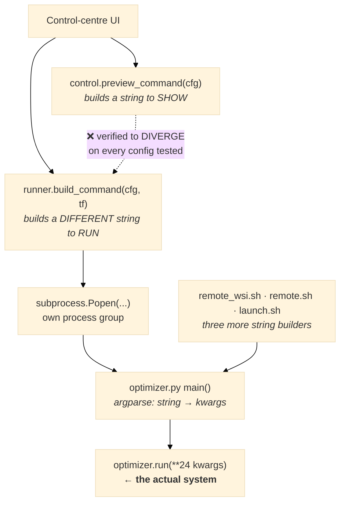

# Architecture audit: is the CLI ↔ control-centre split causing the silent failures?

**Date:** 2026-07-30 · **Question raised:** maintaining the optimizer CLI and the control centre as two
systems, integrated by passing command strings, feels unhealthy. Refactor the core into a backend? Build
a TUI? A middle ground? Or is the status quo best?

---

# VERDICT UP FRONT

**Three findings, and the first one changes the question.**

| | finding |
|---|---|
| 1 | **The "proper backend" already exists.** `optimizer.py` is 858 lines of which `main()` is 114 (13%). `run()` takes **24 parameters**; the CLI has **24 flags**; `main()` is a pure argv→kwargs translator. The core is a *library with a CLI wrapper*, not a CLI tool. |
| 2 | **The unhealthy part is real, but it is not the process boundary — it is the STRING as the interface.** Six independent places construct an optimizer invocation, and what the UI *shows* is built by a different function from what actually *runs*. Tested: **they diverge on 4 of 4 configurations.** |
| 3 | ⚠️ **A refactor would NOT have prevented the silent failures.** Of the seven documented, **one** was caused by the split. The other six were constants not derived from the registry — they would have occurred identically in any architecture. |

**Recommendation: neither full option. Take the middle ground** — keep the subprocess (it is correct),
replace the *string* interface with a **spec object built by one function**. Small change, removes the
entire divergence class.

---

## 1. What the integration actually is

The config is a Python dict. It is serialised into a command string, parsed back into kwargs by
argparse, and handed to a function whose parameters match the flags one-for-one. **The round trip
through text is pure loss** — it adds a translation layer in each direction and nothing else.

## 2. Measured: the duplication

**Six sites construct an optimizer invocation:**

| file | purpose |
|---|---|
| `dashboard/control.py:104` | the command the UI **displays** |
| `dashboard/runner.py:108` | the command that **executes** |
| `server/remote_wsi.sh:175` | server campaign launcher |
| `server/remote_wsi.sh:129` | server `--plan` preview |
| `server/remote.sh:84` | older server launcher |
| `server/server_logs/launch.sh:13` | another launcher |

`control.py:91` documents the situation in its own docstring:

> *"mirrors remote_wsi.sh's IND_ARGS construction **exactly** (same flags, same order, opt-in flags
> omitted when unset)"*

That is a comment asking a human to keep three implementations byte-identical by hand, forever.

### Preview ≠ reality, verified

| config | UI shows | actually runs |
|---|---|---|
| plain | `--trials 47100` | `--study-prefix cc03e2b7f5 --auto-trials` |
| scoped to 18 | `--trials 5900` | `--study-prefix cc3e57b4a7 --auto-trials` |
| split + max-enabled | `--trials 47700` | `--study-prefix ccbf7e1aef --auto-trials` |
| cold start | `--trials 47100` | `--study-prefix cceafa9c36 --auto-trials` |

**4 of 4 diverge.** The operator is shown an explicit trial count; the run instead uses `--auto-trials`
and computes its own — and is assigned a `--study-prefix` the UI never mentions, so you cannot tell from
the screen which study your run will write to.

Today the *numbers* happen to agree, because I fixed the budget in `search_dims()` and in
`preview_command()` separately, hours apart. **Their agreement is a coincidence that must be
re-established after every change** — which is the definition of a structural defect rather than a bug.

## 3. ⚠️ Testing the hypothesis: would a refactor have stopped the silent failures?

This is the load-bearing claim, so it deserves a straight answer: **mostly no.**

| # | silent failure | architecture-caused? |
|---|---|---|
| 1 | `--max-enabled` kept the first N in registry order | ❌ logic bug in the cap repair |
| 2 | `--auto-trials` counted the whole registry | ❌ logic bug in `search_dims()` |
| 3 | MAP-Elites genome: probability not count | ❌ calibration |
| 4 | MAP-Elites mutation: fixed bits not fraction | ❌ calibration |
| 5 | two-stage Stage A: 1.2 trials/dim | ❌ calibration |
| 6 | L2 + contributor unscoped searches | ❌ missing parameter plumbing |
| 7 | **control plane budgeted the full registry** | ✅ **yes — duplicated computation across the boundary** |

**One of seven.** The other six are *"a constant was written relative to the registry instead of derived
from it"* — they would have happened identically inside a monolith, a microservice, or a TUI.

So the architecture change is worth doing **for its own reasons**, and it will remove a real class of
defect (preview≠reality, three-way hand-synced launchers). But it must not be sold as the cure for the
scaling debt. **That cure is #89: derive quantities from `len(REGISTRY)`.** Conflating the two would mean
paying for a refactor and still getting silent failures.

## 4. The options, costed

### Option A — refactor the core into a backend; the GUI calls functions in-process

**Cost: much lower than it sounds — and it is the wrong target anyway.**

The core is *already* a library: `run()` with 24 parameters, `main()` a 114-line wrapper. There is almost
nothing to refactor.

But calling `run()` **in-process from the web server is a regression**, and `runner.py`'s own docstring
explains why it was built as a subprocess:

> *"Drives `optimize/optimizer.py` as a subprocess the control plane owns (`Popen`, its own process
> group)"*

A 47,100-trial study runs for hours. In-process it would block the event loop, could not be killed
independently, would take the dashboard down with it on a crash, and could not survive a dashboard
restart. **Process isolation is not the problem — it is a correct design decision.**

| | |
|---|---|
| effort | low (the library exists) |
| removes duplication | yes |
| **loses process isolation, stop/restart, crash containment** | **yes — disqualifying** |

### Option B — a TUI that talks to the CLI

**Cost: moderate. Benefit: negative.**

A TUI is a **seventh** consumer that must construct the same invocation. It does not remove the string
interface — it adds another client of it, and another place to keep in sync. It addresses the *symptom*
the operator experiences (a clunky GUI) rather than the *defect* (duplicated translation).

| | |
|---|---|
| effort | moderate |
| removes duplication | **no — adds a site** |
| addresses preview≠reality | no |

### Option C — middle ground: keep the subprocess, replace the string with a spec ⭐

**Keep process isolation. Delete the translation layer.**

1. **One `RunSpec`** — a dataclass mirroring `run()`'s 24 parameters, with validation and defaults in one
   place.
2. **One `build_argv(spec)`** used by *every* caller: the UI preview, the runner, and the shell scripts
   (via a `--print-argv` subcommand). Preview and execution become **the same function call** — they
   cannot diverge, because there is nothing to keep in sync.
3. **Optionally, skip argv entirely**: `python -m optimize.optimizer --spec run.json`, where the JSON is
   `asdict(spec)`. The child parses one JSON object instead of 24 flags; the flags remain for humans.
4. `main()` becomes: parse argv → `RunSpec` → `run(**asdict(spec))`. Roughly what it already does, minus
   the ability to drift.

| | |
|---|---|
| effort | **small–moderate** (~1 new module, ~4 call sites re-pointed, shell scripts call `--print-argv`) |
| removes duplication | **yes — six sites collapse to one** |
| preview≠reality | **structurally impossible** |
| keeps process isolation | **yes** |
| risk to the engine | **none** — `run()` is untouched |

### Option D — keep the current architecture

Defensible: it works, it is deployed, and the engine itself is sound. But the divergence recurs. It has
already produced one confirmed defect (the 8× budget), and the hand-sync comment in `control.py:91` is a
standing invitation for the next one.

| | |
|---|---|
| effort | zero |
| ongoing cost | every change must be mirrored in up to six places, by hand, forever |

## 5. Recommendation

**Option C**, in this order:

1. `RunSpec` + `build_argv()` in one module, with a test asserting *preview == executed argv* for a
   matrix of configs — the test that would have caught the 8× budget divergence.
2. Re-point `control.preview_command` and `runner.build_command` at it. **Two call sites, and the
   divergence class is gone.**
3. Add `--print-argv` so the shell launchers stop building flags by hand; delete the duplicated logic
   from `remote_wsi.sh` / `remote.sh` / `launch.sh`.
4. *Optional later:* `--spec run.json`, removing flag translation entirely.

**Explicitly do not:** move the optimizer in-process (loses isolation), or add a TUI (adds a seventh
consumer of the very interface that is the problem).

**And keep the two problems separate.** This refactor fixes *preview≠reality and hand-synced launchers*.
It does **not** fix the silent scaling debt — **#89** does, by deriving constants from `len(REGISTRY)`.
Doing C and skipping #89 would leave six of the seven failure modes fully intact.

---

## 6. In plain language

**What you suspected:** the GUI and the optimizer are two systems talking by passing text commands, and
that's fragile. **You're right that it's fragile — but not about why.**

**The good news:** the optimizer is *already* a proper backend. It's a normal Python function taking 24
settings. The command-line part is a thin 114-line shell around it — 13% of the file. So "refactor the
core into a backend" is mostly **already done**.

**The real problem:** the screen builds the command with **one piece of code**, and the thing that
actually runs builds it with **a different piece of code**. I tested four setups — **all four showed you
one command and ran another.** They agree on the numbers today only because I happened to fix both sides
this morning.

**Why not just call the function directly instead of running a command?** Because a search runs for
hours. If it ran *inside* the dashboard, the dashboard would freeze, you couldn't stop the search
without killing the dashboard, and a crash in one would kill both. Running it as a separate program is
**correct** — that part isn't the mistake.

**Why not a text-menu interface (TUI)?** It would become a *seventh* place that has to build the same
command. It moves the buttons; it doesn't fix the plumbing.

**What I recommend:** keep running it as a separate program, but have **one** piece of code build the
command — used by the screen, by the runner, and by the server scripts. Then "what you see" and "what
runs" are literally the same function call and *cannot* disagree.

⚠️ **One honest caution.** You hoped this would stop the silent failures. It would have stopped **one of
the seven**. The other six were a different problem — numbers written for 18 indicators that nobody
updated for 165. That's **#89**. If we do this refactor and skip #89, the silent failures continue.

---

## ٧. بالعربية — الخلاصة

**الحكم:** لا الخيار الأول ولا الثاني، بل **حلٌّ وسط**.

1. ⭐ **«الواجهة الخلفية السليمة» موجودة أصلًا.** `optimizer.py` من ٨٥٨ سطرًا، منها `main()` ١١٤ سطرًا
   فقط (١٣٪). الدالة `run()` تأخذ **٢٤ معاملًا** ويقابلها **٢٤ راية** في سطر الأوامر — تطابق واحد لواحد.
   فالنواة **مكتبة بغلاف سطر أوامر**، لا أداة سطر أوامر.
2. **العلّة الحقيقية ليست حدود العمليات، بل النصّ كواجهة.** **ستة مواضع** تبني أمر التشغيل، وما
   **تعرضه** الشاشة تبنيه دالة غير التي **تُشغّل** فعلًا — **اختُبرت أربع حالات فاختلفت جميعها**.
3. ⚠️ **إعادة الهيكلة ما كانت لتمنع الأعطال الصامتة.** من السبعة الموثّقة **واحد فقط** سببه هذا الانقسام؛
   والستة الباقية ثوابت لم تُشتقّ من السجلّ، وكانت ستقع في أيّ معمارية.

**التوصية:** أبقِ التشغيل كعملية منفصلة (وهو قرار **صحيح**: البحث يستغرق ساعات، وتشغيله داخل اللوحة
يُجمّدها ويمنع إيقافه ويُسقط الاثنين معًا عند الانهيار)، لكن **اجعل بناء الأمر في دالة واحدة** تستخدمها
الشاشة والمُشغِّل وسكربتات الخادم ⇒ يصير «ما تراه» و«ما يُنفَّذ» **نفس الاستدعاء**، فيستحيل اختلافهما.

**ولا تخلط المشكلتين:** هذا الإصلاح يعالج «المعروض ≠ المُنفَّذ»، أمّا الأعطال الصامتة فعلاجها **#89**
(اشتقاق الثوابت من `len(REGISTRY)`). وتنفيذ الأول دون الثاني يُبقي ستة من سبعة كما هي.
