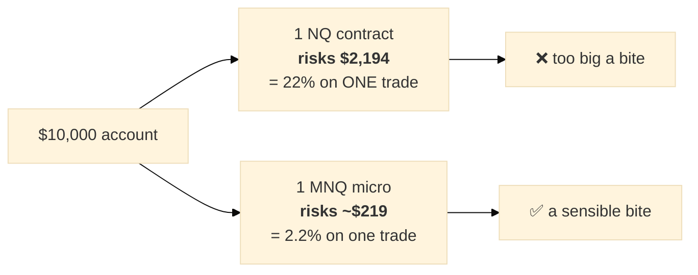

# Contract sizes (#83) and why natural gas is dangerous (#79) — three languages
# ‏أحجام العقود (#83) ولماذا الغاز الطبيعي خطِر (#79) — بثلاث لغات

**Date:** 2026-07-30
**Contents:** [Part 1 — Professional English](#part-1--professional-english) ·
[Part 2 — Baby English](#part-2--baby-english) · [Part 3 — العربية](#part-3--العربية)

> These are two halves of one problem: **#79** says a contract can hurt you more than its stop-loss
> allows; **#83** asks whether we can buy a *smaller* contract so that it hurts less.

---

# PART 1 — PROFESSIONAL ENGLISH

## 1.1 #79 — the finding, stated precisely

On natural gas, **the hard stop does not bound the loss**.

| | |
|---|---|
| NG 5-minute champion's hard stop | **0.001017** — about **0.03%** of a $3.57 price |
| worst trade observed | **−182.84 risk units** (182.84× the intended loss) |
| the mechanism | a **+5.52%** gap across a weekend reopen |

Traced to the raw bars, because the whole conclusion rests on it:

* short entered at **3.368** — the real close of the 5m bar ending **Fri 2025-01-03 16:55**
* the market closed for the weekend
* reopened **Sun 2025-01-05 18:00 at 3.554** — it never traded between those prices
* exit `STOP_LOSS_HARD` at 3.554: a loss of **0.186 points**, i.e. **182.84×** the intended risk

A stop-loss is an instruction: *"if price reaches X, get me out."* It works when price **travels** to X.
It cannot work when price **jumps over** X while the market is shut. Our stop was worth 0.03% of price;
the gap was 5.52% — **180 times larger**.

### Why this matters to the whole book, not just gas

Every other market's worst trade sits between **−2.1** and **−36.4** risk units. NG's is **−182.84**.
When the position-sizing analysis (#3) asked *"how much can we risk per trade?"*, that single number set
the answer **for all nine markets**:

| | largest safe risk fraction |
|---|---:|
| whole book **including** NG | **0.400%** |
| whole book **excluding** NG | **1.000%** — and P(ruin) is 0.00% up to 2% |

**One market forces the other eight to trade at 40% of the size they could safely carry.**

### ⚠️ The honest qualifier

In *risk units* NG is catastrophic. In **actual dollars on one contract** it is mid-pack:

| CL | NQ | SI | GC | **NG** | ES | YM | RTY | HG |
|---:|---:|---:|---:|---:|---:|---:|---:|---:|
| −$7,710 | −$7,420 | −$3,850 | −$3,760 | **−$3,660** | −$3,038 | −$2,525 | −$2,250 | −$1,650 |

NG is **fifth**. The −183× is large because we divide by a *microscopic* stop, not because the dollar
loss is unusual. It becomes genuinely dangerous only in a system that would **size up** to make that tiny
stop equal 1% of capital — and our system does not: it trades **one contract**, always.

So #79 is not "gas is about to ruin us today". It is: **the stop on gas is not performing the job a stop
exists to do, and any future sizing logic built on it would be built on a false floor.**

### The three candidate fixes

1. **Widen NG's stops** to something commensurate with its gap distribution, then re-tune under honest
   fills and measure the P&L cost. A wider stop that *holds* may be worth more than a tight stop that
   only looks good on paper.
2. **Do not hold NG through the Sunday reopen.** This removes the mechanism rather than pricing it. The
   engine already supports end-of-day exit rules (`cap_mode`), so this may be a parameter change rather
   than new code.
3. **Accept it and size NG separately** (0.3%) — the workaround #3 recommends. It pays for a broken stop
   with size everywhere else.

## 1.2 #83 — what "smaller contract" actually means

### The correction that shapes the work

**Futures contracts cannot be traded in fractions.** You cannot buy 0.25 of an NQ contract. This is not a
broker rule that varies by material — it is what a futures contract *is*: a standardised agreement for a
fixed quantity (NG = 10,000 MMBtu; CL = 1,000 barrels). Half an agreement does not exist.

Fractional trading is real in **equities** (buy $50 of a $900 share) and in **crypto**. All nine of our
tokens are **futures**.

### The real mechanism: a contract ladder

Exchanges solved exactly this problem — not with fractions, but with **smaller separate products**:

| full-size | smaller sibling | typical ratio |
|---|---|---|
| NQ ($20/pt) | **MNQ** micro | 1/10 |
| ES ($50/pt) | **MES** micro | 1/10 |
| GC ($100/pt) | **MGC** micro | 1/10 |
| RTY ($50/pt) | **M2K** micro | 1/10 |
| YM ($5/pt) | **MYM** micro | 1/10 |
| CL ($1,000/pt) | **MCL** micro | 1/10 |
| SI, NG, HG | smaller variants exist | **varies** |

⚠️ **These ratios are indicative and must be verified against current CME/COMEX/NYMEX specifications
before anything is built.** That verification is task one of #83, not a footnote. Some instruments may
have no micro at all, and specifications change.

**A micro is a different ticker** with its own price series, margin, tick size and liquidity — *not* a
scaled view of its parent. Trading MNQ is not "trading 0.1 NQ".

### Why this matters

One NQ contract risks **$2,194** at the champion's stop. On a $10,000 account that is **22% of capital in
a single trade** — there is no way to take a smaller bite. With MNQ at $2/point the same strategy risks
**~$219**. That is the granularity that percentage-based risk budgets assume and futures do not otherwise
provide.

### ⚠️ The governance constraint

Choosing *how many* micros to trade **is a position-sizing decision layer** — the exact thing that must
never appear implicitly. The engine currently trades one contract and has no account input;
`optimize/TASK.md:24` records *"1 contract only … no scaling/ladder"* as a standing constraint.

So unit selection must be **explicit and human-controlled from the control centre**, never inferred by
the optimizer.

### ⚠️ And the invariant that must hold

> *"What if I bought a full contract and sold only a quarter of it? That is the same as entering with
> four contracts and selling three. This is not allowed by design."*

Correct, and it is the sharpest constraint in the design. Partial exit introduces **scaling out** —
per-unit exit rules, a position no longer described by one stop and one target. The engine, the trade
ledger, the drawdown breaker, the golden gate and every champion assume **one position, one exit**.

**The rule: trade an integral number of the smallest chosen unit, and exit all of it.** Granularity
without opening the scaling-out space. Whether to open that space later is a separate decision needing
its own evidence.

### How #79 and #83 connect

If NG has a smaller sibling, the ladder gives a **second** way to reduce gas's damage — not by fixing the
stop, but by making each unit smaller. It does not repair the stop; a gap still blows through it. **It
reduces the dollar consequence, not the structural flaw.** Fixing the stop (#79) remains the better
answer; the ladder (#83) is a complementary tool.

---

# PART 2 — BABY ENGLISH

## 2.1 #79 — why natural gas is dangerous

**A stop-loss is a safety net. On gas, the net has a hole in it.**

You tell the market: *"if gas falls to $3.00, sell me out."* That works when the price **walks down** to
$3.00 — it passes your instruction and you get out.

But markets **close**. And while gas was closed for the weekend:

| | |
|---|---|
| Friday, gas closed at | **$3.368** — you were short (betting it falls) |
| Sunday evening, gas reopened at | **$3.554** |
| It never traded in between | it **jumped over** your instruction |

Your safety net was set **0.001 away**. The jump was **0.186** — **180 times bigger**. The net was never
going to catch that.

> **You planned to lose 1 unit. You lost 183.**

### Why this hurts the other eight markets

When we asked *"how much should we risk per trade?"*, gas's one terrible trade set the answer for
**everything**:

| | biggest safe bet |
|---|---|
| with gas in the book | **0.40%** |
| **without gas** | **1.00%** |

**One market makes the other eight trade at 40% of the size they could safely handle.**

### ⚠️ But don't panic — the honest version

In **dollars**, on one contract, gas is not the worst. It is **fifth**:

| oil | Nasdaq | silver | gold | **gas** | S&P | Dow | Russell | copper |
|---|---|---|---|---|---|---|---|---|
| −$7,710 | −$7,420 | −$3,850 | −$3,760 | **−$3,660** | −$3,038 | −$2,525 | −$2,250 | −$1,650 |

The "183 times" is big because we **divide by a tiny stop** — not because the money lost is unusual. It
would only become deadly in a system that *grew* the position to make that tiny stop worth 1% of your
account. **Our system never does that: it buys one contract, always.**

**So the real meaning of #79 is:** *on gas, the safety net is not doing its job.* Not "we are about to
lose everything today."

### Three ways to fix it

1. **Make the net bigger** — a wider stop-loss on gas, then measure what it costs in profit.
2. **Don't hold gas over the weekend** — close before Friday ends. Removes the danger instead of paying
   for it.
3. **Just bet less on gas** (0.3%) — works, but it pays for a broken net with smaller bets everywhere.

## 2.2 #83 — can we buy a smaller piece?

### First, the correction

**You cannot buy half a futures contract.** Not because a broker forbids it — because a futures contract
*is* a fixed-size agreement. NG = 10,000 units of gas. CL = 1,000 barrels of oil. **Half an agreement
does not exist.**

(Buying fractions *is* real — for **shares** and **crypto**. We trade neither.)

### But there IS a smaller size — a different product

The exchanges already solved this. They sell **small versions** as separate products:

| big one | small one | size |
|---|---|---|
| NQ — $20 per point | **MNQ** | **1/10** |
| ES — $50 per point | **MES** | 1/10 |
| GC — $100 per point | **MGC** | 1/10 |

**It is a different thing you buy, with its own ticker and its own price screen** — not a slice of the
big one.

### Why we want it

One Nasdaq contract risks **$2,194** on our strategy. If your account is **$10,000**, that is **22% of
everything on one trade.** There is no smaller bite available.

With the small version: **~$219**. Now you can take a sensible bite.

### ⚠️ Two rules that must not be broken

**1. A human decides how many — never the computer.** Choosing "how many contracts" *is* the
position-sizing decision you never approved. It must be a switch on your control centre, chosen by you,
shown in the report.

**2. Buy whole units, sell all of them.** Your own point, and it is exactly right:

> *"What if I bought one contract and sold only a quarter of it? That's the same as buying four and
> selling three. That is not allowed."*

Selling part of a position is a **whole new ability** ("scaling out"). It would mean one trade has
several exits, several stops, several answers to "did it win?". Everything we have — the trade log, the
safety breaker, the golden test, every champion — assumes **one position, one exit**.

**So: pick the smallest unit you want, buy a whole number of them, and exit all of it at once.**

### How the two issues fit together

If gas has a small version, that is a **second** way to reduce the damage — smaller units, smaller loss.
But **it does not fix the hole in the net.** The jump still goes over your stop; it just costs less.

**Fixing the stop (#79) is still the better answer. The small contract (#83) is a helpful extra.**

---

# PART 3 — العربية

## ٣.١ المسألة #79 — لماذا الغاز الطبيعي خطِر؟

**وقف الخسارة شبكة أمان. وفي الغاز، في الشبكة ثقب.**

أنت تقول للسوق: *«إن هبط الغاز إلى ٣٫٠٠ دولار فأخرجني».* وهذا ينجح حين **يمشي** السعر إلى ٣٫٠٠ فيمرّ
بأمرك. لكنّ الأسواق **تُغلق**، وأثناء إغلاق عطلة نهاية الأسبوع:

| | |
|---|---|
| أغلق الغاز الجمعة عند | **٣٫٣٦٨** — وكنتَ في بيع (تراهن على الهبوط) |
| فتح الأحد مساءً عند | **٣٫٥٥٤** |
| ولم يتداول بينهما إطلاقًا | بل **قفز فوق** أمرك |

وكانت شبكتك على بُعد **٠٫٠٠١**، والقفزة **٠٫١٨٦** — **أكبر بـ١٨٠ مرة**. لم تكن الشبكة لتمسك ذلك أبدًا.

> **خطّطتَ لخسارة وحدة واحدة. فخسرت ١٨٣.**

### لماذا يؤذي هذا الأسواق الثمانية الأخرى؟

حين سألنا «كم نخاطر في الصفقة؟»، حدّدت صفقةُ الغاز السيّئة الجوابَ **للجميع**:

| | أكبر مخاطرة آمنة |
|---|---|
| مع الغاز | **٠٫٤٠٪** |
| **بدون الغاز** | **١٫٠٠٪** |

⇒ **سوق واحدة تجبر الثماني الأخرى على التداول بـ٤٠٪ من الحجم الذي تحتمله بأمان.**

### ⚠️ لكن لا داعي للذعر — الرواية الأمينة

**بالدولار، وبعقد واحد، الغاز ليس الأسوأ — بل الخامس:**

| النفط | ناسداك | الفضة | الذهب | **الغاز** | ‏S&P | داو | راسل | النحاس |
|---|---|---|---|---|---|---|---|---|
| −٧٬٧١٠ | −٧٬٤٢٠ | −٣٬٨٥٠ | −٣٬٧٦٠ | **−٣٬٦٦٠** | −٣٬٠٣٨ | −٢٬٥٢٥ | −٢٬٢٥٠ | −١٬٦٥٠ |

الرقم «١٨٣ ضعفًا» كبير لأننا **نقسم على وقفٍ متناهي الصِّغَر**، لا لأنّ الخسارة المالية استثنائية. ولا
يصبح قاتلًا إلا في نظامٍ **يُكبِّر** الصفقة حتى يصير ذلك الوقف الضئيل ١٪ من رأس المال — **ونظامنا لا
يفعل ذلك أبدًا: يشتري عقدًا واحدًا، دائمًا.**

⇒ **معنى #79 الحقيقي:** *في الغاز، شبكة الأمان لا تؤدي وظيفتها* — لا «أننا على وشك خسارة كل شيء اليوم».

### ثلاثة حلول ممكنة

1. **وسّع الوقف** بما يناسب توزيع فجوات الغاز، ثم أعد الضبط وقِس الكلفة في الأرباح.
2. **لا تحتفظ بالغاز عبر عطلة نهاية الأسبوع** — إغلاق قبل نهاية الجمعة. يزيل الآلية بدل أن يدفع ثمنها.
   (المحرّك يدعم أصلًا قواعد الإغلاق اليومي `cap_mode`.)
3. **اقبل الأمر وصغّر حجم الغاز** (٠٫٣٪) — يعمل، لكنه يدفع ثمن شبكةٍ معطوبة بحجمٍ أصغر في كل مكان.

## ٣.٢ المسألة #83 — هل نستطيع شراء جزء من العقد؟

### التصحيح أولًا

**لا يمكن شراء كسر من عقد آجل.** ليس لأنّ الوسيط يمنع، بل لأنّ العقد الآجل **اتفاق بحجم ثابت**:
الغاز = ١٠٬٠٠٠ وحدة، النفط = ١٬٠٠٠ برميل. **ونصف الاتفاق لا وجود له.**

(الشراء الكسريّ حقيقي في **الأسهم** و**العملات الرقمية** — ونحن لا نتداول أيًّا منهما.)

### لكن يوجد حجم أصغر — كمنتج مختلف

حلّت البورصات هذه المشكلة بمنتجات **مصغّرة منفصلة**:

| الكبير | المصغّر | الحجم |
|---|---|---|
| NQ — ٢٠ دولارًا للنقطة | **MNQ** | **١/١٠** |
| ES — ٥٠ دولارًا | **MES** | ١/١٠ |
| GC — ١٠٠ دولار | **MGC** | ١/١٠ |

⚠️ **هذه النسب استرشادية ويجب التحقّق منها من مواصفات البورصة الحالية قبل بناء أي شيء** — وهي المهمة
الأولى في #83. **والمصغّر رمز تداول مختلف** له سلسلة أسعار وهامش وسيولة خاصة به — **لا شريحة من الكبير**.

### لماذا نريده؟

عقد ناسداك واحد يخاطر بـ**٢٬١٩٤ دولارًا**. فإن كان حسابك **١٠٬٠٠٠ دولار**، فتلك **٢٢٪ من كل شيء في صفقة
واحدة**، ولا تملك قضمة أصغر. أمّا بالمصغّر فنحو **٢١٩ دولارًا** — قضمة معقولة.

### ⚠️ قاعدتان لا تُكسَران

**١. الإنسان يقرّر العدد، لا الحاسوب.** اختيار «كم عقدًا» **هو** طبقة قرار تحديد الحجم التي لم توافق
عليها؛ فليكن مِقبضًا في مركز التحكّم، تختاره أنت، ويظهر في التقرير.

**٢. اشترِ وحدات كاملة، وأغلقها كلّها.** وهي ملاحظتك، وهي دقيقة تمامًا:

> *«ماذا لو اشتريتُ عقدًا وبعتُ رُبعه فقط؟ هذا يساوي أن أدخل بأربعة وأبيع ثلاثة — وهذا غير مسموح
> بالتصميم.»*

البيع الجزئي قدرة **جديدة كليًّا** («التخارج المتدرّج»): تعني مخارج متعددة، وأوقافًا متعددة، وأجوبة
متعددة عن «هل ربحت الصفقة؟». وكلّ ما لدينا — سجلّ الصفقات، قاطع الهبوط، البوابة الذهبية، وكل بطل —
يفترض **مركزًا واحدًا ومخرجًا واحدًا**.

⇒ **اختر أصغر وحدة تريدها، واشترِ عددًا صحيحًا منها، واخرج منها دفعةً واحدة.**

### كيف ترتبط المسألتان؟

إن كان للغاز نسخة مصغّرة، فتلك **طريقة ثانية** لتقليل الضرر — وحدات أصغر ⇒ خسارة أصغر. **لكنها لا تُصلح
الثقب في الشبكة**: القفزة ما زالت تتجاوز وقفك، لكنها تكلّف أقل.

⇒ **إصلاح الوقف (#79) يبقى الجواب الأفضل، والعقد المصغّر (#83) أداة مساعدة مكمّلة.**
