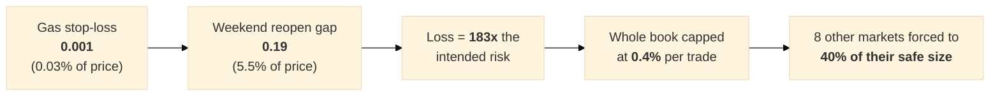

# Issue #79 — Natural gas: the stop-loss is smaller than the gaps · **OPEN, NEW**

**Date opened:** 2026-07-29 · Split out of [#3](./ISSUE-03-risk-budget.md) · **Not started**

---

## 1. The finding, in one sentence

**Natural gas's stop-loss is roughly a hundred times smaller than the jumps natural gas makes over a
weekend — so on gas, the stop-loss does not limit the loss at all.**

| | |
|---|---|
| gas 5-minute strategy's stop-loss | **0.001017** — about **0.03%** of a $3.57 price |
| worst trade actually recorded | **−183×** the intended risk |
| what caused it | a **+5.52%** jump when the market reopened after a weekend |

Every other market we trade has a worst case between **−2.1×** and **−36.4×**. Gas is **−183×**.

## 2. Why this matters far beyond natural gas

Because gas sets the speed limit for the **entire** book:

| | biggest bet before the worst known trade wipes you out | biggest safe bet |
|---|---:|---:|
| whole book (with gas) | 0.547% | **0.400%** |
| **whole book without gas** | 2.749% | **1.000%** |

Without gas, the chance of ruin is **0.00% at every bet size up to 2%**.

> **One market is forcing the other eight to trade at 40% of the size they could safely carry.**

The mitigation recommended in #3 — bet only 0.3% on gas — works, but it is a **workaround**. It accepts
a stop-loss that cannot do its job and pays for that everywhere else.

## 3. What to investigate

1. **Widen the gas stops** to something comparable with how gas actually moves, then re-tune gas under
   honest pricing and measure what it costs in profit. **A wider stop that actually holds may be worth
   more than a tight stop that only looks good on paper.**
2. **Don't hold gas through the Sunday reopen.** This removes the exact mechanism rather than pricing
   it. The engine already supports end-of-day exit rules (`cap_mode`), so this may be a settings change
   rather than new code.
3. **Check the other jumpy markets for the same shape.** Copper's worst is −36× — far better than gas,
   but still 36 times its intended risk.
4. **Ask how much of gas's profit depends on stops that only looked tight because the old backtest
   cheated on gaps.** Gas's 5-minute strategy shows **$38,079** of profit — and it is the same strategy
   that a rounding bug once flipped to **−$1,714**. It has a history of being fragile to exactly this
   kind of detail.

## 4. What "done" looks like

A **decision, backed by measurements**: either gas keeps its current stops and is permanently sized at
0.3%, or it gets wider stops / a weekend-flat rule and rejoins the book at ~1%.

**Either answer is acceptable.** The point is that it should be **chosen deliberately rather than
inherited by accident.**

## 5. ⚠️ Honest caveat

**This rests on one trade.** It is verified against the raw price bars — the entry price is real, the
gap is real — but it is a single observation of an extreme event. The correct reading is *"gas is
capable of this"*, **not** *"gas does this X% of the time"*. There are only a handful of weekend gaps
this size in the history, so the frequency is not well estimated. That is an argument for fixing the
stop, not for assuming the risk is rare.

## 6. Why it was split out rather than fixed inside #3

#3 asked *"how much should we bet?"* — a sizing question, and it now has a complete answer. Changing
gas's stop-loss or adding a weekend-flat rule **changes the strategy itself**, which needs its own
re-tuning, its own verification, and its own champion proposal. Bundling a strategy change into a sizing
decision is how untested changes get shipped.
