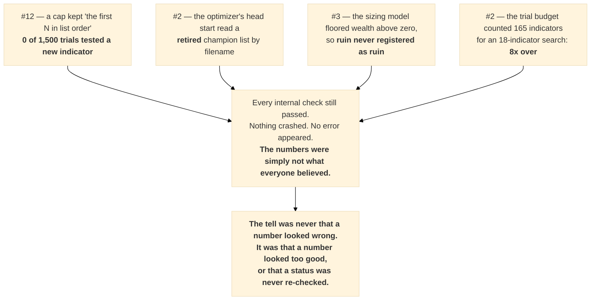

# Issue reports — 2026-07-29

Plain-language reports for every issue touched or left open on this date. **Start with the
[glossary](./00-GLOSSARY-plain-language.md)** if any term is unfamiliar — it explains `f`, `R`,
`P(ruin)` and `P(dd≥50%)` in dollars on a $100,000 account, and summarises RISK-01 and GAP-02 in
everyday language.

| report | issue | state | one-line summary |
|---|---|---|---|
| [glossary](./00-GLOSSARY-plain-language.md) | — | — | what every term and percentage means, in dollars |
| ⭐ [**trilingual + governance**](./01-TRILINGUAL-f-R-ruin-drawdown.md) | — | — | `f`/`R`/ruin/drawdown in **professional English, baby English and Arabic** — and the answer to "was a sizing layer added without my approval?" (**no**) |
| [system analysis](./02-SYSTEM-ANALYSIS-orm-and-storage.md) | — | — | do we need an ORM (**no**), is the SQLite/Postgres split still right (**yes, keep both**) |
| [#6](./ISSUE-06-ci-enforcement.md) | CI enforcement | ✅ **closed** | the code checker ran but nothing forced anyone to obey it. Now required. |
| [#12](./ISSUE-12-indicator-library.md) | 143 new indicators | ✅ **closed** | library complete at 165 — but a safety valve meant **0 of 1,500 trials** ever tested a new one |
| [#3](./ISSUE-03-risk-budget.md) | how much to bet | ✅ **closed** | **21.8% of trades lose more than their stop.** The limit is ruin, not drawdown |
| [#2](./ISSUE-02-champion-reoptimization.md) | re-tune champions | 🔄 **running** | July's run wasn't lost, it was unsaved — and its headline reverses. Corrected re-run in flight |
| [#4](./ISSUE-04-gold-macro-forward-test.md) | gold vs macro news | ⬜ **not started** | gold moves against economic surprises — real, but needs a pre-registered forward test |
| [#79](./ISSUE-79-ng-stops.md) | natural gas stops | ⬜ **new** | gas's stop is ~100× smaller than its weekend gaps, and it caps the whole book |

## The thread running through all of them

Four separate investigations this week found the same shape of bug, and **not one of them announced
itself**:

**Two habits that caught all four:**

1. **Re-derive the claim from the primary source instead of trusting the summary.** The July champion
   run "didn't exist" until the server was searched; the −183× trade was traced back to actual price
   bars before a $100,000-scale recommendation was built on it.
2. **Ask what a passing check would look like if it were broken.** A stop-loss test that only ever sees
   stop-losses hold, a budget that only ever counts the full library, a simulator that cannot go
   bankrupt — each passes perfectly while measuring the wrong thing.
