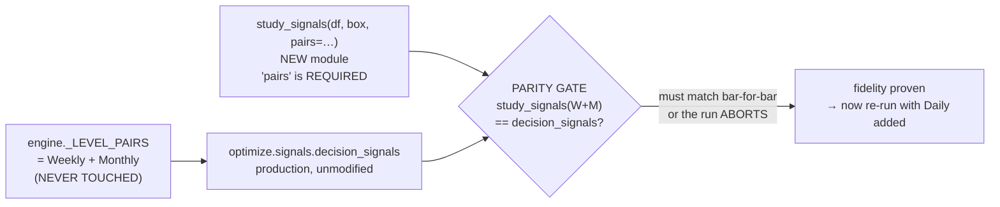
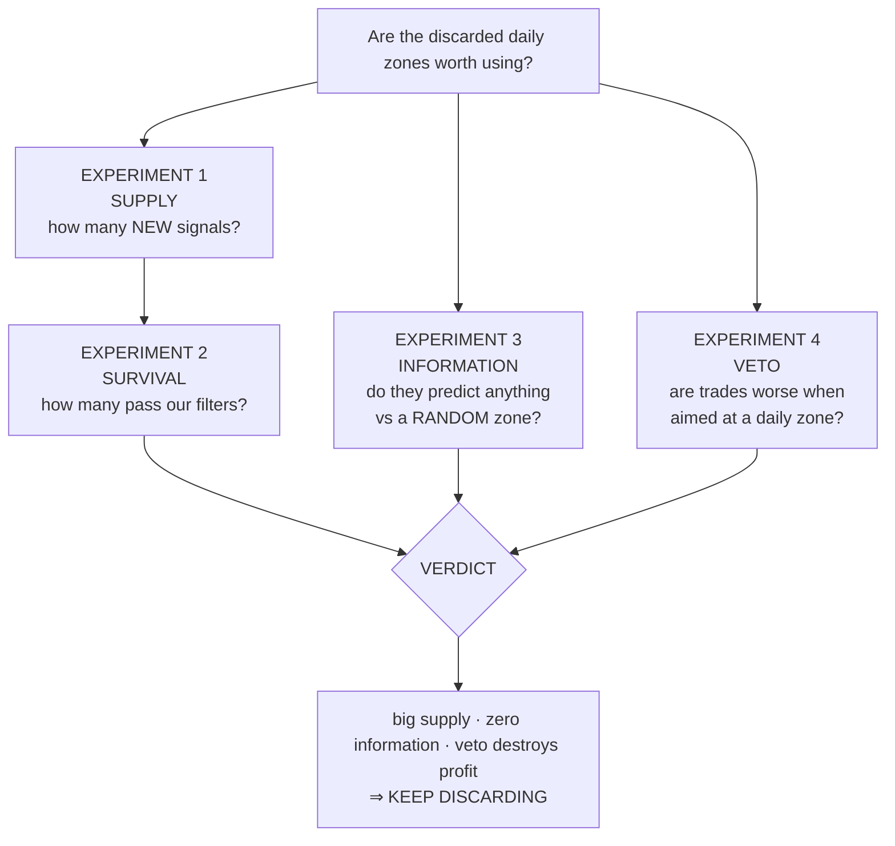
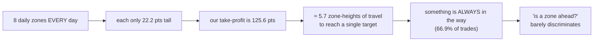

# DAILY-BOX-01 — Team Leader Report
## Do the daily box levels we throw away contain anything we can trade?

**Date:** 2026-07-23
**Workstream:** `research-daily-boxes` (branched off `dev` @ `e7eadbe`)
**Pull request:** [#9](https://github.com/mulhamfetna/trading-strategy-finder/pull/9) → base `dev`
**Instrument:** NQ (Nasdaq-100 E-mini futures), $20 per point
**Status:** COMPLETE — topic closed on both possible uses
**Safety:** golden regression gate **6/6 MATCH before AND after**; **zero production files modified**

---

# PART 1 — EXECUTIVE SUMMARY

## 1.1 The question

Our trading system reads a spreadsheet of price "zones" — areas where price previously did something
important. We load the **weekly** and **monthly** zones. Sitting in the very same rows are the **daily** zones,
and the loader **throws them away**. It has done so since the system was built. Nobody had ever measured what
we were discarding.

This workstream measured it.

## 1.2 The answer, in one paragraph

The daily zones **do** produce a large number of genuinely new trade signals — enough to increase our trade
count by about **a quarter**. But when tested, those signals turned out to carry **no information**: a daily
zone placed at a **completely random price** performed just as well. We then tested the opposite use — treating
daily zones as a **veto** (refusing trades that head into one) — and that failed too, for a blunt reason: the
trades it would block are **profitable**, so blocking them would delete roughly **half our profit**.

**Recommendation: keep discarding the daily zones. Do not spend a re-optimization campaign on them. The topic
is closed on both uses.**

## 1.3 Bottom-line numbers

| Question | 4-hour chart | 1-hour chart |
|---|--:|--:|
| New signals the daily zones add | **439** | **1,355** |
| …that survive our filters | 65 | 82 |
| Potential increase in trade count | **+23.5%** | **+23.2%** |
| Do real zones beat randomly-placed zones? | **No — 0 of 6** | **No — 0 of 3** |
| Would a daily-zone veto help? | **No** — deletes **$79,407** of a **$147,191** book | **No** — deletes **$51,982** of **$110,038** |

## 1.4 What this cost, and what it saved

The study took one working session and consumed **no production risk** (nothing shippable was touched). Against
that, it prevented a **full re-optimization campaign** — re-tuning every champion across every timeframe and
re-capturing all golden baselines — on a feature that we can now show carries no edge. It also closed a
question that had been sitting open and undecided in our documentation since the indicator decisions were first
written.

---

# PART 2 — BACKGROUND

## 2.1 What a "box" actually is (plain language)

Our strategy is built on **boxes** — price zones drawn around places where the market previously reacted. Each
box is a **band with a top edge and a bottom edge**, not a single line. When price interacts with a box in a
particular way, the system may take a trade.

There are eight *kinds* of box, and each kind exists at three *time scales*:

| Code | Name | What it marks |
|---|---|---|
| `TH` (+ `TH sub`) | **T**rue **H**igh | The extreme high of the period |
| `RH` | **R**ejection **H**igh | Where price pushed up and got pushed back down |
| `IH` | **I**nteraction **H**igh | Where price traded and reacted, upper side |
| `IL` | **I**nteraction **L**ow | Same, lower side |
| `RL` | **R**ejection **L**ow | Where price pushed down and got bought back up |
| `TL` (+ `TL sub`) | **T**rue **L**ow | The extreme low of the period |

The three time scales are **D**aily, **W**eekly and **M**onthly, giving column names like `WIHU` (Weekly
Interaction High, Upper edge) and `DIHD` (Daily Interaction High, lower/Down edge).

## 2.2 What we were throwing away

`box_lookup.py` states the omission in its own header, lines 8–10:

> *"Single file with one row per market day (the CLOSING day). Both weekly and monthly levels live on the same
> row (W\* and M\* columns). **Daily (D\*) columns exist in the raw file but are ignored at load time.**"*

And `INDICATOR_DECISIONS.md` recorded it as a deliberate choice: *"Daily boxes remain ignored."*

So we load 16 zones per day (8 weekly + 8 monthly) and **discard 8 more**.

## 2.3 How big is a daily zone? (with money attached)

Measured on the real file. A "zone height" is the distance from its bottom edge to its top edge. At NQ's
**$20 per point**, per single contract:

| Zone type | Median height | In dollars | Status |
|---|--:|--:|---|
| **Daily** | **22.2 points** | **$444** | **discarded** |
| Weekly | 48.5 points | $970 | used |
| Monthly | 108.8 points | $2,176 | used |

A daily zone is about **half the height of a weekly zone** and **one fifth of a monthly zone**.

## 2.4 Why we re-opened a question that had already been dismissed

An earlier note, `RESEARCH_SLEEPING_DAYS.md` (status: *PAUSED mid-brainstorm*), had looked at adding daily
boxes to fill "sleeping days" — long stretches where the strategy takes no trade — and dismissed them as a
*"minor lever, wrong target"*, reasoning that the dead periods are caused by our **filters rejecting signals**
(82% of them), not by a **shortage of signals**.

That reasoning was sound, but it rested on an assumption about the daily data that had never been checked. We
checked it, and found two facts that pointed the other way:

**Fact 1 — the daily zones are present on essentially every single day.**

```
DIHU / DIHD   363/363 days   (100%)          WTHU   90/363   (25%)
DILU / DILD   363/363 days   (100%)          WTLU   58/363   (16%)
DRHU / DRHD   363/363 days   (100%)
DRLU / DRLD   363/363 days   (100%)
DTHU            6/363 days   (1.7%)
DTLU           12/363 days   (3.3%)
```

The four main daily zones (interaction and rejection, high and low) are filled in on **100%** of days — in both
the 2025–26 file (363 rows) and the 2024 file (263 rows). Only the daily true-high/true-low are rare. This is
not an occasional extra we were skipping; it is a dense source discarded on **every single bar**.

**Fact 2 — they are not duplicates of what we already use, and they are much tighter.**

| Zone | Daily height | Weekly height | Monthly height | Daily lands on the same price as Weekly |
|---|--:|--:|--:|--:|
| Interaction High | **22.2** | 48.5 | 108.8 | **0.0%** of days |
| Interaction Low | **22.2** | 48.5 | 108.8 | **0.6%** |
| Rejection High | **54.5** | 111.2 | 406.9 | **0.3%** |
| Rejection Low | **56.3** | 104.3 | 322.4 | **0.6%** |

They essentially **never** coincide with the zones we already load. They mark genuinely different prices.

Tighter zones get crossed more often, which is *the mechanism* by which they could add signals — and also the
reason they might be lower-quality. That trade-off is exactly what this study set out to measure, rather than
assume in either direction.

---

# PART 3 — METHOD AND SAFETY

## 3.1 The single most important design decision: change nothing

Past regressions in this codebase came from edits to shared code paths. So the study was built to **modify zero
production files**. Everything lives in a new, self-contained package `research/daily_boxes/`.



The study **re-implements** the trading rule with the zone list passed in as an argument, then **proves the
re-implementation is faithful** by requiring it to reproduce the production function's output **bar for bar**
on the weekly+monthly set. If a single bar disagrees, the run aborts. This gives us the ability to ask "what if
daily zones were included?" without ever risking the live system.

**Evidence it worked:** the golden regression gate — which reproduces every champion's P&L exactly — returned
**6/6 MATCH both before and after** the entire study:

| Timeframe | P&L | Trades | Before | After |
|---|--:|--:|:--:|:--:|
| 4h | $151,655 | 277 | MATCH | MATCH |
| 2h | $101,518 | 173 | MATCH | MATCH |
| 1h | $110,038 | 353 | MATCH | MATCH |
| 15m | $82,156 | 654 | MATCH | MATCH |
| 5m | $20,092 | 314 | MATCH | MATCH |
| 2m | $31,898 | 276 | MATCH | MATCH |

## 3.2 Discipline applied

| Rule | How it was honoured |
|---|---|
| No silent defaults | The zone list is a **required** argument. Every run **prints every parameter it used**. |
| Dumb control for positives | Two independent controls (§5.2). |
| Power analysis for negatives | Minimum-detectable-effect reported for every arm (§7.2). |
| Verify, don't assume | Four errors caught by reading code rather than trusting notes (§4). |
| No heavy local compute | All real runs on the server; only synthetic unit tests locally. |

**37 unit tests** were written, all passing, on synthetic data with known answers.

---

# PART 4 — FOUR ERRORS CAUGHT BEFORE THEY COULD CORRUPT RESULTS

This section exists because each of these would have produced a **confident, wrong answer**.

## 4.1 We were about to measure the wrong trading rule

The original design said the study would use the `above → inside → below` **traversal rule** described in
`box_lookup.py`. Reading the code showed this is **not the rule our champions use**:

| Code path | Rule | Who uses it |
|---|---|---|
| `engine._stage1_candle_signal` → `optimize.signals.decision_signals` | **touch-and-close-beyond** | **the champions / optimizer** |
| `BoxLookup` | traversal state machine | dashboard display, L2 contributor features |

The champions' actual rule: the bar must physically **touch** the zone, and then close **above the top edge**
(a buy) or **below the bottom edge** (a sell); a bar that closes where it opened is ignored; buys win ties.

Had we used the traversal rule, we would have counted signals **the champions never see** and reported them as
if they were tradeable.

## 4.2 We were about to modify the wrong file

`BoxLookup` is not on the champion path at all. The zone list the champions read is **one line** —
`engine.py:55`:

```python
_LEVEL_PAIRS = _WEEKLY_LEVELS + _MONTHLY_LEVELS
```

## 4.3 We were about to add data that nothing reads

The plan called for merging the 2024 zone file to get a longer sample. But the champions' research window is
**2025–2026 only** (`config.YEARS = (2025, 2026)`; the 4-hour candle file is **2,119 bars**, 2025-01-01 →
2026-05-19). Merging 2024 *zone* rows would have added rows that **no candle ever looks up** — silently inert,
while appearing in the write-up as "we used a longer sample".

**Resolution:** the window was split by measurement. Supply and filter tests run on the champion window
(2,119 bars) — which also makes them directly comparable to the earlier note. The information test needs no
champion, so it takes the extra year where candles genuinely exist (**3,663 bars**, +73%), and is reported
**both ways** so the extension cannot quietly change a conclusion.

## 4.4 A real bug: reading candles from the wrong directory

The system uses **two different data roots**:

- decision candles: `$WSH_DATA_BASE/<RAW_DIR>/NQ_<tf>.csv`
- zone levels: `$WSG_DATA_ROOT/full_data/NQ_full_data.csv`

Our new code read candles from the *zone* root. Both directories happen to contain `NQ_4h.csv`, so the wrong
path **silently worked on the 4-hour chart** and would have failed on the 1-hour. Fixed by importing
production's own path constant, with a regression test asserting all three timeframes resolve there.

---

# PART 5 — THE EXPERIMENTS



## Experiment 1 — SUPPLY: how many new signals do they create?

**Design.** Run the champions' own rule three times: once with the zones we use today (weekly+monthly), once
with **only** the daily zones, and once with all of them. The number that matters is **NEW** — daily signals
firing on bars where today's system produces nothing. A daily signal that merely repeats a weekly one adds no
tradeable supply and is deliberately not counted.

**Results.**

| | 4-hour | 1-hour |
|---|--:|--:|
| Bars examined | 2,119 | 8,121 |
| Signals today (weekly + monthly) | 829 | 1,759 |
| Signals from daily zones alone | 989 | 2,190 |
| Signals with everything combined | 1,268 | 3,114 |
| **NEW signals** | **439** | **1,355** |
| Trading days | 431 | 431 |
| Days that already have a signal | 340 | 361 |
| Days with **no** signal at all | 91 | 70 |
| **Days rescued by daily zones** | **49** | **39** |

**Finding.** The supply is real and substantial. On the 4-hour chart the daily zones produce **439 signals our
system has never seen**, and they create a signal on **49 of the 91 completely dead days** — so they genuinely
do address the "sleeping days" problem the earlier note was concerned with.

**Independent validation of the measurement.** Our day counts came out at **431 trading days / 340 with a
signal / 91 with none**. The earlier `RESEARCH_SLEEPING_DAYS` note, written separately with a different
implementation, reported *exactly the same* 340/431 and 91. Two independent implementations agreeing to the
unit is strong evidence the measurement is correct.

## Experiment 2 — SURVIVAL: how many could we actually trade?

**Design.** Most signals are thrown away by our filters — the volatility check, the indicator veto, and the
confirmation vote (together, "the gate"). Those filters are computed from price and indicators, **independently
of which zone fired**, so we can ask directly: of the NEW daily signals, how many land on bars the live gate
would have let through?

**Results.**

| | 4-hour | 1-hour |
|---|--:|--:|
| New signals | 439 | 1,355 |
| **Surviving the gate** | **65** | **82** |
| Survival rate | 14.8% | 6.1% |
| Current trade count (deployed champion) | 277 | 353 |
| **Potential increase in trade count** | **+23.5%** | **+23.2%** |
| Pre-committed band | **large** | **large** |

**Finding.** Both charts clear the **≥20% = "large"** threshold that was fixed *before* any number was seen. On
supply alone, this looked like a green light.

**Two honest caveats.**

1. **The script printed 26.2% for the 4-hour chart; the correct figure is 23.5%.** The helper that counts
   baseline trades (`champion_taken_trades`) runs the champion **without its time cap**, yielding 248 trades
   instead of the deployed **277**. We use the deployed number. The band is "large" either way, so no
   conclusion changes. (On the 1-hour chart the two agree at 353, because that champion has no cap — which
   confirms the diagnosis.)
2. **This is an upper bound.** It ignores that the strategy is frequently already in a trade, on cooldown, or
   halted by the loss breaker — any of which blocks a bar the gate allowed. The true figure is lower.

## Experiment 3 — INFORMATION: do the zones predict anything?

This is the experiment that decides everything.

**Design.** We asked the only question that matters for trading: **after a daily-zone signal fires, does price
actually keep going the way the signal pointed?** Measured 1, 3 and 6 bars later, in the signal's own direction
(so a correct sell scores positive). Compared against **two dumb controls**:

| Control | Construction | What it rules out |
|---|---|---|
| **Random location** | Same zone **height**, moved to a **random price** | "Any band drawn near price looks meaningful" |
| **Random date** | Give today **another day's** zones | "Any zone shape works; the date is irrelevant" |

**The methodological point that mattered.** Our first pass compared each arm's error bar by eye. That is **not
a test**: two intervals can overlap while their difference is significant, and vice versa. So we bootstrapped
**the difference itself** — real minus control — and asked whether it is reliably above zero.

### 3.1 Raw per-arm results — 4-hour chart

Values in points; ×$20 for dollars per contract. "MDE" = the smallest effect this sample could reliably detect.

| Window | Horizon | Arm | n | Mean (pts) | Mean ($) | 90% CI | MDE |
|---|--:|---|--:|--:|--:|---|--:|
| 2025–26 | 1 | **real** | 989 | **+3.73** | +$75 | −4.15 … +12.20 | 13.27 |
| 2025–26 | 1 | random location | 722 | +7.03 | +$141 | −1.72 … +16.08 | 15.85 |
| 2025–26 | 1 | random date | 89 | −26.65 | −$533 | −54.93 … −13.77 | 47.17 |
| 2025–26 | 3 | **real** | 987 | **+1.22** | +$24 | −7.80 … +14.67 | 22.62 |
| 2025–26 | 3 | random location | 720 | +4.66 | +$93 | −8.91 … +24.34 | 28.38 |
| 2025–26 | 3 | random date | 89 | −25.73 | −$515 | −80.19 … −11.52 | 79.64 |
| 2025–26 | 6 | **real** | 985 | **−14.70** | −$294 | −30.16 … +1.19 | 31.55 |
| 2025–26 | 6 | random location | 720 | −20.29 | −$406 | −40.51 … +3.99 | 36.21 |
| 2025–26 | 6 | random date | 89 | −60.50 | −$1,210 | −151.00 … −27.74 | 109.37 |
| 2024–26 | 1 | **real** | 1,642 | **+3.80** | +$76 | −1.59 … +9.59 | 9.17 |
| 2024–26 | 1 | random location | 1,288 | +4.88 | +$98 | −0.93 … +11.39 | 9.75 |
| 2024–26 | 3 | **real** | 1,640 | **+3.31** | +$66 | −3.53 … +11.76 | 15.34 |
| 2024–26 | 3 | random location | 1,286 | +7.95 | +$159 | −0.51 … +19.06 | 16.60 |
| 2024–26 | 6 | **real** | 1,638 | **−6.97** | −$139 | −18.41 … +4.40 | 21.57 |
| 2024–26 | 6 | random location | 1,285 | −2.29 | −$46 | −14.65 … +10.01 | 23.40 |

**Every single "real" confidence interval includes zero.** And in five of six comparisons the *randomly placed*
zones scored **higher** than the real ones.

### 3.2 Raw per-arm results — 1-hour chart

| Window | Horizon | Arm | n | Mean (pts) | Mean ($) | 90% CI | MDE |
|---|--:|---|--:|--:|--:|---|--:|
| 2025–26 | 1 | **real** | 2,190 | **+1.78** | +$36 | −1.15 … +4.89 | 4.95 |
| 2025–26 | 1 | random location | 1,534 | +1.86 | +$37 | −1.29 … +5.94 | 6.12 |
| 2025–26 | 3 | **real** | 2,190 | **+0.92** | +$18 | −3.24 … +5.66 | 8.66 |
| 2025–26 | 3 | random location | 1,533 | −0.34 | −$7 | −5.41 … +5.65 | 10.33 |
| 2025–26 | 6 | **real** | 2,187 | **+0.48** | +$10 | −5.65 … +7.58 | 12.31 |
| 2025–26 | 6 | random location | 1,533 | +1.82 | +$36 | −4.34 … +8.75 | 15.15 |

*(The 1-hour chart has no 2024 extension: there is no `NQ_1h_2024.csv`. The run prints that it skipped, so a
missing window can never be mistaken for a measured null.)*

### 3.3 The decisive test — real **minus** control

| Chart | Window | Horizon | vs random **location** | Real wins? |
|---|---|--:|--:|:--:|
| 4h | 2025–26 | 1 | −3.30 (CI −15.99 … +9.13) | ✗ |
| 4h | 2025–26 | 3 | −3.44 (CI −23.59 … +14.65) | ✗ |
| 4h | 2025–26 | 6 | +5.59 (CI −23.38 … +32.74) | ✗ |
| 4h | 2024–26 | 1 | −1.08 (CI −9.57 … +7.55) | ✗ |
| 4h | 2024–26 | 3 | −4.63 (CI −18.16 … +7.29) | ✗ |
| 4h | 2024–26 | 6 | −4.67 (CI −21.62 … +10.35) | ✗ |
| 1h | 2025–26 | 1 | −0.07 (CI −4.91 … +4.72) | ✗ |
| 1h | 2025–26 | 3 | +1.26 (CI −5.62 … +8.69) | ✗ |
| 1h | 2025–26 | 6 | −1.34 (CI −9.98 … +8.06) | ✗ |

> ### **Real daily zones beat randomly-placed zones in 0 of 9 comparisons.**
> **Seven of the nine point estimates are negative** — the random zones did slightly *better*.

### 3.4 The one place "real" won, and why it does not count

Against the **weaker** random-*date* control, on the 4-hour champion window, real won all three horizons:
+30.38, +26.95 and +45.80 points (all CIs excluding zero).

We do not treat this as a finding, for two reasons:

1. **It does not replicate.** On the longer 2024–26 window the same test gives +8.27, +8.62 and +23.87 — **all
   including zero**. A result that evaporates when you add a year of data is not a result.
2. **That control is structurally weak.** Shuffling dates flings zones far away from current price, so only
   **89** signals survive out of 989, and they are unrepresentative outliers.

Across both charts: **3 wins out of 18 comparisons, and all 3 are that single non-replicating cell.**

## Experiment 4 — VETO: should we *block* trades that aim at a daily zone?

The first version of this report closed by stating explicitly that this had **not** been tested. It has now been
measured.

**The claim being tested.** A veto says: *don't enter toward a daily zone, because price will stall or reverse
at it.* This is a different question from Experiment 3, which asked whether *breaking through* a zone predicts
continuation. It needed its own measurement.

**Design.** A trade is called **"walled"** when a daily zone sits **between its entry price and its
take-profit target** — meaning price must punch through a daily zone to reach the win. If the thesis is true,
walled trades should earn reliably less than clear ones, and by more than the same test run on random zones.

**Results.**

| | 4-hour | 1-hour |
|---|--:|--:|
| Take-profit target | 125.6 pts (**$2,511**) | 99.7 pts (**$1,995**) |
| Trades in book | 248 | 353 |
| **Walled trades** | **166 (66.9%)** | **216 (61.2%)** |
| Average **walled** trade | **+23.92 pts = +$478** | **+12.03 pts = +$241** |
| Average **clear** trade | +41.33 pts = +$827 | +21.19 pts = +$424 |
| walled − clear | −17.41 pts, CI90 **[−34.82, +14.06]** | −9.16 pts, CI90 **[−22.08, +6.54]** |
| Reliable difference? | **No — CI spans zero** | **No — CI spans zero** |
| **A veto would delete** | **166 trades worth +$79,407** | **216 trades worth +$51,981** |
| …out of a book worth | +$147,191 | +$110,038 |
| …i.e. removing | **54% of all profit** | **47% of all profit** |

**Finding: NO — and the decisive reason needs no statistics at all.** The walled trades are **profitable**,
averaging **+$478** and **+$241** per trade. A veto only earns its keep if the group it blocks **loses** money.
This one would delete about **two-thirds of all trades and roughly half of all profit**. The direction of the
point estimate is mildly supportive — walled trades do earn less than clear ones — but the difference is not
statistically reliable on either chart, and *"earns less while still making good money"* is not a case for
deleting it.

**Control oddity, reported rather than hidden.** On the random-location control the sign **flips** (walled
trades did *better*, +21.08 points on the 4-hour chart). We do not read this as meaningful: the control's
walled set is a different and smaller group (95 trades vs 166). It does reinforce that "walled vs clear" is not
tracking anything stable.

---

# PART 6 — WHY BOTH USES FAIL: THE UNDERLYING REASON

The two failures look unrelated but share one cause: **daily zones are too dense relative to how far our trades
travel.**



Our 4-hour take-profit is **125.6 points**. A daily zone is **22.2 points** tall, and there are **eight of them
every single day**. So price must travel roughly **five and a half zone-heights** to reach a target, and
something lands in the way on **two-thirds** of all trades. Asking "is there a daily zone ahead?" is close to
asking "is it a Tuesday" — it is nearly always true, so it separates almost nothing.

The same density explains Experiment 3. With zones that small and that numerous, a **randomly placed** zone of
the same height lands near price about as usefully as the real one — which is precisely what we measured.

**This is a structural conclusion, not a power problem.** It will not be fixed by more data, a different
buffer, or a re-tuned threshold. It is a property of the geometry.

---

# PART 7 — HONEST LIMITATIONS

## 7.1 A flaw in our own decision rule (and the fix)

Before running anything, we fixed a decision rule so the verdict could not be reverse-engineered from the
result. **That rule had a gap.** It branched on **supply first** — "if the new gate-surviving supply is ≥20%,
ship it" — and only consulted the information test **if supply was small**.

Daily boxes returned **large supply with zero information**: a case the rule never contemplated. Read
literally, **the rule said "ship"** — on a feature we can show carries no edge.

We are reporting this rather than quietly reinterpreting the rule after the fact. Three rules have been added to
`AGENTS.md` §5 (*The Research Discipline*), the permanent list where every entry exists because skipping it
once produced a wrong, confident result:

1. **A pre-committed decision rule must gate on EDGE before it gates on SIZE.** More trades is not a result;
   more trades *that beat a dumb control* is.
2. **Test the difference, not two overlapping error bars.** Bootstrapping *(real − control)* turned a soft
   "probably nothing" into a firm 0-of-9.
3. **Name the question your measurement does NOT answer.** Doing so is what made it obvious Experiment 4 had to
   be run before the topic could be closed. Had the first report simply said "daily boxes: closed", a live
   option would have been buried.

## 7.2 How large an effect could we have missed?

Being straight about this. On the 4-hour chart at 1 bar, the smallest per-trade effect the sample could reliably
detect was **13.3 points ≈ $265 per trade**, while the real zones showed **+3.7 points ≈ $75**. So a *small*
edge cannot be excluded by any single test, and the difference intervals are wide (e.g. −16.0 to +9.1 points).

What carries the weight is **not any one interval but the pattern**: across nine comparisons spanning two chart
speeds, three time horizons and two date ranges, the estimates cluster at zero with **no positive trend** —
seven of nine negative. A genuine edge would appear as consistently positive. This one appears as consistently
nothing.

## 7.3 Other limitations

- **One market era.** Everything here is 2024–2026, a broadly rising market. Nothing in this study speaks to
  behaviour in a sustained downturn. This is the same missing-history constraint flagged in the fundamentals
  closeout.
- **One instrument.** NQ only. We have not checked whether daily zones behave differently on gold, oil, or the
  other onboarded markets.
- **Experiment 2 is an upper bound** (position-carry, cooldown and the loss breaker are not modelled).
- **The 2024 extension exists only for the 4-hour chart**, so the 1-hour results have less statistical power.

---

# PART 8 — WHAT WENT WELL / WHAT WENT WRONG

## Went well

- **Reading the code instead of trusting the notes caught three design errors and one real bug** before any
  compute was spent — including that we were about to measure a trading rule the champions do not use.
- **Zero production files touched**, proven by the golden gate returning **6/6 both before and after**.
- **The measurement validated itself** — day counts (431/340/91) independently reproduced a separately-written
  earlier note, to the unit.
- **Upgrading the statistics changed the strength of the conclusion.** Eyeballing intervals suggested "probably
  nothing"; testing the difference directly produced a firm **0 of 9** — a far better basis for a decision.
- **Publishing "Option C is untested" was the right call**, and testing it immediately afterwards was better. It
  is the reason the topic is now genuinely closed instead of merely abandoned.
- **The failure has a clean structural explanation** (density vs trade distance), so it will not resurface as a
  "maybe with different parameters" proposal.

## Went wrong

- **The pre-committed decision rule was mis-ordered** (§7.1). This is the main process lesson.
- **The random-date control is weak** — by flinging zones away from price it collapses the sample to 89 and
  generates a non-replicating "win". The random-*location* control is the one worth keeping.
- **The uplift figure was initially misreported as 26.2%** because the trade-counting helper silently drops the
  champion's time cap. Corrected to 23.5%; the band was unchanged, but the discrepancy had to be chased down.
- **An early path bug** would have broken the 1-hour run while silently "working" on 4-hour — caught only
  because 1-hour was in scope.

---

# PART 9 — RECOMMENDATION

| Use | Verdict | Reason |
|---|---|---|
| **Daily zones as a new entry signal** (Option B) | **NO** | Large supply (+23.5%), but beats a random zone in **0 of 9** tests |
| **Daily zones as a veto/filter** (Option C) | **NO** | Blocks **profitable** trades; would delete ~half the book's P&L |
| **Keep discarding them** | **YES** | Both uses are now measured and closed |

**Do not fund a re-optimization campaign on the daily boxes.** The supply they offer is real, but it is
uninformative supply — and adding large volumes of uninformative signals is precisely the pattern that already
defeated the intra-candle-entry feature, where extra entries inflated drawdown and the optimizer learned to
avoid them.

**Suggested next step for the team:** the binding constraint on this strategy remains what the fundamentals
closeout identified — **we cannot predict direction, so the leverage is in sizing and risk, not in finding more
entry signals.** This study is further evidence for that conclusion: a genuinely new, dense, non-duplicate
signal source turned out to carry no directional information whatsoever.

---

# PART 10 — ARTIFACTS AND REPRODUCTION

## Deliverables

| Item | Path |
|---|---|
| Design spec | `docs/superpowers/specs/2026-07-23-daily-boxes-characterization-design.md` |
| Implementation plan | `docs/superpowers/plans/2026-07-23-daily-boxes-characterization.md` |
| Technical results report | `docs/superpowers/DAILY-BOX-01-characterization-results.md` |
| **This report** | `docs/superpowers/DAILY-BOX-01-TEAM-LEADER-REPORT.md` |
| Study code | `research/daily_boxes/` (7 modules) |
| Tests (37, all passing) | `tests/test_daily_boxes_*.py` |
| Raw numbers | `results/daily_boxes/*.csv` |
| Discipline rules added | `AGENTS.md` §5 |

## Reproduce

```bash
# On the server, from ~/Mulham/daily-boxes/subprojects/Parametric-Indicators
export WSH_DATA_BASE=/home/dev/Mulham/wsg-i
export WSG_DATA_ROOT=/home/dev/Mulham/wsg-i/data
PY=/home/dev/Mulham/.venv/bin/python3

# Experiments 1-3 (supply, gate survival, information)
$PY -m research.daily_boxes.run_study \
    --tf 4h --horizons 1,3,6 --seed 20260723 --draws 1000 --block 20 --loc-frac 0.02

# Experiment 4 (the veto thesis)
$PY -m research.daily_boxes.run_veto \
    --tf 4h --seed 20260723 --draws 1000 --block 20 --loc-frac 0.02

# Safety gate — must print 6/6 MATCH
$PY perf/check_golden.py
```

Unit tests (no server data needed): `python3 -m pytest tests/test_daily_boxes_*.py` → **37 passed**.

Every run prints the full parameter set it used before producing any number.
