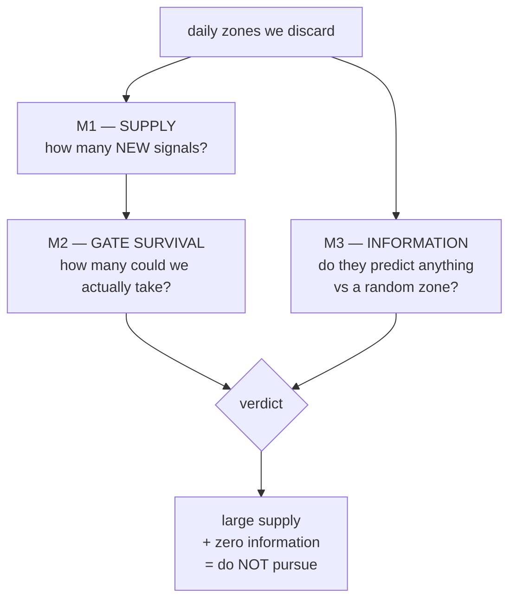

# DAILY-BOX-01 — Do the ignored daily boxes on NQ carry anything? — Results

**Date:** 2026-07-23
**Branch:** `research-daily-boxes`
**Spec:** `docs/superpowers/specs/2026-07-23-daily-boxes-characterization-design.md`
**Plan:** `docs/superpowers/plans/2026-07-23-daily-boxes-characterization.md`
**Status:** COMPLETE — verdict below
**Compute:** server (`~/Mulham/daily-boxes`), golden gate 6/6 before **and** after

---

## 0. The one-paragraph answer

The daily boxes we have been throwing away **do generate a lot of new trade signals** — on the 4-hour chart
they add **439 signals the current system never sees**, enough to raise the trade count by roughly **a
quarter**. That part is real and it is big. But when we tested whether those signals actually *predict*
anything, they did not: a daily zone put at a **completely random price** did just as well. Across **9 fair
comparisons** on two different chart speeds, the real daily zones beat the random ones **zero times**.

**So: lots of new trades, no evidence of any new edge. Recommendation — do NOT spend a re-optimization
campaign on them.**

We also tested the other possible use — treating daily zones as a **veto** (refusing entries that point into
one). That fails too, and for a blunt reason: the trades it would block are **profitable**, so blocking them
would delete about **half the book's P&L**. Both uses are now closed (§3b).

---

## 1. What we were actually testing (plain language)

Our strategy trades off "boxes" — price zones drawn around important past highs and lows. Each zone has a
**top edge** and a **bottom edge**, so it is a band, not a line.

We currently load two kinds of zone:

- **Weekly** zones (`W…` columns) — about **48 points** tall.
- **Monthly** zones (`M…` columns) — about **109 points** tall.

There is a third kind sitting in the very same spreadsheet rows that we **throw away when we load the file**.
`box_lookup.py` says so in its own header, lines 8–10:

> *"Both weekly and monthly levels live on the same row (W\* and M\* columns). **Daily (D\*) columns exist in
> the raw file but are ignored at load time.**"*

Those are the **daily zones** — about **22 points** tall, roughly half a weekly zone and a fifth of a monthly
one. In money, at NQ's **$20 per point**, one contract:

| Zone type | Height in points | Height in dollars |
|---|--:|--:|
| **Daily** (ignored) | **22.2** | **$444** |
| Weekly (used) | 48.5 | $970 |
| Monthly (used) | 108.8 | $2,176 |

Two facts made this worth investigating rather than assuming, both measured on the real file:

1. **They are there every single day.** The four main daily zones are filled in on **363 of 363** days in the
   2025–26 file and **263 of 263** in the 2024 file — 100%. This is not an occasional extra; we discard it on
   every bar.
2. **They are not copies of what we already use.** A daily zone sits in the same place as the weekly zone on
   **0.0–0.6%** of days. They mark genuinely different prices.

### The two terms you need

- **A "signal"** — the rule that turns a zone into a trade idea. The champions' rule is *touch-and-close-beyond*:
  the bar must physically touch the zone, and then close **above the top** (a buy) or **below the bottom** (a
  sell). A bar that opens and closes the same (a "doji") is ignored.
- **The "gate"** — a set of filters (volatility check, indicator veto, confirmation vote) that throws away most
  signals. Only signals that pass the gate can ever become trades.

---

## 2. What we measured, and what we found



### M1 — Supply: yes, a lot

| | 4-hour chart | 1-hour chart |
|---|--:|--:|
| Bars examined | 2,119 | 8,121 |
| Signals today (weekly+monthly) | 829 | 1,759 |
| Signals from daily zones alone | 989 | 2,190 |
| **NEW signals** (daily fires where today's system is silent) | **439** | **1,355** |

"NEW" is the number that matters — a daily signal that merely repeats a weekly one adds nothing.

**Sanity check that we measured the right thing:** our day counts came out at **431 trading days, 340 with a
signal, 91 with none**. The earlier `RESEARCH_SLEEPING_DAYS` note independently reported *the same* 340/431 and
the same 91 "scarce" days. Two separate implementations landing on identical numbers is good evidence the
measurement is sound.

The daily zones create a signal on **49 of those 91 previously-silent days** (4h) — so they genuinely do fill
in dead days.

### M2 — Gate survival: still large

Most signals die at the gate, so the honest question is how many *survive*.

| | 4-hour | 1-hour |
|---|--:|--:|
| New signals | 439 | 1,355 |
| **New signals that pass the gate** | **65** | **82** |
| Current trade count (deployed champion) | 277 | 353 |
| **Potential increase in trades** | **23.5%** | **23.2%** |
| Pre-committed band | **large** | **large** |

By the decision rule we fixed *before* looking at any number (≥20% ⇒ "large"), both charts land in the **large**
band. On supply alone, this looked like a green light.

> **Two honest caveats on that 23.5%.**
> **(a)** The script's own printout said 26.2% because the helper it uses to count baseline trades
> (`champion_taken_trades`) runs the champion **without its time cap**, giving 248 trades instead of the
> deployed 277. We use the deployed **277**, so **23.5%** is the correct figure. Either way it stays "large".
> **(b)** This is an **upper bound**. It ignores that the strategy is often already in a trade, on cooldown, or
> halted by the loss breaker — any of which blocks a bar the gate allowed. The real number is lower.

### M3 — Information: no

This is where it falls apart. We asked the only question that matters for trading: **after a daily-zone signal
fires, does price keep going the way the signal pointed?** We measured that 1, 3 and 6 bars later, and compared
it against **two dumb controls**:

| Control | What it does | What it rules out |
|---|---|---|
| **Random location** | Same zone *height*, moved to a **random price** | "Any line drawn near price looks meaningful" |
| **Random date** | Give today **another day's** zones | "Any zone shape works, the date does not matter" |

Comparing two overlapping error-bars by eye is **not** a test of whether one is better. So we bootstrapped the
**difference itself** (real minus control) and asked whether it is reliably above zero.

**Result — real vs the random-location control, the meaningful one:**

| Chart | Window | 1 bar | 3 bars | 6 bars |
|---|---|--:|--:|--:|
| 4h | 2025–26 | −3.30 | −3.44 | +5.59 |
| 4h | 2024–26 | −1.08 | −4.63 | −4.67 |
| 1h | 2025–26 | −0.07 | +1.26 | −1.34 |

*(points; every single confidence interval includes zero)*

**Real zones beat randomly-placed zones in 0 out of 9 comparisons.** Seven of the nine point estimates are
**negative** — the random zones did slightly *better*.

**The one place "real" won, and why it does not count.** Against the weaker *random-date* control on the 4h
champion window, real won all three horizons (+30.4, +27.0, +45.8 points). But that same test **fails on the
longer 2024–26 window** (+8.3, +8.6, +23.9, all including zero). A result that vanishes when you add a year of
data is not a finding. It is also the weaker control by construction: shuffling dates flings zones far away
from current price, so only 89 signals survive and they are odd ones. Total across both charts: real wins
**3 of 18** comparisons, and **all 3 are that single non-replicating cell**.

---

## 3. The verdict

| Option | Verdict |
|---|---|
| **B — use daily zones as a new entry signal** | **NO.** Supply is large but carries no measurable information. |
| **C — use daily zones as a veto/filter** | **NO.** Tested (§3b). The trades it would block are *profitable*; vetoing them deletes ~half the book's P&L. |
| Keep discarding them | **Yes — both uses are now closed.** |

**Why "no" to B even though supply is large.** The whole cost of Option B — re-optimizing every champion,
re-capturing the golden baselines — is only worth paying if the new signals carry an edge. They do not. Adding
~440 (4h) or ~1,355 (1h) signals of no demonstrated value is precisely the pattern that **already killed the
intra-candle feature**: that feature also added entries, and the optimizer *avoided* it because the extra
trades blew up drawdown. We should not re-run that experiment under a new name.

## 3b. Option C — the veto thesis, now tested

The first version of this report closed with "C is open but untested". It has since been measured.

**The claim.** A veto says: *don't enter toward a daily zone, because price will stall or reverse at it.* That
is a different question from §2 (which asked whether *breaking through* a zone predicts continuation), so it
needed its own measurement.

**How we framed it.** A trade is **"walled"** when a daily zone sits between its entry price and its
take-profit target — meaning price must punch through a daily zone to reach the target. If the thesis is true,
walled trades should earn reliably less than clear ones, and by more than the same test on random zones.

| | 4-hour | 1-hour |
|---|--:|--:|
| Take-profit target | 125.6 pts ($2,511) | 99.7 pts ($1,995) |
| Trades in book | 248 | 353 |
| **Walled trades** | **166 (66.9%)** | **216 (61.2%)** |
| Average walled trade | **+$478** | **+$241** |
| Average clear trade | +$827 | +$424 |
| walled − clear | −17.41 pts, CI90 **[−34.82, +14.06]** | −9.16 pts, CI90 **[−22.08, +6.54]** |
| Reliable difference? | **No — CI includes zero** | **No — CI includes zero** |
| **A veto would delete** | **+$79,407 of a +$147,191 book** | **+$51,981 of a +$110,038 book** |

**Verdict: NO — and the decisive reason needs no statistics.** The walled trades are **profitable**
(+$478 and +$241 per trade on average). A veto only earns its keep if the group it blocks *loses* money. This
one would delete roughly **two-thirds of all trades and about half of all profit**. The direction of the point
estimate is mildly supportive — walled trades do earn less — but the difference is not reliable on either
timeframe, and "earns less while still making money" is not a case for deleting it.

**Why the test barely discriminates, and that is itself the finding.** The take-profit is **125.6 points**
while a daily zone is only **22.2 points** tall, and there are **8 of them every single day**. So *of course*
something lands between entry and target — it happens on two-thirds of trades. The classification is close to
"is it a Tuesday". Daily zones are too dense, relative to how far these trades travel, to act as a meaningful
filter.

**One control oddity, stated rather than hidden.** On the random-location control the sign *flips* (walled
trades did better, +21.08 pts on 4h). We do not read this as meaningful: the control's walled set is a
different, smaller group (95 vs 166 trades), and by the rule we require — the whole interval below zero — the
control fails the thesis too. It does confirm that "walled vs clear" is not picking up anything stable.

### Power — how much could we have missed?

Being straight about this. On the 4h chart at 1 bar, the smallest per-trade effect we could reliably detect was
**13.3 points ≈ $265 per trade**; the real zones showed **+3.7 points ≈ $75**. So a *small* edge cannot be
excluded by any single test, and the difference intervals are wide (e.g. −16.0 to +9.1 points).

What carries the weight is not one interval but the **pattern**: across 9 comparisons spanning two chart
speeds, three horizons and two date ranges, the estimates cluster at zero with **no positive trend** — 7 of 9
negative. A genuine edge would show up as consistently positive, not consistently zero.

---

## 4. What went well / what went wrong

**Went well**
- **Caught three spec errors before spending compute.** Reading the code rather than trusting the older
  research note revealed (i) the champions use *touch-and-close-beyond*, not `BoxLookup`'s traversal state
  machine, so the original plan would have measured signals the champions never see; (ii) `BoxLookup` is not
  even on the champion path — `engine.py:55` is; (iii) the champion window is 2025–26, so the planned 2024 box
  merge would have added rows nothing ever reads.
- **Zero production files touched.** The redesign put the study in its own package with the level list as a
  *required* argument. Golden stayed **6/6 before and after** — proof nothing moved.
- **The measurement self-validated.** Day counts (431/340/91) independently reproduced the earlier note's
  numbers.
- **Adding the difference test changed the conclusion's strength.** Eyeballing the per-arm intervals suggested
  "probably nothing"; the differential test made it **0 of 9**, which is a far firmer basis for a decision.
- **Fixed a real path bug found at run time:** the study read candles from the wrong root, which silently
  "worked" on 4h and would have broken on 1h.

**Went wrong / would do differently**
- **My pre-committed decision rule had a gap.** It branched on supply first (≥20% ⇒ go B) and only consulted
  informativeness if supply was small. It never contemplated **large-but-uninformative** supply — which is
  exactly what happened. Following the rule literally would have said "go B". Future rules must require the
  edge test to *pass* before size of supply matters.
- **The random-date control is weak.** By flinging zones away from price it collapses the sample to 89 and
  produces a non-replicating "win". The random-*location* control is the one worth keeping.
- **The 2024 extension only exists for 4h** (there is no `NQ_1h_2024.csv`), so 1h got no power boost. The run
  prints that it skipped, so it can never be mistaken for a measured null.
- **Shipping a report that said "C is untested" was the right call, and then testing it was better.** Naming
  the unanswered variant is what made it obvious C had to be measured before closing the topic. Had the first
  report just said "daily boxes: closed", a live option would have been buried.
- **Still one bull era.** Everything here is 2024–2026. Nothing in this study speaks to a bear market.

---

## 5. Reproduce

```bash
# server, from ~/Mulham/daily-boxes/subprojects/Parametric-Indicators
env WSH_DATA_BASE=/home/dev/Mulham/wsg-i WSG_DATA_ROOT=/home/dev/Mulham/wsg-i/data \
  /home/dev/Mulham/.venv/bin/python3 -m research.daily_boxes.run_study \
  --tf 4h --horizons 1,3,6 --seed 20260723 --draws 1000 --block 20 --loc-frac 0.02
```

Outputs: `results/daily_boxes/{tf}_supply.csv`, `{tf}_informativeness.csv`, `{tf}_real_vs_control.csv`.
Local unit tests (no server data): `python3 -m pytest tests/test_daily_boxes_*.py` → 29 passed.
