# GAP-03 — Champion re-optimization under gap-aware fills: before / after

**Date:** 2026-07-22
**Branch / Issue:** `fundamental-analysis` · GitHub Issue #2 (champion re-optimization under honest fills)
**Depends on:** [GAP-01 / GAP-02](./GAP-02-gap-aware-fills.md) (the gap-aware fill change)
**Status:** ⛔ **RETRACTED 2026-07-29 — the baseline in this report is the wrong champion set. Do not
quote its verdicts or its portfolio numbers.** The run itself completed (12/12 studies); what is wrong is
what it was measured against.

---

## ⛔ CORRECTION (2026-07-29) — read this before anything below

Everything in this report calls `wsh4_champions_full*.json` "deployed". **It is not.** The deployed set
moved to `best_*` on **2026-07-14** — eight days *before* this run — via `DEFAULT_CHAMPION_SET`
(commit `4585648`). Two consequences, one procedural and one substantive:

1. **The search was floored against the wrong incumbent.** `warm_start_seeds()` read `wsh4_*` by name,
   so Optuna's "front is guaranteed ≥ the seed" promise held against a *retired* set. Fixed on
   2026-07-29 — the seed now resolves through the same resolver the dashboard uses
   (`optimize/test_warm_start_seed_set.py`, verified to fail on the old code).
2. **The before/after table below compares against that same retired set.** Re-scored against the
   champions we actually run, the picture inverts on the axis that matters:

| | full-history | 2026 OOS |
|---|---:|---:|
| this report's claim ("vs deployed" = `wsh4`) | **+$52,443** | **+$35,475** |
| **vs the truly deployed `best_*`** | **+$94,522** | **−$12,832** |

Per adopted slot, against the real deployed champions: **NQ 1h +$10,805** · **GC 15m +$2,226** ·
**NQ 2h −$14,017** → **net −$986 out-of-sample.** The trio is a wash, and **NQ 2h is materially worse
than the champion it was meant to replace.**

The evidence was already on disk: `best_vs_wsh4.log` was produced on 2026-07-22 at **16:05**, forty
minutes *after* the adoption commit, and was never acted on. It is now archived with the rest of the run
in [`optimize/reports/gap_fills/reopt_wshgap/`](../../optimize/reports/gap_fills/reopt_wshgap/README.md).

**What was NOT harmed.** The adoption (`105a2da`) wrote into `wsh4_champions_full*.json` — the retired
set — so **the deployed book never changed**. No live champion was replaced by any of this. The golden
baselines for 1h/2h were re-captured to match (`96eb8de`), leaving the gate self-consistent with `wsh4`
rather than with what is deployed.

**Also note:** these champions are persisted at 4 decimal places (the precision fix was not in the
`fundamental-analysis` worktree). For NQ and GC that is provenance-only — the smallest stop, GC 2m
`sl_soft=2.2426`, still carries 5 significant figures. It would be fatal on NG or HG.

**Superseded by:** a re-run seeded from `best_*` on the current engine. #62/#74/#75 changed indicator
computation and fixed cross-series wiring outright after this run, so these numbers would not reproduce
today even with correct seeding.

---

## 1. What this is, in one paragraph

In [GAP-01/02](./GAP-02-gap-aware-fills.md) we fixed a quiet flaw in the backtest engine: when a
one-minute bar **gaps** straight past a stop-loss or take-profit line (opens beyond it, never trading
*at* the line), the old engine pretended we got filled *at the line*. Reality fills you at the bar's
**open** — worse than the line on a stop, and that is the honest price. Turning that on
(`gap_fills=True`, now the default) did not change total profit much across the book (−0.2%) but it
made **drawdown ~10% worse** — the old model was understating **risk**, not profit. Because our champion
strategies (their stops, take-profits, gates, and time-caps) were *tuned* on the too-optimistic engine,
this report answers the natural next question: **if we re-tune every champion on the honest engine, do we
get better strategies?** The answer is yes for 3 of 12, no for 2 (the honest out-of-sample year caught
them as over-fit), and "no change possible" for 7 (the search could not beat what we already run).

---

## 2. How the re-optimization was run (so it is reproducible)

- **Where:** the AMD dev server, from the `fundamental-analysis` worktree (the only tree that has the
  gap-aware engine), study prefix **`wshgap`**.
- **Scope:** the two markets the user asked for — **NQ** (Nasdaq-100 future) and **GC** (gold future) —
  across all six timeframes each (`4h, 2h, 1h, 15m, 5m, 2m`) = **12 studies**.
- **Indicator frame:** `--ind-1min` throughout (indicators evaluated on the one-minute frame — the
  correct frame; the `4h`/`ind_1min=False` frame is a known wrong-frame trap).
- **Warm start (the safety net):** every study was *seeded* with the market's current deployed champion,
  re-scored on the honest engine. Optuna's warm start guarantees the returned champion is **never worse**
  than that honest-re-scored incumbent. So a "no change" result is not a failure — it means the search
  spent its whole budget and could not beat what we already deploy.
- **Both sides scored identically:** every number in this report — deployed *and* re-optimized — was
  produced by the **same** honest engine (`gap_fills=True`) through the dashboard's exact causal path
  (`build_view_payload`), each champion running its **own** parameters. The stored `full_pnl` values in
  the two JSON files are **not** comparable (the deployed set's stored numbers were measured on the old
  optimistic engine); this re-scores both, apples to apples.

**Two windows are reported for every slot:**
- **Full** = the entire multi-year history (the in-sample fit).
- **2026 OOS** = the 2026 out-of-sample year — data the optimizer's *seed* was built before. This is the
  honesty check: a change that only helps "full" but not "2026" is fitting the past, not finding an edge.

---

## 3. The full before/after — all 12 slots

P&L and drawdown ("dd", the worst peak-to-trough equity dip) are in dollars. "n" = trades taken,
"win" = win rate. **Bold** = the slot changed.

| Market · TF | Full P&L (dep → reopt) | Full dd (dep → reopt) | 2026 OOS P&L (dep → reopt) | 2026 OOS dd | Verdict |
|---|---|---|---|---|---|
| **NQ 1h** | **75,919 → 110,038** (+34,119, +45%) | 13,870 → 15,535 | **18,603 → 38,008** (+19,405) | 13,220 → 9,357 | ✅ **ADOPT** |
| **NQ 2h** | **88,478 → 101,517** (+13,039, +15%) | 16,274 → 8,768 | **12,882 → 26,728** (+13,846) | 10,334 → 5,170 | ✅ **ADOPT** |
| **GC 15m** | **82,616 → 87,901** (+5,285, +6%) | 10,094 → 7,724 | **37,899 → 40,123** (+2,224) | 7,583 → 7,530 | ✅ **ADOPT** |
| GC 4h | 79,015 → 113,466 (+34,451, +44%) | 17,164 → 24,041 | 11,816 → **9,344** (−2,472) | — | ❌ REJECT (over-fit) |
| NQ 5m | 20,092 → 23,056 (+2,964, +15%) | 8,160 → 3,345 | 282 → **−581** (−863) | — | ❌ REJECT (OOS turns negative) |
| NQ 4h | 151,655 → 151,655 | 15,560 | 61,601 → 61,601 | — | ⏸ held (incumbent best) |
| NQ 15m | 81,290 → 81,290 | 8,089 | 34,172 → 34,172 | — | ⏸ held |
| NQ 2m | 31,898 → 31,898 | 3,234 | 7,816 → 7,816 | — | ⏸ held |
| GC 2h | 84,927 → 84,927 | 15,649 | 26,100 → 26,100 | — | ⏸ held |
| GC 1h | 86,969 → 86,969 | 21,007 | 28,741 → 28,741 | — | ⏸ held |
| GC 5m | 18,131 → 18,131 | 4,115 | 7,155 → 7,155 | — | ⏸ held |
| GC 2m | 38,705 → 38,705 | 4,577 | 13,699 → 13,699 | — | ⏸ held |

---

## 4. The three winners we ADOPT — and why each is genuinely better

A slot is adopted only when it improves on **all the axes that matter**: in-sample profit, **out-of-sample
profit** (the honesty check), and risk. All three clear that bar.

- **NQ 1h — the standout.** +$34,119 in-sample (+45%), and crucially **+$19,405 out-of-sample** (more than
  doubling the 2026 result, $18,603 → $38,008). It trades **more** (179 → 250) yet its 2026 win rate
  *rises* from 47.6% to 57.7% and its 2026 drawdown *falls* 29% ($13,220 → $9,357). More trades, more
  profit, better win rate, less out-of-sample risk — a real improvement, not a lucky fit. (Widened its
  soft stop 44→69 and tightened its hard stop 117→94 pts.)
- **NQ 2h — the risk win.** +$13,039 in-sample and **+$13,846 out-of-sample**, but the headline is risk:
  drawdown roughly **halves** on both windows (full 16,274 → 8,768; 2026 10,334 → 5,170). It does this by
  being *more selective* (152 → 125 trades) and adding a time-cap. Same-or-better profit for half the
  risk is exactly what we want.
- **GC 15m — the steady add.** The smallest but cleanest: +$5,285 in-sample **and** +$2,224 out-of-sample,
  with drawdown down 23% in-sample and flat out-of-sample. Tiny tuning of already-tight gold stops.

## 5. The two we REJECT — and why the out-of-sample year saved us

Both look *great* on the full-history column. Both are traps, and the 2026 column is what exposes them.

- **GC 4h — the seductive over-fit.** +$34,451 in-sample (+44%) is the biggest "improvement" in the whole
  run. But its 2026 result *drops* $2,472, its drawdown *grows* 40% ($17,164 → $24,041), and its win rate
  **collapses** from 77.3% to 55.6%. The optimizer found a higher-variance configuration that piles up
  dollars on the specific past but is riskier and worse on unseen data. Adopting it would be buying a
  worse, riskier strategy that merely *looks* better in the rear-view mirror. **Keep the deployed champion.**
- **NQ 5m — the marginal negative.** +$2,964 in-sample and genuinely lower drawdown, but its 2026 result
  flips from **+$282 to −$581**. A slot already sitting near zero going *negative* out-of-sample is not an
  improvement worth taking. **Keep the deployed champion.**

This is the [research discipline](../../AGENTS.md) working as designed: *a change that only helps the
in-sample window is fitting the past.* Without the OOS gate we would have shipped two worse strategies
because their full-history dollar figures were the two largest gains in the table.

## 6. The seven we HOLD

For NQ 4h, NQ 15m, NQ 2m, GC 2h, GC 1h, GC 5m, GC 2m the re-optimized champion is **byte-for-byte the
deployed one** — the warm-started search could not beat the honest-re-scored incumbent within its budget.
(A few show a cosmetic `cap_mode: null → "none"` — that is the same "no cap", just written explicitly;
the parameters and results are identical.) These stay exactly as deployed.

---

## 7. Portfolio effect — and why discipline beats greed

Summed across all 12 slots, **every number below is on the honest engine**:

| Champion set | Full-history P&L | vs deployed | 2026 OOS P&L | vs deployed |
|---|---|---|---|---|
| **Deployed** (current book) | $839,695 | — | $260,766 | — |
| **Adopted** (deployed + 3 verified winners) | **$892,138** | **+$52,443 (+6.2%)** | **$296,241** | **+$35,475 (+13.6%)** |
| Naive "take every re-opt" | $929,553 | +$89,858 (+10.7%) | $292,906 | +$32,140 (+12.3%) |

Read the last two rows together. Chasing the biggest in-sample number ("take every re-opt") wins an extra
**+$37,415 in-sample** over the disciplined set — but **loses $3,335 out-of-sample** ($296,241 → $292,906),
because that extra in-sample money comes entirely from the two over-fit slots (GC 4h, NQ 5m). The
disciplined, OOS-gated set earns **less on the past and more on the future.** That is the point of the
whole exercise.

```mermaid
%%{init: {'theme':'base'}}%%
xychart-beta
    title "Portfolio P&L by champion set (honest fills) — $000s"
    x-axis ["Deployed", "Adopted (+3)", "Naive (all reopt)"]
    y-axis "P&L ($000s)" 0 --> 950
    bar [839.7, 892.1, 929.6]
    bar [260.8, 296.2, 292.9]
```

*Taller bars = full-history P&L; shorter bars = 2026 out-of-sample P&L. "Naive" is tallest on the left
(in-sample) yet shorter than "Adopted" on the right (out-of-sample) — over-fit dollars that do not carry
forward.*

---

## 8. Verification status

- **Headless (done):** each of the 3 winners was replayed through `build_view_payload` — the *exact*
  backend function a dashboard "Run" click triggers — and reproduced its target to the dollar
  (NQ 1h $110,038 · NQ 2h $101,517 · GC 15m $87,901), under `gap_fills=True`, `--ind-1min`.
- **Browser (pending):** the three are saved as selectable profiles — `REOPT NQ 1h (gap)`,
  `REOPT NQ 2h (gap)`, `REOPT GC 15m (gap)` — on the single dev dashboard (port 8200, now serving this
  build). The final human-style click-through (select instrument → pick profile → **Run** → confirm the
  P&L on screen) is blocked only by the Claude browser extension being offline.

## 9. What went well / what to watch

- **Went well:** the warm-start floor meant no slot could regress; the OOS gate caught the two over-fits
  that the in-sample column would have waved through; both champion sets were scored on one honest engine,
  so the comparison is clean.
- **Watch:** the deployed set's *stored* JSON P&L numbers predate the honest engine and must never be
  compared against `wshgap` numbers directly — always re-score both (as done here). And **do not adopt on
  in-sample gain alone**: GC 4h is the cautionary example sitting right in this table.

## 10. Next

⛔ **Superseded by the 2026-07-29 correction at the top of this file.** The original plan below is kept
only as a record of what was intended; steps 1 and 3 were both wrong or already overtaken.

1. ~~Browser click-through of the 3 winners → adopt into the deployed registry.~~ **Do not adopt.**
   Against the truly deployed `best_*` set the trio is **−$986 out-of-sample**, with **NQ 2h −$14,017**.
   The adoption that did happen (`105a2da`) landed in the retired `wsh4_*` file and never reached the
   deployed book.
2. **Issue #3 — re-cut the risk budget** on honest drawdowns. Still valid, and it does **not** depend on
   this run: the honest-drawdown measurement it needs is [GAP-02](../../../../docs/superpowers/GAP-02-champion-before-after.md),
   across all 54 deployed champions (P&L −0.2%, drawdown **+9.8%**, NG +148%). That measurement stands.
3. ~~Cut v5.1.0 with the adopted champions.~~ v5.1.0 and v5.2.0 both shipped without them.
4. **New:** re-run the re-optimization seeded from `best_*` on the current engine, then judge adoption
   against the deployed set on the 2026 holdout.
