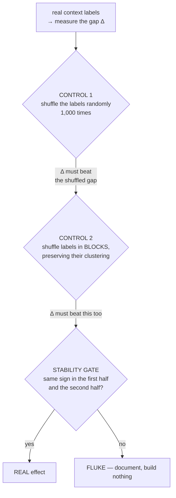

# NEWS-CTX-01 — Team Leader Report
## Does the same announcement behave differently depending on the context it lands in?

**Date:** 2026-07-23
**Workstream:** `research-news-context` (branched off `dev` @ `3b16087`)
**Instrument:** NQ (Nasdaq-100 E-mini futures), $20 per point
**Status:** COMPLETE — verdict below
**Safety:** zero production files modified · 18 unit tests passing · all outputs pulled to local and committed

---

# PART 1 — EXECUTIVE SUMMARY

## 1.1 The question

Our headline fundamentals result is that scheduled US macro news does **not** predict which way the market
moves — measured across 882 releases at 99% statistical power. That result was always computed by **pooling all
releases together**.

The question raised for this workstream was sharp and, it turns out, entirely legitimate: *what if the same
announcement pushes price **up** in one kind of market and **down** in another?* If so, averaging them together
would produce approximately zero — and our "no effect" conclusion would be an artifact of the averaging rather
than a fact about the market.

## 1.2 The answer

**We tested it, one candidate looked real, and our own pre-registered discipline killed it.**

The theory-backed split produced a result that would have been publishable-looking: consistent sign across
every time horizon, an effect that grew steadily with horizon, and statistical significance against **two**
different null models including a deliberately hard one. Then the stability check — fixed in advance — showed
the effect **reverses sign** between the first and second half of the data.

**Verdict: the context effect is NOT established. "News is priced in" stands, and is now stronger for having
survived the most credible remaining challenge to it.**

## 1.3 Bottom line

| Split tested | Result |
|---|---|
| **C1 — policy-response regime** (the theory-backed one) | Beat both controls, then **reversed sign across halves → FLUKE** |
| **C2 — volatility regime** | No effect |
| **C3 — prior trend** | No effect |
| | **0 of 12 tests beat both controls AND were stable** |

## 1.4 What this cost and what it bought

One session, no production risk, no new data purchased. It **closed the last open variant of the news
question** — the one thing that could have overturned a headline result the whole project rests on. It also
produced a concrete, well-defined next experiment (§7) rather than an open-ended "maybe".

---

# PART 2 — WHY THIS WAS WORTH ASKING

## 2.1 The logical gap in our own result

Our pooled finding is a correlation of **−0.004** between the "surprise" in a macro release and the subsequent
price move, across **882 releases**. At that sample size we had ~99% power, so this is strong evidence.

But strong evidence *of what*, exactly? It is strong evidence against a **context-independent** effect. It says
nothing about a **conditional** one. If hot inflation data lifts stocks in one environment and sinks them in
another, the two cancel and the average is zero — which is exactly the number we reported.

**This is not a hypothetical objection. Our own code raised it and then dropped it.** From
`study_surprise.py`'s docstring:

> *"we do NOT impose a sign. Whether strong jobs are bullish (growth) or bearish (hawkish Fed) is
> **regime-dependent** and arguing about it is how people fool themselves. We MEASURE the correlation."*

The author identified regime-dependence as the central hazard — and then measured the pooled correlation
anyway. The conditioning was never run.

## 2.2 An unexplained anomaly in our own data

`Exp 50` compared two signals across years:

| Signal | 2024 → 2025 → 2026 |
|---|---|
| **Magnitude** (how big the move is) | +0.291 → +0.218 → +0.115 — **never flips sign** |
| **Direction** (which way) | 2025 = −0.43 → 2026 = −0.01 / +0.16 / +0.13 — **flipped sign** |

We recorded that as "the direction signal is noise". But a sign flip is *also* precisely what a
context-dependent effect looks like when the context changes and you are averaging over it. Only one reading
was ever written down.

## 2.3 What the academic literature says

A prior-art pass (mandatory before any new workstream here) found this is a **real, named, heavily-studied and
actively contested** phenomenon:

| Source | Finding |
|---|---|
| **McQueen & Roley (1993)** | Stocks respond **negatively** to good economic news in good times, and show no systematic response in bad times. Controlling for economic state became standard practice after this paper. |
| **Boyd, Jagannathan & Hu** | Unemployment news changes meaning across the business cycle. |
| ⚠️ **Poitras (2004)** | Finds **no** state dependence — explicitly disputes the robustness of the above. |
| ⭐ **Elenev, Law, Song & Yaron (2024, *Journal of Financial Economics*), "Fearing the Fed"** | Sensitivity to macro news is **countercyclical**; the driver is shifting perceptions of **how responsive the Fed will be**. |

**The single most relevant sentence for us**, from *Fearing the Fed*: from **2022**, hotter-than-expected
inflation produced larger sell-offs than ever before, and *for the first time this century positive economic
surprises **led to price declines***.

That describes a **documented reversal inside our own sample window**. Our data spans 2010–2026 and therefore
pools both worlds: roughly 566 releases from the "good news is good" era and 264 from after.

**So going in, the hypothesis was theory-backed and pre-registered — not likely-true.** Poitras found nothing,
and our own anomaly was equally consistent with noise.

---

# PART 3 — METHOD

## 3.1 Data

The **882-release ledger** built by the original fundamentals work — and a note on where it was living.

| | |
|---|---|
| Releases | **882** (cpi 198 · nonfarm payrolls 193 · pce 186 · retail sales 165 · ppi 140) |
| Span | 2010-04-14 → 2026-07-02 |
| Price frame | **5,452,534** one-minute NQ bars, 2010-06-06 → 2026-07-12 |
| Priced releases per horizon | 865–871 of 882 |

Each row is causal by construction: the "expected" value uses only publications from **before** that morning,
the surprise is standardized by the rolling deviation of **past** surprises, and the outcome is measured from
the 08:29 close to the 08:30+h close — entirely **after** the print. Nothing peeks at the future.

> ⚠️ **A finding about our own housekeeping.** This ledger — 1,150 API calls of point-in-time data, and the
> exact input behind our headline null — existed **only on the server**. It was invisible to version control
> and would have been lost the next time a working directory was cleaned up. It is now pulled to local and
> committed (md5-verified identical). The raw 46 GB price corpus necessarily stays server-side; everything
> derived from it now lives locally.

## 3.2 The three context splits

Exactly **three**, fixed before any number was seen. Not more, because testing many splits and reporting the
best one manufactures false positives — the trap `Exp 43`'s Bonferroni correction already caught this project
in once.

All three are **causal**: computable at 08:29 on the release morning from information already available.

| Split | Buckets | What it asks |
|---|---|---|
| **C1 — policy-response regime** (PRIMARY) | `POS` / `NEG` — the sign of the relationship over the **previous 40 releases** | "Has the market lately been treating good news as good, or as bad?" |
| **C2 — volatility regime** | `CALM` / `TURBULENT` — existing causal daily labels | "Does news land differently when the tape is already loud?" |
| **C3 — prior trend** | `UP` / `DOWN` vs the 50-day average | "Same news, rising vs falling market" |

**Why C1 is measured from our own data rather than by splitting on 2022.** The literature told us to expect a
break around 2022. Splitting the data on that date would be *assuming the answer we are testing for*. Deriving
the regime from the market's own recent behaviour is harder, but it is honest — and it has a practical
advantage: it is knowable **in real time**, so a positive result would have been actionable rather than
hindsight.

## 3.3 How we decided what counts

**Spearman rank correlation** is the primary statistic, with Pearson reported alongside. This is a standing
rule: on gold, ordinary Pearson correlation was **blind** (−0.012) to a real relationship of **−0.193**,
because a few enormous moves swamped it. Rank correlation is robust to that.

**The decisive quantity is the DIFFERENCE between the two buckets** — not each bucket's own error bar.
Comparing two overlapping error bars by eye is not a test of their difference; two intervals can overlap while
the difference is significant, and vice versa.

**Two independent dumb controls**, because a "finding" that any random split would also produce is not a
finding:



**Control 2 exists because of a specific weakness we identified in our own design.** C1's label is derived from
the trailing behaviour of *the very relationship being measured*, so its labels come in long runs. A purely
random shuffle scatters the labels and destroys that clustering — which makes the null too easy to beat, since
any "streaky" series will look significant against scattered labels. The block version keeps runs of identical
labels intact, so the only thing destroyed is *which* stretch of market each run is attached to. It is the
harder and fairer test.

Also fixed in advance: **power computed up front**, and a **Bonferroni-corrected threshold** of α = 0.05 ÷ 12 =
**0.00417** for the 3 splits × 4 horizons.

---

# PART 4 — RESULTS

## 4.1 Sanity check: the known null reproduces exactly

| Horizon | Pooled rank correlation | Pearson | n |
|---|--:|--:|--:|
| 5 min | −0.0073 | −0.0125 | 870 |
| 15 min | −0.0225 | −0.0149 | 871 |
| 30 min | −0.0020 | −0.0145 | 870 |
| 60 min | −0.0000 | +0.0092 | 865 |

Flat at every horizon, reproducing the known −0.004. **Our pipeline measures the same thing the original study
measured** — so any difference that follows is about the conditioning, not about a different dataset.

## 4.2 C1 — the primary split. This is the one that nearly got through.

| Horizon | ρ when "good news is good" | ρ when "good news is bad" | **Gap Δ** | vs shuffle | vs block | 1st half | 2nd half | Stable? |
|--:|--:|--:|--:|--:|--:|--:|--:|:--:|
| 5 | +0.061 (n=481) | −0.102 (n=354) | **+0.163** | 0.019 | 0.052 | −0.126 | +0.072 | ❌ |
| 15 | +0.051 (n=501) | −0.103 (n=335) | **+0.154** | 0.038 | 0.032 | −0.050 | −0.016 | ✅ |
| 30 | +0.080 (n=517) | −0.123 (n=318) | **+0.202** | 0.006 | 0.005 | −0.148 | +0.109 | ❌ |
| **60** | **+0.102 (n=491)** | **−0.129 (n=339)** | **+0.231** | **0.0020** | **0.0020** | **−0.112** | **+0.236** | ❌ |

**Why this looked like a genuine discovery:**

1. **The sign is the same at every horizon** — positive relationship in the `POS` regime, negative in the `NEG`
   regime, four times out of four.
2. **The gap grows steadily with horizon** (0.163 → 0.154 → 0.202 → 0.231). A dose-response like that is hard to
   get from pure noise.
3. **At 60 minutes it cleared the strict threshold against BOTH controls** (p = 0.0020 and 0.0020, versus a bar
   of 0.00417) — including the deliberately hard block control built specifically to catch this kind of
   self-referential design.
4. It is exactly the direction and mechanism a 2024 *Journal of Financial Economics* paper predicts.

**And then the stability gate killed it.** At 60 minutes the gap is **+0.236 in the second half of the data and
−0.112 in the first**. It does not merely fade — it **reverses**. The same reversal appears at 5 and 30 minutes.
The entire full-sample result comes from the recent half.

```mermaid
xychart-beta
    title "C1 gap by data half (positive = good news is good in POS regime)"
    x-axis ["h=5", "h=15", "h=30", "h=60"]
    y-axis "gap in correlation units" -0.2 --> 0.3
    bar [-0.126, -0.050, -0.148, -0.112]
    bar [0.072, -0.016, 0.109, 0.236]
```



*(first bar of each pair = first half of the data, second = second half)*

## 4.3 C2 and C3 — nothing at all

**C2 — volatility regime:**

| Horizon | CALM | TURBULENT | Gap | p | Stable? |
|--:|--:|--:|--:|--:|:--:|
| 5 | −0.004 | −0.029 | +0.025 | 0.74 | ❌ |
| 15 | −0.024 | −0.006 | −0.018 | 0.82 | ❌ |
| 30 | +0.038 | −0.085 | +0.123 | 0.11 | ✅ |
| 60 | +0.046 | −0.085 | +0.131 | 0.10 | ✅ |

**C3 — prior trend:**

| Horizon | UP | DOWN | Gap | p | Stable? |
|--:|--:|--:|--:|--:|:--:|
| 5 | −0.049 | +0.072 | −0.121 | 0.10 | ✅ |
| 15 | −0.060 | +0.050 | −0.109 | 0.13 | ❌ |
| 30 | −0.007 | −0.003 | −0.004 | 0.96 | ✅ |
| 60 | +0.007 | −0.003 | +0.009 | 0.88 | ❌ |

Neither comes close to the threshold at any horizon, and C3's gap **changes sign** across horizons — the classic
signature of noise.

## 4.4 One number that matters more than the p-values

Even taking the surviving C1 result at face value: a correlation of **0.10** means the surprise explains about
**1%** of the variation in what price does next. A correlation of 0.13 explains under 2%.

So even in the most favourable reading, this was never going to be a strategy. It would have been a small
statistical tilt inside a distribution whose per-trade swings run to **±$1,600**. That context matters when
weighing how hard to chase it.

---

# PART 5 — THE HONEST DIFFICULTY

**A hypothesis about regime *change* is awkward to judge with a test that assumes *stability*.**

Our stability gate asks: is the effect the same in both halves of the data? But *Fearing the Fed* says the
mechanism **changed around 2022**. An effect genuinely absent before 2022 and present afterwards would
**necessarily fail** a first-half/second-half test. The gate assumes stationarity; the hypothesis is explicitly
about non-stationarity.

And the observed pattern does fit that story. The first half is **consistently negative** at all four horizons
(−0.126, −0.050, −0.148, −0.112); the second half is **positive at three of four**. The second half of an
882-release ledger spanning 2010–2026 begins around 2018 and contains the entire post-2022 period.

**We are not using this to rescue the result.** Two readings fit the same data equally well:

1. A real regime-dependent effect that only switched on recently.
2. A fluke confined to the recent window — which is what **every** near-miss in this project has turned out to
   be: the Asia session cell (0 of 3 other indices replicated), `Exp 50`'s direction signal, the surprise signal
   that evaporated out-of-sample.

Nothing in this test distinguishes them. The rule fixed in advance says a sign flip across halves is a fluke.
**So the verdict is fluke.** Picking the flattering interpretation *after* seeing the numbers is exactly the
failure the pre-registration exists to prevent — and this project has already retracted one workstream for a
softer version of that error.

**Two further reasons for caution, stated rather than buried:**

- **It sits barely above the detection floor.** The gap was 0.231 against a minimum detectable effect of
  **0.196**. We were resolving something at the very edge of what 882 releases can resolve.
- **C1's construction is self-referential** — the label comes from the trailing behaviour of the same
  relationship being measured. The block control was built precisely for this and the effect *did* survive it,
  but the design still deserves more suspicion than an independent variable would.

---

# PART 6 — VERDICT

| Split | Verdict | Basis |
|---|---|---|
| **C1 policy-response regime** | ❌ **FLUKE** | Beat both controls; reversed sign across halves |
| **C2 volatility regime** | ❌ **NULL** | No effect; underpowered below \|Δρ\| ≈ 0.214 |
| **C3 prior trend** | ❌ **NULL** | No effect; underpowered below \|Δρ\| ≈ 0.207 |

**0 of 12 tests beat both controls and were temporally stable.**

**The "scheduled macro news is priced in" conclusion stands** — and is stronger than before, because it has now
survived a serious, theory-backed, well-powered attempt to break it rather than merely never having been
attacked.

**Power caveat, stated plainly:** the worst-case minimum detectable difference was **\|Δρ\| ≈ 0.214**. Effects
smaller than that are **not** excluded. The C2 and C3 results mean "no *large* context effect", not "no context
effect".

---

# PART 7 — WHAT WOULD ACTUALLY SETTLE IT

**Not more slicing of NQ.** With a fixed 882 releases, additional splits mostly manufacture false positives.

**Cross-instrument replication is the decisive test.** ES, RTY and GC all price the same US macro releases. If
C1's pattern reflects a real macro mechanism, it must appear on them too. If it appears **only** on NQ, it is
noise.

This is exactly the discriminator that settled the Asia session cell — it failed on 3 of 3 other indices and
was closed as a fluke. It is the cleanest available way to separate the two readings in Part 5, and the harness
built here already does everything required except point at a different instrument.

---

# PART 8 — WHAT WENT WELL / WHAT WENT WRONG

## Went well

- **The pre-registered decision rule did its job under maximum pressure.** It stopped a result that had a
  consistent sign across four horizons, a clean dose-response in horizon, significance against two independent
  null models, and a 2024 *JFE* paper behind it. Without the stability gate fixed in advance, this would very
  likely have been written up as a discovery.
- **Suspecting our own design paid off.** We identified that C1's self-referential labelling could make the
  standard control too easy, and built a harder one. It *confirmed* the effect rather than killing it — which
  is what a fair control looks like, and it means the eventual verdict rests on stability rather than on a
  weak null.
- **The pooled null reproduced exactly** (−0.004 → −0.007/−0.023/−0.002/−0.000), validating the pipeline
  against prior work before any new claim was made.
- **The prior-art pass earned its keep three times over**: it supplied the primary hypothesis, its mechanism,
  and — critically — the disconfirming paper (Poitras 2004) that kept expectations calibrated.
- **A real housekeeping risk was caught and closed**: the irreplaceable 882-release ledger was living only on
  the server, outside version control.

## Went wrong

- **The stability gate is a blunt instrument for this particular hypothesis** (Part 5). We applied it because
  it was pre-registered, which was correct — but a better design would have named the true discriminator
  (cross-instrument replication) *in advance*, instead of discovering the need for it afterwards.
- **C1's self-referential construction is a genuine design weakness.** The cleaner proxy is the stock-bond
  comovement that *Fearing the Fed* itself uses, which needs bond futures we do not currently load.
- **The first server run aborted** on a path off-by-one (`parents[1]` where `parents[2]` was needed) — the two
  directories both existed, so the failure was a clean crash rather than silently wrong numbers. Now covered by
  a regression test that asserts the default path loads exactly 882 releases.

---

# PART 9 — ARTIFACTS

| Item | Path |
|---|---|
| Design spec | `docs/superpowers/specs/2026-07-23-news-context-dependence-design.md` |
| Implementation plan | `docs/superpowers/plans/2026-07-23-news-context-dependence.md` |
| Technical results | `docs/superpowers/NEWS-CTX-01-context-dependence-results.md` |
| **This report** | `docs/superpowers/NEWS-CTX-01-TEAM-LEADER-REPORT.md` |
| Study code | `research/news_context/` (4 modules) |
| Tests (18, passing) | `tests/test_news_context_*.py` |
| Raw numbers + full run log | `results/news_context/` |
| The surprise ledger | `optimize/fundamentals/surprises_cache.csv` |

## Reproduce

```bash
# server, from ~/Mulham/news-context/subprojects/Parametric-Indicators
env WSH_DATA_BASE=/home/dev/Mulham/wsg-i WSG_DATA_ROOT=/home/dev/Mulham/wsg-i/data \
  /home/dev/Mulham/.venv/bin/python3 -m research.news_context.run_study \
  --k 40 --horizons 5,15,30,60 --ma-days 50 --draws 1000 --seed 20260723 --block 20
```

Every run prints the full parameter set before producing any number. Unit tests need no server data:
`python3 -m pytest tests/test_news_context_*.py` → **18 passed**.
