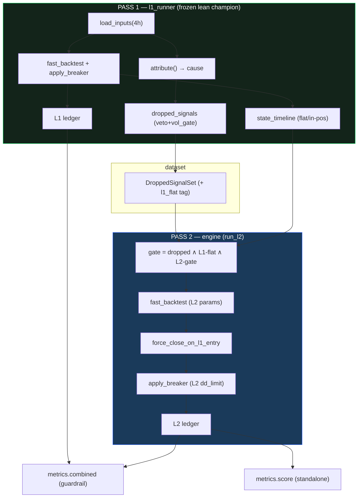

# L2 Second-Layer Backtester (Round 1) Implementation Plan

> **For agentic workers:** REQUIRED SUB-SKILL: Use superpowers:subagent-driven-development (recommended) or superpowers:executing-plans to implement this plan task-by-task. Steps use checkbox (`- [ ]`) syntax for tracking.

**Goal:** Build the round-1 L2 backtester — a "second decision layer" that runs a *secondary profile* over the box signals the frozen L1 champion drops (veto + vol-gate), opening only when L1 is flat and force-closing when L1 enters, scored standalone with a combined-book drawdown guardrail.

**Architecture:** Two-pass, frozen-engine + L1-state mask (spec Approach A). **Pass 1** (`l1_runner`) runs the frozen lean 3-indicator champion through the existing `fast_backtest` + breaker overlay and emits `{ledger, dropped_signals, cause, state_timeline}` plus the loaded data + masks. **Pass 2** (`engine`) reuses the *same* `fast_backtest` exit math with L2's own params, restricted by a gate = `dropped_mask ∧ L1-flat ∧ L2-gate`, then force-closes any L2 trade overlapping a later L1 entry. `dataset` isolates the dropped set; `metrics` scores L2 standalone and computes the merged-book guardrail. L1's bytes are never touched, so the golden gate stays green by construction.

**Tech Stack:** Python 3, NumPy, pandas, the existing `optimize/` package (`fast_engine`, `core`, `data`, `timeframes`, `signals`, `counterfactual_pause`), `indicators/` (`library`, `runner`), pytest. New code lives in a fresh `optimize/l2/` subpackage; nothing under `engine.py` / `fast_engine.py` / `core.py` is modified.

## Global Constraints

- **L1 is frozen.** No edits to `engine.py`, `optimize/fast_engine.py`, `optimize/core.py`, `indicators/*`. L2 only *composes* them. `python3 perf/check_golden.py` must print **6/6 MATCH** after every task (run from the subproject root `/mnt/data/projects/trading/subprojects/Parametric-Indicators`).
- **L1 source of truth:** the `wshlean_4h` champion — `optimize/results/wsh_lean_4h_champion.json` (`["4h"]`): box `sl_soft=149.8, sl_hard=167.1, tp=120.2, gate_pct=86.9, dd_limit=4747.0, cooldown=0, flip=false, k=1`; indicators `cci{n:138,threshold:35}`, `order_block{swing_l:10}`, `structure_trend{swing_l:6}`; **`ind_1min=True`** (this champion's indicators read the 1-minute frame). `pv = config.NQ_POINT_VALUE` (= 20.0).
- **Scope (round 1):** L2 manages **veto + vol-gate** dropped signals only. Exclude `box_silence`, `confirm<K`, in-position, warmup.
- **Concurrency law:** at most one position across L1+L2. L2 opens only when L1 is flat; if L1 enters during an L2 trade, L2 closes at that bar's close, exit reason `L1-entry`, P/L attributed honestly.
- **Direction:** L2's direction is the box direction optionally reversed by L2's `flip` (independent-direction is realized via `flip` + L2's own gate; "reverse is implicit"). Each L2 trade is labelled `l2_dir_vs_box ∈ {agree, oppose}`.
- **Timeframe:** 4h only.
- **No look-ahead:** L2 decides at bar `idx` from data ≤ `idx` (engine convention: signal read at `idx-1`, gate masks applied at `idx`).
- **Commit only when the task says so; stage explicitly by path** (never `git add -A`/`.`). Never stage repo-root secrets or the pre-existing modified files. Branch is `dev`.
- **All visuals Mermaid, never ASCII.**
- **⚠️ Count note:** the spec's "565 dropped (359 veto + 206 vol-gate)" figures were measured on the *wsh4 8-indicator* champion. Under the **lean 3-indicator** L1 the counts will differ. Tests assert **internal consistency** and **record** the lean counts — they do **not** assert 359/206/565.

---

### Task 1: Package scaffold + `l1_runner.py` (Pass 1)

**Files:**
- Create: `optimize/l2/__init__.py`
- Create: `optimize/l2/l1_runner.py`
- Test: `optimize/l2/test_l1_runner.py`

**Interfaces:**
- Consumes: `optimize.data.load_inputs(tf_name) -> (df_dec, df1, box, vf, n_split)`; `optimize.timeframes.get(tf_name).bar_td`; `optimize.fast_engine.fast_backtest(...) -> list[dict]` and `signals_to_int`; `optimize.signals.decision_signals`; `optimize.counterfactual_pause.attribute(sig, vol_gate, veto, confirm)`; `indicators.library.from_specs`; `indicators.runner.{indicator_source_1min,compute_votes,veto_mask,confirm_mask}`; `presets._all_specs(inds_on) -> (specs, gen_swing)`; `config.NQ_POINT_VALUE`.
- Produces:
  - `LEAN_4H_PARAMS: dict` — the frozen L1 engine-param dict (`sl_soft,sl_hard,tp,gate_pct,dd_limit,cooldown,flip,window,k,ind_1min,indicators`).
  - `apply_breaker(cand: list[dict], pv: float, dd_limit: float, cooldown: int) -> tuple[list[dict], int, int]` → `(taken, n_skipped, n_locks)`; each `taken` dict is the fast_backtest trade dict plus `pnl` (dollars), `eq`, `dd`.
  - `build_state_timeline(taken: list[dict], dec_dates: np.ndarray, n: int) -> np.ndarray` (bool, `True`=L1 in-position).
  - `@dataclass L1Result` with fields: `tf:str, params:dict, df_dec, df1, box, vf, n_split:int, bar_td, sig_int:np.ndarray, vol_gate:np.ndarray, veto:np.ndarray, confirm:np.ndarray, ledger:list[dict], cause:np.ndarray, dropped_signals:list[dict], state_timeline:np.ndarray`.
  - `run_l1(tf: str = "4h") -> L1Result`.

- [ ] **Step 1: Write the failing test**

```python
# optimize/l2/test_l1_runner.py
import sys
from pathlib import Path

_PI = Path(__file__).resolve().parents[2]   # subproject root
if str(_PI) not in sys.path:
    sys.path.insert(0, str(_PI))

import numpy as np
import config
from optimize.core import backtest_metrics
from optimize.l2 import l1_runner


def test_run_l1_ledger_matches_frozen_engine():
    """Pass-1 ledger total P/L is byte-identical to core.backtest_metrics on the same lean params,
    and reproduces the lean champion's reported full-period P/L (~$149,989)."""
    r = l1_runner.run_l1("4h")
    l1_total = sum(t["pnl"] for t in r.ledger)

    ref = backtest_metrics(r.df_dec, r.df1, r.box, r.vf, r.n_split,
                           dict(r.params, window="full"), r.bar_td, sig_int=r.sig_int)
    assert abs(l1_total - ref["pnl"]) < 1e-6
    assert len(r.ledger) == ref["n_taken"]
    assert abs(l1_total - 149989.0) < 50.0          # loose sanity vs the rounded champion figure


def test_state_timeline_marks_each_trade_bar():
    r = l1_runner.run_l1("4h")
    assert r.state_timeline.dtype == bool
    assert len(r.state_timeline) == len(r.df_dec)
    # every ledger trade's entry bar is flagged in-position
    for t in r.ledger:
        assert r.state_timeline[int(t["entry_idx"])]


def test_cause_only_buckets_veto_and_vol_gate_into_dropped():
    r = l1_runner.run_l1("4h")
    reasons = {d["reason"] for d in r.dropped_signals}
    assert reasons <= {"veto", "vol_gate"}
    n_veto = int((r.cause == "vetoed").sum())
    n_gate = int((r.cause == "vol_gated").sum())
    assert len(r.dropped_signals) == n_veto + n_gate
    print(f"[lean-4h dropped] veto={n_veto} vol_gate={n_gate} total={len(r.dropped_signals)}")
```

- [ ] **Step 2: Run test to verify it fails**

Run: `cd /mnt/data/projects/trading/subprojects/Parametric-Indicators && python3 -m pytest optimize/l2/test_l1_runner.py -v`
Expected: FAIL — `ModuleNotFoundError: No module named 'optimize.l2'`.

- [ ] **Step 3: Create the empty package marker**

```python
# optimize/l2/__init__.py
"""L2 — second decision layer over L1's dropped (veto / vol-gate) box signals (round 1)."""
```

- [ ] **Step 4: Write `l1_runner.py`**

```python
# optimize/l2/l1_runner.py
"""L2 Pass 1 — run the FROZEN lean 3-indicator champion (L1) and emit everything L2 needs:
the taken-trade ledger (with the same drawdown breaker as core.backtest_metrics), the per-bar
no-entry attribution, the isolated dropped-signal log (veto + vol-gate only), and the L1 flat/
in-position state timeline. L1's engine bytes are never touched (golden stays green)."""
from __future__ import annotations

import sys
from dataclasses import dataclass
from pathlib import Path

import numpy as np
import pandas as pd

_PI = Path(__file__).resolve().parents[2]
if str(_PI) not in sys.path:
    sys.path.insert(0, str(_PI))

import config                                                       # noqa: E402
import presets                                                      # noqa: E402
from optimize import data as data_mod, timeframes as TF, signals as sig_mod   # noqa: E402
from optimize.fast_engine import fast_backtest, signals_to_int     # noqa: E402
from optimize.counterfactual_pause import attribute                # noqa: E402
from indicators import library, runner                             # noqa: E402

_LEAN = data_mod  # alias kept for clarity below; not used directly


def _lean_params(tf: str = "4h") -> dict:
    """Build the L1 engine-param dict from optimize/results/wsh_lean_4h_champion.json via presets._all_specs."""
    c = presets._champions_lean().get(tf)
    if not c:
        raise SystemExit("missing optimize/results/wsh_lean_4h_champion.json (the L1 source of truth)")
    box = c["box"]
    specs, _gen = presets._all_specs(c.get("indicators", {}))
    return dict(sl_soft=float(box["sl_soft"]), sl_hard=float(box["sl_hard"]), tp=float(box["tp"]),
                gate_pct=float(box["gate_pct"]), dd_limit=float(box["dd_limit"]),
                cooldown=int(box["cooldown"]), flip=bool(box["flip"]), window="full",
                k=int(box["k"]), ind_1min=True, indicators=specs)


LEAN_4H_PARAMS: dict = _lean_params("4h")


def apply_breaker(cand: list[dict], pv: float, dd_limit: float, cooldown: int):
    """Global-HWM drawdown-breaker overlay — identical math to optimize.core.backtest_metrics
    (lines 125-150). Returns (taken, n_skipped, n_locks); each taken dict = the fast_backtest trade
    dict + 'pnl' (dollars), 'eq', 'dd'."""
    use_brk = dd_limit > 0
    peak = eq = 0.0
    locked = False
    cd = 0
    skipped = 0
    n_locks = 0
    taken: list[dict] = []
    for t in cand:
        pnl = float(t["pnl_points"]) * pv
        if use_brk and locked:
            cd -= 1
            if cd <= 0:
                locked = False
            else:
                skipped += 1
                continue
        eq += pnl
        peak = max(peak, eq)
        dd = peak - eq
        tt = dict(t)
        tt["pnl"] = pnl
        tt["eq"] = eq
        tt["dd"] = dd
        taken.append(tt)
        if use_brk and dd >= dd_limit:
            locked = True
            cd = cooldown
            n_locks += 1
    return taken, skipped, n_locks


def build_state_timeline(taken: list[dict], dec_dates: np.ndarray, n: int) -> np.ndarray:
    """Per-decision-bar L1 position state. A trade occupies [entry_idx, exit_bar), where exit_bar is the
    first decision bar at/after exit_time (and at least entry_idx+1, so the entry bar is always occupied)."""
    in_pos = np.zeros(n, dtype=bool)
    for t in taken:
        e = int(t["entry_idx"])
        xb = int(np.searchsorted(dec_dates, np.datetime64(t["exit_time"]), side="left"))
        xb = max(xb, e + 1)
        in_pos[e:min(xb, n)] = True
    return in_pos


@dataclass
class L1Result:
    tf: str
    params: dict
    df_dec: pd.DataFrame
    df1: pd.DataFrame
    box: pd.DataFrame
    vf: np.ndarray
    n_split: int
    bar_td: pd.Timedelta
    sig_int: np.ndarray
    vol_gate: np.ndarray
    veto: np.ndarray
    confirm: np.ndarray
    ledger: list           # taken trade dicts (post-breaker, full fields + pnl/eq/dd)
    cause: np.ndarray      # per-bar attribution (object array; cause[0] is None)
    dropped_signals: list  # [{idx, ts, box_dir, reason}] for veto + vol_gate only
    state_timeline: np.ndarray  # bool, True = L1 in-position


def run_l1(tf: str = "4h") -> L1Result:
    params = _lean_params(tf)
    df_dec, df1, box, vf, n_split = data_mod.load_inputs(tf)
    bar_td = TF.get(tf).bar_td
    n = len(df_dec)
    sig_int = np.asarray(signals_to_int(sig_mod.decision_signals(df_dec, box)))[:n]

    # vol gate (frozen on the reference segment, causal) — mirrors core.backtest_metrics / load_champion.
    vol_gate = np.ones(n, dtype=bool)
    if params["gate_pct"] > 0:
        gthr = float(np.percentile(vf[:n_split], params["gate_pct"]))
        vol_gate = vf[:n] <= gthr

    inds = library.from_specs([s for s in params["indicators"] if s.get("enabled")])
    src = runner.indicator_source_1min(df_dec, df1, bar_td) if params["ind_1min"] else None
    votes = runner.compute_votes(df_dec, box, inds, src=src)
    veto = np.asarray(runner.veto_mask(df_dec, box, inds, src=src, votes=votes), dtype=bool)[:n]
    confirm = np.asarray(runner.confirm_mask(df_dec, box, inds, int(params["k"]), src=src, votes=votes),
                         dtype=bool)[:n]

    engine_gate = vol_gate & ~veto & confirm
    dec_dates = df_dec["Date"].to_numpy()
    cand = fast_backtest(
        dec_dates, df_dec["Close"].to_numpy(float), sig_int, engine_gate,
        df1["Date"].to_numpy(), df1["High"].to_numpy(float),
        df1["Low"].to_numpy(float), df1["Close"].to_numpy(float),
        params["sl_soft"], params["sl_hard"], params["tp"], params["flip"])
    pv = float(config.NQ_POINT_VALUE)
    taken, _skipped, _locks = apply_breaker(cand, pv, params["dd_limit"], params["cooldown"])

    cause = attribute(sig_int, vol_gate, veto, confirm)
    dropped = []
    for idx in range(1, n):
        if cause[idx] in ("vetoed", "vol_gated"):
            dropped.append({"idx": idx,
                            "ts": pd.Timestamp(dec_dates[idx]),
                            "box_dir": "long" if sig_int[idx - 1] == 1 else "short",
                            "reason": "veto" if cause[idx] == "vetoed" else "vol_gate"})
    state_timeline = build_state_timeline(taken, dec_dates, n)

    return L1Result(tf=tf, params=params, df_dec=df_dec, df1=df1, box=box, vf=vf, n_split=n_split,
                    bar_td=bar_td, sig_int=sig_int, vol_gate=vol_gate, veto=veto, confirm=confirm,
                    ledger=taken, cause=cause, dropped_signals=dropped, state_timeline=state_timeline)
```

- [ ] **Step 5: Run tests to verify they pass**

Run: `cd /mnt/data/projects/trading/subprojects/Parametric-Indicators && python3 -m pytest optimize/l2/test_l1_runner.py -v -s`
Expected: 3 PASS. The `-s` flag prints the recorded lean dropped counts (`[lean-4h dropped] veto=… vol_gate=… total=…`) — note these in the commit message.

- [ ] **Step 6: Golden gate**

Run: `cd /mnt/data/projects/trading/subprojects/Parametric-Indicators && python3 perf/check_golden.py`
Expected: 6/6 MATCH (L1 path untouched).

- [ ] **Step 7: Commit**

```bash
cd /mnt/data/projects/trading/subprojects/Parametric-Indicators
git add optimize/l2/__init__.py optimize/l2/l1_runner.py optimize/l2/test_l1_runner.py
git commit -m "feat(l2): Pass-1 l1_runner — frozen lean champion ledger + dropped-signal log + state timeline

Reproduces core.backtest_metrics P/L byte-for-byte on the lean 3-ind 4h champion; emits
veto+vol-gate dropped signals and the L1 flat/in-position timeline. Golden 6/6.

Co-Authored-By: Claude Opus 4.8 (1M context) <noreply@anthropic.com>"
```

---

### Task 2: `dataset.py` — the isolated dropped-signal set

**Files:**
- Create: `optimize/l2/dataset.py`
- Test: `optimize/l2/test_dataset.py`

**Interfaces:**
- Consumes: `L1Result` (Task 1) — `dropped_signals`, `state_timeline`, `df_dec`, `sig_int`.
- Produces:
  - `@dataclass DroppedSignal` with `idx:int, ts, box_dir:str, reason:str, l1_flat_at_idx:bool`.
  - `@dataclass DroppedSignalSet` with `signals:list[DroppedSignal], n_veto:int, n_vol_gate:int` and methods `__len__` and `flat_candidates() -> list[DroppedSignal]` (only those with `l1_flat_at_idx`).
  - `build_dataset(l1) -> DroppedSignalSet`.

- [ ] **Step 1: Write the failing test**

```python
# optimize/l2/test_dataset.py
import sys
from pathlib import Path

_PI = Path(__file__).resolve().parents[2]
if str(_PI) not in sys.path:
    sys.path.insert(0, str(_PI))

from optimize.l2 import l1_runner, dataset


def test_dataset_consistency_with_l1():
    r = l1_runner.run_l1("4h")
    ds = dataset.build_dataset(r)

    assert len(ds) == len(r.dropped_signals)
    assert ds.n_veto == sum(1 for d in r.dropped_signals if d["reason"] == "veto")
    assert ds.n_vol_gate == sum(1 for d in r.dropped_signals if d["reason"] == "vol_gate")
    assert ds.n_veto + ds.n_vol_gate == len(ds)

    # every signal carries the box direction and a flat-at-idx flag consistent with the L1 timeline
    for s in ds.signals:
        assert s.box_dir in ("long", "short")
        assert s.reason in ("veto", "vol_gate")
        assert s.l1_flat_at_idx == (not bool(r.state_timeline[s.idx]))

    # flat_candidates is the subset L2 is actually allowed to open on
    flat = ds.flat_candidates()
    assert len(flat) <= len(ds)
    assert all(s.l1_flat_at_idx for s in flat)
    print(f"[lean-4h dataset] total={len(ds)} veto={ds.n_veto} vol_gate={ds.n_vol_gate} "
          f"flat_candidates={len(flat)}")
```

- [ ] **Step 2: Run test to verify it fails**

Run: `cd /mnt/data/projects/trading/subprojects/Parametric-Indicators && python3 -m pytest optimize/l2/test_dataset.py -v`
Expected: FAIL — `ImportError: cannot import name 'dataset'`.

- [ ] **Step 3: Write `dataset.py`**

```python
# optimize/l2/dataset.py
"""L2 dataset — the single source of truth for "what L2 is allowed to touch": the box signals L1
dropped (veto + vol-gate), each tagged with the box direction and whether L1 is flat at that bar."""
from __future__ import annotations

from dataclasses import dataclass


@dataclass
class DroppedSignal:
    idx: int
    ts: object        # pd.Timestamp
    box_dir: str      # 'long' | 'short'
    reason: str       # 'veto' | 'vol_gate'
    l1_flat_at_idx: bool


@dataclass
class DroppedSignalSet:
    signals: list      # list[DroppedSignal]
    n_veto: int
    n_vol_gate: int

    def __len__(self) -> int:
        return len(self.signals)

    def flat_candidates(self) -> list:
        """The subset L2 may open on: dropped signals where L1 is flat at the bar."""
        return [s for s in self.signals if s.l1_flat_at_idx]


def build_dataset(l1) -> DroppedSignalSet:
    sigs = []
    n_veto = n_gate = 0
    for d in l1.dropped_signals:
        flat = not bool(l1.state_timeline[d["idx"]])
        sigs.append(DroppedSignal(idx=int(d["idx"]), ts=d["ts"], box_dir=d["box_dir"],
                                  reason=d["reason"], l1_flat_at_idx=flat))
        if d["reason"] == "veto":
            n_veto += 1
        else:
            n_gate += 1
    return DroppedSignalSet(signals=sigs, n_veto=n_veto, n_vol_gate=n_gate)
```

- [ ] **Step 4: Run test to verify it passes**

Run: `cd /mnt/data/projects/trading/subprojects/Parametric-Indicators && python3 -m pytest optimize/l2/test_dataset.py -v -s`
Expected: PASS; prints the lean dataset counts.

- [ ] **Step 5: Golden gate**

Run: `cd /mnt/data/projects/trading/subprojects/Parametric-Indicators && python3 perf/check_golden.py`
Expected: 6/6 MATCH.

- [ ] **Step 6: Commit**

```bash
cd /mnt/data/projects/trading/subprojects/Parametric-Indicators
git add optimize/l2/dataset.py optimize/l2/test_dataset.py
git commit -m "feat(l2): dataset — isolated veto+vol-gate dropped-signal set with L1-flat tagging

Co-Authored-By: Claude Opus 4.8 (1M context) <noreply@anthropic.com>"
```

---

### Task 3: `engine.py` — Pass 2 (run L2 over the masked dropped signals)

**Files:**
- Create: `optimize/l2/engine.py`
- Test: `optimize/l2/test_engine.py`

**Interfaces:**
- Consumes: `L1Result` (Task 1), `apply_breaker`, `build_state_timeline` (Task 1); `optimize.fast_engine.fast_backtest`; `indicators.library/runner`; `config.NQ_POINT_VALUE`.
- Produces:
  - `force_close_on_l1_entry(cand, l1_entries, dec_dates, dec_close, pv) -> list[dict]` (pure; truncates each candidate at the earliest L1 entry strictly inside its span, exit reason `L1-entry`).
  - `@dataclass L2Result` with `params:dict, ledger:list[dict], n_skipped_breaker:int, n_locks:int, n_l1_entry_exits:int`.
  - `run_l2(l1, l2_params: dict) -> L2Result`. `l2_params` keys: `sl_soft, sl_hard, tp, gate_pct, dd_limit, cooldown, flip, k, ind_1min, indicators` (same shape as `LEAN_4H_PARAMS`). Each ledger trade dict adds `pnl` (dollars) and `l2_dir_vs_box ∈ {agree, oppose}`.

- [ ] **Step 1: Write the failing test**

```python
# optimize/l2/test_engine.py
import sys
from pathlib import Path

_PI = Path(__file__).resolve().parents[2]
if str(_PI) not in sys.path:
    sys.path.insert(0, str(_PI))

import numpy as np
from optimize.l2 import l1_runner, engine


def test_force_close_truncates_at_earliest_l1_entry():
    """A candidate spanning a later L1 entry is cut at that bar's close with reason 'L1-entry'; a
    candidate with no overlapping L1 entry is left untouched."""
    dec_dates = np.array(["2025-01-01T00:00", "2025-01-01T04:00", "2025-01-01T08:00",
                          "2025-01-01T12:00", "2025-01-01T16:00"], dtype="datetime64[ns]")
    dec_close = np.array([100.0, 110.0, 120.0, 130.0, 140.0])
    pv = 20.0
    # long entry at idx 0, natural exit at idx 4 (16:00); an L1 entry exists at idx 2.
    cand = [{"entry_idx": 0, "entry_time": dec_dates[0], "entry_price": 100.0, "direction": "long",
             "exit_time": dec_dates[4], "exit_price": 140.0, "exit_reason": "TAKE_PROFIT_HARD",
             "pnl_points": 40.0},
            # a second trade entirely after any L1 entry — untouched
            {"entry_idx": 3, "entry_time": dec_dates[3], "entry_price": 130.0, "direction": "short",
             "exit_time": dec_dates[4], "exit_price": 140.0, "exit_reason": "STOP_LOSS_HARD",
             "pnl_points": -10.0}]
    out = engine.force_close_on_l1_entry(cand, [2], dec_dates, dec_close, pv)
    assert out[0]["exit_reason"] == "L1-entry"
    assert out[0]["exit_price"] == 120.0                  # dec_close[2]
    assert out[0]["pnl_points"] == 20.0                   # 120 - 100 (long)
    assert out[1]["exit_reason"] == "STOP_LOSS_HARD"      # untouched (no L1 entry inside its span)


def test_l2_never_opens_while_l1_in_position():
    r = l1_runner.run_l1("4h")
    l2_params = dict(r.params)                            # reuse lean params as a stand-in L2 profile
    res = engine.run_l2(r, l2_params)
    for t in res.ledger:
        assert not bool(r.state_timeline[int(t["entry_idx"])]), "L2 opened while L1 in-position"


def test_l1_entry_exits_correspond_to_real_l1_entries():
    r = l1_runner.run_l1("4h")
    res = engine.run_l2(r, dict(r.params, flip=True))     # flip => 'oppose' labelling exercised
    l1_entry_bars = {int(t["entry_idx"]) for t in r.ledger}
    dec_dates = r.df_dec["Date"].to_numpy()
    for t in res.ledger:
        assert t["l2_dir_vs_box"] in ("agree", "oppose")
        if t["exit_reason"] == "L1-entry":
            xb = int(np.searchsorted(dec_dates, np.datetime64(t["exit_time"]), side="left"))
            assert xb in l1_entry_bars
    print(f"[lean-as-L2 run] n_trades={len(res.ledger)} l1_entry_exits={res.n_l1_entry_exits}")
```

- [ ] **Step 2: Run test to verify it fails**

Run: `cd /mnt/data/projects/trading/subprojects/Parametric-Indicators && python3 -m pytest optimize/l2/test_engine.py -v`
Expected: FAIL — `ImportError: cannot import name 'engine'`.

- [ ] **Step 3: Write `engine.py`**

```python
# optimize/l2/engine.py
"""L2 Pass 2 — run the secondary profile over the dropped signals, reusing the EXACT fast_backtest
exit math. L2 may open only at dropped bars where L1 is flat AND L2's own gate passes; any L2 trade
overlapping a later L1 entry is force-closed at that bar (L1 priority). Direction = box direction,
optionally reversed by L2's flip ('reverse is implicit')."""
from __future__ import annotations

import sys
from dataclasses import dataclass
from pathlib import Path

import numpy as np

_PI = Path(__file__).resolve().parents[2]
if str(_PI) not in sys.path:
    sys.path.insert(0, str(_PI))

import config                                                       # noqa: E402
from optimize.fast_engine import fast_backtest                     # noqa: E402
from optimize.l2.l1_runner import apply_breaker                    # noqa: E402
from indicators import library, runner                             # noqa: E402


def _l2_gate_masks(l1, l2_params: dict) -> np.ndarray:
    """L2's own per-bar eligibility = vol_gate ∧ ¬veto ∧ confirm≥K, computed with L2's params over the
    SAME data L1 used. Identical recipe to core.backtest_metrics' gate construction."""
    d, d1, box = l1.df_dec, l1.df1, l1.box
    n = len(d)
    gate_pct = float(l2_params.get("gate_pct", 0.0))
    K = int(l2_params.get("k", 1))
    vol_gate = np.ones(n, dtype=bool)
    if gate_pct > 0:
        gthr = float(np.percentile(l1.vf[:l1.n_split], gate_pct))
        vol_gate = l1.vf[:n] <= gthr
    veto = np.zeros(n, dtype=bool)
    confirm = np.ones(n, dtype=bool)
    specs = [s for s in l2_params.get("indicators", []) if s.get("enabled")]
    if specs:
        inds = library.from_specs(specs)
        src = runner.indicator_source_1min(d, d1, l1.bar_td) if l2_params.get("ind_1min") else None
        votes = runner.compute_votes(d, box, inds, src=src)
        veto = np.asarray(runner.veto_mask(d, box, inds, src=src, votes=votes), dtype=bool)[:n]
        confirm = np.asarray(runner.confirm_mask(d, box, inds, K, src=src, votes=votes), dtype=bool)[:n]
    return vol_gate & ~veto & confirm


def force_close_on_l1_entry(cand: list[dict], l1_entries, dec_dates: np.ndarray,
                            dec_close: np.ndarray, pv: float) -> list[dict]:
    """Truncate each candidate at the earliest L1 entry STRICTLY inside (entry_idx, exit_bar). Exit at
    that bar's close, reason 'L1-entry'; P/L recomputed honestly (never dropped)."""
    l1_entries = sorted(int(j) for j in l1_entries)
    out = []
    for t in cand:
        e = int(t["entry_idx"])
        xb = int(np.searchsorted(dec_dates, np.datetime64(t["exit_time"]), side="left"))
        xb = max(xb, e + 1)
        hit = next((j for j in l1_entries if e < j < xb), None)
        if hit is None:
            out.append(t)
            continue
        ep = float(t["entry_price"])
        xp = float(dec_close[hit])
        pts = (xp - ep) if t["direction"] == "long" else (ep - xp)
        tt = dict(t)
        tt["exit_time"] = dec_dates[hit]
        tt["exit_price"] = xp
        tt["exit_reason"] = "L1-entry"
        tt["pnl_points"] = pts
        out.append(tt)
    return out


@dataclass
class L2Result:
    params: dict
    ledger: list
    n_skipped_breaker: int
    n_locks: int
    n_l1_entry_exits: int


def run_l2(l1, l2_params: dict) -> L2Result:
    d, d1 = l1.df_dec, l1.df1
    n = len(d)
    dec_dates = d["Date"].to_numpy()
    dec_close = d["Close"].to_numpy(float)
    pv = float(config.NQ_POINT_VALUE)

    dropped_mask = np.zeros(n, dtype=bool)
    for ds in l1.dropped_signals:
        dropped_mask[int(ds["idx"])] = True
    l1_flat = ~l1.state_timeline
    l2_gate = dropped_mask & l1_flat & _l2_gate_masks(l1, l2_params)

    cand = fast_backtest(
        dec_dates, dec_close, l1.sig_int, l2_gate,
        d1["Date"].to_numpy(), d1["High"].to_numpy(float),
        d1["Low"].to_numpy(float), d1["Close"].to_numpy(float),
        float(l2_params["sl_soft"]), float(l2_params["sl_hard"]), float(l2_params["tp"]),
        bool(l2_params.get("flip", False)))

    l1_entries = [int(t["entry_idx"]) for t in l1.ledger]
    cand_fc = force_close_on_l1_entry(cand, l1_entries, dec_dates, dec_close, pv)
    taken, skipped, n_locks = apply_breaker(cand_fc, pv, float(l2_params.get("dd_limit", 0.0)),
                                            int(l2_params.get("cooldown", 0)))

    # label direction vs the box and count forced exits
    n_l1_exit = 0
    for t in taken:
        box_long = l1.sig_int[int(t["entry_idx"]) - 1] == 1
        t["l2_dir_vs_box"] = "agree" if (box_long == (t["direction"] == "long")) else "oppose"
        if t["exit_reason"] == "L1-entry":
            n_l1_exit += 1

    return L2Result(params=dict(l2_params), ledger=taken, n_skipped_breaker=skipped,
                    n_locks=n_locks, n_l1_entry_exits=n_l1_exit)
```

- [ ] **Step 4: Run tests to verify they pass**

Run: `cd /mnt/data/projects/trading/subprojects/Parametric-Indicators && python3 -m pytest optimize/l2/test_engine.py -v -s`
Expected: 3 PASS.

> **Round-1 fidelity note (document, do not fix):** force-close runs on `cand` *before* the breaker, so breaker decisions use truncated P/L (consistent). The one known simplification: if an L2 trade is truncated by an L1 entry, `fast_backtest` already sequenced later candidates against the *natural* (un-truncated) exit, so an L2 re-entry opportunity that opens up between the truncated exit and the natural exit can be missed. This is **conservative** (under-counts L2 trades), never a single-position violation. Logged here and in the spec; round 2 may revisit.

- [ ] **Step 5: Golden gate**

Run: `cd /mnt/data/projects/trading/subprojects/Parametric-Indicators && python3 perf/check_golden.py`
Expected: 6/6 MATCH.

- [ ] **Step 6: Commit**

```bash
cd /mnt/data/projects/trading/subprojects/Parametric-Indicators
git add optimize/l2/engine.py optimize/l2/test_engine.py
git commit -m "feat(l2): Pass-2 engine — masked dropped-signal run, L1-flat gate, L1-entry force-close

L2 reuses fast_backtest verbatim with its own params; opens only when L1 flat; truncates on L1
entry (reason L1-entry, honest P/L); labels each trade agree/oppose vs the box. Golden 6/6.

Co-Authored-By: Claude Opus 4.8 (1M context) <noreply@anthropic.com>"
```

---

### Task 4: `metrics.py` — standalone score + combined-book guardrail

**Files:**
- Create: `optimize/l2/metrics.py`
- Test: `optimize/l2/test_metrics.py`

**Interfaces:**
- Consumes: `L1Result.ledger` (Task 1), `L2Result.ledger` (Task 3). Each ledger trade has `pnl` (dollars), `exit_time`.
- Produces:
  - `score(l2) -> dict` with keys `pnl, max_dd, n, win, pf, n_l1_entry_exits` (standalone L2 metrics).
  - `combined(l1, l2) -> dict` with keys `pnl, max_dd, l1_only_dd, dd_not_worse` (merged-book guardrail; `dd_not_worse = combined max_dd <= l1_only_dd`).
  - `_equity_dd(pnls: list[float]) -> tuple[float, float]` helper → `(total_pnl, max_drawdown)`.

- [ ] **Step 1: Write the failing test**

```python
# optimize/l2/test_metrics.py
import sys
from pathlib import Path

_PI = Path(__file__).resolve().parents[2]
if str(_PI) not in sys.path:
    sys.path.insert(0, str(_PI))

import types
from optimize.l2 import metrics


def _stub(pnls, times):
    return types.SimpleNamespace(
        ledger=[{"pnl": p, "exit_time": t} for p, t in zip(pnls, times)],
        n_l1_entry_exits=0)


def test_equity_dd_basic():
    total, dd = metrics._equity_dd([100.0, -40.0, -30.0, 50.0])
    assert total == 80.0
    assert dd == 70.0          # peak 100 -> trough 30


def test_score_standalone():
    l2 = _stub([100.0, -40.0, -30.0, 50.0],
               ["2025-01-02", "2025-01-03", "2025-01-04", "2025-01-05"])
    s = metrics.score(l2)
    assert s["pnl"] == 80.0
    assert s["max_dd"] == 70.0
    assert s["n"] == 4
    assert s["win"] == 50.0     # 2 of 4 > 0


def test_combined_guardrail_orders_by_exit_time():
    # L1: +100 then -50 (dd 50). L2 a losing -80 interleaved in the middle worsens combined dd.
    l1 = _stub([100.0, -50.0], ["2025-01-01", "2025-01-10"])
    l2 = _stub([-80.0], ["2025-01-05"])
    c = metrics.combined(l1, l2)
    # merged by time: +100 (peak 100), -80 (eq 20), -50 (eq -30) -> dd 130
    assert c["pnl"] == -30.0
    assert c["max_dd"] == 130.0
    assert c["l1_only_dd"] == 50.0
    assert c["dd_not_worse"] is False
```

- [ ] **Step 2: Run test to verify it fails**

Run: `cd /mnt/data/projects/trading/subprojects/Parametric-Indicators && python3 -m pytest optimize/l2/test_metrics.py -v`
Expected: FAIL — `ImportError: cannot import name 'metrics'`.

- [ ] **Step 3: Write `metrics.py`**

```python
# optimize/l2/metrics.py
"""L2 metrics — standalone fitness on the L2 book, plus the combined-book drawdown guardrail
(report-only: the merged L1+L2 equity curve must not worsen L1's standalone drawdown)."""
from __future__ import annotations

import numpy as np
import pandas as pd


def _equity_dd(pnls) -> tuple[float, float]:
    """(total P/L, max drawdown) for a P/L sequence — same global-HWM underwater math as core."""
    if not pnls:
        return 0.0, 0.0
    eq = np.cumsum(np.asarray(pnls, dtype=float))
    dd = float((np.maximum.accumulate(eq) - eq).max())
    return float(eq[-1]), dd


def score(l2) -> dict:
    """Standalone L2 metrics from its ledger."""
    pnls = [float(t["pnl"]) for t in l2.ledger]
    total, dd = _equity_dd(pnls)
    arr = np.asarray(pnls, dtype=float)
    wins = arr[arr > 0]
    losses = arr[arr < 0]
    return dict(
        pnl=total,
        max_dd=dd,
        n=len(pnls),
        win=round(100 * (arr > 0).mean(), 1) if len(arr) else 0.0,
        pf=(round(float(wins.sum() / abs(losses.sum())), 2)
            if len(losses) and losses.sum() != 0 else None),
        n_l1_entry_exits=int(getattr(l2, "n_l1_entry_exits", 0)),
    )


def combined(l1, l2) -> dict:
    """Merge both ledgers in realized-exit-time order and compute the combined-book P/L + drawdown.
    Guardrail: combined max_dd must not exceed L1's standalone max_dd (dd_not_worse)."""
    merged = [(pd.Timestamp(t["exit_time"]), float(t["pnl"])) for t in l1.ledger] \
        + [(pd.Timestamp(t["exit_time"]), float(t["pnl"])) for t in l2.ledger]
    merged.sort(key=lambda x: x[0])
    c_total, c_dd = _equity_dd([p for _, p in merged])
    _l1_total, l1_dd = _equity_dd([float(t["pnl"]) for t in l1.ledger])
    return dict(pnl=c_total, max_dd=c_dd, l1_only_dd=l1_dd, dd_not_worse=(c_dd <= l1_dd))
```

- [ ] **Step 4: Run tests to verify they pass**

Run: `cd /mnt/data/projects/trading/subprojects/Parametric-Indicators && python3 -m pytest optimize/l2/test_metrics.py -v`
Expected: 4 PASS.

- [ ] **Step 5: Golden gate**

Run: `cd /mnt/data/projects/trading/subprojects/Parametric-Indicators && python3 perf/check_golden.py`
Expected: 6/6 MATCH.

- [ ] **Step 6: Commit**

```bash
cd /mnt/data/projects/trading/subprojects/Parametric-Indicators
git add optimize/l2/metrics.py optimize/l2/test_metrics.py
git commit -m "feat(l2): metrics — standalone L2 score + combined-book drawdown guardrail

Co-Authored-By: Claude Opus 4.8 (1M context) <noreply@anthropic.com>"
```

---

### Task 5: End-to-end smoke + UPDATE doc + tracker + final commit

**Files:**
- Create: `optimize/l2/run_smoke.py` (a runnable end-to-end check; not a unit test)
- Create: `optimize/l2/UPDATE_l2_backtester.md` (verbose Mermaid build report)
- Modify: the L2 spec frontmatter at `docs/superpowers/specs/2026-06-17-second-layer-nonentry-design.md:7` — status → "BACKTESTER BUILT (round 1); next = dashboard-inside-dashboard"
- Test: none new (this task wires existing pieces and documents)

**Interfaces:**
- Consumes: `run_l1`, `build_dataset`, `run_l2`, `score`, `combined`.

- [ ] **Step 1: Write the end-to-end smoke script**

```python
# optimize/l2/run_smoke.py
"""End-to-end L2 round-1 smoke: run L1, build the dropped-signal dataset, run L2 with the lean params
as a stand-in secondary profile, and print standalone + combined-guardrail metrics. Read-only.

Run:  python3 -m optimize.l2.run_smoke
"""
from __future__ import annotations

import sys
from pathlib import Path

_PI = Path(__file__).resolve().parents[2]
if str(_PI) not in sys.path:
    sys.path.insert(0, str(_PI))

from optimize.l2 import l1_runner, dataset, engine, metrics    # noqa: E402


def main() -> int:
    import warnings
    warnings.filterwarnings("ignore")
    l1 = l1_runner.run_l1("4h")
    ds = dataset.build_dataset(l1)
    res = engine.run_l2(l1, dict(l1.params))      # lean params as a placeholder L2 profile
    s = metrics.score(res)
    g = metrics.combined(l1, res)
    print(f"L1 trades={len(l1.ledger)} pnl=${sum(t['pnl'] for t in l1.ledger):,.0f}")
    print(f"dropped total={len(ds)} veto={ds.n_veto} vol_gate={ds.n_vol_gate} "
          f"flat_candidates={len(ds.flat_candidates())}")
    print(f"L2 standalone: n={s['n']} pnl=${s['pnl']:,.0f} maxDD=${s['max_dd']:,.0f} "
          f"win={s['win']}% L1-entry-exits={s['n_l1_entry_exits']}")
    print(f"combined: pnl=${g['pnl']:,.0f} maxDD=${g['max_dd']:,.0f} "
          f"(L1-only DD ${g['l1_only_dd']:,.0f}) dd_not_worse={g['dd_not_worse']}")
    return 0


if __name__ == "__main__":
    raise SystemExit(main())
```

- [ ] **Step 2: Run the smoke and capture the numbers**

Run: `cd /mnt/data/projects/trading/subprojects/Parametric-Indicators && python3 -m optimize.l2.run_smoke`
Expected: prints L1/dropped/L2/combined lines without error. Record the printed figures for the UPDATE doc.

- [ ] **Step 3: Run the full L2 test suite + golden together**

Run: `cd /mnt/data/projects/trading/subprojects/Parametric-Indicators && python3 -m pytest optimize/l2/ -v && python3 perf/check_golden.py`
Expected: all L2 tests PASS; golden 6/6 MATCH.

- [ ] **Step 4: Write `UPDATE_l2_backtester.md`** (fill the bracketed figures from Step 2)

````markdown
---
name: update_l2_backtester
description: "L2 round-1 backtester — BUILT. Pass-1 l1_runner (frozen lean champion) + dataset (veto+vol-gate isolated set) + Pass-2 engine (L1-flat gate, L1-entry force-close) + metrics (standalone + combined guardrail). Golden 6/6; all L2 tests green."
metadata:
  type: project
  workstream: second-layer-nonentry
  status: BACKTESTER BUILT (round 1) — dashboard/optimizer/speed remain
  date: 2026-06-18
---

# L2 round-1 backtester — build report

> Spec: `docs/superpowers/specs/2026-06-17-second-layer-nonentry-design.md` ·
> Plan: `docs/superpowers/plans/2026-06-18-l2-backtester-round1.md`.



## Modules (all under `optimize/l2/`)
| File | Purpose | Tests |
|---|---|---|
| `l1_runner.py` | Pass 1: frozen lean champion → ledger + dropped log + state timeline; `apply_breaker`, `build_state_timeline` | `test_l1_runner.py` (3) |
| `dataset.py` | isolated veto+vol-gate set with L1-flat tagging | `test_dataset.py` (1) |
| `engine.py` | Pass 2: masked run + L1-entry force-close + agree/oppose labelling | `test_engine.py` (3) |
| `metrics.py` | standalone score + combined-book DD guardrail | `test_metrics.py` (4) |
| `run_smoke.py` | end-to-end runnable check | — |

## Smoke figures (lean params as stand-in L2 profile)
- L1: [N] trades, $[…] P/L.
- Dropped (lean L1): veto=[…], vol_gate=[…], total=[…], flat candidates=[…].
  - **Note:** differs from the spec's 359/206/565 (those were the wsh4 8-ind champion).
- L2 standalone: n=[…], P/L $[…], maxDD $[…], win […]%, L1-entry exits=[…].
- Combined guardrail: P/L $[…], maxDD $[…] (L1-only DD $[…]) → dd_not_worse=[…].

## Invariants verified
- L1 ledger P/L byte-matches `core.backtest_metrics` on the lean params.
- L2 never opens while L1 in-position; `L1-entry` exits map to real L1 entry bars.
- Golden **6/6** unchanged (L1 path untouched).

## Known round-1 simplification
Force-close precedes the breaker (consistent), but a truncated L2 trade can miss an L2 re-entry
between its truncated and natural exit — **conservative** (under-counts), never a single-position
violation. Round 2 may revisit (A/B "keep L2 open, discard L1").

## Next (out of this plan)
Dashboard-inside-dashboard (#236) → optimizer with prefix `l2v1` (#237) → speed.
````

- [ ] **Step 5: Update the spec status line**

Change `docs/superpowers/specs/2026-06-17-second-layer-nonentry-design.md` line 7 from
`status: DESIGN APPROVED (2026-06-17) — §12 decisions confirmed; next = writing-plans`
to
`status: BACKTESTER BUILT (round 1, 2026-06-18) — next = dashboard-inside-dashboard`.

- [ ] **Step 6: Final commit**

```bash
cd /mnt/data/projects/trading/subprojects/Parametric-Indicators
git add optimize/l2/run_smoke.py optimize/l2/UPDATE_l2_backtester.md \
        docs/superpowers/specs/2026-06-17-second-layer-nonentry-design.md
git commit -m "feat(l2): round-1 backtester smoke + build report; spec status -> backtester built

End-to-end l1_runner -> dataset -> engine -> metrics verified on 4h; all L2 tests green; golden 6/6.

Co-Authored-By: Claude Opus 4.8 (1M context) <noreply@anthropic.com>"
```

---

## Spec coverage self-check

- §2 scope (veto + vol-gate only) → Task 1 `dropped_signals` filter + Task 2 dataset. ✅
- §2 standalone fitness + combined guardrail → Task 4. ✅
- §2/§3 concurrency (L1-flat mask, L1 wins ties, force-close) → Task 1 `state_timeline` + Task 3 gate + `force_close_on_l1_entry`. ✅
- §2 independent direction (flip + L2 gate) + agree/oppose labelling → Task 3. ✅
- §3 Architecture A (frozen engine + mask, reuse `fast_backtest`) → Tasks 1 & 3. ✅
- §4 components 1–4 (`l1_runner`, `dataset`, `engine`, `metrics`) → Tasks 1–4. (components 5 optimizer / 6 dashboard are later workstreams #236/#237, out of this plan's scope.) ✅
- §6 exit model (reuse exit engine + `L1-entry` cause) → Task 3. ✅
- §8 edge cases: one-position (mask + force-close), truncation honesty (recomputed P/L), reverse-vs-box labelling, no-look-ahead (engine convention preserved), golden invariant → Tasks 1/3 + golden step each task. ✅
- §11 testing: golden 6/6 each task; parity (`run_l1` vs engine); dataset consistency; concurrency unit tests; metrics mini-ledger. (No-look-ahead is inherited from the unmodified engine; the engine test asserts the L1-flat invariant on real data.) ✅
- §12 L1 source = `wshlean_4h`, module `optimize/l2/`, `min_trades=5` (applies in the later optimizer phase, not this backtester) → Global Constraints + Task 1. ✅
- §7/§9/§10 optimizer, speed, dashboard, round 2 → explicitly out of scope (later plans). ✅
