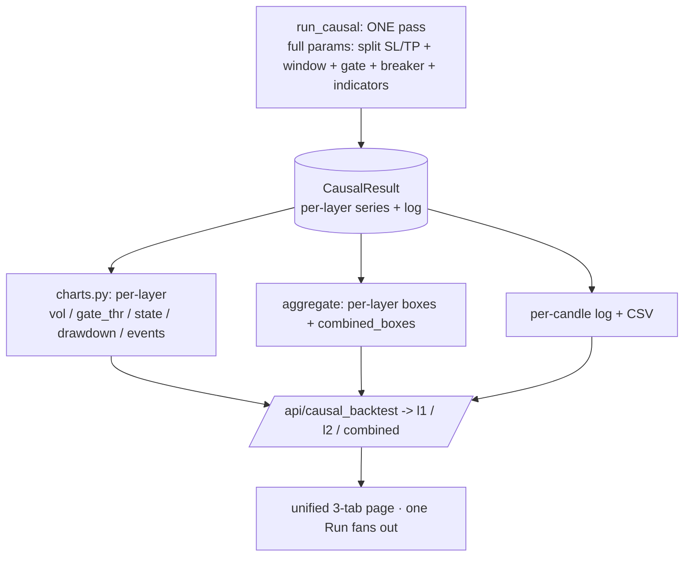

# Plan v2 — Unified tabbed dashboard (FULL build · one engine of record)

Status: REWRITTEN after council round 1 (verdict: rework). For council round 2 before any code.
Branch `dev`, base `865bf45`. Supersedes v1. Council report: `tasks/wvblgglfi.output`.

## 0. What changed from v1 (the council's verified fact-corrections)
The council verified three load-bearing v1 claims were FALSE against the code. v2 is built on the
corrected facts:
- **F1 — window has no loader arg.** `optimize/data.py:46` `load_inputs(tf)` takes NO window param;
  `n_split` is hardcoded to `config.YEARS[0]`. ALL window logic (bundle-swap `load_year_bundle(2024)`
  / `get_bundle_plus20d`, the `lo:hi` slice, and the vol-gate seed `gthr=vf[:n2025]`) lives ONLY in
  `strategy.build_payload` (`strategy.py:244-261`). Window is a real backend feature, not a "re-derive".
- **F2 — `dd_cap` is display-only.** `strategy.py:175,177,237,495-496` read/validate/echo it; the
  breaker loop (`strategy.py:336-375`) and `apply_breaker` (`l1_runner.py:42-74`) gate on
  `dd_limit`/`cooldown` ONLY. `dd_cap` changes ZERO trades. → **DROPPED from scope.** `dd_limit` (the
  real breaker) is already threaded through both engines.
- **F3 — engine charts exist only for L1, only via `build_payload`.** `run_causal`/`run_l1`/`run_l2`
  emit NO vol / gate_thr / engine-state / drawdown / event series. The mega-response `engine:{}` block
  in v1 had no backing source for L2/combined, and the endpoint identity was wrong
  (`/api/backtest_causal` = L1-engine, `/api/causal_backtest` = lean log).

## 1. Goals (user-locked; FULL-build scope)
1. ONE central page, three tabs (L1 / L2 / Combined). Retire `index.html` + `l2.html` (last step).
2. **Full engine options + charts on ALL three tabs**: split long/short SL/TP, window selection, vol
   gate, dd_limit/cooldown, indicators, PLUS vol / engine-state / drawdown charts + event log — for L1,
   L2 AND combined. (`dd_cap` dropped per F2.)
3. ONE Run → ONE causal pass → all three tabs filled; switching tabs never re-fetches.
4. Fix blank boxes (warmup / indicator-req) WITHOUT collapsing or degrading them.
HARD CONSTRAINT: strictly additive — never drop/degrade a box without explicit permission.

## 2. Architecture decision — ONE engine of record (resolves the invariant risk)
The v1 hazard: the L1 view already runs TWO engines (`build_payload` for charts + `run_causal` for the
log) that agree ONLY at the frozen default; every new lever breaks the coincidence and risks the
$149,989 anchor. **v2 makes `CausalResult` the single engine of record.** Charts, boxes, log and trades
for ALL THREE layers are derived from ONE causal pass. The `build_payload` chart dependency is retired
for the dashboard. This makes "all views agree" true *by construction* (the design intent in
`logbook.py`'s docstring) AND supplies the L2/combined charts that don't exist today.

## 3. Backend workstream (each item individually parity-gated against STEP 0 gold)
3.1 **Centralize the vol-gate seed (pre-req).** The percentile seed `vf[:n_split]` is duplicated at
    `l1_runner.py:125`, `engine.py:33`, `strategy.py:260`. Extract ONE helper
    `gate_threshold(vf, n_split, gate_pct)` and route all three through it. Behavior-preserving;
    golden 6/6 must stay green. This is the guard that stops window selection re-seeding on a windowed vf.
3.2 **Window as a shared bundle/slice helper (F1).** Factor `build_payload`'s window machinery
    (`load_year_bundle`/`get_bundle_plus20d` + `lo:hi` slice + 2025-seeded gate) into a shared
    `windowing` helper. `data.load_inputs` gains an optional `window=` that returns `(df_dec, df1, box,
    vf, n_split, lo, hi)` for the selected window using that helper. Thread `window` into
    `run_l1`/`run_l2` (via `bar_mask` already supported at `engine.py:107`) and into `aggregate` so
    boxes are computed over the SAME sliced range. Re-prove the frozen-L1 disk cache + golden under
    EACH window before any frontend work.
3.3 **Split SL/TP through the causal layer.** `fast_backtest` already supports `long_*/short_*`
    (`fast_engine.py:50-74`, parity-locked #212) but `run_l1` (`l1_runner.py:137-141`) and `run_l2`
    (`engine.py:110-115`) pass shared sl/tp only. Add `long_sl_soft/long_sl_hard/long_tp` +
    `short_*` to `validate_layer_params` and thread into BOTH call sites. **L2-split is a gated
    sub-decision** (council open-Q2: L2 force-close/flip semantics make per-side SL/TP unclear) —
    default L1+L2 share the split inputs but L2 split stays OFF until a parity test shows it is
    meaningful and stable ($78,391/80 must hold with split-off).
3.4 **Per-layer chart producers (F3).** New `optimize/l2/charts.py`: from `CausalResult` (+ the series
    `run_l1`/`run_l2` already hold: `vf`, `vol_gate`, per-layer `state_timeline`/ledger) emit, per
    layer, `{vol, gate_thr, state, drawdown, events}` matching the shapes `index.html` consumes. L1
    derives from `l1`/`l1.ledger`; L2 from `res.ledger` + L2 state; combined from the merged book.
    Event list rebuilt from the per-candle log rows (entries/exits/breaker locks/force-closes).
3.5 **Protect the frozen-default fast path.** Any new key added to `validate_layer_params` MUST be
    added symmetrically to `l1_default_params`/`_lean_params` so `use_frozen = (l1p ==
    l1_default_params(tf))` (`logbook.py:126`) still selects the cached oracle for the unchanged
    default. Add a regression test asserting `use_frozen is True` for the default AFTER the schema
    change (guards the $149,989/255 anchor).
3.6 **One fan-out endpoint, per-layer shape.** `POST /api/causal_backtest` returns
    `{ l1:{boxes,engine,trades}, l2:{...}, combined:{...}, log, candles, l1_spans, dropped }` from ONE
    causal pass (NOT a single top-level `engine:{}`). Keep the old `view` param + `/api/backtest_causal`
    working until STEP 5. Bound the per-candle `log` (entries + a bar window); full log via the existing
    `/api/causal_log.csv` (`_LAST_CAUSAL`).

## 4. Frontend workstream
4.1 Unified app (hand-rolled multi-pane boot like `combined.html:307-339`; NOT `DB.initDashboard` —
    it is single-panel). Three tabs switch the WHOLE view. Built by extending `combined.html`.
4.2 Each tab: full engine form (split-SL/TP toggle, window picker, vol gate, dd_limit/cooldown,
    indicators) + vol/state/drawdown charts + event log + per-candle log + CSV. Port index.html's full
    L1 render INCLUDING the L1-only Phase-1 SMC `gen_report` panel (`index.html:98,186-190`).
4.3 One Run → one `/api/causal_backtest` → cache by `(l1,l2,tf,window)` hash → render active tab; tab
    switch renders from cache (cannot serve a stale tab from a different param set).
4.4 **Blank-box fix (no degradation).** Render a measured `0` as `0 candles` not `—`. Keep warmup and
    indicator-req as TWO DISTINCT cards with the `/api/warmup` driver label preserved — do NOT collapse
    them onto the single `aggregate._warmup_for` value (`logbook.py:102` sets `warmup_bars ==
    indicator_req_bars`). If one-engine-of-record forces a single source, enrich `charts.py`/aggregate
    to emit BOTH distinct values + the driver label, or keep the `/api/warmup` enrichment.

## 5. Box inventory — explicit per-tab golden (the "never remove" guard)
The three tabs are NOT supersets; they are asymmetric and that is intentional:
- **L1 tab = 18 cards** (financials 4 · streaks 5 · totals 5 · counts 2 · warmup 2) + SMC gen_report
  panel + event log + per-candle log.
- **L2 tab = 20 cards** (financials 6 incl. L1-entry force-closes · streaks 4, NO box_silence ·
  totals 4, NO box_silence_total · counts 2 · warmup 2 · dropped 2) + dropped table + per-candle log.
- **Combined tab = 17 cards** (financials 4 · streaks 5 · counts 4 · guardrails 4; NO totals group).
Verification = per-tab **Playwright DOM assertions**: count `.card` elements AND assert each `.k`
label, per tab (a backend key-union test cannot catch a silent render swap — the three views use
different key namespaces and value shapes: flat `S.*` / `b.*` vs wrapped `{value,layer}`). Document the
intentional gaps (combined has no totals; L2 has no box_silence) so a later reviewer can't "fix" them.

## 6. Sequencing (parity gate between every step)
- **STEP 0 — pin gold.** Commit a golden test for L1 $149,989/255 · L2 $78,391/80 · combined $228,380
  + confirm golden 6/6 byte gate green + add `use_frozen==True` default regression. The gate every
  later step re-passes.
- **STEP 1 — blank-box fix (frontend-only, ship alone).** §4.4. No engine change, no parity risk.
- **STEP 2 — 3.1 centralize gate seed** (behavior-preserving) → gate.
- **STEP 3 — 3.4 per-layer chart producers** (additive; defaults unchanged) → gate + chart unit tests.
- **STEP 4 — 3.2 window** (the spike; per-window parity re-proof) → gate per window.
- **STEP 5 — 3.3 split SL/TP** (L1 first; L2-split gated) → gate + non-default parity test.
- **STEP 6 — 3.6 endpoint + §4 unified page** over the new per-layer payload → gate + per-tab DOM golden.
- **STEP 7 — cleanup LAST.** Repoint server root + routes + `frontend/README`, verify end-to-end
  (Playwright: one Run, all 3 tabs populated, no blank boxes, no console errors, screenshots), THEN
  delete `index.html`/`l2.html`. Keep `/api/causal_log.csv` `_LAST_CAUSAL` working.

## 7. Stronger-than-default parity gates (beyond the frozen golden)
For at least one non-default value per lever (split SL/TP on; window=2026; dd_limit>0; k>1; an indicator
on): assert L1-tab numbers == Combined-tab L1 group == the per-candle log's L1 financials, AND that each
layer's chart-implied trade set (entry/exit times + pnls) matches the log's entries for that layer. The
frozen golden only exercises defaults — exactly where the engines coincide.

## 6b. Round-2 corrections (v2.1) — council verdict GO-WITH-CHANGES
STEP 0–2 greenlit to start now. Four blockers clear BEFORE STEP 4 (window). Verified deltas:
- **B1 (charts signature).** `CausalResult` (logbook.py:70-80) holds only `{log,n,dec_dates,warmup,
  counts}` — NOT `vf`/`vol_gate`/OHLC. So §3.4 must be `charts_for_layer(result, l1:L1Result,
  l2:L2Result|None, layer)`. The `L1Result` (vf l1_runner.py:96, vol_gate :100, state_timeline :106)
  is already in scope at the call site (payload.py:391 re-fetches `run_l1_cached`). Thread it in.
- **B2 (window = physical slice, NOT bar_mask).** `run_l1` has no `bar_mask`; `bar_mask` (run_l2 only)
  ANDs the L2 entry gate and does NOT slice. `apply_breaker` cumulates a GLOBAL high-water-mark, so
  entry-masking ≠ data-slicing → different max_dd/n_locks/n_skipped for window≠full. FIX: extract
  strategy.py:244-261 into a shared `windowing` helper returning `(df_dec,df1,box,vf,n_split,lo,hi)`;
  `run_l1` gains `window=` and physically slices BEFORE `fast_backtest`+`apply_breaker`, gate seed kept
  on the PRE-window `vf[:n_split]` (STEP 2 first). 2024/+20d need `load_year_bundle`/`get_bundle_plus20d`.
  Extend the disk-cache key (payload.py:32 lean hash) to include `window`. STEP-4 assertion:
  `run_l1(window=w).max_dd/n_locks == build_payload(window=w)` for w∈{2024,2025,2026,full+20d,2026+20d}.
- **B3 (L2/combined engine-state + would_be_pnl).** `apply_breaker` `continue`s skipped candidates
  (loses idx+pnl); run_l2 returns only n_skipped/n_locks. The L2/combined state chart + SKIP would-be-P/L
  + per-bar indicator vote chips (deferred LogRow fields, logbook.py:21-24) are NOT producible today.
  Per the never-degrade constraint, DEFAULT = surface them (per-bar L2 lock timeline from run_l2/
  apply_breaker; enrich logbook `would_be_pnl`/`indicators`). Decide before STEP 4/6; do not leave implicit.
- **B4 (re-sequence).** New order: 0 pin gold → 1 blank-box → 2 gate seed → **3 WINDOW** → 4 charts
  (windowed) → 5 split SL/TP → 6 endpoint+page → 7 cleanup.
- Notes (don't gate): §2 "build_payload retired" overstates — `generate_structures`/`gen_report`
  (SMC panel) is kept for L1 (no CausalResult source). Split-SL/TP keys must land symmetrically in
  validate_layer_params + _lean_params + l1_default_params with a regression covering BOTH frozen sites
  (logbook.py:126 AND payload.py:391). L2-split gate test must exercise a force-closed L2 trade. Measure
  the bounded mega-payload at the FINEST TF (2m/+20d), not 4h.

## 6c. STEP 3 progress + the 3b design (the seed-carrying trap)
STEP 3a DONE (e08745c): `strategy.window_slice()` extracted, build_payload refactored, golden 6/6 green,
all 6 windows smoke-sane. De-risk verified: `data.load_inputs("4h")` == `get_bundle("4h")` byte-identical.

**3b — thread window through run_l1 + run_l2 (the careful half).** Non-obvious parity trap found while
designing it:
- `run_l1` can window cleanly: after `data.load_inputs(tf)`, if window!="full" call
  `strategy.window_slice(...)` → run the engine on the WINDOWED `d4/d1/vfw`, but seed the gate on the
  PRE-window `vf_full[:n_split]` (window_slice returns both). For 4h this matches build_payload because
  the data is byte-identical.
- **THE TRAP:** `engine.run_l2` re-seeds its OWN gate as `np.percentile(l1.vf[:l1.n_split], gate_pct)`
  (engine.py:33). If `L1Result.vf` is the windowed `vfw`, then for window=2026 the windowed vf is
  `vf_full[n_split:N]` — there is NO prefix of it equal to the 2025 in-sample threshold, so L2 would
  silently re-seed on OUT-OF-SAMPLE 2026 data and diverge. `counterfactual_pause`/`diagnose_pause` have
  the same `vf[:n_split]` shape.
- **FIX:** `L1Result` must carry the gate SEED explicitly — add `gthr` (the computed threshold, or the
  pre-window `(seed_vf, seed_n)`) to L1Result, and have `run_l2` (and any reseeder) use
  `l1.gthr` instead of recomputing `percentile(l1.vf[:l1.n_split])`. This also lets STEP 2's centralized
  `gate_threshold` be computed ONCE in run_l1 and reused. Add to validate_layer_params + _lean_params +
  l1_default_params symmetrically (keep window="full" default so use_frozen holds at BOTH sites:
  logbook.py:126 AND payload.py:391). Extend `run_l1_cached` disk-cache key (payload.py:32) with window.
- **3b parity gate:** assert `run_l1(window=w)` financials (P/L, n, max_dd, n_locks) ==
  `build_payload(window=w)` for w∈{full,2024,2025,2026,full+20d,2026+20d}, AND L2 stays $78,391/80 for
  window=full (frozen). Then STEP 4 charts consume the windowed CausalResult.

## 8. Open sub-decisions carried into round 2
- L2 split SL/TP: include or declare L1-only? (default: wire schema, keep L2 split OFF until proven).
- Warmup/indicator-req single-source vs keep `/api/warmup` driver label (avoid content degradation).
- Mega per-layer response vs 3 cached calls: both consistent under one-engine-of-record; pick on
  payload size measured at 4h full window (bound the log either way).
