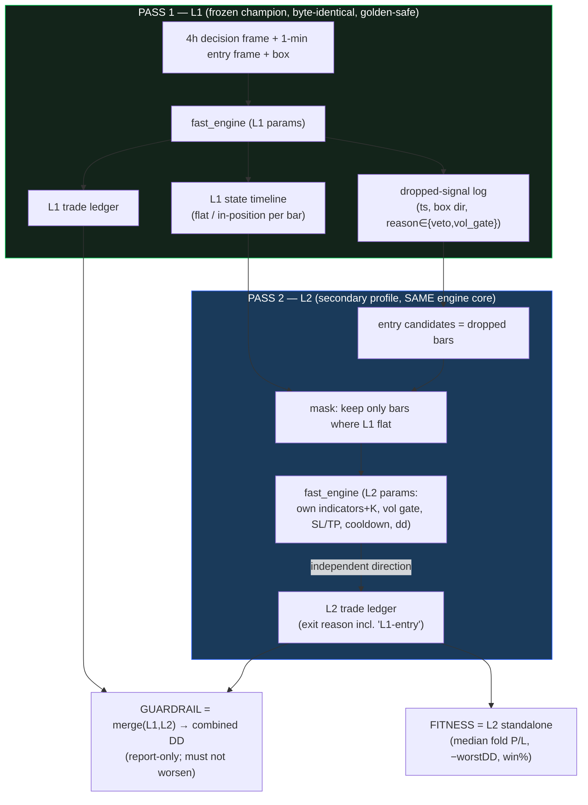

# L2 — Second Decision Layer for Non-Entry Signals (round 1)

## 1. Context & goal

The primary champion ("**L1**", the lean 3-indicator 4h/1-min profile, **+$149k P/L · ~$15k DD**, milestone
branch `best-of-4h-1min-3ind-149kpnl-15kdd`) is the **first decision layer**. For every box signal it emits
**ENTRY** or **NON-ENTRY**. The entry book is excellent and **frozen**.

The counterfactual study (`study_range_regime/REPORT_counterfactual_pause.md`) already proved that re-deciding
the non-entries with **L1's own logic** loses money → "accept the pause". This workstream asks a *different*
question: can a **second decision layer (L2)** — same engine, but its **own** indicators / gate / direction
logic — extract positive expectancy from the signals L1 throws away?

> **Mental model:** a dashboard inside the dashboard. L1 labels a signal NON-ENTRY → L2 takes the lead on
> that one signal with a **secondary profile**.

**Round 1 is deliberately narrow** (see §9 for the round map). Build order mirrors how L1 was built:
**backtester → dashboard-inside-dashboard → optimizer → speed.**

## 2. Locked decisions (from brainstorming)

| # | Decision | Value (round 1) |
|---|---|---|
| Scope | Which non-entry types L2 manages | **veto + gate-veto only** (565 signals: 359 vetoed + 206 vol-gated). Excludes warmup, box-silence, in-position, confirm<K (=0). |
| Fitness | How L2 is scored/optimized | **Standalone** on the isolated dropped-signal dataset; the merged **L1+L2 book is a DD guardrail** (report-only, must not worsen combined DD). |
| Concurrency | L1↔L2 position model | **L2 opens only when L1 is flat; L1 wins ties** — if L1 enters during an L2 trade, L2 closes at that bar (reason `L1-entry`). At most one position across both layers. |
| Action | L2's decision on a dropped signal | **Independent direction** — L2's own indicators choose long/short/skip (it may agree with or oppose the box). Reverse is implicit. |
| Trigger | When L2 may act | **Only the dropped box-signal bars** (veto/gate-veto). The isolated dataset = that set of dropped signals. |
| Overfit policy | When we account for overfitting | **Not** during optimization (no penalty). **In the analysis stage**: compare train vs. held-out (out-of-sample) and judge overfitting there. |

## 3. Architecture — Approach A (approved): two-pass, frozen engine + L1-state mask

**Why A:** L1's bytes never change → **golden 6/6 stays green**. L2 reuses the exact `fast_engine` + `core`
exit path with its own params → identical fill/exit math, no new engine to validate. Concurrency is modeled by
an explicit **mask** (L1-flat timeline) + **force-close on L1 entry**, not by surgery on the fused engine
(rejected alt **B**) and not by fragile post-hoc reconciliation (rejected alt **C**).

## 4. Components (isolation boundaries)

Each unit has one purpose, a typed interface, and is independently testable:

1. **`l2/l1_runner.py` — `run_l1(tf, l1_params) → L1Result`.** Wraps the frozen engine to emit
   `{ledger, dropped_signals, state_timeline}`. Pure read of L1; no L2 knowledge. *Depends on:* `fast_engine`,
   `core`, `signals`.
2. **`l2/dataset.py` — `build_dataset(L1Result) → DroppedSignalSet`.** The isolated dataset: each dropped
   signal = `{idx, ts, box_dir, reason, l1_flat_after}` + the bar arrays L2 needs. The single source of truth
   for "what L2 is allowed to touch".
3. **`l2/engine.py` — `run_l2(DroppedSignalSet, state_timeline, l2_params) → L2Result`.** Runs the secondary
   profile through the shared engine core, restricted to masked candidates, force-closing on L1 entry. Emits
   the L2 ledger with honest exit attribution. *This is the only new "engine" code, and it composes the
   existing core rather than re-implementing it.*
4. **`l2/metrics.py` — `score(L2Result) → standalone metrics` and `combined(L1Result, L2Result) → guardrail`.**
   Standalone fitness + the merged-book DD check. No engine knowledge.
5. **`l2/optimize.py`** (later phase) — NSGA-III search over L2 params, reusing `optimize/optimizer.py`
   machinery (folds, samplers, warm-start, Postgres store) with a **new study prefix**.
6. **Dashboard-inside-dashboard** (later phase) — a sub-view that loads an L1 profile, shows its dropped
   signals, and lets the user apply/inspect an L2 profile manually before optimizing.

## 5. Data flow (round 1)

1. Run L1 once → ledger + dropped-signal log + state timeline.
2. Build the isolated dataset from the dropped signals.
3. For each dropped bar where **L1 is flat**, L2's indicator layer decides long/short/skip; if it enters, the
   trade runs on the **same exit engine** (L2's SL/TP) until: TP, SL, drawdown breaker, **or L1 enters** (→
   close at that bar, reason `L1-entry`).
4. Score L2 standalone; compute the combined-book guardrail.

## 6. Exit model (round 1)

L2 **reuses L1's exit engine verbatim** (soft/hard SL, TP, sub-bar 1-min resolution, drawdown breaker), with
**L2's own SL/TP params** (which the optimizer may *shrink* relative to L1). One added exit cause:

- **`L1-entry`** — when L1 opens its own trade while L2 holds, L2 exits at that bar's close (L1 priority). The
  realized P/L of the truncated leg is attributed to L2 **honestly** (never dropped) so the standalone metric
  is not inflated. *(Round 2 will A/B this against "keep L2 open, discard L1".)*

## 7. Optimizer (later phase) — search space, objective, validation

- **Search space (L2 levers, from the brief):** L2 indicator subset + per-indicator params + **K**; **vol gate
  `gate_pct`**; **SL/TP bounds (shrinkable)**; `cooldown`; `dd_limit`; (direction is indicator-driven, so the
  "reverse" lever is implicit — no separate flip knob needed, though we keep `veto_as_flip`/`flip` available).
- **Objective:** the same NSGA-III 3-objective as L1 — `(median fold P/L, −worst DD, win-rate)` with the
  `DD ≤ 25%·P/L` feasibility constraint — computed on the **standalone L2 book**.
- **Validation = the overfit policy:** walk-forward folds during search (no overfit penalty); a held-out
  **out-of-sample** slice is scored **after** and compared to train in the analysis stage to judge overfitting.
  A hard `min_trades` floor guards against degenerate few-trade "winners" on the sparse 565-signal dataset.
- **Study isolation:** a **new prefix** (e.g. `l2v1`) in the Postgres store; never reuses an L1 prefix.
- **Timeframe:** **4h** (matches the champion + the production "4h-only optimizer" directive). Other TFs later.

## 8. Edge cases & trading-law guardrails (the "mathematically right but breaks trading law" checks)

- **One real account, one position.** The L1-flat mask + L1-wins rule guarantees L1 and L2 never hold
  simultaneous (let alone opposing) positions — no impossible net exposure on a single futures account.
- **Truncation honesty.** `L1-entry` exits are realized and attributed to L2; we never silently discard the
  truncated leg (would lie about L2's edge).
- **Reverse-vs-structure labeling.** When L2 enters opposite the box direction, the ledger flags it
  (`l2_dir_vs_box ∈ {agree, oppose}`) so analysis can tell "the gate was too strict" (agree) apart from
  "fade the failed signal" (oppose).
- **No look-ahead.** L2 decides at bar `idx` using data ≤ `idx` (same convention as L1: enter at `idx` on
  `sig[idx-1]`, gated by masks at `idx`). The L1 state timeline is causal (L1's own no-look-ahead ledger).
- **Sparsity.** 565 candidate signals, of which L2 takes a subset and some are truncated → low trade counts.
  Treated as an analysis-stage caveat (train-vs-OOS), not an optimization constraint, per the locked policy.
- **Golden invariant.** L1 path is untouched; `perf/check_golden.py` must stay **6/6** after every change.

## 9. Round map (scope boundary — what is NOT in round 1)

| Round | Adds |
|---|---|
| **1 (this spec)** | veto + gate-veto; L2 independent direction; L1 wins ties (exit `L1-entry`); standalone fitness + combined guardrail; 4h. |
| 2 | A/B "keep L2 open, discard L1" vs round-1's L1-priority exit; compare. |
| later | in-position / "trade-open" non-entries; box-silence; the other delay type; market-regime conditioning (low-vol-horizontal, overshoot-reversal); other timeframes. |

## 10. Build order (mirrors L1)

1. **Backtester** (§3–6): `l1_runner` + `dataset` + `engine` + `metrics`, TDD, golden 6/6, parity tests.
2. **Dashboard-inside-dashboard** (§4.6): manual apply/inspect of an L2 profile over the dropped signals.
3. **Optimizer** (§7): NSGA-III over L2 params, new prefix, walk-forward + OOS.
4. **Speed**: profile + optimize the L2 backtester (the 1-min indicator compute is the known bottleneck, #210).

## 11. Testing strategy

- **Golden 6/6 unchanged** after every change (L1 frozen).
- **Parity:** `run_l1` reproduces the champion's ledger byte-for-byte vs the existing engine.
- **Dataset:** dropped-signal count == counterfactual report (359 veto + 206 gate).
- **Concurrency unit tests:** L2 never opens while L1 in-position; `L1-entry` exit fires + P/L attributed;
  opposing/again labeling correct.
- **No-look-ahead:** synthetic series where any peek would change the trade.
- **Metrics:** standalone vs combined guardrail on a hand-built mini-ledger.

## 12. Design decisions — CONFIRMED (2026-06-17)

1. **L1 source of truth:** the **`wshlean_4h`** champion — the latest 3-indicator + gate portfolio. Canonical
   params: `shareable/lean_3indicator_backtester/champions/lean_4h.json` (`preset` block; also preset id
   `wshlean_4h` in `presets.py`). Frozen config: enabled indicators **cci** (n=138, threshold=35, mode `both`),
   **structure_trend** (swing_l=6, `both`), **order_block** (swing_l=10, `both`) — all others off;
   `gate_pct=86.9`, `sl_soft=149.8`, `sl_hard=167.1`, `tp=120.2`, `dd_limit=4747`, `cooldown=0`, `flip=false`,
   `k=1`, `dd_cap=5000`, `pv=20`, gen `swing_l=10`/`golf_n=3`. `run_l1` loads exactly this.
2. **Module location:** new **`optimize/l2/`** package (isolated from the frozen engine). ✅
3. **Study prefix:** **`l2v1`**. ✅
4. **min_trades floor:** reuse L1's **`min_trades=5`**, revisit in the analysis stage. ✅
