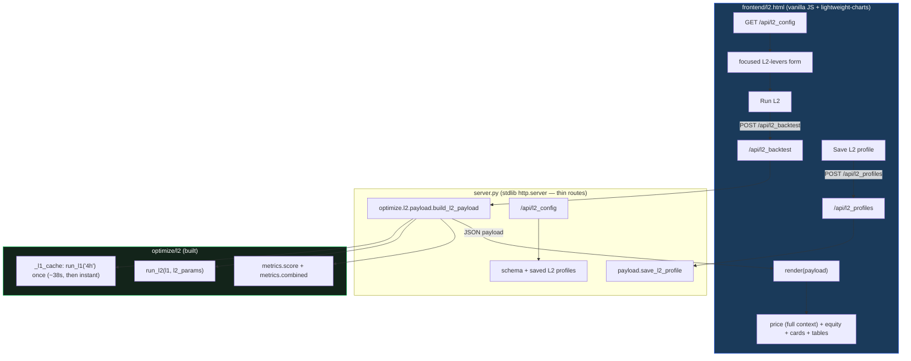

# L2 — dashboard-inside-dashboard (round 1, task #236)

## 1. Context & goal

The L2 round-1 **backtester** is built (`optimize/l2/`: `l1_runner`, `dataset`, `engine`, `metrics`;
10 tests green; golden 6/6). This workstream adds the **dashboard-inside-dashboard**: a UI to load the
frozen L1 champion, see the box signals it drops (veto + vol-gate), manually tune an **L2 profile** over
them, and inspect the result — standalone L2 performance **and** the combined-book drawdown guardrail —
before the optimizer phase (#237) searches for the real profile.

Mirrors how L1 was built (backtester → **dashboard** → optimizer → speed) and the existing backtest
dashboard's shape (`server.py` + `frontend/index.html`).

## 2. Locked decisions (from brainstorming, 2026-06-18)

| # | Decision | Value |
|---|---|---|
| Q1 Integration | How the L2 view attaches | **Separate page `frontend/l2.html` + new `/api/l2_backtest` endpoint.** No changes to `index.html`; normal backtest stays fast. |
| Q2 L1 base | Fixed or selectable | **Fixed to the lean 4h champion** (`run_l1("4h")`); selectable L1 is later. |
| Q3 Form | What the L2 form exposes | **Focused L2-levers only** (what `run_l2` consumes): indicator subset + params + mode + K, `gate_pct`, shared SL/TP, `dd_limit`, `cooldown`, `flip`, `ind_1min`. No window/retrace/wait/split/veto_as_flip. |
| Q4 Charts | L1 context on the price chart | **Full context**: L1 in-position shading, dropped markers by reason, L2 trades agree/oppose, SL/TP lines, `L1-entry` force-close flags, combined-vs-L1-only equity. |
| Q5 Scope | Manual vs persistence vs optimizer | **Manual apply/inspect + save L2 profiles** (`profiles/l2_profiles.json`). **No optimizer launch** (that is #237). |

## 3. Architecture



**Why this shape:** L1 stays frozen (the cache reuses the built `run_l1`); `/api/backtest` and
`index.html` are untouched (normal backtest stays ~234 ms); `build_l2_payload` is a pure, testable
orchestrator (the L2 analogue of `strategy.build_payload`), so `server.py` stays thin and the payload is
unit-testable without HTTP.

## 4. Components (isolation boundaries)

1. **`optimize/l2/payload.py`** — the orchestrator + persistence:
   - `build_l2_payload(l2_params: dict, tf: str = "4h") -> dict` — cached `run_l1` + `run_l2` +
     `score`/`combined`, then serialize chart series. Pure (no HTTP).
   - `_l1_cache: dict[str, L1Result]` + `get_l1(tf)` — run-once-per-process cache (first ~38 s).
   - `load_l2_profiles() -> dict` / `save_l2_profile(name, preset) -> dict` — `profiles/l2_profiles.json`
     (mirrors `presets.load_user_profiles`/`save_user_profile`).
   - `l2_config() -> dict` — `{indicator_schema, l1: {label, dropped, veto, vol_gate, flat_candidates},
     profiles}` to drive the form + saved-profile dropdown.
2. **`server.py`** — three thin routes (parse JSON → call payload fn → send JSON), no logic:
   `POST /api/l2_backtest`, `POST /api/l2_profiles`, `GET /api/l2_config`. Plus serve `frontend/l2.html`
   (the existing static handler already serves any file under `frontend/`).
3. **`frontend/l2.html`** — vanilla JS + lightweight-charts; focused L2 form (reuse the indicator-panel
   builder + a box-knobs subset), Run, charts, metric cards, L2 ledger, dropped-signal table, Save.
   Self-contained (own inline `<script>`/`<style>`, like `index.html`).

## 5. Endpoint contracts

**`POST /api/l2_backtest`** — request (focused L2 levers; tf fixed `"4h"`):
```json
{ "indicators": [ {"key":"cci","enabled":true,"mode":"both","params":{"n":138,"threshold":35}}, ... ],
  "k": 1, "gate_pct": 0, "sl_soft": 149.8, "sl_hard": 167.1, "tp": 120.2,
  "dd_limit": 0, "cooldown": 0, "flip": false, "ind_1min": false }
```

Response (epoch-second `time`, mirroring the existing payload's series shape):
```json
{ "meta": { "summary": {
      "l2": {"pnl":-64299.0,"max_dd":108453.0,"n":349,"win":54.4,"pf":0.9,"n_l1_entry_exits":52},
      "combined": {"pnl":85690.0,"max_dd":50574.0,"l1_only_dd":15491.0,"dd_not_worse":false} },
    "l1": {"n_trades":255,"pnl":149989.0,"dropped":492,"veto":286,"vol_gate":206,"flat_candidates":410},
    "run_ms": 180 },
  "candles": [ {"time":1735754400,"open":...,"high":...,"low":...,"close":...}, ... ],
  "l1_spans": [ {"from":1735754400,"to":1735790400}, ... ],
  "dropped":  [ {"time":1735761600,"reason":"veto","box_dir":"long"}, ... ],
  "l2_trades":[ {"entry_time":...,"exit_time":...,"direction":"long","entry_price":...,"exit_price":...,
                 "sl_soft_line":...,"sl_hard_line":...,"tp_hard_line":...,"exit_reason":"TAKE_PROFIT_HARD",
                 "pnl":...,"l2_dir_vs_box":"agree"}, ... ],
  "l2_equity":[ {"time":...,"value":...}, ... ],
  "combined_equity":[ {"time":...,"value":...}, ... ],
  "l1_equity":[ {"time":...,"value":...}, ... ] }
```

**`POST /api/l2_profiles`** — `{name, preset}` → validate (must be a dict with the L2-lever keys) →
`save_l2_profile` → `{ok:true, profiles:{…}}`. **`GET /api/l2_config`** → see `l2_config()` above.

## 6. Visualization (full context)

- **Price chart** (lightweight-charts, reuse `index.html` patterns): candles; **L1 in-position shading**
  from `l1_spans` (a background/area band so you see where L2 is masked out); **dropped markers** colored
  by reason (veto = orange, vol-gate = blue); **L2 trade markers** entry/exit, `agree` = solid / `oppose`
  = hollow shape; **SL/TP lines** per L2 trade; **`L1-entry` exits** flagged distinctly (text/marker).
- **Equity chart**: `combined_equity` vs `l1_equity` overlaid (the guardrail, visual); `l2_equity` optional.
- **Metric cards**: L2 standalone (`pnl,max_dd,n,win,pf,n_l1_entry_exits`) + combined
  (`pnl,max_dd,l1_only_dd,dd_not_worse`), with `dd_not_worse` colored green (true) / red (false).
- **Tables**: L2 trade ledger (incl. `l2_dir_vs_box`, `exit_reason`); dropped-signal table (ts, reason,
  box_dir, whether L1 was flat).

## 7. Data-flow & caching

1. Page load → `GET /api/l2_config` → build the indicator panel + saved-profile dropdown + show the fixed
   L1 summary (dropped counts).
2. Run → `POST /api/l2_backtest {levers}` → `build_l2_payload`: `get_l1("4h")` (cached) → `run_l2` →
   `score`/`combined` → serialize → JSON → `render()`.
3. The L1 run (~38 s) happens **once per server process** (lazy on first L2 run; cached thereafter). All
   subsequent L2 runs are fast (only `run_l2` + metrics + serialization).
4. Save → `POST /api/l2_profiles` → `profiles/l2_profiles.json`; dropdown refreshes from the response.

## 8. Edge cases & guardrails

- **L1 frozen / golden.** `payload.py` only *calls* the built `run_l1`/`run_l2`; no engine edits →
  `perf/check_golden.py` stays **6/6**. `/api/backtest` + `index.html` untouched.
- **No silent dead controls.** The form shows only levers `run_l2` consumes (Q3) — honors the project's
  "no silent fallback" norm.
- **Empty result.** A restrictive L2 profile may yield 0 L2 trades (e.g. lean-params-as-L2 → 0); the page
  renders cards with n=0 + an empty ledger, not an error.
- **First-run latency.** The first L2 run blocks ~38 s on the L1 cache fill; the UI shows a "computing L1
  (first run, ~40 s)…" status. Subsequent runs are instant.
- **Profile store isolation.** L2 profiles live in `profiles/l2_profiles.json`, separate from
  `user_profiles.json` (L1) — no cross-contamination of the strategy dropdown.
- **Serialization.** Times are epoch seconds (UTC), matching the existing payload so the chart helpers
  port directly; `pnl`/lines are floats.

## 9. Testing strategy

- **Golden 6/6 unchanged** after every change (all-new modules; `/api/backtest` untouched).
- **`build_l2_payload`**: returns every documented key; its `summary.l2` equals `metrics.score` and
  `summary.combined` equals `metrics.combined` for a known profile. The **permissive** profile gives
  deterministic anchors (n=349, pnl −$64,299, 52 force-closes; combined maxDD $50,574, dd_not_worse=false).
- **L1 cache**: `get_l1("4h")` returns the *same object* on the 2nd call (identity check; no re-run).
- **Profiles**: `save_l2_profile` then `load_l2_profiles` round-trips; written to `l2_profiles.json`.
- **Series sanity**: `l1_spans` cover exactly the in-position bars; `dropped` count == payload `l1.dropped`;
  every `l2_trades` entry has `l2_dir_vs_box ∈ {agree,oppose}`.
- **Frontend**: no framework/tests (matches the existing dashboard) — covered by the backend payload test
  + a manual page smoke (load `l2.html`, Run, see panels populate).

## 10. Build order & scope

1. **Backend** — `optimize/l2/payload.py` (cache + `build_l2_payload` + profiles + `l2_config`) + the three
   `server.py` routes, TDD, golden 6/6.
2. **Frontend** — `frontend/l2.html` (form + charts + cards + tables), manual smoke.
3. **Profile save** — wire Save button + saved-profile dropdown.
4. **Docs** — UPDATE build report + tracker; spec status.

**Out of scope (later):** optimizer launch / prefix `l2v1` (#237), selectable L1 base, speed (#210),
round-2 exit A/B.
