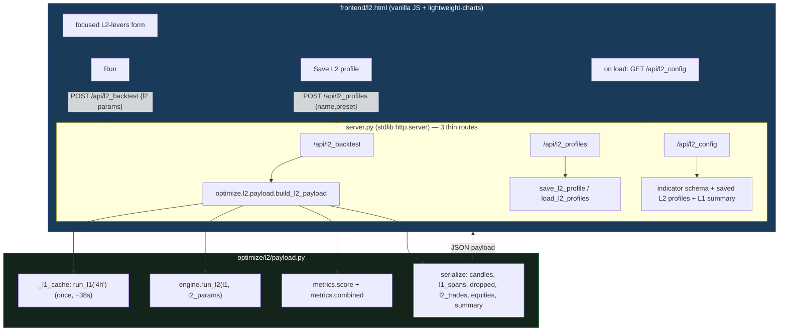

# L2 — Dashboard-inside-dashboard (round 1, #236)

## 1. Context & goal

The L2 round-1 **backtester** is built ([[update_l2_backtester]]: `optimize/l2/` — `l1_runner`, `dataset`,
`engine`, `metrics`; 10 tests; golden 6/6). This workstream adds the **dashboard-inside-dashboard**: a UI
to *manually* apply and inspect an L2 profile over the frozen L1 champion's dropped signals, mirroring how
the L1 backtest dashboard works. It is the visualization layer between the backtester and the optimizer
(#237). The optimizer is **out of scope** here.

**Build order (spec §10 of the L2 design):** backtester ✅ → **dashboard-inside-dashboard (this spec)** →
optimizer → speed.

## 2. Locked decisions (from brainstorming, 2026-06-18)

| # | Decision | Value |
|---|---|---|
| Attach | How the L2 view attaches | **Separate page `frontend/l2.html` + new `/api/l2_backtest` endpoint.** No changes to the 637-line `index.html`; normal `/api/backtest` stays fast. |
| L1 base | Fixed vs selectable | **Fixed to the lean 4h champion** (`run_l1("4h")`), cached once per process. The page displays which L1 it uses; selectable L1 is later. |
| L2 form | What controls to expose | **Focused L2-levers form only**: indicator panel (subset + params + mode + K), `gate_pct`, shared SL/TP, `dd_limit`, `cooldown`, `flip`, `ind_1min`. No `window`/`retrace`/`wait`/`veto_as_flip`/split — `run_l2` ignores them (no dead/misleading controls). |
| Charts | L1 context overlay | **Full context**: L1 in-position shading, dropped markers by reason (veto/vol-gate), L2 trades agree-vs-oppose, L2 SL/TP lines, `L1-entry` force-close flags, combined-vs-L1-only equity. |
| Scope | Persistence + optimizer | **Manual apply/inspect + save L2 profiles** to `profiles/l2_profiles.json` (mirrors `user_profiles.json`). **No optimizer launch** (that is #237). |

## 3. Architecture



**Why:** L1 is frozen (cache reuses the exact `run_l1`), `index.html` and `/api/backtest` are untouched
(golden + normal-backtest speed both unaffected), and orchestration sits in a testable Python module
(`build_l2_payload`) so `server.py` stays a thin router. The page reuses the existing dark theme,
lightweight-charts patterns, and the indicator-panel builder.

## 4. Components (isolation boundaries)

1. **`optimize/l2/payload.py`** — the L2 analogue of `strategy.build_payload`. Pure-ish orchestration; no HTTP.
   - `run_l1_cached(tf="4h") -> L1Result` — module-level cache (`_L1_CACHE: dict[str, L1Result]`); first
     call runs `l1_runner.run_l1`, subsequent calls return the same object.
   - `build_l2_payload(l2_params: dict) -> dict` — runs `run_l2` + `metrics`, serializes the response (§6).
   - `validate_l2_params(p: dict) -> dict` — coerces/validates the focused levers; raises `L2ParamError`
     on bad input (no silent clamp — matches the project norm).
   - `save_l2_profile(name, preset) -> dict` / `load_l2_profiles() -> dict` — persist to
     `profiles/l2_profiles.json` (same shape/pattern as `presets.save_user_profile`).
2. **`server.py`** — three new routes, each a thin wrapper around the above (validate → call → JSON; 400 on
   `L2ParamError`, 500 on failure):
   - `POST /api/l2_backtest`, `POST /api/l2_profiles`, `GET /api/l2_config`.
3. **`frontend/l2.html`** — self-contained page: focused form, Run, charts, metric cards, L2 ledger,
   dropped-signal table, Save-profile, saved-profile dropdown. Linked from `index.html` (a small "L2 layer"
   link, the only edit to `index.html`).

## 5. Data flow

1. Page load → `GET /api/l2_config` → indicator schema (for the panel) + saved L2 profiles + L1 summary
   (n_trades, P/L) for the header.
2. User tunes the focused L2 form → **Run** → `POST /api/l2_backtest {l2 params}`.
3. `build_l2_payload`: `run_l1_cached("4h")` (frozen) → `run_l2(l1, params)` → `score` + `combined` →
   serialize → JSON.
4. Page `render(payload)` populates charts + cards + tables.
5. **Save L2 profile** → `POST /api/l2_profiles {name, preset}` → `profiles/l2_profiles.json` → returns the
   updated profile list for the dropdown.

## 6. Endpoint contracts

**`POST /api/l2_backtest`** — request (focused levers; `tf` fixed `"4h"`):
```json
{ "indicators": [ {"key":"cci","enabled":true,"mode":"both","params":{"n":138,"threshold":35}}, ... ],
  "k": 1, "gate_pct": 0, "sl_soft": 149.8, "sl_hard": 167.1, "tp": 120.2,
  "dd_limit": 0, "cooldown": 0, "flip": false, "ind_1min": false }
```

Response:
```json
{ "meta": {
    "l1": {"n_trades": 255, "pnl": 149989.0},
    "summary": {
      "l2": {"pnl": -64299.0, "max_dd": 108453.0, "n": 349, "win": 54.4, "pf": 0.9, "n_l1_entry_exits": 52},
      "combined": {"pnl": 85690.0, "max_dd": 50574.0, "l1_only_dd": 15491.0, "dd_not_worse": false}
    },
    "dropped_counts": {"veto": 286, "vol_gate": 206, "total": 492, "flat_candidates": 410},
    "run_ms": 120 },
  "candles": [ {"time": 1735754400, "open": ..., "high": ..., "low": ..., "close": ...}, ... ],
  "l1_spans": [ {"from": 1735754400, "to": 1735790400}, ... ],
  "dropped":  [ {"time": 1735761600, "reason": "veto", "box_dir": "long", "l1_flat": true}, ... ],
  "l2_trades": [ {"entry_time": ..., "exit_time": ..., "direction": "long", "entry_price": ...,
                  "exit_price": ..., "exit_reason": "TAKE_PROFIT_HARD", "pnl": 1335.0,
                  "l2_dir_vs_box": "agree", "sl_soft_line": ..., "sl_hard_line": ..., "tp_hard_line": ...}, ... ],
  "l2_equity":       [ {"time": ..., "value": ...}, ... ],
  "l1_equity":       [ {"time": ..., "value": ...}, ... ],
  "combined_equity": [ {"time": ..., "value": ...}, ... ] }
```

Errors: `400 {"error": ...}` on invalid params (`L2ParamError`), `500 {"error": ...}` on failure.

**`POST /api/l2_profiles`** — `{name, preset}` → validate → `save_l2_profile` → `{"ok": true, "profiles": {...}}`.

**`GET /api/l2_config`** — `{ "indicator_schema": {...}, "l2_profiles": {...}, "l1": {"n_trades":255,"pnl":149989}, "l1_label": "🍃 lean 4h ..." }`.

> **Note on SL/TP lines:** `engine.run_l2` ledger trades come from `fast_backtest`, which does *not* emit
> `sl_*_line`/`tp_*_line` fields (only `entry_price`, `direction`, etc.). `build_l2_payload` derives the
> line levels for the chart from `entry_price ± points` (long: `sl = ep − sl_hard`, `tp = ep + tp`; short
> mirror), the same convention the engine fills against. This is presentation-only and does not change P/L.

## 7. Charts & layout (full context)

- **Price chart** (lightweight-charts candlestick, reuse `mk()`/theme):
  - L1 **in-position shading** from `l1_spans` (a faint background band/area series).
  - **Dropped-signal markers** at `dropped[].time`, colored **veto = orange**, **vol-gate = blue**; flat
    candidates solid, in-position-masked ones dimmed.
  - **L2 trade markers**: entry arrow + exit; **agree = solid**, **oppose = hollow** shape; `L1-entry`
    force-close exits flagged with a distinct marker/text.
  - **L2 SL/TP lines** (derived per §6 note) drawn per trade like the L1 dashboard.
- **Equity chart**: **combined (L1+L2)** vs **L1-only** lines overlaid (the guardrail, visual); L2-standalone
  as an optional third line.
- **Metric cards**: L2-standalone block + combined block; **`dd_not_worse` colored green/red**.
- **Tables**: L2 trade ledger; dropped-signal table (time, reason, box_dir, l1_flat).
- **Layout**: reuse `index.html`'s resizable sidebar (form) + main (charts/tables) pattern and CSS.

## 8. Edge cases & guardrails

- **Slow L1 (~38s):** cached per process; the page shows a "computing L1 (first run)…" state on the first
  request. Subsequent runs are fast (only `run_l2`).
- **0-trade L2 profiles:** valid and expected (e.g. lean-params-as-L2 → 0 trades). The page renders empty
  L2 series + a clear "L2 took 0 trades" note; cards show zeros; combined == L1-only.
- **No silent fallback:** invalid L2 params → `400` with the reason; the page surfaces it (matches the
  project norm, like the L1 dashboard's `ParamError` handling).
- **L1 frozen / golden:** `payload.py` only *reads* L1 via `run_l1`; `index.html` and `/api/backtest`
  untouched. `perf/check_golden.py` stays **6/6**.
- **Profile store isolation:** L2 profiles live in `profiles/l2_profiles.json`, separate from
  `user_profiles.json`, so the two profile namespaces never collide.

## 9. Testing strategy

- **Backend pytest (`optimize/l2/test_payload.py`):**
  - `build_l2_payload` returns all documented keys; its `summary.l2` equals `metrics.score` and
    `summary.combined` equals `metrics.combined` for a **known permissive profile** (deterministic from the
    smoke: n=349, P/L −$64,299, maxDD $108,453, 52 force-closes; combined maxDD $50,574, `dd_not_worse` False).
  - `run_l1_cached` returns the **same object** on the 2nd call (cache works).
  - `validate_l2_params` raises `L2ParamError` on a bad param; accepts a good one.
  - `save_l2_profile` round-trips through `profiles/l2_profiles.json` (use a temp path / cleanup).
  - SL/TP line derivation matches `entry_price ± points` for a hand-built trade.
- **Route smoke (backend):** drive the handler (or call `build_l2_payload` directly) → HTTP-shaped JSON,
  `200`; a bad body → `400`.
- **Frontend:** no framework/tests (matches the existing dashboard) — verified by the backend payload test
  + a manual page smoke (load `l2.html`, Run with a permissive profile, see all panels populate).
- **Golden 6/6** after every change (all-new modules; nothing in the golden path imports `optimize/l2/`).

## 10. Build order (this spec)

1. **Backend** `optimize/l2/payload.py` (cache + `build_l2_payload` + validate + profile store) + the 3
   `server.py` routes, TDD, golden 6/6.
2. **Frontend** `frontend/l2.html` (form + charts + cards + tables) + the `index.html` link.
3. **Profile save** wiring (`/api/l2_profiles` + dropdown).
4. **Smoke + build report** (`UPDATE_l2_dashboard.md`), update tracker/spec status.

## 11. Out of scope (later)

Optimizer launch + study `l2v1` (#237); selectable L1 base; other timeframes; speed (#210/#237). Round-2
exit-model A/B (keep-L2-open-discard-L1).
