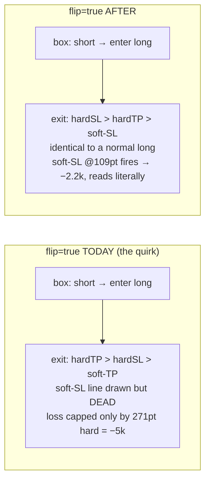

# Flip semantics → "reverse entry only" (design)

**Date:** 2026-06-22
**Status:** approved (design) — pending spec review → implementation plan
**Workstream task:** #252

---

## 0. Problem (in the user's words)

> "I got a short and entered long, but the take-profit and stop-loss concepts should appear with the
> same logic for me as a logs reader. I don't want to think 'oh this is reversed so I have to do X to
> understand the logs correctly.' Now I see one stop loss of −5k which is impossible logically for the
> watcher eye."

A log-audit (task #251) traced this to the `flip` parameter's exit semantics. Today `flip=True` does **two**
things: (1) reverses the entry direction, **and** (2) swaps the exit logic so "soft" moves to the
take-profit side — leaving the **soft stop-loss line drawn on the chart but never enforced**. The only
real loss cap in flip mode is the hard stop (L2 champion: 271 pt = **−$5,429**), which is the "impossible
−5k" a reader sees after price visibly sailed through the 109-pt soft line that did nothing.

This was **documented, intended behavior** (`docs/VECTORIZATION.md:50`, `WS-I_MEGADOC.md:173`: *"flip:
TP/SL priority swapped, soft on the TP side"*) — the engine is faithfully executing the coded rule. The
decision (user-approved) is to **change that rule**, not just relabel the display.

## 1. The change

**`flip` becomes "reverse the entry direction, full stop."** After reversal, a flipped trade runs the
**identical exit logic as a normal trade** in its entered direction:

```
ALL trades (flip or not):  hard-SL  >  hard-TP  >  soft-SL      (soft-TP inactive, as in normal mode today)
```

The "soft swaps to the TP side in flip mode" behavior is **deleted**. A flipped-into-long trade then has
soft-SL + hard-SL below entry and TP above — exactly like a real long. No mental reversal anywhere.



### Equivalence guarantee (the invariant)

After the change:

```
flip=True  on signal S   ≡   flip=False  on the reversed signal ¬S
```

byte-for-byte (same trades, same exit reasons, same fills) — in **both** `engine.py` and
`optimize/fast_engine.py`. This is the core regression test (§4).

## 2. Implementation approach

Three options were considered; **Option 1 is chosen** (smallest, safest diff):

- **Option 1 — collapse to one exit path (CHOSEN).** Keep the entry reversal (`engine.py:411` signal
  swap; `fast_engine.py:80` `d = -raw if flip else raw`). **Delete the separate flip exit-branch** so the
  single normal exit path runs for every trade regardless of `flip`. `soft-TP` stays vestigial/inactive
  exactly as it already is in normal mode — no removal, no scope creep.
- Option 2 — keep two branches, swap `soft-TP`→`soft-SL` inside the flip branch. Same result, but retains
  pointless dead branch. Rejected.
- Option 3 — reverse the signal array upstream of the engine so the engine never sees `flip`. Cleaner in
  theory but disturbs signal plumbing and the recorded trade direction; more consumers at risk. Rejected.

### Exact edit sites

| File | Site | Edit |
|---|---|---|
| `engine.py` | 319–362 | Remove the `if not flip / else` split; run the normal long/short exit logic (current 319–340) unconditionally for the entered direction. Delete the flip branch (342–362). |
| `engine.py` | 411 | **Keep** — entry direction reversal stays. |
| `engine.py` | 512–516 | **Keep** — all 4 lines still computed & stored (`soft-TP` simply stays unused, as today in normal mode). `flip` still stored in the trade dict. |
| `optimize/fast_engine.py` | 80 | **Keep** — `d = -raw if flip else raw`. |
| `optimize/fast_engine.py` | 109,113 | `soft_breach` always uses `sls_line` (soft-SL); drop the `if not flip` conditional. |
| `optimize/fast_engine.py` | 122,125 | `order` always `[(t_slh,R_SL_HARD), (t_tph,R_TP_HARD), (t_soft,R_SL_SOFT)]`; drop the flip branch. |

`strategy.py` (266/339/351), `two_stage.py` (flip search dimension), `presets.py`, `config.py`, the
frontend flip selectors, and the trade-dict `flip` field **all stay** — `flip` remains a real,
meaningful knob (entry reversal); only its *exit* effect changes.

## 3. Blast radius / what moves

| Surface | Effect |
|---|---|
| **L1 lean champion** (`flip=false`; $149,989 / 255 / $15,491 DD) | **Byte-identical — untouched.** Never used the flip branch. Anchor stays. |
| **L2 champion** (`l2v1_4h_champion.json`, `flip=true`; $78,391 / 80 / $8,961) | **Changes** → anchor retired, replaced after re-opt (§5). |
| **Combined** ($228,380 / 335 / $20,303) | **Changes** (depends on L2) → retired, replaced. |
| **WS-I 1h & 2h champions** (`wsi_champions_full.json`, `flip=true`) | Stored stats go **stale** → regenerate or mark stale. Not in active anchors. Flagged side-effect, not blocking. |
| `two_stage.py` flip dimension `[False,True]` | Still valid; re-opt explores both. |
| `engine↔fast` parity (flip case in `test_fast_parity.py`) | Both engines change together → compares to each other, not hardcoded → stays green. |

## 4. Test strategy (TDD)

1. **Keep green — L1 parity anchor** (`optimize/l2/test_parity_anchor.py`: 149989 / 15491 / 255). Proves
   normal mode is untouched. This is the guard that the change is surgical.
2. **New invariant test (write first, RED→GREEN):** for a representative signal series + params,
   assert `flip=True(S)` produces trades identical to `flip=False(¬S)` — in **both** engines. Lives next
   to `test_fast_parity.py`.
3. **Retire** the flip-dependent anchors in `test_parity_anchor.py` — L2 (78391 / 8961 / 80) and combined
   (228380 / 20303 / 335). They encode the quirk and will (correctly) break. Re-lock with the new
   champion's numbers after §5. Until then, mark them `xfail`/skip with a clear reason pointing here.
4. `test_fast_parity.py` flip case stays green (engine↔fast consistency).
5. `test_two_stage.py` — confirm the flip search dimension still runs.

## 5. Re-optimization (user choice: **b — re-run optimizer**)

After the engine change lands and tests are green:

- Re-run the L2 optimizer under the clean semantics, **fresh prefix `l2v2`** (per the optimizer's
  "new prefix for fresh runs" rule), on the AMD/Postgres optimizer (`wsh-pg`).
- Produce a new L2 champion (`l2v2_4h_champion.json`) → write the new L2 + combined parity anchors.
- This is a **separate heavy step**, teed up but not auto-launched in the implementation of §1–§4.

## 6. Frontend / docs

- **Chart lines: no change needed.** `sl_soft` (orange) becomes enforced, so it stops lying. Exit reasons
  read literally: `STOP_LOSS_SOFT` / `STOP_LOSS_HARD` / `TAKE_PROFIT_HARD`; no more `TAKE_PROFIT_SOFT`.
- **"Entry flipped" badge (user approved: SHOW it).** When `flip=true`, render a small badge in the run
  header / per-trade marker indicating the entry was reversed from the box signal (so the reader knows the
  box said the opposite, without having to reason about exit mechanics). The display continues to show the
  **entered** direction everywhere (already the case).
- **Docs:** update `docs/VECTORIZATION.md:50` and `docs/WS-I_MEGADOC.md:173` ("soft on the TP side" → the
  new rule), refresh `MASTER.md` dictionary entry for `flip`, and write the audit/design trail (this doc +
  a short REPORT under `optimize/l2/`).

## 7. Out of scope (YAGNI)

- No change to the 4-line model in `engine.py` (soft-TP stays computed-but-unused, as today in normal
  mode). No new soft-TP feature.
- No change to L1, to the box/Stage-1 signal logic, to indicators, or to the vol-gate / dd-breaker.
- WS-I 1h/2h stat regeneration is flagged, not performed, in §1–§4.

## 8. Order of operations

1. Write the failing invariant test (§4.2) → RED.
2. Edit `engine.py` then `fast_engine.py` (§2) → invariant GREEN, L1 anchor GREEN, engine↔fast GREEN.
3. Retire/xfail the flip-dependent anchors (§4.3).
4. Frontend badge + docs (§6).
5. Commit + push to `dev`.
6. (Separate) Re-optimize `l2v2` → new champion → re-lock L2 + combined anchors (§5).
