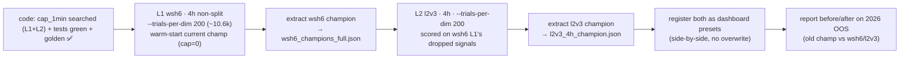

# Optimizer cap_1min Search + wsh6/l2v3 Run — Design Spec

**Date:** 2026-06-25 · **Status:** approved (brainstorm)

## Goal

Add `cap_1min` (max-hold in traded 1-min bars — the "bars" exit cap) as a **searched dimension** in the
optimizer (L1 + L2), then run a fresh **L1 round (`wsh6`)** and a **L2 round (`l2v3`)** on **4h, non-split**,
to find the hold-time that lifts PnL / shrinks DD. The resulting champions are exposed as **new
dashboard-selectable presets side-by-side** with the current ones — **nothing is overwritten**, the
frozen production L1/L2 and the golden/anchor locks stay intact.

## Decisions (locked during brainstorm)

1. **Trials: double** the per-dim budget (`--trials-per-dim 200` ≈ 10.6k L1 trials). Square is
   computationally infeasible (~28M).
2. **`cap_1min` search range:** `int 0..1440` (0 = off, up to ~1 trading day of 1-min bars).
3. **Cap mode:** search **`bars` only** (`cap_1min`; `cap_mode` stays `bars` when `cap_1min>0`, else
   `none`). End-of-day mode is NOT searched.
4. **Timeframe:** **4h only**, **non-split** SL/TP (matches the production wsh4-style champion).
5. **Execution:** launched on the remote **AMD/Postgres (`wsh-pg`)** fleet via `remote_wsi.sh`.
6. **Side-by-side, never overwrite:** `wsh6`/`l2v3` champions are saved to their own result files and
   registered as **importable dashboard presets**. Production defaults and frozen anchors are untouched;
   `perf/check_golden.py` stays ✅. Swapping a production default later is a separate explicit decision.

## Current system (from the optimizer map)

`docs/OPTIMIZER_MAP.md` has the full chart. Key seams (file:line):
- Search space `objective` (`optimizer.py:308-330`); dimension count `search_dims` (`:128-137`);
  trial budget `recommended_trials = dims × 100` (`:140`); warm-start `_native_seed`/`warm_start_seeds`
  (`:209-275`); NSGA-III, 3 objectives (median fold PnL ↑ / −worst DD / median win-rate),
  constraint `full_DD ≤ 0.25·full_PnL`.
- The missing engine wire: `core.py backtest_metrics` does NOT pass `cap_1min` to `fast_backtest`
  (the engine already accepts it — from the time-cap work).
- L2 search `l2/optimize.py suggest_l2_params`; L2 scored on L1's dropped signals; reads the frozen L1.

## Components

1. **`optimize/optimizer.py`** — `objective`: `cap_1min = trial.suggest_int("cap_1min", 0, 1440)`; add
   `cap_1min` to the params dict. `search_dims`: `base_int` 2→3 (so the plan/budget counts it).
   `_native_seed`: read `box.get("cap_1min", 0)`, clamp to `[0,1440]` (champion warm-start, default 0 →
   prior champion reproduces exactly). `CAP_1MIN_MAX = 1440` module constant.
2. **`optimize/core.py`** — `backtest_metrics`: `cap_1min = int(params.get("cap_1min", 0))`, pass
   `cap_1min=cap_1min` into the `fast_backtest(...)` call (the missing wire). `cap_mode` defaults so a
   bare `cap_1min>0` acts as `bars` (already normalised in `fast_backtest`).
3. **`optimize/l2/optimize.py`** — `suggest_l2_params`: mirror `cap_1min = trial.suggest_int(...)` so L2
   searches it too.
4. **L2-against-candidate-L1 wiring** — the L2 round must score on the **wsh6** L1's residuals, NOT the
   frozen production L1. Pass the wsh6 L1 params as an L1 override to the L2 study (the L2 optimizer
   already has a frozen-L1 read via `run_l1_cached`; add/-use an L1-params override path so the run uses
   the candidate without rewriting `wsh_lean_4h_champion.json`).
5. **Preset registration** — export `wsh6`/`l2v3` champions to their own result files
   (`optimize/results/wsh6_champions_full.json`, `l2v3_4h_champion.json`) and register them as importable
   presets (`presets.py` — the same path that lists the existing one-click champions), so they appear as
   selectable options in the dashboard alongside the current ones.
6. **Tests** — a trial's params include `cap_1min` and it reaches `fast_backtest` (a capped trial yields
   `TIME_CAP` exits); `search_dims()["total"]` increases by 1 and `recommended_trials` reflects it;
   existing optimizer + `test_fast_parity` + golden suites stay green (default cap=0 path unchanged).

## Run plan (executed on the remote fleet)

Launch via `remote_wsi.sh` (reports the plan + asks acceptance; watchdog loop to the trial target);
fresh prefixes `wsh6` / `l2v3` per the no-mix rule; storage on `wsh-pg` Postgres.

## Testing & gates

- New unit tests (above) + the existing optimizer suite.
- `perf/check_golden.py` ✅ ALL MATCH (cap-default path unchanged; no production file touched).
- After the run: a before/after report (current champion vs `wsh6`/`l2v3`) on full + 2026 OOS, and a
  dashboard check that both presets load and run.

## Out of scope (YAGNI)

- No production-default swap (separate explicit decision after reviewing results).
- No all-TF sweep (4h only this round).
- No end-of-day mode in the search (bars cap only).
- No bundle port.
