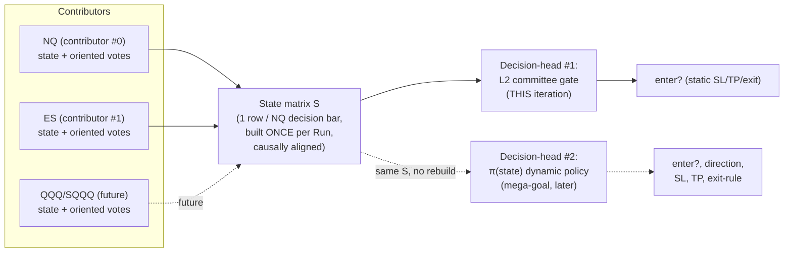
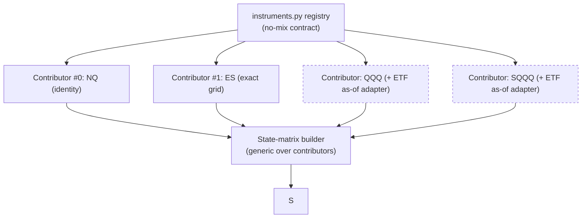
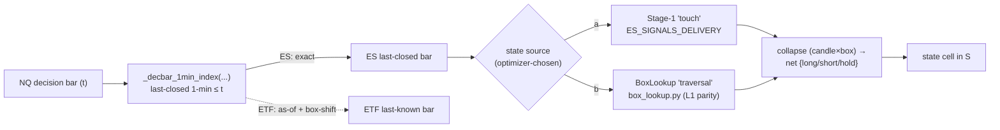
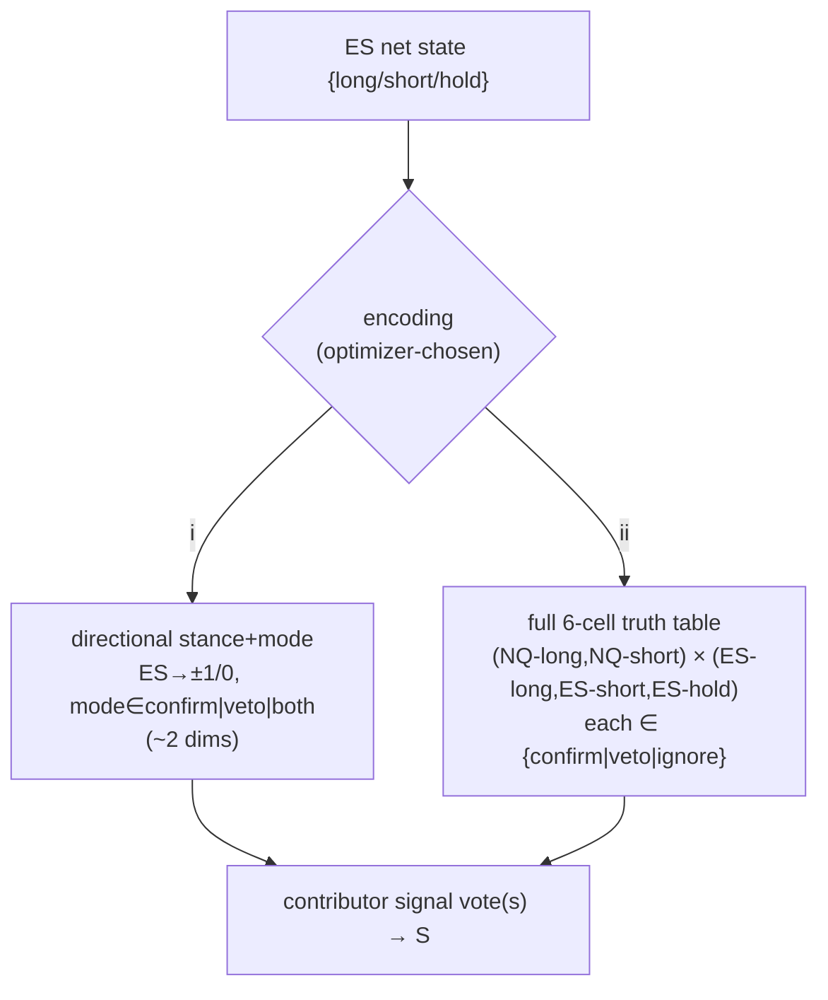
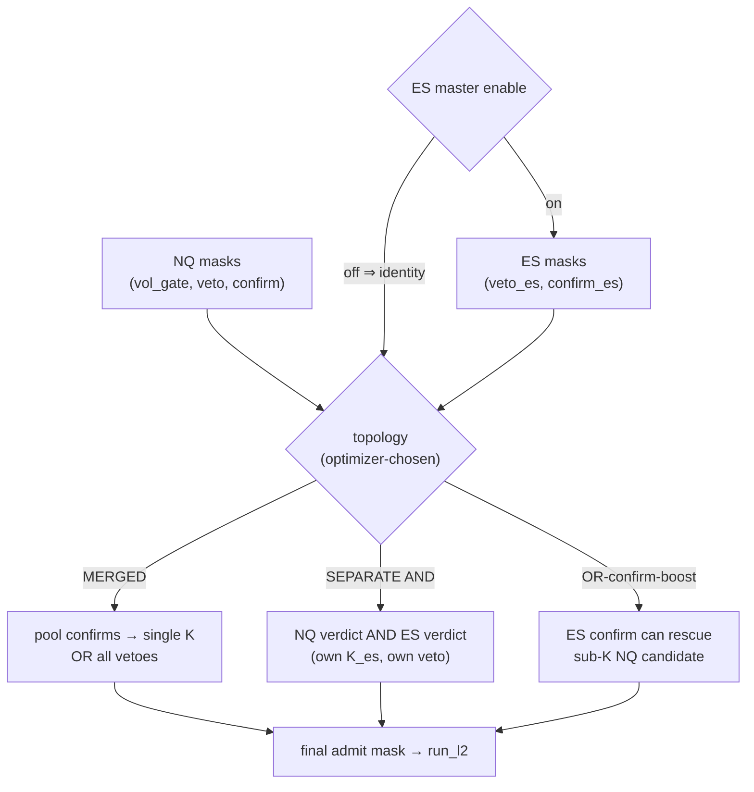
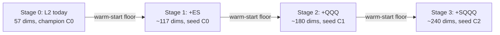
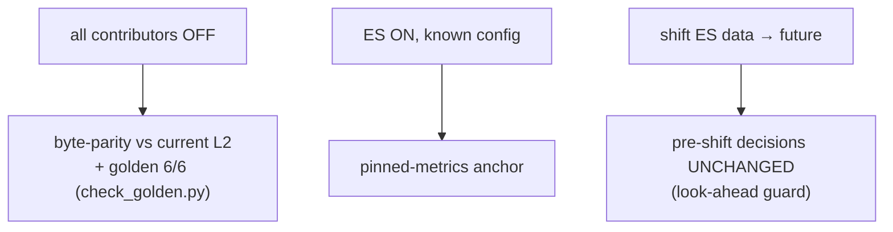
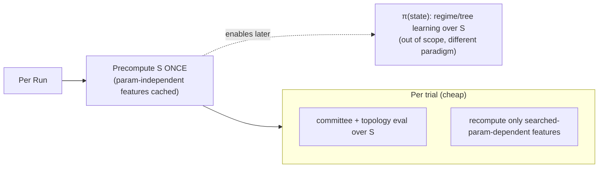
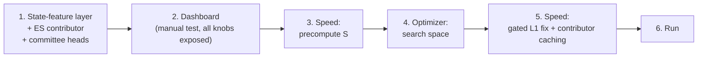
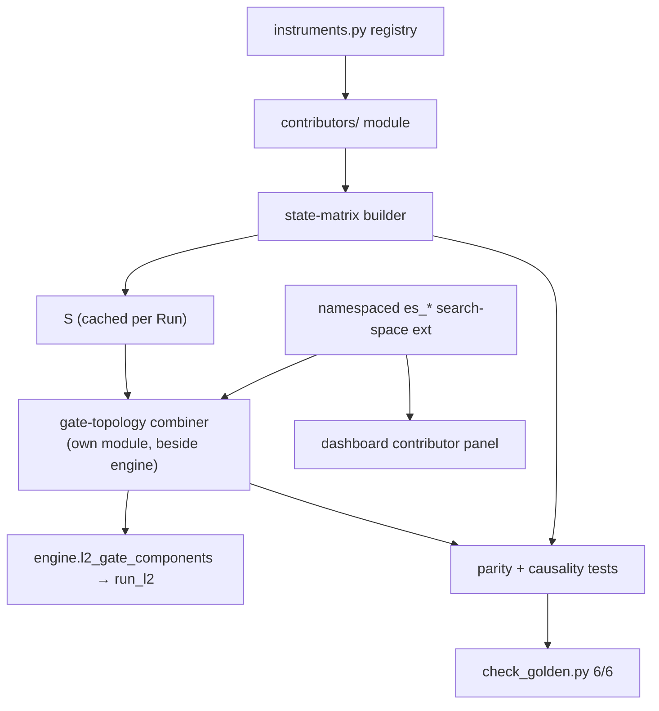

# Cross-Instrument L2 State-Feature Layer (ES = contributor #1)

> **Document type:** Design spec (brainstorming output, pre-implementation-plan).
> **Status:** Design locked, ready for plan-writing.
> **Date:** 2026-06-26
> **Scope of this iteration:** Build the *substrate* that lets external instruments contribute their signal + indicators into NQ's **Layer-2 (L2)** decision only. **L1 is untouched.**
> **Not in scope this iteration:** the dynamic per-state policy (see §1, the mega-goal) — but the architecture here must not dead-end it.

This is a precise, self-contained design document. Every section is intended to be readable without the original session. Diagrams are Mermaid (never ASCII). Nothing here is committed to git as part of this write.

---

## 1. Goal & context

### 1.1 This iteration (what we are actually building)

Let an **external instrument** contribute its own **signal + indicators** into NQ's **Layer-2 (L2)** decision-making, with the explicit objective of **increasing the number of profitable entries** that L2 admits. The first contributor is **ES** (E-mini S&P 500). The change is confined to **L2 only** — L1 (the primary NQ signal extraction + first-layer gate) is **not** modified in any way.

The intuition: NQ and ES are tightly correlated CME index futures. When ES's own state and indicator committee *agree* with an NQ L2 candidate, that candidate is more likely to be a profitable entry; when ES *disagrees*, the candidate is more likely to be noise. Today L2 only ever looks at NQ-derived information. This iteration gives L2 a second (and eventually third, fourth …) pair of eyes.

### 1.2 The mega-goal (POST-project — NOT this iteration)

The long-horizon target is a **state-conditioned dynamic policy**:

```
π(state) → { enter?, direction, SL, TP, exit-rule }
```

— a policy that enters **nearly every signal**, but makes **per-state decisions**: for *this* market state, choose whether to enter, which direction, which stop-loss and take-profit, and which (value- or time-based) exit rule. This **replaces** today's single, static, optimizer-extracted rule (one SL/TP/gate config applied uniformly to every signal).

This iteration does **not** build π. It builds the **substrate** that π will consume: a per-decision-bar **state matrix `S`**. The current L2 committee becomes the *first* decision-head reading `S`; π becomes a *later* head reading the *same* `S` with no rebuild. The architecture must keep that seam open (see §2.2).

### 1.3 Constraints the user set

- **Implementation / refactor effort is NOT a constraint.** This is an independent, extensively documented, git-managed project. Refactor freely; prefer clean isolation over minimal-diff hacks.
- **Optimizer time and system efficiency DO matter** — but *days* of optimizing are acceptable in exchange for a large PnL gain. Worked example the user gave: spending **3 days of optimization to go from ~150k → ~500k** PnL is a great trade. So: be efficient, cache aggressively, but do not contort the design to shave hours.

---

## 2. The state-feature layer (the backbone)

### 2.1 What `S` is

`S` is a **per-NQ-decision-bar state matrix**. One row per NQ L2 decision bar (the bars at which L2 is asked "admit this entry or not?"). Columns are **features contributed by every instrument**:

- **NQ as contributor #0** — its own indicators' oriented votes + its categorical state.
- **Each external contributor** (ES = #1, later QQQ/SQQQ …) — for each: that instrument's indicators' **oriented votes** and the instrument's **categorical state** (`long` / `short` / `hold`).

Concretely, each contributor adds to every row:
- one **state cell** — the contributor's net categorical state for that NQ decision bar, and
- one **oriented vote cell per enabled indicator** — each indicator's `±1 / 0` vote, oriented to NQ's box direction (see §5b).

`S` is built **ONCE per Run**, **causally aligned** to NQ decision bars (every contributor cell uses only information available at or before that NQ bar's close — see §4 / §8). It is the single shared artifact that every decision-head reads.

### 2.2 Decision-heads on `S` (the forward-compat seam — stated explicitly)

The current L2 committee is **decision-head #1** reading `S`. The future π(state) policy is **decision-head #2** on the **same** `S`. There is no rebuild of `S` between them — that is the whole point of factoring `S` out as a standalone artifact.



**Design rule:** nothing in head #1 may assume it is the *only* consumer of `S`. `S` is computed and owned independently of the gate.

---

## 3. Contributor abstraction + registry (the STANDARD for QQQ/SQQQ)

### 3.1 The `Contributor` abstraction

A contributor is a small, declarative bundle:

```
Contributor(
    token,            # instrument identifier (e.g. "ES", "QQQ", "SQQQ")
    candle_src,       # where to load this instrument's OHLCV bars
    box_src,          # where to load / how to recompute this instrument's boxes
    align_adapter,    # how to map this instrument's bars onto NQ decision bars
)
```

The set of contributors is **registry-driven** through `subprojects/all-stocks-signals/instruments.py` — the existing **no-mix contract** (the module that already guarantees instruments' data are never accidentally crossed). Contributors are *declared* there, not hard-coded into the gate.

### 3.2 The three concrete contributors

| Contributor | Token | Venue | Alignment | Notes |
|---|---|---|---|---|
| **#0** | NQ | CME | identity (it *is* the decision grid) | the host instrument |
| **#1** | ES | CME | **exact / drop-in** | grid byte-identical to NQ — **verified 2,120 4h bars, 0 mismatches**, same `hour>=18` roll rule → no adapter needed beyond identity |
| future | QQQ, SQQQ | ETF (different exchange) | **as-of adapter** | different RTH/ETH sessions, calendar roll; needs one-business-day box-shift via `isolated_etf_box_shift.py` |

**ES is the clean first case precisely because its 4h grid is identical to NQ's** (same bar boundaries, same `hour>=18` → next-session roll). That makes ES a *drop-in* contributor: the alignment is exact, so ES exercises the *whole* contributor pipeline (registry → state → votes → gate) without the complexity of session/calendar mismatch. ETFs then add **only** the alignment adapter on top of an already-proven pipeline.

### 3.3 The standard: adding a future contributor

Adding QQQ/SQQQ (or anything else) is:
1. a **registry entry** in `instruments.py`, plus
2. (for ETFs only) an **alignment adapter** (the as-of join + one-business-day box-shift).

**ZERO gate-logic change.** The gate combiner (§6) iterates contributors generically; it never names ES. This is the explicit "standard for QQQ/SQQQ" the user asked for.



---

## 4. Alignment + state definition

### 4.1 Alignment seam

The single alignment chokepoint lives in `indicators/runner.py`:

```
_decbar_1min_index(NQ_dec_dates, contrib_1min_dates, bar_td)
```

For each NQ decision bar it returns the contributor's **last-closed 1-min candle** as of that NQ bar — **causal, no look-ahead** by construction (we only ever index a bar whose close `≤` the NQ decision bar's close).

- **ES** (identical grid): the mapping is **exact** — each NQ bar has a precisely coincident ES bar.
- **ETFs** (QQQ/SQQQ): **as-of** — the last-known contributor bar with close `≤` the NQ bar close (plus the one-business-day box-shift from the ETF adapter).

### 4.2 State definition — OPTIMIZER-CHOSEN between two sources

The contributor's **categorical state** for a decision bar can be derived two ways, and **which one is used is an optimizer choice** (searchable switch), not a hard-coded decision:

- **(a) Delivered Stage-1 'touch' signal** — read directly from the contributor's `ES_SIGNALS_DELIVERY` (the pre-exported Stage-1 touch signal).
- **(b) Recomputed 'traversal' state via BoxLookup** — recompute from the contributor's boxes using `src/strategy/box_lookup.py`, at **parity with NQ's L1** logic.

In both cases, the raw per-`(candle × box)` rows **collapse to a single net state** `{long / short / hold}` per decision bar — **mirroring L1's collapse-to-one-entry-per-candle** rule. (The collapse is what makes the contributor's state a single clean cell in `S`, exactly like NQ's own L1 state.)

The two definitions can produce **materially different** ES states (touch vs traversal answer different questions). **Letting the optimizer pick is intentional** — see §12.

### 4.3 ES data paths (cited)

- Stage-1 delivered signal: `ES_SIGNALS_DELIVERY/`
- Candles: `ALL_STOCKS/CANDLES/CME/ES_Continuous_Data/ES_<TF>.csv`
- Boxes: `ALL_STOCKS/BOXS/CME/ES/ES_full_data.csv`



---

## 5. Contributor voter set (BOTH channels — optimizer-gated)

The user wants **both** of the following channels available; the optimizer decides how much (if any) of each to use.

### 5a. Composite signal voter — BOTH encodings searchable

The contributor's **categorical state** (`§4`) feeds a signal voter. **Both encodings are implemented and searchable; the optimizer chooses** which (or neither):

- **(i) Directional stance + mode (~2 dims):** map ES-state → `±1 / 0`, with `mode ∈ {confirm | veto | both}`. Compact, cheap, low-dimensional. Reuses `votes.stance_directions`.
- **(ii) FULL 6-cell truth table:** an independent `{confirm | veto | ignore}` decision for **each** combination of `(NQ-long, NQ-short) × (ES-long, ES-short, ES-hold)` = 6 cells. Maximally expressive; lets the optimizer learn asymmetric interactions (e.g. "ES-hold vetoes NQ-short but is ignored for NQ-long").

Both reuse the existing orientation machinery: `base.Indicator.vote` orientation logic (`base.py:86-103`) and `votes.stance_directions`.



### 5b. Indicator committee — the full 18-indicator registry on the contributor's bars

The **entire 18-indicator registry** (`indicators/library.py`) is computed on the **contributor's own bars** via the **instrument-agnostic** `MarketContext` (`runner.market_context`). These are searchable **exactly like NQ's L2 indicators**: per indicator an enable flag `en_<key>` + its params (+ optionally a per-indicator `mode`). Every contributor indicator vote is **oriented to NQ's `box_dir`** so that a `+1` always means "agrees with the NQ entry direction," regardless of the contributor.

This is the channel that gives ES its own committee, identical in spirit to NQ's L2 committee but computed on ES data.

---

## 6. Gate combination — optimizer-chosen topology

### 6.1 Today's gate (the chokepoint)

In `optimize/l2/engine.py`:

```
l2_gate_components  (lines 24-48)  →  _l2_gate_masks (51-54)  →  run_l2
```

Today the gate is a single fixed formula:

```
admit = vol_gate  &  ~veto  &  (confirm >= K)
```

### 6.2 The extension — search the *topology*

We extend the gate so the **optimizer searches the topology** that combines **NQ's masks** with **each enabled contributor's masks**. Topology options:

- **MERGED** — pool all confirms (NQ + contributors) into **one** count with a single `K`; **OR** all vetoes together. One big committee.
- **SEPARATE AND-gate** — the contributor has its **own** `K_es` and its **own** veto; the contributor's verdict is **ANDed** with NQ's verdict. Two independent committees that must both pass.
- **OR-confirm-boost** — a strong contributor confirm can **rescue** an NQ candidate that fell just short of NQ's `K` (confirms OR'd in).

**Per-contributor master enable:** each contributor has a master on/off. **Disabled ⇒ identity ⇒ no effect** on the gate (this is what guarantees §8's parity invariant). Within any committee: **veto stays any-OR** (any veto kills), **confirm stays K-of-N**.



**Invariant restated:** with every contributor's master enable OFF, the topology collapses to today's exact `vol_gate & ~veto & confirm>=K` — byte-identical (see §8).

---

## 7. Optimizer search space + dimension/budget math

### 7.1 Namespacing

A **namespaced per-contributor** suggestion pass (`es_*`, later `qqq_*`, `sqqq_*`) is added in `optimize/l2/optimize.py` `suggest_l2_params` (lines 36-52), **mirroring** `OPT._suggest_indicators` (`optimizer.py:56-72`). Each contributor's knobs are prefixed so they never collide and can be enabled/disabled as a block.

Current L2 search space = **57 dims**.

### 7.2 Dimension accounting (per contributor)

| Block | Dims |
|---|---|
| Indicator committee (18 on/off + ~30 params) | ~48 |
| Composite signal table (6-cell + encoding switch) | ~6 |
| Encodings / topology / state-source switches | ~6 |
| **Per contributor total** | **≈ +60** |

Roll-up:

| Configuration | Approx dims | Budget @ TRIALS_PER_DIM=100 |
|---|---|---|
| L2 today | 57 | ~5.7k |
| L2 + ES | **≈ 117** | **~11.7k** |
| L2 + ES + QQQ + SQQQ | **≈ 240** | **~24k** |

Budget = `dims × 100` (`TRIALS_PER_DIM`, `optimizer.py:125`).

### 7.3 Staged search (the efficiency lever)

Do **not** enable all contributors at once. **Enable contributors incrementally, warm-starting each stage** from the previous stage's champion. Because **warm-start is a floor** (a warm-started run is guaranteed `≥` the seeded champion — the established pattern), each added contributor can only help or be ignored, never regress the baseline. Stage order: `L2(today) → +ES → +QQQ → +SQQQ`.

Reference `docs/PERFORMANCE.md` for the dimensionality ↔ trials ↔ wall-clock trade-off curve when picking per-stage budgets.



---

## 8. Causality & golden-parity safety invariant (NON-NEGOTIABLE)

### 8.1 The invariant

**With ALL contributors disabled, the system is byte-identical to today's L2.** The golden gate must still pass **6/6** (`perf/check_golden.py`). The entire contributor block is **purely additive**: disabled contributors are identity in the gate (§6.2), contribute no columns that affect any decision, and add no code path to the all-off execution.

### 8.2 Causality

Alignment is **causal by construction** — `_decbar_1min_index` only ever returns a contributor bar whose close `≤` the NQ decision bar's close (last-closed). No contributor cell can encode future information.

### 8.3 New tests

1. **Contributor-OFF byte-parity** — all contributors disabled ⇒ outputs byte-identical to current L2 (and golden 6/6 unchanged).
2. **ES-ON anchor** — a *known* ES-enabled config with its metrics pinned (regression anchor for the ES path).
3. **Look-ahead guard** — shifting ES data **forward** in time must **not** change any pre-shift decision. (If it does, alignment leaked the future.)



---

## 9. Speed & efficiency plan

- **Precompute `S` ONCE per Run.** All param-*independent* features (alignment indices, raw contributor states, base indicator series) are computed once and cached. Per-trial work is then only: committee/topology evaluation over the cached `S` (cheap, vectorized) **plus** recompute of the small set of features that actually depend on the trial's searched params.
- **Compounds with the gated candidate-L1 speed fix** (task #1, post-l2v4) — the two optimizations stack.
- **Per-trial cost scales with the number of *active* contributors' indicator computes.** The precompute + caching keep this bounded; an inactive contributor costs ~nothing.
- **Mega-goal note:** the eventual π(state) policy will likely want a **different search paradigm** (regime / tree learning over `S`) rather than Optuna-style param search. That is **out of scope here**, but factoring `S` as a standalone cached artifact is exactly what makes that future paradigm cheap to bolt on.



---

## 10. Build sequence (the user's order)

The user fixed this order. Each step gets its **own** plan later.



1. **State-feature layer + ES contributor + committee heads** — build `S`, the ES contributor, both voter channels, the gate topology.
2. **Dashboard** — expose **every** knob for manual testing before any optimization.
3. **Speed: precompute `S`** — make the Run-level cache real.
4. **Optimizer: search space** — namespaced `es_*` suggestion pass + topology search.
5. **Speed: gated L1 fix + contributor caching** — stack the two perf wins.
6. **Run** — the staged search (§7.3).

---

## 11. Components & interfaces (isolation/clarity)

New/changed units, each with responsibility / how used / dependencies. **Design constraint:** `engine.l2_gate_components` will grow — **keep contributor logic in its own module** so the engine chokepoint stays readable.

| Unit | Responsibility (what it does) | How used | Depends on |
|---|---|---|---|
| **`contributors/` module** (new) | Houses the `Contributor` abstraction, registry adapters, alignment glue, and state-definition (touch vs traversal). Generic over instruments; never names ES. | Imported by the state-matrix builder and the gate combiner. | `instruments.py` (no-mix registry), `box_lookup.py`, `ES_SIGNALS_DELIVERY`, ETF adapter (`isolated_etf_box_shift.py`). |
| **State-matrix builder** (new) | Builds `S` ONCE per Run: aligns each contributor to NQ decision bars, collapses to net state, computes oriented votes, caches param-independent features. | Produces the single `S` consumed by all decision-heads. | `contributors/`, `runner._decbar_1min_index`, `runner.market_context`, `indicators/library.py`, `base.Indicator.vote`. |
| **Gate-topology combiner** (new, lives near engine) | Combines NQ masks with each enabled contributor's masks under the optimizer-chosen topology (MERGED / SEPARATE-AND / OR-boost); per-contributor identity-when-disabled. | Called inside `engine` between `_l2_gate_masks` and `run_l2`. | `engine.l2_gate_components`, contributor masks from `S`. |
| **Namespaced search-space extension** (changed) | Adds `es_*` (later `qqq_*`/`sqqq_*`) suggestion blocks for committee + signal table + encodings + topology + state-source switches. | Invoked by `suggest_l2_params`. | `optimize/l2/optimize.py:36-52`, mirrors `optimizer.py:56-72`. |
| **Dashboard contributor panel** (new) | Exposes every contributor knob (enable, state-source, encoding, committee toggles/params, topology) for manual testing. | Manual verification before optimization (build step 2). | the gate combiner + search-space schema (shared knob definitions). |
| **Parity / causality tests** (new) | The three guards of §8.3 (OFF byte-parity + golden 6/6, ES-ON anchor, look-ahead guard). | CI / `check_golden.py` gate. | `perf/check_golden.py`, the builder + combiner. |



---

## 12. Open questions / risks

- **Overfitting at ~117–240 dims.** The biggest risk. Mitigations: (1) a **feasibility constraint** on the search; (2) an **OOS holdout**; (3) the **staged search** (§7.3) so dimensionality grows only when it pays. **Cite the l2v3 overfit lesson** — high-dimensional L2 search has already burned us once; treat OOS as mandatory, not optional.
- **ETF alignment correctness.** The as-of join + one-business-day box-shift has edge cases (session boundaries, holidays, calendar roll). ES (exact grid) sidesteps this; QQQ/SQQQ must validate the adapter carefully before trusting their states.
- **Touch-vs-traversal divergence.** The two state definitions (§4.2) can produce **very different** ES states. This is **documented as intentional** — letting the optimizer choose the state source is a deliberate degree of freedom, not an ambiguity to resolve up front.

---

## Decisions locked

| # | Decision | Locked choice |
|---|---|---|
| 1 | Scope | **L2 only**; L1 untouched |
| 2 | Mega-goal | π(state) policy is **later**; this iteration ships the `S` substrate; seam kept open |
| 3 | Effort vs PnL | refactor effort **not** a constraint; days of opt acceptable for big PnL |
| 4 | First contributor | **ES** (CME, exact grid — 2,120 bars / 0 mismatches verified) |
| 5 | Abstraction | `Contributor(token, candle_src, box_src, align_adapter)`, registry-driven via `instruments.py` |
| 6 | Future contributors | registry entry (+ ETF adapter) = **zero gate-logic change** |
| 7 | Alignment | `_decbar_1min_index` last-closed bar; ES exact, ETF as-of |
| 8 | State source | **optimizer-chosen**: touch (delivery) **vs** traversal (BoxLookup, L1 parity) |
| 9 | Signal voter | **BOTH** encodings searchable: stance+mode **and** full 6-cell truth table |
| 10 | Indicator committee | full **18-indicator** registry on contributor bars, oriented to NQ box_dir |
| 11 | Gate topology | **optimizer-chosen**: MERGED \| SEPARATE-AND \| OR-confirm-boost; per-contributor identity-when-off |
| 12 | Search space | namespaced `es_*`; ~117 dims (ES) → ~240 (3 contributors); staged warm-start |
| 13 | Safety invariant | all-OFF ⇒ **byte-identical** to today's L2; golden **6/6** must hold; purely additive |
| 14 | Speed | precompute `S` once/Run + cache; compounds with gated L1 fix |
| 15 | Build order | layer+ES → dashboard → speed(S) → optimizer → speed(gated+caching) → run |

---

## Next: writing-plans

This is the design spec. Each step of the build sequence (§10) gets its **own** implementation plan, written later via the writing-plans workflow — starting with **Step 1 (state-feature layer + ES contributor + committee heads)**. No code is written and nothing is git-committed as part of this spec.
