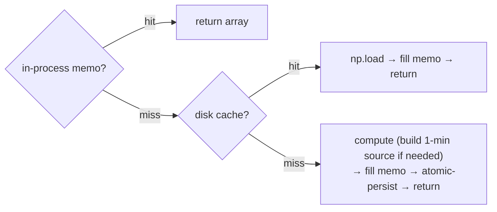

# Disk-persistent indicator-vote cache — design

**Date:** 2026-06-28
**Status:** approved (design), pending implementation plan
**Related:** `optimize/core.py` + `optimize/l2/engine.py` (the in-process vote memos from commit `c0db7f7`),
`PERFORMANCE.md` §4.4 (the candidate-L1 disk cache this mirrors) + §7.4 (the memoization that fixed the fleet
slowdown) + §9 (the cold `ifvg`/`breaker` cost this targets).

## 1. Goal & motivation

Item 1's in-process memoization (`c0db7f7`) caches each indicator's per-decision-bar votes by
`(slice, config)`, so repeats within a worker process are free. But the memo **resets on process exit /
watchdog respawn**, so the expensive cold computes — measured `ifvg` **74.5 s** and `breaker` **25 s** on the
NQ 1-minute frame (§9) — are **re-paid on every respawn and by every fresh worker**. Profiling confirmed the
optimizer is **100% compute-bound** (ask 0% / compute 100% / tell 0%), and that cold-SMC compute is the
dominant remaining cost. This feature **persists the vote cache to disk** so each `(slice, config)` vote is
computed **once ever** and shared across all workers and respawns — turning the cold-SMC re-pay into a
one-time cost.

**Scope of benefit (honest):** modest for a single long run with few respawns (item 1 already amortizes
within the process); larger for many short / frequently-respawning sweeps (per-contributor × multi-seed ×
multi-TF), where the cold re-pay currently recurs.

## 2. Why this and not the alternatives

- **Not the batched-CPU engine** (refuted: workload is compute-bound, overhead ~0.3%, backtest ~5 ms warm).
- **Not vectorizing `ifvg`/`breaker`** (high-risk per-indicator rewrite; a disk cache makes the cold compute
  a one-time cost anyway, so vectorization's only benefit — the first-ever compute — becomes marginal).
- A disk cache is **result-neutral by construction** (stores/reloads the exact array) and reuses the proven
  §4.4 atomic-write pattern, so it is low-risk.

## 3. Architecture

A thin **disk tier behind** the existing in-process memos — `core.py:_VOTE_MEMO` (L1 fold path) and
`engine.py` `l1._l2_vote_memo` (L2 path). Lookup order per indicator config:

The 1-minute source is **not** disk-cached separately: it is only needed on a *vote* miss, and once votes are
on disk the source is rarely rebuilt. (Out of scope; revisit only if measured necessary.)

## 4. The cache key (the parity guard)

`key = (CACHE_VERSION, slice_signature, use_1min, ind.key, mode, params_tuple)`

- `slice_signature` = `(len(d), first_ts, last_ts, len(d1), first_ts1, last_ts1, str(bar_td))` — the same
  content signature item 1 already uses for the in-memory memo (`core._slice_sig`). Uniquely identifies a
  contiguous window of a fixed dataset. **Both call sites compute it the same way, from their frames:** the
  `core.py` L1-fold path uses the per-fold `(d, d1)` window; the `engine.py` L2 path uses the L1's full
  `(l1.df_dec, l1.df1)` frames (the L2 committee always runs on the whole frozen L1). So one `slice_signature`
  helper serves both — the caller just passes its frames.
- `use_1min` = whether the 1-minute source is used (decision-frame vs 1-min indicator mode).
- `ind.key, mode, params_tuple = tuple(sorted(config.params.items()))` — the full indicator config.
- `CACHE_VERSION` = an integer constant **bumped whenever any indicator's vote math changes**. This is the
  one manual invariant; it prevents a stale array (computed by old code) from loading. (Same risk model as
  the §4.2/§4.4 `vf_seed`/version field checks.)

A SHA-256 of the key → the on-disk filename. A dataset change moves the endpoints; a code change bumps the
version; either way a stale hit is impossible.

## 5. Storage & concurrency

- One file per key: `votecache_<sha16>.npy` under the existing disk-cache directory (the same dir + version
  scheme as the L1 caches; configurable via the existing cache-dir resolution).
- **Atomic write** for the cold-launch race (many workers compute the same cold vote at once): write to a
  `NamedTemporaryFile` in the cache dir, then `os.replace` into place (atomic on one filesystem) — a reader
  never sees a half-written file. **Best-effort:** any write/read error is swallowed and falls back to
  compute; the cache never fails the run (mirrors §4.4 exactly).
- Vote arrays are per-decision-bar (~2,119 ints ≈ 2 KB), so files are tiny; no eviction needed.

## 6. Public surface

- `optimize/vote_cache.py` (new, shared helper): `get(key) -> np.ndarray | None`, `put(key, arr) -> None`
  (atomic, best-effort), `make_key(slice_sig, use1, ind) -> tuple`, `CACHE_VERSION`, and a
  `_clear_disk_cache()` + cache-dir override for tests.
- `core.py:_cached_votes` and `engine.py:_committee_votes` consult `vote_cache.get` on a memo miss and
  `vote_cache.put` after a compute. No change to their signatures or to any caller.

## 7. Result-parity & testing (TDD)

**Byte-identical by construction** — the cache stores and reloads the exact computed array; the only failure
mode is staleness, fully closed by the versioned + signature key. Tests:

1. **round-trip identity:** `put` then `get` returns an array `array_equal` to the original.
2. **cross-process reuse (the core case):** compute votes (warming disk), **clear the in-memory memo**, then
   recompute — assert the second pass returns byte-identical votes *and* loaded from disk (no recompute), via
   a tmp cache dir.
3. **key isolation:** different params / different slice / different `CACHE_VERSION` ⇒ distinct keys (no
   collision); a dataset-endpoint change ⇒ a miss (no stale hit).
4. **best-effort safety:** an unwritable cache dir ⇒ silent fallback to compute (no raise).
5. **Golden 6/6 + L2 78 tests** (payload / parity-anchor / contributors) with the disk cache active (tmp dir),
   proving result-neutral on both the L1 and L2 paths.

**Gate:** golden `perf/check_golden.py` 6/6 at every step; tests point the cache at a tmp dir so golden never
reads a stale or cross-run cache.

## 8. Out of scope (YAGNI)

- Caching the 1-minute source (§3) — only the votes.
- Selective/threshold caching — votes are 2 KB, caching all is simpler.
- Eviction / LRU / a central DB — just versioned atomic files.
- The `ifvg`/`breaker` algorithm vectorization (item 4) — a disk cache makes it unnecessary.
- The batched-CPU engine (item 6) — refuted by the compute-bound profile.
