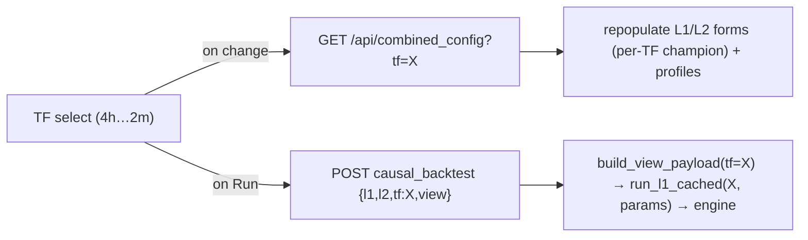

# Dashboard timeframe selector — design

**Date:** 2026-06-29
**Status:** approved (design), pending implementation plan
**Related:** `server.py` (`/api/combined_config`, `/api/causal_backtest`, `/api/backtest_causal`),
`optimize/l2/payload.py` (`l1_default_params`, `build_view_payload`), `optimize/l2/l1_runner.py`
(`_lean_params`), `optimize/results/wsh4_champions_full.json` (per-TF champions), `frontend/dashboard.html`.

## 1. Goal

Let the user pick the decision timeframe in the dashboard (and thus the causal-backtester run) from a dropdown,
instead of the hardcoded `4h`. On switch, the dashboard loads that TF's deployed champion as the L1 default and
runs L1/L2/combined at that TF.

## 2. Current state (what already works vs the gap)

- The backend run path is **already TF-parametric**: `build_view_payload(l1, l2, tf, view)` and
  `run_l1_cached(tf, params=…)` work for any TF (the engine is golden-tested on all 6: 4h/2h/1h/15m/5m/2m).
  `server.py` already reads `body.get("tf","4h")` / `body.get("timeframe","4h")`.
- **The frontend hardcodes `'4h'`** in all three run POSTs and never sends a TF.
- **The L1 *default* is 4h-only:** `l1_default_params(tf)` → `l1_runner._lean_params(tf)` reads the
  4h-only `wsh_lean_4h_champion.json`; for `tf≠4h` it raises `SystemExit`.
- Per-TF champions DO exist: `wsh4_champions_full.json` has `box`+`indicators` for all 6 TFs.
- L2 champions are **4h-only** (`l2v*`), so non-4h L2 has no curated default.

## 3. TF set

The **6 decision TFs**: `4h, 2h, 1h, 15m, 5m, 2m` (the `wsh4` champion set / golden set). `1m` is excluded
(not in the champion sweep). Default = `4h`.

## 4. Architecture

### 4.1 Backend — per-TF L1 default
Factor the champion→engine-params logic (currently inline in `optimize/l2/optimize.py:_l1_params_from_champion`)
into a shared helper, e.g. `payload._champion_layer_params(tf, champ_entry) -> dict`:
`presets._preset(tf, champ_entry["box"], champ_entry.get("indicators", {}))` → set `ind_1min=True` →
`validate_layer_params(...)`.

Extend `payload.l1_default_params(tf)`:
- `tf == "4h"` → **unchanged** (the lean champion). Preserves today's 4h default + keeps the 4h config
  byte-identical.
- else → `_champion_layer_params(tf, wsh4_champions_full.json[tf])`.

`l2_default_params()` stays **tf-agnostic** (the permissive default) — L2 champions are 4h-only, so non-4h L2
starts permissive (accepted).

### 4.2 Backend — `combined_config?tf=`
`/api/combined_config` parses a `tf` query param:
- default `"4h"`; validate against the 6 TFs → **HTTP 400** on an unknown TF.
- return `l1_default_params(tf)`, `l2_default_params()`, the profiles, the (TF-agnostic) `indicator_schema`,
  and a per-TF `l1_label` (`"WS champion {tf}"`; keep the 🍃 lean label for 4h).
- **No `tf` (or `tf=4h`) ⇒ byte-identical to today** (back-compat for any existing caller).

### 4.3 Frontend — selector + wiring (`frontend/dashboard.html`)
- A `<select id="tf_select">` in the top bar with the 6 TFs (default `4h`).
- **On change:** `fetch('/api/combined_config?tf='+tf)` → `setLayer('l1', cfg.l1_default)` +
  `setLayer('l2', cfg.l2_default)` + refresh the L1/L2 profile dropdowns (`fillDropdown`) + `DB.markDirty()` +
  status `"switched to {tf} — click Run"`. (Re-uses the existing config-load code path; factor it into a
  reusable `loadConfig(tf)`.)
- **Run POSTs:** replace the hardcoded `'4h'` in all three —
  `/api/backtest_causal` (`timeframe`), the two `/api/causal_backtest` (`tf`) — with the selected TF
  (`const tf = $('tf_select').value`).
- `collectES()`'s contributor `tf` follows the selected main TF (the ES committee aligns to NQ's decision TF).

## 5. Data flow

## 6. Testing

**Backend:**
1. `l1_default_params("2h")` returns valid params whose box/indicators match `wsh4_champions_full.json["2h"]`;
   same for `15m`/`2m` (a representative few).
2. `l1_default_params("4h")` is **unchanged** (still the lean champion) — byte-identical to current.
3. `combined_config?tf=2h` (via the server TestClient) returns the 2h defaults + label; **no-`tf` ==
   `tf=4h` == current** (back-compat); bad `tf` → 400.
4. A server smoke: `causal_backtest` at `tf=2h` (with the 2h default L1) returns a non-empty trade book.
5. **Golden 6/6** (engine untouched) + the existing server/payload suites green.

**Frontend:** JS parses (node `new Function` check); live smoke — start `server.py`, switch the select to 2h,
confirm the config re-fetch + a Run returns 200 with 2h data.

## 7. Out of scope (YAGNI)
- Per-TF L2 champions (don't exist) — non-4h L2 = permissive.
- Per-TF profile filtering — show all saved profiles regardless of TF.
- `1m` timeframe.
- Any engine change — the run path is already TF-parametric.
