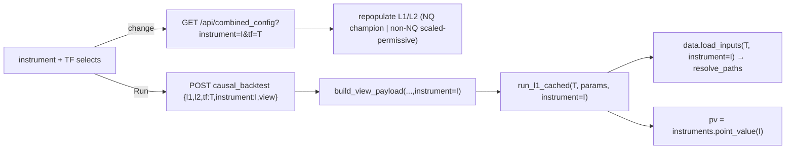

# Multi-instrument selector (NQ / ES) — design

**Date:** 2026-06-29
**Status:** approved (design), pending implementation plan
**Related:** `config.py` (`NQ_POINT_VALUE`, `DATA_ROOT`), `optimize/data.py` (`load_inputs`, `load_box`,
`_RAW`, `_BOX_CSV`), `optimize/l2/l1_runner.py` (`run_l1`, `apply_breaker`, pv), `optimize/l2/engine.py`
(`run_l2`, pv), `optimize/l2/logbook.py` (`run_causal`), `optimize/l2/payload.py` (`run_l1_cached`,
`build_view_payload`, `l1_default_params`, `l2_default_params`, the memo/disk caches), `optimize/vote_cache.py`,
`server.py` (`/api/config`, `/api/combined_config`, `/api/backtest`, `/api/causal_backtest`),
`frontend/dashboard.html`, `frontend/index.html`, and the existing cross-subproject registry
`subprojects/all-stocks-signals/instruments.py` (already consumed by `optimize/l2/contributors/registry.py`).

## 1. Goal

Add an **instrument** dropdown (two tokens: `NQ`, `ES`) to both the backtester (`index.html`) and the combined
dashboard (`dashboard.html`). Selecting an instrument runs the *same* box/L1/L2 engine on **that instrument's
candles + boxes + economics**. The decision-timeframe selector (shipped 2026-06-29) composes with it: the run
is `(instrument, timeframe)`.

**Scope note:** the registry holds 6 tokens (NQ, ES, QQQ-RTH/ETH, SQQQ-RTH/ETH), but this feature exposes only
**NQ and ES** — both CME futures with clean point-value economics; ES is already wired+validated as the L2
cross-instrument contributor. The ETFs are deferred (the design generalizes to them trivially later — add
tokens to `TOKENS` + `POINT_VALUE`).

## 2. Current state — the single-instrument ("NQ") assumption

The engine math is **already instrument-agnostic** (verified): `box_lookup.py`'s 18:00 session roll,
`optimize/signals.decision_signals`, and `optimize/fast_engine.fast_backtest` are pure over *data + params*.
The NQ assumption lives in exactly three places:

1. **Data paths** — `optimize/data.py` hardcodes `NQ_<tf>.csv`, `NQ_1m.csv` (`_RAW / f"NQ_{tf}.csv"`) and
   `_BOX_CSV = config.DATA_ROOT/"full_data"/"NQ_full_data.csv"`. `strategy.py` similarly hardcodes per-year
   `NQ_*` files (only used by the L1-engine `index.html` path).
2. **Economics** — `config.NQ_POINT_VALUE = 20.0`, injected at `l1_runner.py:188` and `engine.py:210`
   (`pv = float(config.NQ_POINT_VALUE)`), and in `presets._preset` (`pv=config.NQ_POINT_VALUE`).
3. **Champions** — NQ-only (`wsh4_champions_full.json`, `wsh_lean_4h_champion.json`); no per-instrument champs.

**Data already exists** for all 6 instruments in NQ-identical schema, under the workspace-root `ALL_STOCKS/`
tree, addressed by the registry in `all-stocks-signals/instruments.py`:
- candles `ALL_STOCKS/CANDLES/.../<prefix>_<tf>.csv` (cols `datetime,open,high,low,close,volume` — verified
  identical to NQ for ES/QQQ/SQQQ), incl. `_1m.csv`;
- boxes `ALL_STOCKS/BOXS/.../<INST>_full_data.csv` (wide `Date,Scraped_At,dOpen,…,DIHD,…` schema — verified
  identical columns to NQ).
- **NQ parity proven:** `ALL_STOCKS/.../NQ` candle+box files are **byte-identical (md5)** to
  `config.DATA_ROOT/full_data/NQ_*.csv`. So NQ may keep its existing `config.DATA_ROOT` path with zero golden
  risk, and non-NQ routes through the registry.

## 3. Instrument set & economics

The dropdown exposes **2** tokens (default `NQ`):

| token | data | point value ($/pt) | median 4h close (ref) | scale_factor |
|---|---|--:|--:|--:|
| `NQ` | `config.DATA_ROOT` (unchanged) | 20.0 | ~23,861 | 1.0 |
| `ES` | `ALL_STOCKS/CANDLES/CME/ES_Continuous_Data` + `BOXS/CME/ES` | 50.0 | ~6,508 | ~0.273 |

Both are CME index futures with standard multipliers (NQ $20/pt, ES $50/pt). ES's candle+box data is the same
files the L2 ES-contributor already loads (`contributors/loader.py`), so the path is validated.

## 4. Architecture

### 4.1 New module `optimize/instruments.py` — the Parametric-Indicators instrument facade
The single place instrument identity + economics live for this engine. It **reuses** the cross-subproject
registry (loaded via the same `importlib.util.spec_from_file_location("ass_instruments", …)` mechanism
`contributors/registry.py` already uses — no `sys.path` pollution) and adds economics:

```
TOKENS: tuple[str,...] = ("NQ","ES")                       # default "NQ"; ETFs deferred (§1 scope note)
POINT_VALUE: dict[str,float] = {"NQ":20.0,"ES":50.0}

def is_valid(token: str) -> bool
def point_value(token: str) -> float                       # KeyError-safe; default NQ=20
def resolve_paths(token: str, tf: str) -> tuple[str,str,str]
    # returns (dec_csv, min_csv, box_csv).
    # NQ  -> (config.DATA_ROOT/full_data/NQ_<tf>.csv, .../NQ_1m.csv, .../NQ_full_data.csv)  [UNCHANGED]
    # ES  -> registry: (inst.candle_csv(tf), inst.candle_csv("1m"), inst.box_csv)
def scale_factor(token: str) -> float                      # inst_ref / NQ_ref, cached; NQ -> 1.0
    # ref = median 4h close, read once per token from resolve_paths(token,"4h")[0]
```

### 4.2 Backend threading — `instrument="NQ"` default through the call stack
One optional `instrument` arg, defaulting to `"NQ"`, threaded down. With `instrument="NQ"` every path is
**identical to today** (same files, pv=20).

- `optimize/data.load_inputs(tf_name, instrument="NQ")` and `load_box(instrument="NQ")` → use
  `instruments.resolve_paths`.
- `l1_runner.run_l1(tf, params=None, instrument="NQ")` → `pv = instruments.point_value(instrument)` (replaces
  the line-188 constant); `_lean_params` stays NQ-only (only ever called for NQ).
- `engine.run_l2(l1, l2p, pv=...)` → pv passed in from the caller (replaces line-210 constant).
- `logbook.run_causal(l1_params, l2_params, tf="4h", instrument="NQ", bar_mask=None)` → forwards instrument to
  `run_l1_cached` and the pv to `run_l2`.
- `payload.run_l1_cached(tf, use_disk, params, instrument="NQ")` and
  `payload.build_view_payload(l1_params, l2_params, tf, view, instrument="NQ", l1_engine=None)` → thread it.

**Parity-critical — cache keying.** Every cache that could otherwise serve NQ data for a non-NQ run gains an
`instrument` component:
- `_L1_CACHE` / `_L1_CUSTOM_CACHE` keys, the disk L1 cache filename (`_l1_cache_file`/`_l1_custom_cache_file`),
  and `_CAUSAL_MEMO` key → include `instrument`.
- `vote_cache.disk_key(...)` → include `instrument` (the slice signature is already content-derived from the
  data, so this is belt-and-suspenders, but explicit is correct).
- `_VOTE_MEMO` / `_SRC_MEMO` in `optimize/core.py` (the in-process vote memo) → key includes instrument.
NQ's keys are unchanged in *value space*; adding the dimension just means the first NQ run after the change
recomputes once, then matches golden byte-for-byte.

### 4.3 Per-instrument defaults
- **NQ:** unchanged. `l1_default_params(tf)` = lean/wsh4 champion (incl. the per-TF behavior shipped today);
  `l2_default_params()` = promoted L2 champion / permissive.
- **Non-NQ:** a **price-scaled permissive** default. New helpers:
  ```
  payload.instrument_l1_default(instrument, tf) -> dict
  payload.instrument_l2_default(instrument)     -> dict
  ```
  For NQ they delegate to the existing `l1_default_params(tf)` / `l2_default_params()` (byte-identical).
  For non-NQ they take the PERMISSIVE anchor and multiply the **point-denominated** fields
  (`sl_soft, sl_hard, tp, dd_limit, dd_cap`) by `instruments.scale_factor(instrument)`, leaving scale-free
  fields (`gate_pct, cooldown, k, flip, indicators=[]`) untouched. (e.g. ES sl_soft ≈ 149.8 × 6508/23861 ≈ 40.9.)

### 4.4 API — `?instrument=` on both route families
- `GET /api/combined_config?tf=&instrument=` → validates `instrument ∈ TOKENS` (**400** otherwise), returns
  `instrument_l1_default(inst,tf)` + `instrument_l2_default(inst)` + a per-instrument label + `point_value`.
  Absent ⇒ `NQ` ⇒ **byte-identical to today**.
- `POST /api/causal_backtest` body `instrument` (default `NQ`) → forwarded to `build_view_payload`.
- `GET /api/config?instrument=` and `POST /api/backtest` body `instrument` → the single-layer L1 engine path
  (`strategy.py`); same validation + NQ default. (Phase C.)

### 4.5 Frontend — selector on both UIs
A `<select id="inst_select">` with the 2 tokens (NQ, ES), placed next to the existing TF selector, on **both**
`frontend/dashboard.html` and `frontend/index.html`. On change → re-fetch config for `(instrument, tf)`,
repopulate the default L1/L2 forms (now price-scaled for non-NQ), update an instrument label + a small
"point value $N" hint, set status `"switched to {instrument} {tf} — click Run"`. The run POSTs and
`collectES` thread `instrument`. Reuses the `loadConfig(...)` factor introduced by the TF selector.

## 5. Data flow



## 6. Phasing (one spec, three independently-testable plan phases)

- **Phase A — backend.** `optimize/instruments.py`; thread `instrument` through data/l1_runner/engine/logbook/
  payload + cache keys; per-instrument defaults; `?instrument=` on the dashboard routes. Deliverable: NQ + ES
  runnable via curl/tests; golden 6/6.
- **Phase B — dashboard.html** selector + wiring.
- **Phase C — index.html** (single-layer backtester) selector + its `/api/config` + `/api/backtest`
  instrument plumbing (`strategy.py`).

## 7. Testing & parity

1. **Golden 6/6 byte-identical** (NQ untouched) — the hard gate, run after every phase-A task.
2. `optimize/instruments.py` unit tests: `resolve_paths("NQ",…)` == current paths; ES paths exist on disk;
   `point_value` table (NQ 20, ES 50); `scale_factor("NQ")==1.0` and `0 < scale_factor("ES") < 1`.
3. Per-instrument backend smoke: `build_view_payload(perm_l1, perm_l2, "4h", "l2", instrument=I)` returns a
   non-empty book for NQ and ES, and the PnL reflects `point_value(I)`.
4. **Cache-isolation test:** NQ and ES at the same `(tf, params)` return **different** trade books (proves no
   cross-instrument cache bleed) — clear caches to a tmp dir first.
5. Server: `combined_config?instrument=ES` returns ES defaults + label; no-`instrument`==`NQ`==current
   (back-compat); bad instrument → 400.
6. Playwright E2E (extends `tests/e2e_dashboard_tf_selector.py` pattern): switch instrument → config
   repopulates with scaled SL/TP → Run threads `instrument` into all POSTs.

## 8. Out of scope (YAGNI)

- The 4 ETF tokens (QQQ-RTH/ETH, SQQQ-RTH/ETH) — deferred; the design adds them by extending `TOKENS` +
  `POINT_VALUE` (and, for ETFs, deciding $1/share economics + any box-date-shift nuance) with no structural
  change.
- Inventing or optimizing per-instrument champions (ES default is scaled-permissive; user tunes).
- Cross-instrument mixing (the registry forbids it by construction; the L2 ES-contributor is a separate,
  already-shipped feature and is unaffected).
- Per-instrument profile filtering; saving per-instrument champions.
