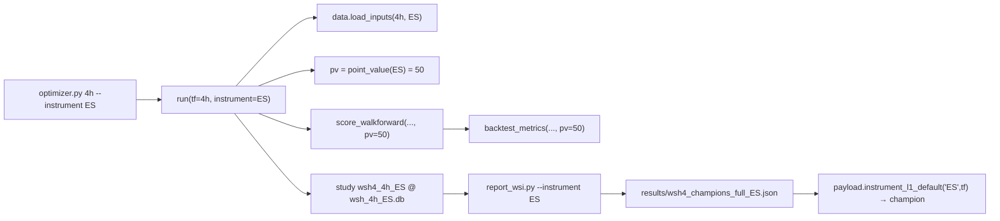

# Instrument-aware optimizer (NQ / ES) + timeframe — design

**Date:** 2026-06-29
**Status:** approved (design), pending implementation plan
**Related:** `optimize/optimizer.py` (L1 search `run()`/`main()`, study naming, `_db_for`),
`optimize/folds.py` (`score_walkforward`), `optimize/core.py` (`backtest_metrics`, pv),
`optimize/l2/optimize.py` (L2 search `run()`/`main()`/`_export_champion`),
`optimize/report_wsi.py` (champion extraction → `wsh4_champions_full.json`),
`optimize/instruments.py` (`TOKENS`, `point_value`, `resolve_paths`), `optimize/l2/payload.py`
(`instrument_l1_default`, `l1_default_params`, `_champion_layer_params`, `_WSH4_CHAMPS`),
`optimize/server/remote_wsi.sh`. Builds on the engine-side instrument feature
(`2026-06-29-instrument-selector-design.md`).

## 1. Goal

Let both optimizers run on a chosen **instrument** (NQ or ES) at a chosen **timeframe**, producing
per-instrument champions that the dashboard then uses as that instrument's default L1. NQ stays
byte-identical (all existing studies, DB files, and champion files preserved). After wiring, launch a short
ES L1 run to produce a first real ES champion and verify it surfaces in the dashboard.

## 2. Current state (the gaps)

The engine layer is already instrument-aware (`load_inputs`, `run_l1_cached`, `l1_runner.run_l1`,
`engine.run_l2`, `instruments.point_value`). The **optimizers are not**:

- **L1** (`optimize/optimizer.py`): positional `timeframe`, no `--instrument`. Loads
  `data.load_inputs(tf_name)` (defaults NQ, line ~318). Scores via `folds.score_walkforward` →
  `core.backtest_metrics(pv=config.NQ_POINT_VALUE)` — **pv is not threaded**, so ES would mis-score with
  NQ's $20. Study name `f"{study_prefix}_{tf_name}"` (e.g. `wsh4_4h`) and DB `wsh_{tf}.db` → **collide**
  across instruments. Champions are extracted post-hoc by `report_wsi.py` into `wsh4_champions_full.json`.
- **L2** (`optimize/l2/optimize.py`): `--tf`, no `--instrument`. `run_l1_cached(tf)` defaults NQ.
  `_export_champion` writes `{prefix}_{tf}_champion.json`.
- **Folds** split by date (`folds.split_folds` over `df_dec["Date"]`) → auto-adapt per instrument; no change.
- **Dashboard** `payload.instrument_l1_default("ES", tf)` returns scaled-permissive (no ES champion read).
- **`remote_wsi.sh`** launches per-TF, no instrument.

## 3. Naming scheme — NQ unchanged, non-NQ suffixed

A single rule, applied everywhere: `suf = "" if instrument == "NQ" else f"_{instrument}"`.

| artifact | NQ (unchanged) | ES |
|---|---|---|
| L1 study name | `{prefix}_{tf}` | `{prefix}_{tf}_ES` |
| L1 DB file | `wsh_{tf}.db` | `wsh_{tf}_ES.db` |
| L1 champions file | `wsh4_champions_full.json` | `wsh4_champions_full_ES.json` |
| L2 champion file | `{prefix}_{tf}_champion.json` | `{prefix}_{tf}_ES_champion.json` |

This guarantees every existing NQ artifact is preserved and NQ/ES never share a study or lock.

## 4. Architecture

### 4.1 L1 optimizer (`optimize/optimizer.py`)
- `main()`: add `ap.add_argument("--instrument", default="NQ")`; validate `instruments.is_valid` (exit on bad).
- `run(..., instrument="NQ")`: pass to `data.load_inputs(tf_name, instrument)`; compute
  `pv = instruments.point_value(instrument)` and thread it into the scoring path; build the study name and
  DB path with the `suf` rule.
- **pv threading:** `folds.score_walkforward(..., pv=None)` forwards `pv` to each fold's
  `core.backtest_metrics(..., pv=pv)`; the full-period `backtest_metrics` call also gets `pv=pv`. When
  `pv is None`, `backtest_metrics` keeps its `config.NQ_POINT_VALUE` default ⇒ NQ byte-identical.
- Study name: `study_name = f"{study_prefix}_{tf_name}{suf}"`; `_db_for(tf_name, study_name, instrument)`
  resolves `wsh_{tf}{suf}.db`.

### 4.2 Champion extraction (`optimize/report_wsi.py`) + dashboard read
- `report_wsi.py` gains an instrument parameter (CLI `--instrument` / `WSI_INSTRUMENT`): reads the
  instrument-suffixed study and writes `wsh4_champions_full{suf}.json` (NQ path unchanged).
- `payload.instrument_l1_default("ES", tf)`: if `results/wsh4_champions_full_ES.json` exists and has `tf`,
  return `_champion_layer_params(tf, champs[tf])` (the same builder NQ uses); else fall back to
  `_scaled_permissive(instrument)`. A small helper `_instrument_champions_path(instrument)` centralizes the
  filename. NQ remains `l1_default_params(tf)`.

### 4.3 L2 optimizer (`optimize/l2/optimize.py`)
- `main()`: add `--instrument`; `run(..., instrument="NQ")` passes it to
  `payload.run_l1_cached(tf, params=l1_params, instrument=instrument)`.
- `_export_champion(..., instrument="NQ")`: filename `{prefix}_{tf}{suf}_champion.json`.

### 4.4 Remote runner (`optimize/server/remote_wsi.sh`)
- Honor `WSH_INSTRUMENT` (default NQ): pass `--instrument "$WSH_INSTRUMENT"` to the optimizer launch and to
  `report_wsi.py`. Default empty/NQ ⇒ the script behaves exactly as today.

### 4.5 The short ES launch
After A–C land: run a bounded local ES L1 optimization at 4h (modest `--trials`, slow-SMC indicators
excluded for speed via the existing `--exclude-indicators`/contributor-exclude precedent), extract with
`report_wsi.py --instrument ES`, write `wsh4_champions_full_ES.json`, and verify
`instrument_l1_default("ES", "4h")` now returns that champion (not scaled-permissive). Report wall-clock +
the champion's in-sample/OOS metrics. This is a *first* ES champion; the full multi-TF campaign is the user's
later call.

## 5. Data flow

## 6. Testing

1. **NQ unchanged:** L1 `run("4h")` (no instrument) builds study `wsh4_4h`/`wsh_4h.db` and scores with pv=20
   exactly as today; existing `optimize/test_optimize.py` + `optimize/l2/test_optimize.py` + fold tests green.
2. **Naming:** unit test that the `suf` rule yields `wsh4_4h_ES` / `wsh_4h_ES.db` /
   `wsh4_champions_full_ES.json` / `{prefix}_4h_ES_champion.json` for ES and the bare names for NQ.
3. **pv threading:** `score_walkforward(..., pv=50)` → `backtest_metrics` receives 50; `pv=None` keeps the
   NQ default (assert a known fixture's $ pnl scales with pv).
4. **ES end-to-end smoke:** a tiny ES L1 study (few trials) creates the ES-named study, `report_wsi`
   writes `wsh4_champions_full_ES.json`, and `instrument_l1_default("ES","4h")` returns the champion (box +
   indicators), not scaled-permissive.
5. **L2:** `_export_champion(..., instrument="ES")` writes the `_ES_` filename; NQ filename unchanged.
6. **Golden 6/6** unaffected (engine untouched; the optimizer is not on the golden path, but NQ pv=20 keeps
   any optimizer-derived numbers identical).

## 7. Out of scope (YAGNI)

- ETF instruments (`TOKENS` stays `("NQ","ES")`).
- The full multi-TF ES campaign (the launch here is one short 4h run; scaling is the user's call).
- Per-instrument warm-start seeding (ES has no prior champions → starts cold).
- Changing NQ study/DB/champion names or the fold logic.
