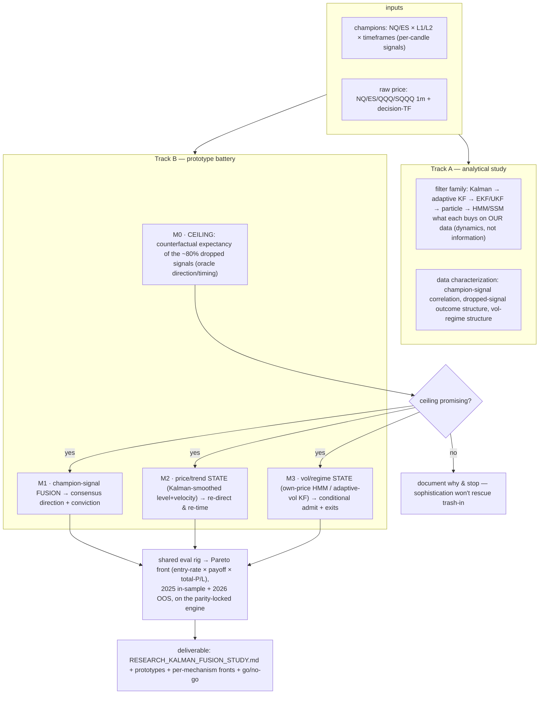
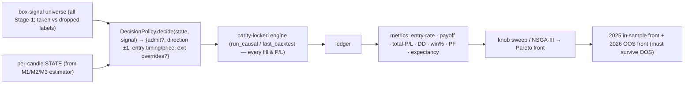
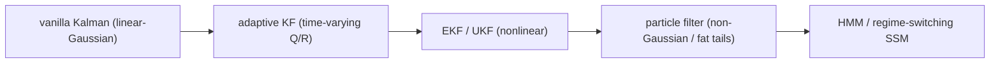
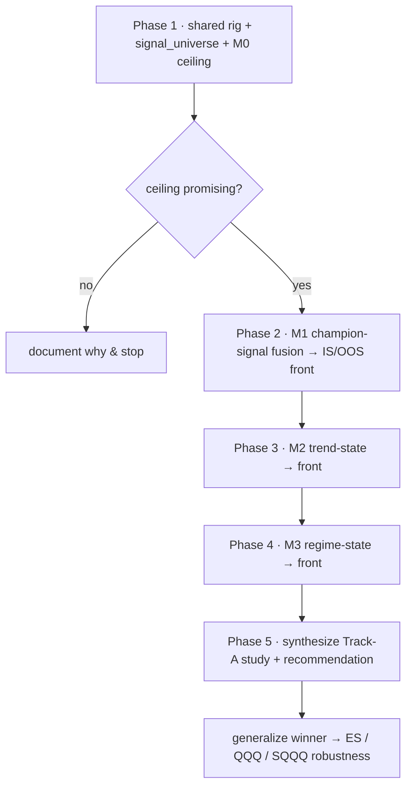

# Design — Kalman filter & signal-fusion study (admit more box signals without degrading payoff)

**Date:** 2026-07-01 · **Type:** research study (evidence-first; no production engine change in scope) ·
**Status:** design approved, spec under review · **Anchor:** NQ, then generalize.

Extends the prior decision note `docs/RESEARCH_SIGNAL_FUSION_KALMAN.md` (which ruled out *ES-as-a-discrete-voter
for entry direction* but explicitly left continuous / multi-timeframe / state-estimation fusion untested).

---

## 1. Goal & hypothesis

Today the strategy is a **hard filter**: box Stage-1 fires on ~829 of 2,119 NQ 4h candles, but the HAR-RV
**vol gate + K-of-N indicator veto drop ~80%**, so the champion **enters on only ~20–25% of box signals**
(~214 trades). We want to **admit far more of them — aim ~75% of box signals (~3× the trades)** — and use
**Kalman state-estimation + signal fusion** so the extra, currently-rejected signals do **not** degrade the
**payoff ratio** (avg win ÷ avg loss).

**Hypothesis (well-posed, testable, honestly ambitious):** *can state-estimation / fusion convert the
currently-dropped box signals into tradeable flow — by better direction, entry timing/price, and/or exits —
so that entry-rate rises sharply while payoff holds or improves?*

The filter's job flips from *"reject 80%"* to *"admit ~75%, but fix each admitted signal."*

### Locked scope decisions (from brainstorming)
| Decision | Choice |
|---|---|
| Deliverable | **Exploratory study comparing all mechanisms** (not a build); gated by a cheap pre-test |
| Success framing | **Pareto front: entry-rate × payoff-ratio × total-P/L** — pick the operating point after seeing what's achievable |
| Inputs | **Champions (NQ/ES × L1/L2 × timeframes) + raw price only.** No external diverse data exists (only Nasdaq-family: NQ/ES/QQQ/SQQQ, all ~0.9+ correlated) → the note's "fuse diverse orthogonal sources" path is infeasible; regime-state is limited to own-price vol |
| Breadth | **Anchor on NQ** (multi-TF L1+L2 champions), then generalize the winner to ES/QQQ/SQQQ |
| Structure | Approach ③ — **written analytical study (Track A) alongside a prototype battery (Track B)** |
| Boundaries | Research layer only; **production engine + golden gate untouched**; all heavy compute on the AMD server |

---

## 2. Overall shape

---

## 3. Shared evaluation rig + objectives + IS/OOS

Every mechanism plugs into **one rig** so results are comparable and trustworthy. The rig **never
re-implements P/L** — it decides *admit / direction / timing* and hands the trade simulation to the
parity-locked engine.

### Objectives (+ diagnostics)
| Objective | Definition | Role |
|---|---|---|
| Entry-rate | entries ÷ box-signals (today ≈ 20–25%; aim ↑ toward 75%) | maximize |
| Payoff ratio | avg win ÷ avg loss (per-trade) | maximize; **champion's value is the reference floor** |
| Total P/L | engine-computed sum | maximize |
| *diagnostics* | max-DD, win%, PF, expectancy, per-trade-R distribution | reported, not optimized |

### Rig decisions
- **Baseline = the champion itself** (its entry-rate, payoff, P/L) plotted as one point; a mechanism only
  "wins" if its front **Pareto-dominates or extends** it.
- **Exits held fixed to the champion's** (SL/TP/breaker/cap) by default → isolates the pure *admit + re-direct +
  re-time* effect on payoff. M3 gets a separate arm that *varies exits by regime*.
- **Direction is free** (reverse-entry-only semantics already exist): a mechanism may admit a dropped signal
  long or short; M0's oracle takes the best case, the real mechanisms take their state's call.
- **Entry timing** rides the existing `entry_resolver` hook (WS-I) — M2 can fill at a Kalman-smoothed level
  with no new engine plumbing.
- **IS/OOS = the established split** (L2-validation option 3): fit filter params on **2025 causally**, hold out
  **2026**; report both fronts. A mechanism is credible only if it holds OOS (the l2v3 lesson).

### Units (small, independently testable)
`signal_universe()` · `StateEstimator` (M1/M2/M3) · `DecisionPolicy` · `evaluate(policy)→ledger` ·
`pareto_sweep()`. Each mechanism = estimator + policy + knobs, swappable without touching the others.

**Parity/safety:** all P/L is engine-computed; the research layer only *chooses* entries. Golden gate untouched.

---

## 4. Mechanism internals

### M0 — the ceiling (counterfactual, runs first)
**Precise "dropped" definition (removes the entry-rate ambiguity):** a *dropped* signal is a box-signal candle
where the champion was **flat and eligible** (not in-position, not in cooldown/breaker-lock) but the vol-gate or
indicator-veto rejected it. The **entry-rate denominator = flat-eligible box signals** (taken + dropped), *not*
all box-signal candles. Exact counts are pinned in Phase 1 against the signal-counting anchors.

For every **dropped** box signal, replay it through the champion's exit rules and aggregate:

| Variant | Measures |
|---|---|
| native direction | payoff/expectancy of the dropped flow as-is |
| opposite direction | how much a perfect flipper would add |
| **oracle = max(native, opposite)** | **hard ceiling** — best case if a perfect director existed |

Stratified by *why* dropped (vol-gate vs veto) and by simple observables (trend sign, vol bucket) to reveal a
**rescuable sub-population**. Reuses `counterfactual_pause.py` / `no_entry.py` + `fast_backtest`. **This bounds
M1–M3.** Decision gate: if the dropped flow is uniformly negative-expectancy and flipping adds nothing → no
filter saves it → document and stop. If oracle payoff is strongly positive and separable by observable state →
M1–M3 have a real target.

### The "advanced relatives" ladder

Principle: *sophistication buys nonlinearity/non-Gaussianity, not information.* Climb a rung **only** where the
simpler rung hints at signal (studied analytically in Track A, prototyped in Track B on evidence).

### M1 — champion-signal fusion *(uses NQ/ES × L1/L2 × timeframes directly)*
- **Observations** `z_t` = champions' per-candle signals, **continuous where possible** (#confirms−#vetoes,
  distance-to-gate) — the "continuous fusion" lever the prior note flagged as untested.
- **State** `x_t` = latent directional conviction. `x_t = F·x_{t-1} + w`, `z_t = H·x_t + v`; `R` = per-champion
  observation noise (from historical hit-rate), `H` = per-champion loading. Kalman → posterior **consensus
  conviction + agreement variance**.
- **Decision:** admit if `|consensus| > θ`; direction = `sign(consensus)`; optionally require low variance
  (agreement). **Knob:** θ traces entry-rate ↔ payoff.
- **Variants:** static weighted-vote (baseline) → dynamic Kalman (time-varying weights) → regime-weighted.
  Higher-TF champions aligned **causally** via the existing MTF/contributor alignment (no look-ahead).

### M2 — price/trend state-estimation
- **Base:** local-level+trend ("constant-velocity") Kalman on log-price → smoothed **level + velocity +
  variances**.
- **Relatives:** adaptive KF (scale Q by realized vol) · EKF/UKF (nonlinear trend / stochastic-vol obs) ·
  particle (fat-tailed innovations).
- **Decision:** admit a dropped signal if trend-velocity agrees (or re-direct to `sign(velocity)`); **entry
  timing** = fill at the smoothed level via `entry_resolver` → cleaner price ⇒ higher per-trade R.
  **Knobs:** velocity threshold, Q/R smoothing, timing offset.

### M3 — vol/regime state *(own-price only)*
- **Base:** HMM regime-switching on returns/realized-vol (causal **filtered** posterior, not look-ahead
  Viterbi) → regime ∈ {trend, chop, high-vol}; or adaptive-vol Kalman for a continuous vol-state.
- **Decision:** admit dropped signals **conditionally on regime**, and/or scale **exits by regime** (wider TP in
  trend, tighter SL in chop) to protect payoff while volume rises. **Knobs:** per-regime admit thresholds + exit
  scalars.
- **Honest caveat, measured explicitly:** overlaps the existing HAR-RV vol gate — M3's reported value is the
  **increment over that gate**, nothing more.

---

## 5. Execution, testing, deliverables, sequencing

### Execution / compute (server-only)
- All backtests/sweeps on the **AMD server** (no local heavy compute). Champions + raw data already at `$WSI`.
  M0 and threshold sweeps are cheap (memoized `fast_backtest`); HMM/particle rungs heavier but bounded.
  NSGA-III (Postgres, new prefix) only if a mechanism's knob-space outgrows a simple grid.
- Prototypes live in an **additive package `research/kalman_fusion/`** — off the production `optimize/` path —
  importing the engine as a library.

### Testing / parity safety (TDD, causal)
- `signal_universe` locked to known anchors (NQ 4h ≈ 829 box-signal candles, ~214 taken, ~615 dropped — pinned
  to the signal-counting note).
- Each **estimator** unit-tested vs hand-computed output on synthetic data; each **policy** for admit/direction
  logic; **metrics** (payoff, entry-rate) on a fixture.
- **Causality guard is mandatory** — an input-truncation test per estimator (truncate future bars → past
  states/decisions unchanged), mirroring `test_causality.py`. Filters use the *filtered* posterior only.
- **Golden 6/6 verified once** to confirm the research layer is truly off-path.

### Deliverables
1. **`docs/RESEARCH_KALMAN_FUSION_STUDY.md`** — extends the prior note: Track-A analysis + M0 ceiling +
   per-mechanism IS/OOS Pareto fronts + per-mechanism go/no-go + overall build recommendation.
2. **`research/kalman_fusion/`** — reproducible, parity-safe prototype code (estimators, policies, rig).
3. **Front artifacts** — Pareto CSVs + scatter PNGs; diagrams in the doc as Mermaid.
4. **A decision** — if a mechanism earns a production build, that is a *separate* brainstorm→spec→build cycle.
   This study's terminal output is the recommendation, not an engine change.

### Sequencing

Track-A write-up runs alongside each phase (theory ⟷ evidence). The relatives ladder is climbed only where the
simpler rung shows promise.

---

## 6. Success criteria & non-goals

**Success:** a decision-grade study that, on the NQ anchor, produces (a) the M0 ceiling, (b) an IS **and** OOS
Pareto front (entry-rate × payoff × total-P/L) for each viable mechanism vs the champion baseline, and (c) a
clear per-mechanism go/no-go plus an overall recommendation — enough to decide whether any mechanism earns a
production build.

**Non-goals:** no change to the production engine, champions, or golden gate in this cycle; no external/macro
data acquisition; no live-trading/execution concerns; a full production integration is a *separate* cycle
triggered only if a mechanism passes IS+OOS.

**Key risks (surfaced, not hidden):** the ceiling may show the dropped flow is genuinely negative-expectancy
(then we stop — a valid, cheap result); admitting ~75% may be unreachable while holding payoff (the Pareto
front will show the real achievable frontier); own-price regime-state may add nothing over the existing HAR-RV
gate (measured as an increment). In-sample fronts can lie — OOS is the gate.
