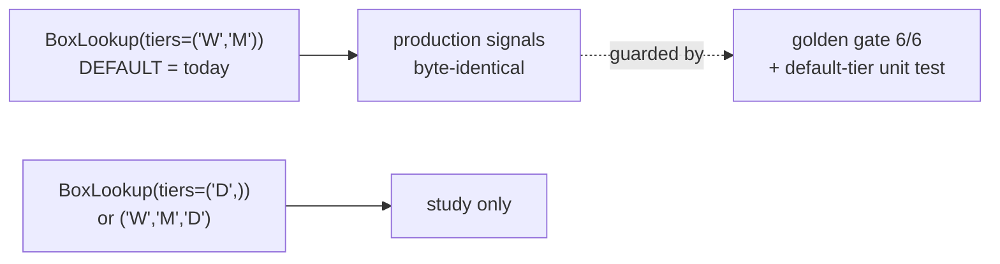
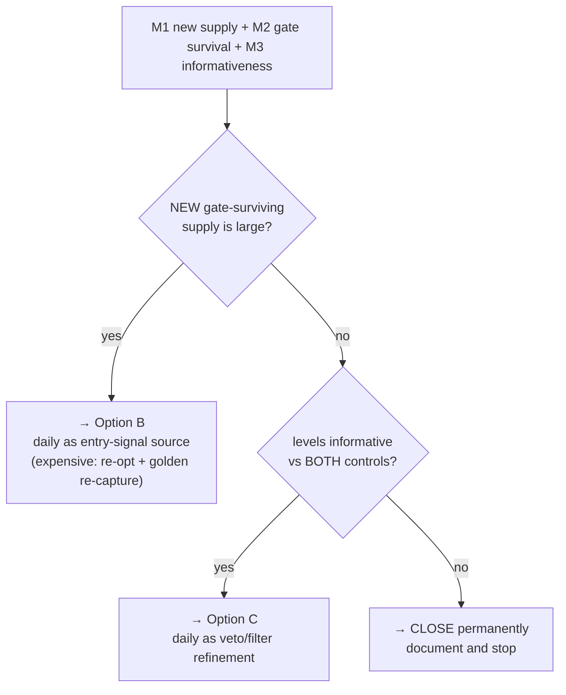

# Daily Boxes (NQ) — Characterization Study — Design Spec

**Date:** 2026-07-23
**Branch:** `research-daily-boxes` (off `dev` @ `e7eadbe`)
**Status:** approved (design), pending spec review
**Author:** pairing session

## Goal

Measure whether the **daily (`D*`) box levels** — which exist in the NQ box CSV but are **discarded at load
time** — carry tradeable information, and produce a decision-ready verdict on what (if anything) to do with
them.

This is a **characterization study, inert with respect to production**. It adds one opt-in parameter to
`box_lookup.py` (§3) but changes no strategy behavior at its default, re-optimizes no champion, and deploys
nothing. Its only output is measurements plus a verdict.

## Non-goals

- Wiring daily levels into signal generation for production (that is Option **B**, gated on this study).
- Extending the key-levels veto to daily zones (that is Option **C**, also gated on this study).
- Re-optimizing any champion, touching the champion registry, or changing dashboard defaults.
- Any change to the traversal rule, the gate, the flip/exit logic, or other instruments (GC/ES/CL/…).

---

## 1. Background — what "the daily boxes" are and why they were ignored

Every box level in this system is a **zone**, not a line: it has an upper edge (column suffix `U`) and a lower
edge (suffix `D`). There are 8 zone-types per timeframe:

| Code | Full name | Meaning |
|---|---|---|
| `TH`, `TH1`/`TH2` | True High (+ sub-zone) | Extreme high of the period |
| `RH` | Rejection High | Price pushed up here and was pushed back |
| `IH` | Interaction High | Price traded and reacted here, upper side |
| `IL` | Interaction Low | Same, lower side |
| `RL` | Rejection Low | Price pushed down here and was bought back |
| `TL`, `TL1`/`TL2` | True Low (+ sub-zone) | Extreme low of the period |

`box_lookup.py` defines `_WEEKLY_LEVELS` and `_MONTHLY_LEVELS` (16 zones total) and loads only those. Its own
docstring (lines 8–10) records the omission:

> *"Single file with one row per market day (the CLOSING day). Both weekly and monthly levels live on the same
> row (W\* and M\* columns). **Daily (D\*) columns exist in the raw file but are ignored at load time.**"*

`INDICATOR_DECISIONS.md` confirms it as a deliberate decision: *"Daily boxes remain ignored."*

A prior investigation, `RESEARCH_SLEEPING_DAYS.md` (status **PAUSED mid-brainstorm**), considered adding daily
boxes to fill no-trade gaps and reached a **caveated dismissal**: gaps are ~82% *gate*-caused rather than
signal-scarce, so more signal supply is "a minor lever, wrong target."

### Why that dismissal is being revisited

Two facts measured on the actual data on 2026-07-23 were **not available** when that note was written, and both
push against its assumption of scarcity:

**(a) The daily zones are populated on essentially every market day.** In the unified file (363 rows):

```
DIHU/DIHD  363/363  (100%)        WTHU  90/363  (25%)
DILU/DILD  363/363  (100%)        WTLU  58/363  (16%)
DRHU/DRHD  363/363  (100%)
DRLU/DRLD  363/363  (100%)
DTHU         6/363  (1.7%)
DTLU        12/363  (3.3%)
```

The four **interaction/rejection** daily zones are present 100% of days. Only daily true-high/true-low are rare.
This is a dense source being discarded on every bar, not an occasional one.

**(b) They are not duplicates of weekly/monthly, and they are far tighter.**

| Zone | Daily width | Weekly width | Monthly width | Daily == Weekly |
|---|--:|--:|--:|--:|
| Interaction High | **22.2 pts** | 48.5 | 108.8 | 0.0% of days |
| Interaction Low | **22.2 pts** | 48.5 | 108.8 | 0.6% |
| Rejection High | **54.5 pts** | 111.2 | 406.9 | 0.3% |
| Rejection Low | **56.3 pts** | 104.3 | 322.4 | 0.6% |

They coincide with the weekly/monthly zones on ≤0.6% of days, so they mark genuinely different price locations.
At NQ's **$20 per point**, a daily interaction zone is ~**$444** wide per contract, weekly ~**$970**, monthly
~**$2,176**.

Tighter zones are crossed more often, which is the mechanism by which they could add signal supply — and also
the reason they may be lower-conviction and noisier. That trade-off is what this study measures.

---

## 2. Study window

Merge the two NQ box files into one frame:

| File | Rows | Range |
|---|--:|---|
| `data/2024_data/NQ_full_data_2024.csv` | 263 | 2023-12-29 → 2024-12-31 |
| `data/full_data/NQ_full_data.csv` | 363 | 2025-01-01 → 2026-05-22 |
| **merged** | **626** | **2023-12-29 → 2026-05-22** |

Both carry all 16 `D*` columns with the dense-4 fully populated (263/263 and 363/363). They are **contiguous**
— no overlap, no calendar gap at the seam.

Rationale for merging rather than using the shorter file: this project has repeatedly been burned by n=1
results (the regime size-ramp that reversed sign after a champion change; the Asia-session cell that failed to
replicate on 3 other indices). Doubling the sample is nearly free here, and the standing rule is that a
negative result requires a power analysis to mean anything.

---

## 3. Guardrails — production must not change



- `BoxLookup` gains an explicit **`tiers`** parameter, defaulting to `("W","M")` — exactly present behavior.
- The default path must remain **byte-identical**, guarded by (i) a unit test asserting default-tier signals
  equal current signals and (ii) the **golden regression gate staying 6/6 green** before and after.
- The daily tier is **opt-in**. Nothing reads it unless the study asks for it.

Rationale: past regressions in this codebase came from edits to shared paths. An inert-by-default parameter is
the only safe way to add a tier.

---

## 4. Components

| Unit | Purpose | Depends on |
|---|---|---|
| `_DAILY_LEVELS` (in `box_lookup.py`) | The 8 daily zone-pairs, mirroring `_WEEKLY_LEVELS` | box CSV |
| `tiers=` parameter on `BoxLookup` | Opt-in tier selection; default reproduces today | — |
| `merge_box_data.py` | Build + assert the 626-day merged frame | both box CSVs |
| `daily_box_study.py` | Runs M1/M2/M3 and emits results | the above, champion payload |

Each unit is independently testable. Only `tiers=` touches shared code, and it is inert at its default.

---

## 5. The three measurements

### M1 — Supply: how many signals do daily zones add?

Run the existing traversal state-machine for three level sets and compare:

| Level set | Meaning |
|---|---|
| `W+M` | Baseline — exactly what we trade today |
| `D` only | The discarded tier in isolation |
| `W+M+D` | Combined |

The traversal rule (unchanged, from `box_lookup.py`): a signal fires only when the close **traverses** a zone —
`above → inside → below` = **short**, `below → inside → above` = **long**. Gap-skips with no intervening
`inside` bar update state silently and do **not** fire.

Report:
- total signals per level set;
- **NEW** signals — daily traversals firing on bars where `W+M` produced nothing (this is the number that
  matters; a daily signal duplicating an existing weekly one adds no supply);
- per-day coverage — specifically, does the daily tier create a signal on the days that currently have **no box
  signal at all**? (`RESEARCH_SLEEPING_DAYS` measured 91 of 431 days, ~21%, as genuinely signal-scarce.)

### M2 — Gate survival: how many of those new signals could we actually take?

The gate arrays (`vol_gate`, `veto`, `confirm`) are computed from price and indicators, **independently of
which zone fired**. So they can be evaluated on any bar, and we can ask directly: of the NEW daily signals, how
many land on bars where the live gate (`vol_gate ∧ ¬veto ∧ confirm`) would have passed?

This is the number that decides Option B, and it is directly comparable to the prior note's baseline of **823
raw in-gap signals → 149 gate-passable (18%)**.

Caveat to carry into the report (it made gate-domination *stronger* in the prior note, and applies here too):
some gate-passable bars are still untakeable because the strategy was already in a position, on cooldown, or
halted by the breaker. So M2 is an **upper bound** on new takeable entries, and must be reported as such.

### M3 — Informativeness: do these levels mark anything real?

Operationalized to match what the strategy actually trades: after price **traverses** a daily zone, does it
**continue** in the traversal direction (momentum — our thesis) or revert?

Measure forward return in the traversal direction at **horizons of 1, 3 and 6 decision-frame bars** (on 4h:
4h / 12h / 24h ahead), against **two dumb controls**:

| Control | Construction | What it kills |
|---|---|---|
| **C1 — location** | Same zone widths, same count per day, placed at random price offsets | "Any line looks meaningful" |
| **C2 — date** | Apply a *different* day's daily zones to this day | Preserves zone geometry, destroys date-specific information |

Each control is drawn **1,000 times** with a fixed, recorded random seed so the run is reproducible.

Reported with effect size and a **90% block-bootstrap confidence interval** (block bootstrap, not i.i.d., to
respect autocorrelation in returns — consistent with how the regime-sizing uplift was tested). **If the result
is null, an explicit power estimate is mandatory** — a null at low power says nothing, and this project has
already retracted one workstream for that exact error.

---

## 6. Decision rule (fixed in advance)

Writing the decision rule before seeing the numbers, so the verdict cannot be retrofitted:



**"Large" is fixed now, before seeing any number**, so the verdict cannot be retrofitted. Define

> `uplift = (NEW daily signals surviving the gate) / (baseline entries on that frame)`

with baseline entries = 255 on 4h. Then:

| `uplift` | Verdict path |
|---|---|
| **≥ 20%** | **Large** → go **B**. A ≥20% potential increase in trade count is material enough to justify B's cost (full re-optimization + golden re-capture). |
| **5–20%** | **Gray band** → report the effect size and decide **B vs C** on M3: informative levels → C is the safer buy; strongly informative *and* near 20% → argue B explicitly. |
| **< 5%** | **Negligible** → daily adds no meaningful supply; fall through to the M3 branch (C or close). |

Recall M2 is an **upper bound** (position-carry / cooldown / breaker not modeled), so a borderline `uplift` should
be read as optimistic, not conservative.

---

## 7. Decision timeframe

- **Primary: 4h** — the frame `RESEARCH_SLEEPING_DAYS` used, so M1/M2 land directly comparable to its numbers
  (2,119 bars / 255 entries / 823 in-gap raw signals / 18% passable).
- **Secondary: 1h** — a newly adopted champion, and tighter zones plausibly matter more on a faster frame.

Not in scope: 5m/15m. Those would fire most on 22-point zones, but they are far from any existing baseline and
much heavier to run. If 4h/1h show promise, extending down is a follow-up, not part of this spec.

Note: there is **no 1d decision frame** in this system (`TIMEFRAMES` = 1m/2m/5m/15m/1h/2h/4h). "Daily boxes"
here means daily *levels* evaluated on an intraday decision frame — not trading a daily bar.

---

## 8. Error handling

- **Merge assertions:** identical schema across both files, no duplicate dates, no calendar gap at the seam,
  sorted ascending. Fail loudly; never silently truncate.
- **Missing columns:** hard failure naming the missing column, not a silent skip.
- **No silent defaults.** Every measurement parameter (horizons, buffer, control seed count, timeframe, level
  set) is passed explicitly and **printed as used**. No `dict.get(key, default)` anywhere near a measurement or
  strategy parameter — a typo there silently measures a different thing, which has invalidated results here
  before.
- **Tautology alarm:** if any headline number comes back equal to its own input, treat it as a bug, not a
  finding.

---

## 9. Testing / verification

| Check | Asserts |
|---|---|
| Default-tier unit test | `BoxLookup(tiers=("W","M"))` signals ≡ current signals, byte-identical |
| Daily-tier unit test | Daily tier loads 8 zones and fires traversals |
| Golden gate | **6/6 green** before and after the change |
| Merge test | 626 rows, contiguous, schema-identical |
| Param echo | Every measurement parameter printed as used |

**Compute location: the server.** This touches the 1-min frame and the champion payload; heavy compute does not
run on the local box.

---

## 10. Outputs

1. A report in the standing house format — plain language, every term and column spelled out, concrete dollar
   examples at $20/point, Mermaid visuals, and an explicit "what went well / what went wrong."
2. Raw numbers as CSV, so no figure in the report is un-auditable.
3. A verdict forced into exactly one of: **go B** · **go C** · **close permanently**.

---

## 11. Open items

None blocking. Two noted for the report:

- The merged window (2023-12-29 → 2026-05-22) is still **one broadly bullish era**. It cannot settle
  bear-market behavior; that gap is the same 2010–2023 data constraint flagged in the FA closeout.
- M2 is an upper bound on takeable entries (position-carry / cooldown / breaker not modeled).
