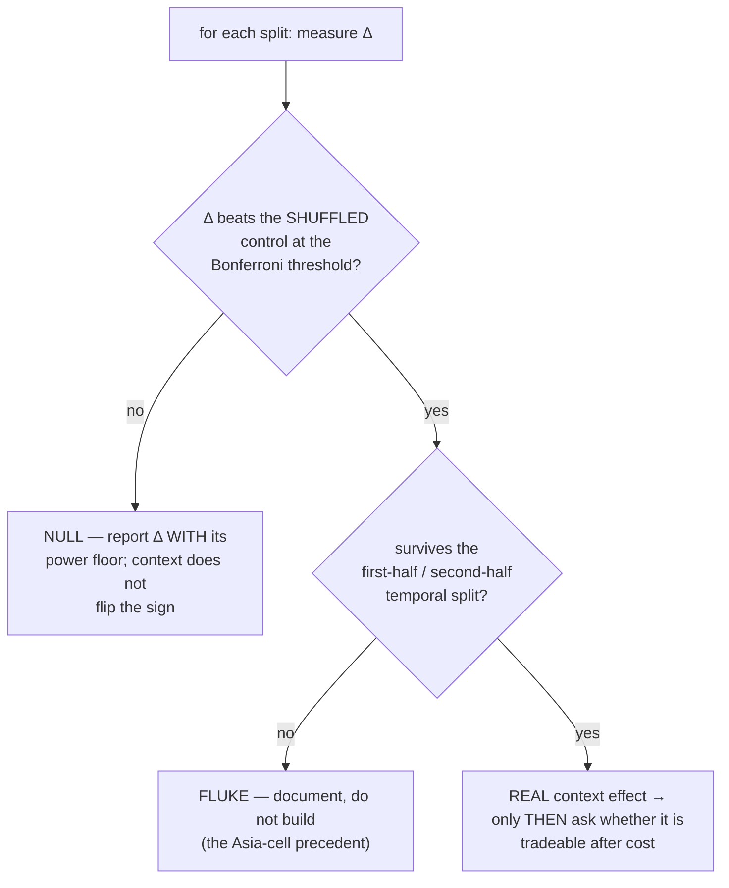

# News CONTEXT-dependence (NQ) — Design Spec

**Date:** 2026-07-23
**Branch:** `research-news-context` (off `dev` @ `3b16087`)
**Status:** approved (design)
**Origin:** user question — *"the context of news, where the same announcement can produce different behaviours"*

## Goal

Test whether the market's **directional** response to a scheduled US macro release is **context-dependent** —
i.e. whether the same announcement moves NQ one way in one market state and the other way in another.

This is the one variant of the news question the fundamentals workstream **never asked**. Every directional
test it ran was **pooled** (or split by event type), and a pooled average is exactly what two equal-and-opposite
conditional effects would produce.

## Non-goals

- Re-testing the **pooled** directional null (settled: −0.004, n=882, 99% power).
- Re-testing **volatility** predictability (settled: real — NFP 13.6×, CPI 12.3×).
- Building a tradeable strategy. This is a **measurement**; tradeability is a separate, later question that
  must also clear cost.
- Any change to production code, champions or the registry.

---

## 1. Why this is a real gap, not a technicality

Our headline fundamentals result is that scheduled macro news does not predict direction: pooled correlation
**−0.004** across **882 releases** at **99% power**. That is strong evidence against a **context-independent**
directional effect. It is **not** evidence against a **conditional** one — if hot CPI lifts price in one regime
and sinks it in another, the pooled mean is ~0 by construction.

**Our own code already knew this.** `study_surprise.py`'s docstring:

> *"we do NOT impose a sign. Whether strong jobs are bullish (growth) or bearish (hawkish Fed) is
> **regime-dependent** and arguing about it is how people fool themselves. We MEASURE the correlation."*

It named regime-dependence as the hazard — and then measured the pooled correlation and stopped. The
conditioning was never run.

**And there is an unexplained sign flip in our own data.** `Exp 50`:

| Signal | 2024 → 2025 → 2026 |
|---|---|
| Magnitude (volatility) | +0.291 → +0.218 → +0.115 — **never flips** |
| Direction | 2025 = −0.43 → 2026 = −0.01 / +0.16 / +0.13 — **flips sign at 2 of 4 horizons** |

We recorded that as "direction is noise". A sign flip is *also* the signature of a conditional effect whose
context changed. Both readings fit; only the first was written down.

---

## 2. Prior art (deep-research-first pass, 2026-07-23)

**The effect is real, named, heavily studied — and contested.**

| Source | Finding |
|---|---|
| **McQueen & Roley (1993)** | Stocks respond **negatively** to good real-economy news in good times, and show **no systematic** response in bad times. Since this paper, controlling for economic state is standard. |
| **Boyd, Jagannathan & Hu** | Unemployment news changes meaning across the cycle. |
| ⚠️ **Poitras (2004)** | Finds **no** state dependence — explicitly disputes the robustness of both above. |
| ⭐ **Elenev, Law, Song & Yaron (2024, JFE) — "Fearing the Fed"** | Stock sensitivity to macro news is **countercyclical**; most variation is **within** expansions (largest early, ~zero late). Mechanism = shifting perceptions of **Fed responsiveness**: sensitivity is large when the cash-flow content of news is least offset by news about future rates. |

**The finding that most concerns us**, from *Fearing the Fed*: from **2022**, hotter-than-expected CPI produced
larger sell-offs than ever before, and *for the first time this century positive macro surprises **led to price
declines***.

That is a **documented sign flip inside our sample window**. Our ledger spans 2010–2026 and therefore pools
both regimes: ~566 releases pre-2022 and ~264 from 2022 on. Averaging them is a mechanism that manufactures a
null.

**Honest read:** this makes the hypothesis theory-backed and pre-registered, **not** likely-true. Poitras found
nothing, and our own sign flip is equally consistent with noise at 17% power in 2026.

---

## 3. Data — already in hand, now local

`optimize/fundamentals/surprises_cache.csv`, pulled from the server and committed this session
(md5 `72d91942bd8d6ebbc75dfad0ee41483e`).

| | |
|---|---|
| Rows | **882 releases** |
| Span | 2010-04-14 → 2026-07-02 |
| Columns | `Date, event, actual, expected, raw_surprise, surprise_z` |
| Events | cpi 198 · nonfarm_payrolls 193 · pce 186 · retail_sales 165 · ppi 140 |

Built causally by `study_surprise.py`: `expected` uses only publications **before** that morning; `surprise_z`
is standardized by the rolling sd of **past** surprises; the outcome is NQ return from `close[08:29]` →
`close[08:30+h]`, entirely after the print. **Nothing peeks.**

This is the identical ledger the pooled null was computed on, so conditional results are directly comparable to
it rather than to a re-derived sample.

---

## 4. The three pre-registered context splits

Exactly three. **No others will be tested**, because a wide sweep re-enters the multiple-comparisons trap that
`Exp 43`'s Bonferroni correction already caught this project in once.

All three are **causal** — computable at 08:29 on the release morning using only prior information.

### C1 — Monetary-policy-response regime (PRIMARY, theory-backed)

The hypothesis from *Fearing the Fed*: whether good news is good or bad for stocks depends on how strongly the
market expects the Fed to react.

Proxied **causally from our own ledger**: for release *i*, compute the Spearman correlation between
`surprise_z` and the forward return over the **previous K releases (strictly before i)**. Label:

- `POS` regime if that trailing correlation > 0 ("good news is good news")
- `NEG` regime if < 0 ("good news is bad news")

`K = 40` releases (~9 months at ~4.4/month), fixed in advance. Requires 40 prior releases, so the first 40 are
unlabelled and dropped — leaving **~842**.

*Why this proxy rather than a hand-drawn 2022 break:* it needs no new data, it is knowable in real time (so a
positive result would be actionable rather than hindsight), and it does not hard-code the very date the
literature told us to expect — which would be borrowing the answer.

### C2 — Volatility regime

Reuse the existing **causal HMM daily volatility labels** (`data/nq_daily_regime.csv`) built by the
regime-edge workstream. Split calm vs turbulent at the median regime label.

### C3 — Prior trend

Price vs its trailing 50-day moving average at the release timestamp: `UP` if above, `DOWN` if below. The
simplest form of "same news, different backdrop", and the classic McQueen–Roley conditioning.

---

## 5. The measurement

For each split, within each bucket, compute the association between `surprise_z` and the forward return at
horizons **h ∈ {5, 15, 30, 60} minutes** (the horizons `study_surprise.py` already uses).

**Statistic: Spearman rank correlation, reported alongside Pearson.** Rank correlation is mandatory here — a
standing rule from the gold work, where Pearson was blind (−0.012) to a real −0.193 rank relationship because
fat tails swamped it.

**The decisive quantity is the DIFFERENCE between buckets**, not each bucket's own interval:

```
Δ = corr(surprise, return | context = A) − corr(surprise, return | context = B)
```

bootstrapped directly with a 90% CI. Two overlapping per-bucket intervals are not a test of their difference —
a rule added to `AGENTS.md` after DAILY-BOX-01.

---

## 6. Controls and discipline (fixed before running)

| Guard | Implementation |
|---|---|
| **Dumb control** | **Shuffle the context labels** (preserving bucket sizes), recompute Δ, 1,000 times. If the real Δ sits inside the shuffled distribution, there is no context effect. This is the single most important control — it kills "any split of 882 numbers produces some spread". |
| **Power, computed UP FRONT** | Minimum detectable Δ at 80% power for each split's realized bucket sizes, reported **before** interpreting any null. |
| **Multiple comparisons** | 3 splits × 4 horizons = 12 tests. Bonferroni-corrected threshold stated in advance. |
| **No silent defaults** | `K`, horizons, MA length, seeds all **required** arguments, printed as used. |
| **Temporal honesty** | Any surviving Δ must be re-checked on a first-half / second-half split. `Exp 50` and the session work both died there; if it does not survive, it is a fluke. |
| **Zero production edits** | New code only, under `research/news_context/`. |

---

## 7. Compute and artifact policy

- **All heavy runs on the server** (`amd-trading`). The outcome side needs the assembled 16-year frame at
  `~/Mulham/data_2010_1s/NQ_Continuous_Data/NQ_1m.csv` — **5,452,535 rows**, inside a **46 GB** dataset. This is
  loaded by `extended_data.load_1m_extended("NQ")`, which is **research-only by design**: lengthening the
  engine's history would change `n_split` and the volatility-percentile gate and therefore every champion, so
  `optimize/data.py` stays untouched and golden stays 6/6.
- **Every output pulled back to local and committed** — reports, CSVs, figures, derived ledgers. The server is a
  compute engine; **local is the source of truth**.
- **The one explicit exception, stated so it is not a silent breach:** the **46 GB raw market-data corpus stays
  server-resident**. It is a bulk input, not an output, and syncing it to the local box is neither practical nor
  useful. Everything *derived* from it — the 882-release surprise ledger (already pulled and committed this
  session), every result CSV and every report — lives locally under version control.

---

## 8. Decision rule (fixed in advance — EDGE gates before SIZE)

Ordered so a failed control kills the result regardless of how large Δ looks — the ordering error identified in
DAILY-BOX-01.



A null here is a genuinely valuable outcome: it would close the last open variant of the news question and
convert "priced in on average" into "priced in in every state we can identify".

---

## 9. Deliverables

1. `research/news_context/` — the study package (no production edits).
2. Unit tests on synthetic data with known answers.
3. `docs/superpowers/NEWS-CTX-01-context-dependence-results.md` — house format: plain language, every term
   spelled out, dollar examples at $20/point, Mermaid visuals, what went well / what went wrong.
4. Raw numbers as CSV, committed **locally**.
5. A verdict per split: **REAL** · **FLUKE** · **NULL (with power)**.
