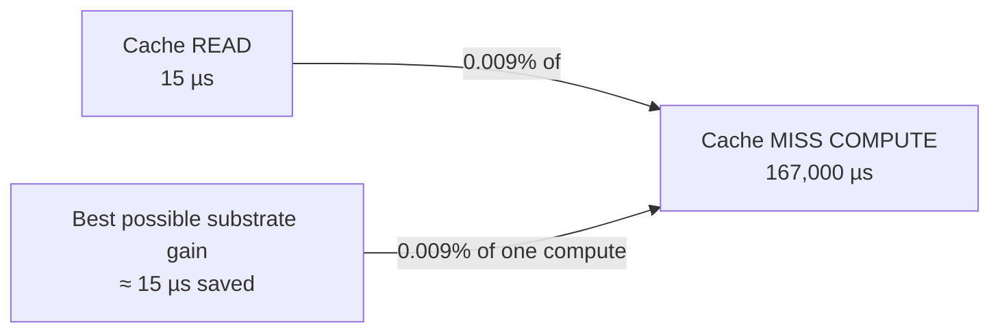

# Report — Cache Substrate & Cache Level, Measured

**Date:** 2026-07-27 · **Issue:** #58 · **Branch:** `research/cache-substrate`
**Purpose:** #54 answered the storage question by **reasoning** ("compute is 99% of wall, so storage can't
matter"). That reasoning was never verified, and storage was one of the original questions. This report
**measures** it.

---

## 0. Verdict up front

**NO-GO on every substrate change.** Not because the alternatives are slow, but because of **two
independent reasons, each sufficient on its own**:

1. **A cache read costs ~0.009% of the compute it replaces.** Reading a cached array takes **15 µs**;
   computing one takes **~167,000 µs**. Even a *perfect, zero-cost* substrate would save 0.009%.
2. **In a fresh sweep the cache is read almost never.** Measured hit rate over **1,995 lookups across 30 trials: 0.00**. Every trial samples new parameters from a ~4-billion-combination grid, and every fold is a
   different data slice, so essentially every lookup is a miss.

> Optimizing the substrate would mean making a *rarely-taken* path *0.009% faster*.

**One correction to earlier work, stated plainly:** #54 and the #58 issue text both speculated that the
cache key's `mode` field caused up to **3× duplication** (confirm/veto/both storing the same array).
**That is false** — see §3. I had asserted it twice without checking; reading the optimizer disproved it.

---

## 1. Question A — the substrate benchmark

300 **real** cached arrays from the live cache (median 6.5 KB, max 266 KB), on the AMD server
(123 GB RAM, `/tmp` = ext4 on NVMe, `/dev/shm` = tmpfs).

| substrate | p50 | p99 | vs current | verdict |
|---|---:|---:|---:|---|
| `dict` (in-process, theoretical floor) | **0.04 µs** | 0.10 µs | 383× faster | not a real option (per-process, unbounded RAM) |
| `shared_mem` (`multiprocessing.shared_memory`) | **0.36 µs** | 0.86 µs | **43× faster** | fastest real option — but see §2 |
| **`npy_tmp` (CURRENT)** | **15.32 µs** | 50.58 µs | — | baseline |
| `npy_shm` (tmpfs `/dev/shm`) | 15.17 µs | 48.63 µs | 1.01× (noise) | **no gain** |
| `redis` (loopback, real server) | 24.70 µs | 80.18 µs | **1.6× SLOWER** | ❌ |
| `npy_mmap` (`mmap_mode='r'`) | 29.24 µs | 67.99 µs | 1.9× SLOWER | ❌ |
| **30 concurrent readers** | | | | |
| `npy_tmp` ×30 | 50.49 µs | 677 µs | — | |
| `npy_shm` ×30 | 46.79 µs | 697 µs | within noise | **no gain** |

*Excluded:* **Arrow Plasma** — deprecated in Arrow 10.0.0, **removed in 12.0.0** (GH-33243). Not a valid
option in 2026; verified against the Arrow issue tracker rather than assumed.

**Three things worth naming:**

- **tmpfs buys nothing.** `/tmp` is ext4 on NVMe, but with **98 GB in page cache** on a 123 GB box the
  `.npy` files are already served from RAM. `/dev/shm` just makes that explicit. (Across two runs the
  concurrent numbers flipped which was faster — i.e. **noise**, not a real difference. Reported honestly
  rather than cherry-picked.)
- **Redis is slower, measured not assumed.** A loopback TCP round-trip plus deserialization (24.7 µs)
  costs more than `np.load` from page cache (15.3 µs). To measure this I ran a throwaway Redis container
  and installed `redis-py` into an isolated directory — **both removed afterwards**; your shared venv was
  not modified.
- **`shared_memory` genuinely is 43× faster** — and that is exactly why the ratio in §2 matters.

---

## 2. The number that ends the discussion

From the #54 re-baseline: **39 s of cold compute over 233 computations ≈ 167 ms per computation.**

| | time |
|---|---:|
| Reading a cached array (current) | **15 µs** |
| Reading a cached array (best possible, `shared_memory`) | 0.36 µs |
| **Computing that array when it's missing** | **~167,000 µs** |



Switching to the fastest substrate saves **~15 µs per hit**. One avoided *compute* saves **167,000 µs** —
**11,000× more**. This is why #54's reasoning was right, and it is now measured rather than asserted.

---

## 3. Question B — is the cache keyed at the wrong LEVEL?

### 3a. The `mode` hypothesis is FALSE (correction)

The claim in #54/#58 was that `mode` in the key causes confirm/veto/both to store the same array 3×.
`optimize/optimizer.py:_suggest_indicators` shows otherwise:

```python
specs.append({"key": key, "enabled": enabled, "mode": meta["mode"], "params": params, ...})
```

**`mode` is taken from the schema default and is never suggested to Optuna** — it is a *constant* per
indicator for the whole sweep. There is no mode duplication, and re-keying to remove `mode` would save
**nothing**. My earlier statement was wrong; this supersedes it.

### 3b. What *is* real: per-fold and per-timeframe recomputation

Two genuine sources of repeated `directions()` work — with honest limits:

| Source | Real? | Why it is not the free win it looks like |
|---|---|---|
| **Per fold** — each trial scores K=5 folds, each a different slice ⇒ 5 separate computes of the same `(indicator, params)` | ✅ real | You *could* compute `directions()` once on the full series and slice per fold — but warm-up at each fold boundary would differ, so **it is not result-neutral**. It changes numbers. Under our rules that disqualifies it unless proven vote-identical (unlikely). |
| **Per timeframe** — the 6 decision TFs all read the *same* 1-minute arrays, but each TF is a separate study with its own slice signature | ✅ real | Each TF study runs its own NSGA sampler with its own seed, so they explore **different** parameter combinations. Overlap across a ~4-billion grid is near zero except for warm-start champion seeds. The sharing mechanism would exist; the hits would not. Also, the production sweep is **4h-only** by default, so there is usually just one TF running. |

**The deeper structural point:** the cached unit is the **vote** (per decision bar, so timeframe-specific),
while the **expensive** unit is `directions()` (on the 1-minute frame, timeframe-*independent*). Caching
one level lower would be the theoretically right shape — but per §2 and §4 it would be optimizing a path
that is both cheap and rarely taken.

---

## 4. The second kill — the cache barely gets hits

Measured with the probe on a fresh 4h sweep (cold cache, real optimizer):

```
30 trials · 1,995 cold computes · 1,995 lookups → hits 0, misses 1,995 → hit_rate = 0.00
wall 317 s · cold 301 s (95% of wall)
```

**Why:** every trial draws a *new* parameter combination from a ~4-billion grid, and every fold is a
different slice. Repeats essentially never happen during exploration.

**Where the caching that DOES pay actually lives:** the in-process `_VOTE_MEMO`, which stops the same vote
array being recomputed by `veto_mask` / `confirm_mask` / `confirm_count` within a single evaluation. That
is the memoization your project memory records as taking candidate-L1 from **24 → 1,286 trials/min** —
**not** the disk cache.

**An honest caveat about the 201,354 files (4.3 GB) sitting in the production cache:** that is evidence of
201,354 *misses being written*, not of hits. It says nothing about how often anything was read back.

**When the disk cache *does* earn its keep:** resuming/re-running a study, warm-start champion seeds
(repeated parameters by construction), and watchdog respawns. Those are real but are not the hot path.

---

## 5. Question C — sub-primitive (shared EMA/ATR) caching

Qlib caches every sub-expression node; several of our indicators share a base EMA/ATR (MACD, Keltner,
ADX). **Estimated, not built** — and the estimate says don't: the shared primitives are the *cheap*
vectorized ones (an EMA over the 1-minute frame is milliseconds). The expensive indicators are expensive
because of their *own* per-bar loops, which share nothing. Complexity is real; the upside is not.

---

## 6. Verdict per lever

| Lever | Verdict | Basis |
|---|---|---|
| tmpfs `/dev/shm` | **NO-GO** | 1.01× (noise); already page-cache-resident |
| Redis | **NO-GO** | **1.6× slower**, measured, plus an ops dependency |
| mmap | **NO-GO** | 1.9× slower for arrays this small |
| `shared_memory` | **NO-GO (despite being 43× faster)** | saves 15 µs against a 167,000 µs miss, on a path with a 0.00 hit rate |
| Parquet/DuckDB | **NO-GO** | analytics store, wrong shape for single-key retrieval |
| Arrow Plasma | **N/A** | removed from Arrow in 12.0.0 |
| Re-key to drop `mode` | **NO-GO** | mode is never searched — zero duplication exists |
| Re-key at `directions()` level | **NO-GO for now** | correct in shape, but per-fold sharing is not result-neutral and per-TF overlap is ~zero |
| Sub-primitive caching | **NO-GO** | shared primitives are the cheap ones |

**Nothing here is worth implementing.** That is a real result, not a failure: it closes an open question
with evidence and prevents future effort being spent on it.

---

## 7. What would change this answer

State the conditions so a future round can re-test cheaply instead of re-litigating:

- **If cold compute ever drops to the ~microsecond range** (it will not — the remaining indicators are
  milliseconds at best), the 15 µs read would start to matter.
- **If the workload shifts from exploration to replay** — e.g. re-scoring thousands of *known* parameter
  sets (champion re-validation, ablation grids, cross-instrument replication). There the hit rate could be
  high, and `shared_memory` (43×) would become worth revisiting.
- **If a study ever runs many TFs over a shared warm-start seed set**, per-TF `directions()` sharing gets
  real overlap.

---

## 8. Honest gaps

1. **The 0.00 hit rate was measured on a deliberately COLD cache** (the harness clears it for clean cold
   timing). A production run against the accumulated 4.3 GB cache could show a non-zero rate on repeated
   studies. **Not measured** — the harness would need a "don't clear" flag.
2. **Per-fold `directions()` sharing was reasoned, not tested.** I did not empirically confirm that
   fold-boundary warm-up changes the numbers; I inferred it from how warm-up works. If someone wants that
   win, that assumption is the thing to test first.
3. **Concurrency was tested at 30 readers on an idle box.** A saturated 30-worker sweep might behave
   differently, though the §2 ratio makes it moot.
4. Redis was tested with default settings (no pipelining, no unix socket). Tuning could close some of the
   1.6× gap — it could not close a 11,000× ratio.
