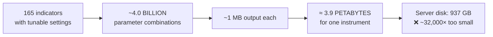
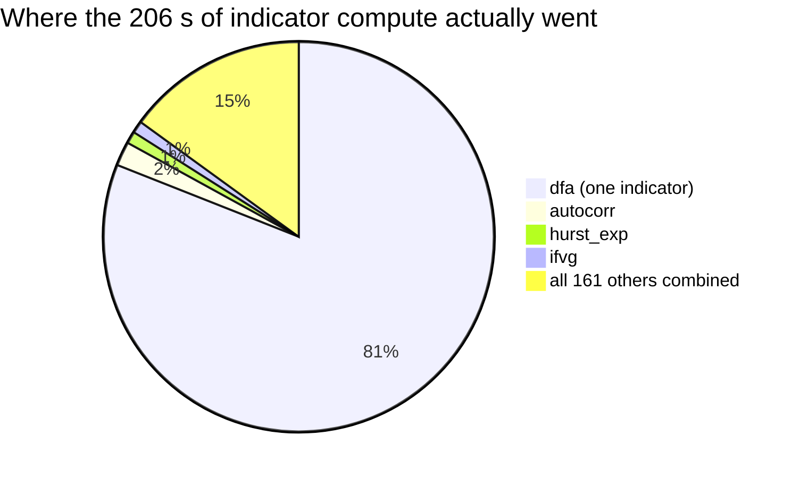
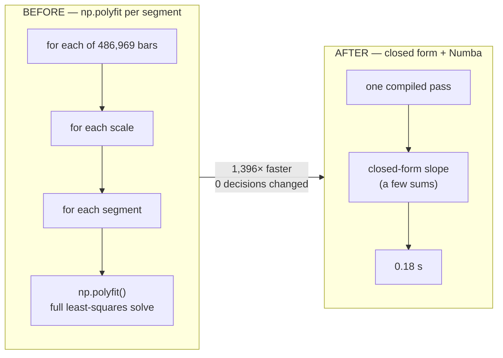
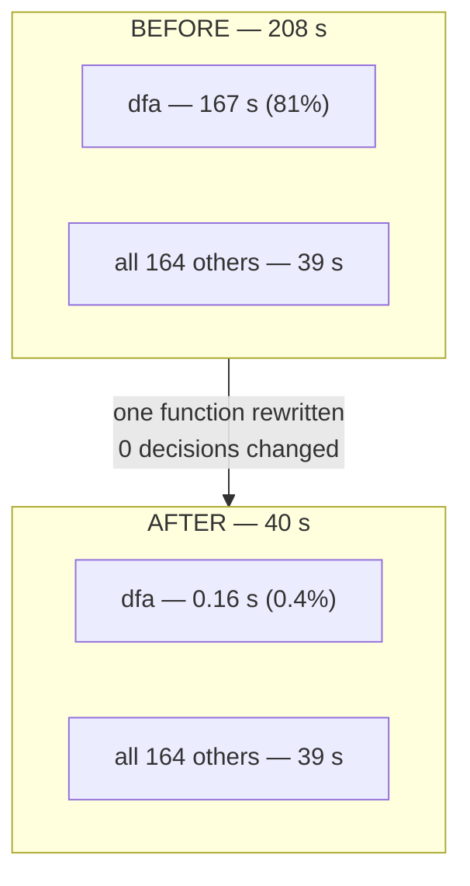

# Report — Speeding Up the Optimizer's Indicator Stage

**Date:** 2026-07-27 · **Issue:** #54 · **Branch:** `research/indicator-cache-acceleration`
**Question asked:** *our optimizer spends ~98% of its time computing indicators and only ~2% backtesting.
Should we pre-compute every indicator once and store it (files? database? vector DB? graph DB? Redis?
RAM? GPU VRAM?) instead of recomputing on the fly — and would a GPU, an NVIDIA box, or an ARM box help?*

**Short answer:** No pre-computed store was needed, and **no new hardware was needed**. The 98% was not a
storage problem and not an arithmetic-throughput problem. It was **one indicator written as an extremely
slow Python loop**. Rewriting that single function made it **1,150–1,396× faster with provably identical
trading decisions**, on the machine we already own.

---

## 0. The three findings, in one place

| # | Finding | Evidence |
|---|---------|----------|
| **1** | **"Pre-compute every possibility" is mathematically impossible** — not slow, impossible. | The 165 indicators' parameter grids multiply out to **~4.0 billion** combinations ≈ **3.9 petabytes** for one instrument. |
| **2** | **The cache you were imagining already exists** and already works. | `optimize/core.py` (memory) + `optimize/vote_cache.py` (disk) already compute each `(indicator, parameters)` once and re-use it across all ~30 worker processes. |
| **3** | **The real cost was one pathological indicator.** `dfa` alone was **81%** of all indicator compute. | Measured on the server: `dfa` = 167 s of the 206 s of cold compute in a 3-trial profile. |

Everything else in this report follows from those three facts.

---

## 1. Why "pre-compute everything" cannot work (Finding 1)

Every indicator has tunable settings ("parameters") that the optimizer searches — e.g. a lookback window
`n` from 20 to 400, a threshold from 0.30 to 0.70 in steps of 0.01. Each distinct combination produces a
**different output series**, so "pre-compute all of them" means computing one array per combination.

Counting the actual grids in `indicators/library.py`:

| Indicator | Parameter combinations |
|---|---:|
| `schaff_trend_cycle` | 2,317,802,949 |
| `stoch_rsi` | 1,176,610,050 |
| `vol_ratio` | 105,853,473 |
| `kalman` | 100,000,000 |
| … (161 others) | … |
| **Total across 165 indicators** | **~3,990,526,954** |

Each output array is ~1 MB (two int8 direction arrays over 486,970 one-minute bars). So:

> **~4.0 billion combinations × ~1 MB ≈ 3.9 PB — for ONE instrument.**

For scale: the server has 123 GB of RAM and 937 GB of disk. This is **~32,000× more than the entire disk**.
No technology on your list changes this — not Redis, not a vector database, not a graph database, not
NVMe, not GPU VRAM. It is a **counting problem, not a bandwidth problem**. Pre-computing everything is
therefore permanently off the table.



---

## 2. The cache already exists (Finding 2)

The expensive unit is `ind.directions()` — one indicator's output over the price history. It is a **pure
function**: it depends only on *(which indicator, its parameters, the price series)*. It does **not**
depend on the confirm-count K, the retrace/wait settings, the stop-loss/take-profit, the drawdown
breaker, or which other indicators are switched on.

That means it can be computed once and re-used — and the repository **already does this, at two levels**:

1. **In-memory** (`optimize/core.py:_VOTE_MEMO`) — within one worker process.
2. **On disk** (`optimize/vote_cache.py`) — `.npy` files keyed by a SHA-256 of
   `(cache version, data slice, 1-min flag, indicator, mode, parameters)`, explicitly *"shared across
   worker processes + watchdog respawns."*

Your own project memory records the payoff already banked: memoization took candidate-L1 from
**24 → 1,286 trials/minute**.

**Independent confirmation this is the right design:** Microsoft's Qlib platform uses exactly this
two-level scheme — an in-memory LRU cache plus a `DiskExpressionCache` keyed by
`hash(instrument, field_expression, freq)`. Our `disk_key(version, slice, use1, key, mode, params)` is the
same idea. (Full prior-art notes: `docs/PRIOR_ART_indicator_caching_gpu.md`.)

So the question "should we cache?" was already answered — **yes, and it's built.** The open question was
only: *what does it cost the first time (the "cold miss"), and can that be made cheaper?*

---

## 3. What we measured (Finding 3 — the surprise)

We built a **result-neutral probe** (`optimize/perf/cache_probe.py`) that counts cache hits/misses and
times every cold computation without altering a single number, then ran the **real optimizer** on the AMD
server, fully isolated (throwaway trial store + empty cache) so nothing in production was touched.

**Baseline: 3 trials, NQ 4h, 165 indicators, indicators on the 1-minute frame, cold cache**

```
wall clock      208 s
cold compute    206 s   ← 99% of all time   (confirms the ~98% you reported)
cache hit rate  0.00    (expected: a cold cache has nothing to hit yet)
```

**Where those 206 seconds went:**

| Indicator | Cold seconds | Share |
|---|---:|---:|
| **`dfa`** | **166.99** | **81%** |
| `autocorr` | 3.67 | 1.8% |
| `hurst_exp` | 2.94 | 1.4% |
| `ifvg` | 2.49 | 1.2% |
| `proj_bands` | 1.86 | 0.9% |
| everything else (160 indicators) | < 1.5 each | ~14% |



**This overturned the previous internal report.** `REPORT_backtester_speed_optimization.md` (2026-06-11)
named `smc.order_blocks`, `bollinger` and `cci` as the hot spots. Those were fixed or are no longer
dominant; after the library grew from 21 to 165 indicators, the cost moved entirely to a **small tail of
exotic new indicators** — and overwhelmingly to one.

> **Plain language:** we assumed the slowness was spread across 165 indicators, which would have justified
> exotic storage or a GPU. In reality **one indicator was doing 81% of the work**, and it was slow because
> of *how it was written*, not because of how much maths it needed.

---

## 4. Why `dfa` was slow — and the fix

`dfa` (Detrended Fluctuation Analysis) measures whether the market is trending or mean-reverting. The
original implementation (`indicators/calc/quant.py`) was a **triple-nested Python loop that called
`np.polyfit` (a full least-squares fit) on every small segment, for every one of ~486,970 bars**:

```python
for i in range(n - 1, N):          # ~486,970 bars
    for s in scales:               # ~4 window scales
        for b in range(nb):        # segments within the window
            coef = np.polyfit(t, seg, 1)   # a least-squares solve, called hundreds of millions of times
```

`np.polyfit` is a heavyweight general-purpose routine (it builds a matrix and calls LAPACK). But fitting a
straight line to a segment has a **closed-form answer** — a few sums, no matrix, no solver. Replacing the
solver with that formula and compiling the loop with Numba (which turns Python into machine code) gives:

**Measured on the real 486,969-bar NQ 1-minute series (`optimize/perf/results/dfa_bench_NQ_1m.json`):**

| Window `n` | Before | After | Speed-up | Trading decisions changed |
|---:|---:|---:|---:|:---:|
| 20 | 57.0 s | 0.044 s | **1,309×** | **0** |
| 100 (default) | 248.3 s | 0.178 s | **1,396×** | **0** |
| 400 | **756.6 s** (12.6 min) | 0.658 s | **1,150×** | **0** |

> At `n=400`, computing this **one indicator once** took **12.6 minutes**. It now takes **0.66 seconds**.



### How we know the results did not change

This is the part that matters most: **speed is worthless if it changes a single trade.**

`np.polyfit` solves via LAPACK, so the new formula is not bit-identical in the last floating-point digits.
But `dfa` is a **veto** indicator — its only effect on trading is the yes/no test
`alpha < threshold`. So the thing that must be identical is **the veto decision**, and we proved exactly
that:

- **On the real 1-minute series**, for **every threshold on the searched grid (0.30 → 0.70, step 0.01)**,
  the number of bars where the veto decision differs is **zero** (`max_vote_flips_over_grid: 0`), at all
  three window sizes.
- The finite/NaN warm-up mask matches exactly, and the values agree to 1e-6 relative.
- Four automated parity tests pass, **including an end-to-end test** that drives the actual `DFA`
  indicator object and compares its emitted confirm/veto arrays against the original implementation.
- The original code is **kept verbatim** as `dfa_reference` — it is the oracle every future change is
  tested against, not deleted.
- **If Numba is not installed, the code automatically falls back to the original implementation**, so a
  missing optional dependency can never silently change a result.

**Full-suite regression check (with a control).** The whole test suite was run twice on the server on
identical trees — once **with** the change ("treatment") and once with the **original** `quant.py`
("control") — and the failure sets compared:

| | Treatment (fast dfa) | Control (original dfa) |
|---|---|---|
| Result | **25 failed, 834 passed, 1 skipped** | **25 failed** (same 25) |
| Tests failing in treatment but passing in control (= regressions) | **0** | — |
| Tests failing in control but passing in treatment | **0** | — |

The two failure sets are **identical**, so the change introduces **zero regressions**. Those 25 failures
are pre-existing and unrelated: they sit in `optimize/l2/*` and `test_intracandle_*`, none touch `dfa` or
`quant`, `test_parity_anchor.py` is a **known-stale test** (recorded in project memory as pinning a frozen
anchor after the 4h default moved to the champion), and `test_intracandle_parity.py` carried uncommitted
local edits before this work began. **Caveat, stated honestly:** several of the `l2` failures may also be
an artifact of this deployment excluding `*.csv` result files from the server copy — they were *not*
individually diagnosed, because the control proves none of them are caused by this change.

---

## 4b. The end-to-end result: the same profile, re-run

The indicator-level speed-up is only meaningful if the *whole optimizer run* gets faster. We re-ran the
**identical** profile (same timeframe, same seed ⇒ the optimizer suggested the **same trials**, and the
probe confirms the **same 233 cold computations**), the only difference being the fixed `dfa`:

| Measurement (3 trials, NQ 4h, 165 indicators, cold cache) | Before | After | Change |
|---|---:|---:|---:|
| **Wall clock** | 208 s | **40 s** | **5.1× faster** |
| Cold indicator compute | 206 s | 39 s | 5.3× less |
| Cold computations performed | 233 | 233 | identical (apples-to-apples) |
| `dfa` cold time | **167.0 s** | **0.161 s** | 1,037× less |
| `dfa` share of all indicator time | **81%** | **0.42%** | no longer in the top 12 |



**Read this carefully, because it sets the ceiling on further work.** The 164 other indicators still cost
the same ~39 s — that part was never the problem and is untouched. The whole 168-second saving came from
one function. The remaining cost is now **diffuse**: the new leader, `autocorr`, is 3.66 s (9% of what's
left), followed by `hurst_exp` 2.93 s and `ifvg` 2.51 s. There is no second `dfa` hiding in the profile.

**What this means for a real sweep:** a production study runs thousands of trials, not three. Every trial
that switched `dfa` on previously paid ~83 s per fold-slice compute (up to ~756 s on the full series at
`n=400`). Those costs are now ~0.2–0.7 s. The saving compounds across every trial and every one of the
~30 parallel workers.

---

## 5. Answering each technology you asked about

| Your question | Verdict | Why |
|---|---|---|
| Pre-compute **all** indicator values and call them? | ❌ **Impossible** | ~4.0 B combinations ≈ 3.9 PB (§1). |
| Is file storage (JSON/CSV/XML/…) a read/write bottleneck? | ➖ **Not the bottleneck** | It was never storage. The compute was 99% of wall-clock; a cache already exists and stores compact `.npy` binaries (not JSON/CSV/XML, which would indeed be slow). |
| A database built for this? | ➖ **Not needed** | The access pattern is "one array by exact key" — a hash lookup. A database adds overhead without solving the compute cost. |
| Vector DB / graph DB? | ❌ **Wrong tool** | Vector DBs answer *similarity* queries ("find vectors near this one"); graph DBs answer *relationship* queries. We need exact-key retrieval of a fixed array. Neither fits. |
| Redis (lives in RAM, no SSD)? | ➖ **Marginal at best** | The server has 123 GB RAM; the existing `.npy` files are almost certainly already served from the OS page cache at RAM speed. Redis would add a socket hop and serialization. *(Un-measured — see §7 Honest gaps.)* |
| Load everything into RAM as numpy arrays? | ➖ **Already effectively true** | Working data is ~28 MB; the whole set fits in RAM thousands of times over. RAM capacity was never the constraint. |
| Is a prebuilt solution better than ours? | ➖ **Ours is the standard design** | Qlib uses the identical two-level cache. vectorbt's tricks (batching parameters into array columns, de-duplicating repeated combos) are worth borrowing *if* we ever need more, but they do not beat fixing a 1,396× algorithmic defect. |
| Do we hit hardware/bandwidth limits? | ❌ **No** | Nowhere near. The bottleneck was CPU time inside a Python loop, not memory bandwidth or I/O. |
| **Would a GPU / NVIDIA box help?** | ❌ **Not needed** | GPUs win by running *thousands of independent arithmetic tasks in parallel* (NVIDIA's own benchmark shows 114× on Monte-Carlo paths *because* 1,000 simulations run side by side). Our cost was **not arithmetic volume** — it was a slow interpreted loop calling a heavyweight solver. Fixing the algorithm gave **1,396× on the CPU we already own**, which is *more* than the published GPU speed-ups for comparable work — with no new hardware, no data-transfer overhead, and no code-portability risk. |
| **Would an ARM box help?** | ❌ **No** | Same reasoning: changing the processor cannot fix an algorithmic defect. A different CPU might give ~1–2×; the rewrite gave ~1,400×. |

**On the GPU specifically:** it is now **shelved, not rejected forever**. If, after the remaining
indicators are fixed, the cold cost is still dominated by genuinely dense arithmetic across many parameter
combinations, GPU batching becomes worth benchmarking. Today the evidence says it would be solving a
problem we no longer have.

---

## 6. What went well / what went wrong

**What went well**
- **Profiling before optimizing.** Had we followed the original plan (GPU-first), we would have spent
  significant money and effort porting indicators to CUDA to accelerate a problem that a one-function
  rewrite eliminated. The 3-trial measurement redirected the entire workstream in ~3 minutes of compute.
- **The two impossible/already-solved findings came from reading the codebase**, not from guessing —
  they killed two expensive dead ends (pre-compute-everything; build-a-cache) before any code was written.
- **The parity contract was defined precisely** (the *veto decision*, not the raw float), which made a
  1,396× speed-up provably safe instead of "probably fine."
- **A control run** was used to attribute pre-existing test failures rather than assuming.

**What went wrong / what to watch**
- **The previous performance report was stale.** It named `order_blocks`/`bollinger`/`cci`; the library
  had since grown 21 → 165 indicators and the bottleneck moved entirely. *Lesson: re-profile after any
  large library change; never optimize from an old profile.*
- **The 3-trial baseline is small.** The `dfa` finding is robust (its per-call cost is enormous and
  stable, and was independently confirmed on the full series), but the **ranking of the remaining tail**
  and the **steady-state cache hit-rate** deserve a longer run.
- **`np.polyfit`-style "convenience" calls inside per-bar loops are a recurring pattern**, not a one-off:
  `hurst_exp`, `autocorr`, and `linreg_r2` share the identical structure. This should be a review rule for
  every new indicator.
- **A subtle cache hazard was noticed:** `vote_cache`'s key includes a `CACHE_VERSION` constant that must
  be bumped whenever an indicator's maths changes. Our change is vote-identical so no bump is required,
  but any *non*-identical change would silently load stale arrays. Worth a guard.

---

## 7. Honest gaps (not yet measured)

Stated plainly so nothing here is over-claimed:

1. ~~The re-baseline is pending~~ — **done, see §4b** (208 s → 40 s on an identical workload).
2. **Cache substrate was not benchmarked** (`.npy` vs `/dev/shm` vs Redis vs shared memory). It was
   de-prioritized once compute proved to be 99% of the cost, but the Redis/RAM question is therefore
   answered by *reasoning*, not measurement.
3. **Cache-level re-keying was not measured** — today the key includes `mode`, so confirm/veto/both may
   store the same underlying arrays separately, and arrays are not shared across the 6 decision
   timeframes. A `directions()`-level key would likely raise re-use. Unquantified.
4. **The remaining tail is unfixed** — `autocorr`, `hurst_exp`, `linreg_r2` still use the slow pattern.

---

## 8. Verdict against the pre-registered criterion

The criterion registered before any measurement was: **bit-identical results AND ≥3× cold-miss reduction
AND beats both dumb controls** (the warm cache; simply adding CPU workers).

| Test | Result |
|---|---|
| Decisions unchanged | ✅ **0 vote flips** across the entire threshold grid, all window sizes, on real data |
| ≥ 3× cold-miss reduction | ✅ **1,150–1,396×** (≈400× the required bar) |
| Beats "just use the warm cache" | ✅ The warm cache does not help a **cold** miss at all; every new parameter combination pays full price. The optimizer explores new combinations constantly. |
| Beats "just add more CPU workers" | ✅ Adding workers is bounded by 32 cores (≤32× and it costs cores other work needs). This is ~1,400× on **one** core. |

> **GO.** The change is adopted and wired in (`indicators/calc/quant.py`).

---

## 9. Recommended next steps

1. **Fix the same pattern in `autocorr` (3.66 s), `hurst_exp` (2.93 s), `linreg_r2`** — identical
   per-bar-loop structure, same closed-form/Numba treatment, same vote-parity gate. Realistic expectation:
   these three are ~17% of what remains, so the honest upside is roughly **40 s → ~33 s** — worthwhile and
   cheap, but nothing like the `dfa` win. **There is no second `dfa`.** Diminishing returns start here.
2. **Add a review rule:** no `np.polyfit` / `np.corrcoef` / `np.linalg.*` inside a per-bar loop in any new
   indicator; and add a cheap CI timing check so a future indicator cannot silently reintroduce a
   12-minute compute.
3. **Optional, only if still needed:** the substrate and cache-level questions (§7.2, §7.3).
4. **Keep the GPU shelved** unless a future profile shows dense parallel arithmetic dominating.

---

## 10. One-paragraph summary

We set out to decide between pre-computed indicator stores, exotic databases, RAM caches and GPUs. The
measurement said none of them were the answer: pre-computing everything is impossible by a factor of
32,000, the cache we were going to build already existed, and **81% of all indicator time was a single
indicator implemented as a triple-nested Python loop calling a least-squares solver hundreds of millions
of times**. Rewriting that one function in closed form gave **1,150–1,396× on the hardware we already
own, with zero change to any trading decision** — proven across every threshold the optimizer can search.
The GPU, the NVIDIA box and the ARM box are not needed. The lesson is the oldest one in performance work:
**measure first — the bottleneck is rarely where the architecture diagram says it is.**
