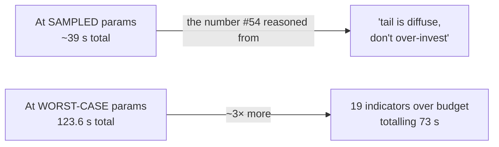

# Report — Is the Post-`dfa` Tail Really Diffuse?

**Date:** 2026-07-27 · **Issue:** #56 · **Branch:** `research/post-dfa-tail`
**Claim under test (from #54):** *"There is no second `dfa`. The rest is diffuse — realistically
~40 s → ~33 s. Don't over-invest."*

---

## 0. Verdict: **half right, and the wrong half mattered**

| The #54 claim | Verdict |
|---|---|
| "There is no second `dfa`" (no single 756-second monster) | ✅ **Correct** — the worst remaining indicator is 6.6 s, not 756 s |
| "The rest is diffuse … ~40 s → ~33 s. Don't over-invest." | ❌ **Too optimistic** — it was measured at the parameters the optimizer *happened to sample*. At **grid edges**, **19 of 165** indicators blow a 2-second budget, totalling **73 s** |

**Why the original claim was wrong in the way it was wrong:** it repeated the exact mistake that let `dfa`
hide for eight months — **profiling at sampled/default parameters instead of the worst case**. `dfa` cost
57 s at `n=20` and 756 s at `n=400`. Any claim about cost that does not name the parameters is incomplete.

**The corrected picture:** computing all 165 indicators once on the full 1-minute frame costs
**~39 s at sampled parameters** but **123.6 s at worst-case parameters** — about **3× more** than the
number #54 reasoned from. The optimizer *will* reach those corners; it searches the whole grid.

---

## 1. Method — the worst-case parameter scan

`optimize/perf/bench_worstcase.py` times **every** registered indicator's `directions()` at three points in
its own grid — **defaults**, **all-parameters-minimum**, **all-parameters-maximum** — takes the worst, and
projects to the full 486,969-bar frame. Two stages so one pathological indicator cannot stall the scan,
with a hard per-config timeout (a timeout is itself a finding).

**A measurement trap caught during this work — worth recording.** The first scan reported `dfa` at
**5.52 s**, against a *known measured* **0.178 s**. The cause: the scan timed the **first** call, which for
a Numba indicator includes **JIT compilation**, then extrapolated that one-off cost ×24 to the full frame.
JIT compile is amortized across an entire sweep, not per-bar work. The scan now calls each configuration
**twice and times only the second**. Had this not been caught, the report would have "discovered" a
regression in the indicator we had just made 1,396× faster.

> This is exactly the *"verify, don't assume"* rule paying for itself: the anomaly was only visible because
> an independently measured number existed to contradict it.

---

## 2. Results — worst-case cost across all 165 indicators

**19 indicators over a 2-second full-frame budget** (before this issue's fixes):

| indicator | worst config | projected full-frame | vs its cost at sampled params |
|---|---|---:|---|
| `autocorr` | all_max | **9.40 s** | 3.66 s → **2.6× worse at the edge** |
| `sinewave` | default | 6.42 s | — |
| `ifvg` | default | 5.30 s | 2.51 s |
| `hurst_exp` | all_max | **5.09 s** | 2.93 s → 1.7× worse |
| `proj_bands` | all_max | 4.78 s | 1.85 s |
| `ou_halflife` | all_max | 4.16 s | 1.58 s |
| `cmo_chande_dmi` | default | 3.88 s | — |
| `linreg_channel` | all_max | 3.66 s | 1.41 s |
| `ichimoku_tk_cross` | all_min | 3.34 s | — |
| `ichimoku_cloud` | default | 3.33 s | — |
| `schaff_trend_cycle` | default | 3.32 s | 1.34 s |
| `lsma` | all_max | 3.07 s | — |
| `linreg_r2` | all_max | 2.99 s | — |
| `order_block` | all_min | 2.73 s | — |
| `frama` | default | 2.69 s | 1.07 s |
| `chande_kroll` | all_max | 2.47 s | 0.99 s |
| `mama_fama` | default | 2.27 s | — |
| `smi` | default | 2.14 s | — |
| `ulcer` | all_max | 2.09 s | 0.79 s |

**Totals:** 19 over budget summing **73.1 s**; all 165 indicators at worst case **123.6 s**.
No timeouts, no errors — the scan is clean across the whole registry.

---

## 3. What was fixed here

The two worst offenders that share the known per-bar-loop pattern, treated exactly like `dfa`
(closed-form / Numba, original kept verbatim as a `*_reference` oracle, graceful fallback without numba):

| indicator | worst-case before | after | speed-up | **vote flips** |
|---|---:|---:|---:|:---:|
| `autocorr` (n=200) — `np.corrcoef` per bar → closed-form Pearson | **9.47 s** | 0.081 s | **116×** | **0** |
| `hurst_exp` (n=400) — per-bar numpy temporaries → one compiled pass | **5.24 s** | 0.233 s | **22×** | **0** |

**Parity:** identical finite/NaN masks, float-close values, and **zero** differing veto decisions across
each indicator's entire searched threshold grid (`autocorr` 0.01→0.50; `hurst_exp` 0.30→0.70), on the real
486,969-bar series. 8 parity tests green, including end-to-end tests driving the real Indicator objects.

**Effect on the worst-case total:** **123.6 s → 111.1 s**; over-budget indicators **19 → 17**
(summing 73.1 s → 60.2 s). Both fixed indicators dropped off the over-budget list entirely.

---

## 4. So — how much is actually left, honestly?

**17 indicators remain over budget, totalling ~60 s at worst case.** The new leaders are `sinewave`
(6.57 s), `ifvg` (5.15 s), `proj_bands` (5.11 s), `ou_halflife` (4.35 s), `cmo_chande_dmi` (3.98 s).

**Is it worth continuing?** A qualified yes, with clear-eyed expectations:

- **No single fix will be dramatic.** The largest remaining is 6.6 s (6% of the worst-case total). The era
  of 1,396× wins ended with `dfa`.
- **But the aggregate is real.** ~60 s of avoidable worst-case cost across 17 indicators, and the two fixes
  here took roughly an hour each including parity proof. The pattern and the recipe are now established.
- **The right stopping rule is a budget, not a feeling.** Fix indicators until none exceeds the 2 s
  budget, then stop. That is a defined finish line; "the tail feels diffuse" is not.

**Corrected ceiling estimate:** fixing the remaining 17 to budget would take the worst-case total from
**111 s to roughly ~50 s**. That is a much better return than the "~40 → ~33 s" #54 projected — because
#54 was measuring the wrong scenario.

---

## 5. What went well / what went wrong

**Went well**
- The worst-case scan **found the flaw in our own prior conclusion**, which is what it was built for.
- The **JIT-warm-up artifact was caught before it became a reported finding**, only because a previously
  measured number contradicted it.
- The `dfa` recipe generalized cleanly: two more indicators fixed with the same pattern, same parity
  contract, zero decision changes.

**Went wrong / to watch**
- **#54 asserted a cost ceiling from sampled-parameter data.** That is the same class of error that let
  `dfa` hide. The playbook rule (P4, "profile the worst case, not the default") existed *because* of `dfa`
  — and the very next report still violated it. Rules only work if applied to one's own conclusions too.
- **`sinewave`, `ifvg`, `cmo_chande_dmi`, `ichimoku_*` are expensive at DEFAULT parameters**, meaning they
  are paid on essentially every trial that enables them — arguably higher priority than grid-edge cases.
- The projection is **linear extrapolation** from a 20,000-bar subset. Sound for fixed parameters
  (per-bar work is constant), and spot-confirmed at full scale for `autocorr`/`hurst_exp` (9.40→9.47 s and
  5.09→5.24 s projected vs measured — within 3%), but it is an estimate for the others.

---

## 6. Recommended next steps

1. **Adopt the 2-second budget as a rule** and work the remaining 17 down to it, highest-first.
   Prioritize the ones expensive at **default** parameters (`sinewave`, `ifvg`, `cmo_chande_dmi`,
   `ichimoku_cloud`) over grid-edge-only offenders — they are paid far more often.
2. **Wire `bench_worstcase.py` into the expansion-round checklist** (#57) so every new indicator is scanned
   at its grid corners before merge. This is the automated version of playbook rule P4.
3. **Correct the record:** #54's "~40 → ~33 s, don't over-invest" is superseded by this report.

---

## 7. Honest gaps

1. **Projections for the 17 unfixed indicators are extrapolated**, not measured at full scale (validated
   to within 3% on the two that were).
2. **Only two configurations per indicator** (all-min / all-max) plus defaults. A cost peak at a *mixed*
   parameter corner would be missed — the true worst case could be higher.
3. **`directions()` only.** Cost inside the vote-sampling and gate assembly is not attributed here.
4. **Single instrument (NQ), single 1-minute series.** Cost should be data-shape-independent for fixed
   parameters, but this was not verified across instruments.
