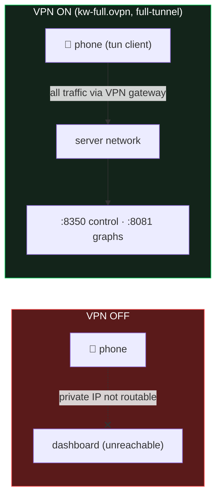
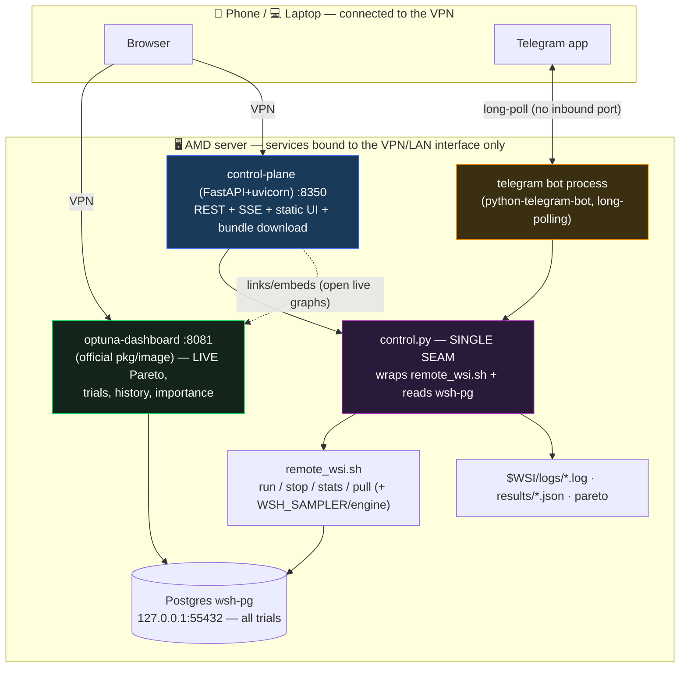
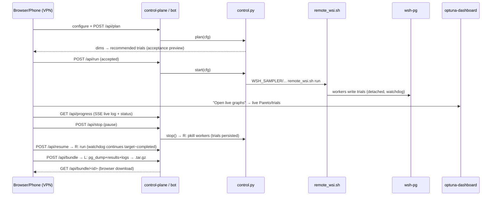

# SPEC — Optimizer Control & Visualization Dashboard

## 0. One-line goal
Expose **every optimizer parameter, control, log, status and live graph** through a dashboard hosted **on
the AMD server** and reachable from laptop **or phone over the existing VPN** — so a run can be configured,
launched, paused, watched (live Pareto + trials), and its full data pulled, without SSH gymnastics.

## 1. Locked decisions (from brainstorming, 2026-06-16)
| # | Decision | Choice |
|---|---|---|
| D1 | Build vs reuse | **Hybrid** — reuse `optuna-dashboard` for all visualization; build a thin control plane for the rest |
| D2 | Remote access | **Over the existing VPN** (`kw-full.ovpn`); bind to the VPN/private interface; **no public port** (see §3.0) |
| D3 | Pause semantics | **Stop-as-pause** — `stop` kills workers (completed trials persist in Postgres); `resume` relaunches and the watchdog continues from `target − completed`. **No optimizer-engine change.** |
| D4 | Telegram | **Full bot in v1** — notify **and** control, with a **chat-id allowlist** |
| D5 | Containerization | **Plain processes for v1**, docker-compose later (P-F) |
| D6 | Control-plane tech | **FastAPI + uvicorn** (web API + SSE) and **python-telegram-bot** (polling), sharing one `control.py` |
| D7 | "Pull to local" | **Server-prepared bundle** (`pg_dump` + results + logs + Pareto) served as a **browser download**, because the dashboard runs on the server (it cannot push to the laptop) |

## 2. Non-goals (v1)
- Not user-friendly "consumer" polish — **developer-mode is fine** (per user).
- **No public internet exposure** (VPN only). No new auth system beyond the VPN + Telegram allowlist.
- **No re-implementation of Pareto/trial charting** — that is optuna-dashboard's job.
- **No optimizer-engine modification** (golden stays byte-identical). True cooperative pause is explicitly out (D3).
- Click-a-Pareto-point → backtest drill-down is a **later nice-to-have**, not v1.

## 3.0 Access model (how reachability works — verified)
The `kw-full.ovpn` profile connects to the OpenVPN server **at the same box** (`remote 78.89.209.212:1194`,
`dev tun`, `proto udp`) and uses **`redirect-gateway def1` = full-tunnel**. So a connected client (phone or
laptop) is routed **inside the server's network** and can reach the server's **private IP:port** directly —
exactly like Twingate. When **not** connected, that private IP is not routable from the public internet, so
the dashboard is **invisible**.



**Hard rule that makes this hold:** every dashboard service **binds to the server's private/VPN IP only —
never the public IP and never `0.0.0.0`** (binding `0.0.0.0` would also listen on the public IP, defeating
the VPN-only intent). The exact private IP to bind (LAN `private_ip` vs the OpenVPN tun IP) is confirmed
once from the phone in **P-A** — a one-line check, not a design unknown. Optional defense-in-depth: a host
firewall rule dropping the public side of the dashboard ports.

## 3. Architecture



**Design principle:** `control.py` is the **only** module that knows how to talk to `remote_wsi.sh` and
Postgres. The FastAPI app and the Telegram bot are thin presenters over it — so the risky seam (shelling
out + DB reads) is written and tested **once**, and either front-end can be changed without touching it.

## 4. Components & interfaces

### 4.1 `optimize/dashboard/control.py` — the seam (pure library, no web)
A small set of functions, each one clear job, each independently testable (mock the subprocess / DB):
| Function | Returns | Notes |
|---|---|---|
| `config()` | dict: samplers (P2 list), engines (`single`/`two_stage`+`cmaes`/`gp`), search-space bounds (from `sl_tp_bounds.json` + `library.schema()`), presets, TFs, defaults | feeds the UI form |
| `plan(cfg)` | dict: dims breakdown + recommended trials | wraps `optimizer.print_plan`/`recommended_trials` (acceptance preview) |
| `start(cfg)` | dict: launch status | builds env (`WSH_SAMPLER`, engine, `WSH_PREFIX`, `WSH_SPLIT`, `WSH_CONFIRM=1`, …) + calls `remote_wsi.sh run`; idempotent |
| `stop()` | dict | `remote_wsi.sh stop` (= pause) |
| `resume(cfg)` | dict | `remote_wsi.sh run` with the same target/prefix |
| `status()` | dict: per-TF complete/feasible/running/pruned/fail, uptime, alive workers, best P/L@DD | wraps `stats --json` + `pgrep` + a best-trial query |
| `tail_logs(tf, n)` / `follow_logs()` | str / generator | reads `$WSI/logs/<tf>.log`; `follow_logs` yields new lines for SSE |
| `build_bundle(mode)` | path to `.tar.gz` | `mode="full"`: `pg_dump` studies + `results/*.json` + logs + Pareto; `mode="lite"`: results + logs + Pareto only. Both shipped. |

### 4.2 `optimize/dashboard/app.py` — FastAPI control plane (:8350)
REST + SSE, serves the static UI. All handlers are 1–5 lines delegating to `control.py`.
| Method · path | Body / params | Does |
|---|---|---|
| `GET /api/config` | — | `control.config()` (+ current `status()`) |
| `POST /api/plan` | cfg | `control.plan(cfg)` — dry-run preview |
| `POST /api/run` | cfg | `control.start(cfg)` |
| `POST /api/stop` | — | `control.stop()` (pause) |
| `POST /api/resume` | cfg | `control.resume(cfg)` |
| `GET /api/status` | — | `control.status()` |
| `GET /api/progress` | `?tf=` | **SSE**: streams live log lines + periodic status |
| `POST /api/bundle` | `?mode=full\|lite` | kicks `control.build_bundle(mode)` (async), returns job id. **full** = `pg_dump` + results + logs + Pareto; **lite** = results + logs + Pareto only. **Both ship in v1.** |
| `GET /api/bundle/<id>` | — | downloads the prepared `.tar.gz` (browser pull); reports size first |
| `GET /` and static | — | serves the control UI |

Request model validated with Pydantic; bad config → 400 with a clear message (mirrors the backtester
dashboard's no-silent-fallback rule).

### 4.3 `optimize/dashboard/static/index.html` — control UI (one vanilla file, no build)
Reuses the existing dashboard's proven patterns: schema-driven panel from `GET /api/config`, inline-math
number inputs (`.mathnum`), TradingView CSS theme, dirty-tracking, fetch helpers.
- **Config panel:** sampler · engine (single/two-stage + stage-B) · trials / `--auto-trials` (with live **plan
  preview**) · folds · min-trades · timeframes · split-sltp · ind-1min · warm-start · prefix · **full bounds**.
- **Controls:** **Start · Pause · Resume**, each gated by the plan preview (dims → recommended trials).
- **Status cards:** per-TF complete/feasible/running/pruned/fail · uptime · alive workers · best P/L@DD.
- **Live log:** SSE scrollback (auto-tail, pausable).
- **Buttons:** **"Open live graphs"** → optuna-dashboard (:8081) · **"Download full data"** → bundle.

### 4.4 `optimize/dashboard/bot.py` — Telegram bot (separate process)
`python-telegram-bot`, **long-polling** (no inbound port — works behind the VPN/NAT). Shares `control.py`.
- **Notify (push):** run started/finished · milestone trial counts · **NEW champion** · worker died/error ·
  **Pareto snapshot image** (rendered from the store).
- **Commands:** `/status` · `/stop` · `/resume` · `/run <preset>` · `/pareto` · `/pull` (sends bundle link).
- **Security:** token in env; **chat-id allowlist** — non-allowlisted chats are ignored. Notifications are
  driven by a lightweight poller in the bot process diffing `status()` (no engine hooks).

### 4.5 optuna-dashboard deployment
Run the official package/process against `wsh-pg`, bound to the VPN/LAN interface:
`optuna-dashboard postgresql+psycopg2://…@127.0.0.1:55432/wsh --host <vpn-ip> --port 8081`.
No code — config + a launch line in the run script. (Docker image deferred to P-F.)

### 4.6 `remote_wsi.sh` extension (small, additive)
Accept new env so the UI can pick the brain/engine: `WSH_SAMPLER` (→ `--sampler`), `WSH_ENGINE`
(`single`|`two_stage`) and stage-B engine (→ `optimize.two_stage` with `--stage-b`). Default unset ⇒
**current behaviour unchanged** (nsga3 single-study). Keeps the acceptance gate (`WSH_CONFIRM=1` to skip
from the API after the UI already showed the plan).

## 5. Run lifecycle (sequence)



## 6. Security
- All HTTP services **bound to the VPN/LAN interface only** (never `0.0.0.0` on the public IP); Postgres
  stays `127.0.0.1`.
- Secrets (Telegram bot token, allowlisted chat-ids, any DB URL) live in a **gitignored
  `optimize/dashboard/dashboard.env`** (same pattern as `pg.env`); **never committed**.
- Telegram: **chat-id allowlist** enforced on every update; unknown senders ignored silently.
- No new credentials in the repo; no secret echoed into logs or the bundle.

## 7. Testing strategy
- **`control.py` unit tests** (the seam): mock `subprocess`/DB → assert correct command + env built for
  `start/stop/resume`, status parsing, bundle manifest. The only logic-heavy module → most tests here.
- **API tests** (FastAPI `TestClient`): each endpoint validates input, calls the right `control.py` fn
  (monkeypatched), returns the right shape; bad config → 400.
- **Bot tests:** allowlist enforcement (non-allowlisted chat → ignored); command → right `control.py` call.
- **Smoke (server):** stand up against `wsh-pg`, start a tiny run, confirm trials appear in optuna-dashboard,
  stop, resume continues, bundle downloads + `pg_restore` loads locally.
- **No golden impact:** dashboard never imports the engine for scoring; `remote_wsi.sh` change is additive
  and default-off → golden 6/6 must remain untouched (verified once after the script edit).

## 8. Phasing → workstream (P-A … P-F)
Each phase: implement → test → verbose doc (Mermaid only) → checkpoint in the workstream tracker.
| Phase | Deliverable | Acceptance |
|---|---|---|
| **P-A** | optuna-dashboard live on the server vs `wsh-pg`, VPN-reachable | open it from phone over VPN, see live Pareto of the current study |
| **P-B** | `control.py` + `remote_wsi.sh` env extension + FastAPI API (config/plan/run/stop/resume/status/progress) | unit + API tests green; can start/stop/resume a tiny run via `curl` |
| **P-C** | control web UI (schema panel, controls, status cards, SSE log, links) | configure + launch + watch + pause from the browser over VPN |
| **P-D** | data-bundle build + download | one click → `.tar.gz` downloads; `pg_restore` loads it locally |
| **P-E** | Telegram bot (notify + control + allowlist + Pareto image) | alerts arrive on new champion; `/status`,`/stop`,`/resume`,`/pull` work; non-allowlisted ignored |
| **P-F (later)** | docker-compose (optuna-dashboard + control plane + bot, beside wsh-pg) | `docker compose up` brings the whole dashboard up on a fresh host |

## 9. File layout (new)
```
optimize/dashboard/
  SPEC_optimizer_dashboard.md     # this file
  control.py                      # the seam (P-B)
  app.py                          # FastAPI control plane (P-B/P-C)
  bot.py                          # Telegram bot (P-E)
  static/index.html               # control UI (P-C)
  run_dashboard.sh                # launches optuna-dashboard + uvicorn + bot (P-A/P-C/P-E)
  docker-compose.yml              # (P-F)
  dashboard.env.example           # documents env keys; real dashboard.env gitignored
  test_control.py / test_app.py / test_bot.py
```

## 10. Risks & open items
- **VPN access model — RESOLVED (see §3.0):** profile is full-tunnel (`redirect-gateway def1`) to the box, so
  a connected client reaches the server's private IP:port; not connected ⇒ invisible. Only open item is the
  **one-line bind-IP confirmation from the phone** in P-A (LAN `private_ip` vs OpenVPN tun IP). Hard rule:
  bind private-only, never `0.0.0.0`/public.
- **optuna-dashboard on the server venv:** `pip install optuna-dashboard` into `REMOTE_VENV`; confirm it reads
  the multi-objective study's Pareto correctly (it does per docs) — validated in P-A.
- **`pg_dump` availability** in the wsh-pg container / server — confirm in P-D (fallback: dump per-study trials
  to parquet via Optuna API).
- **Bundle — RESOLVED:** ship **both** modes (full `pg_dump`+results+logs+Pareto, and lite results+logs+Pareto);
  report size before download. (§4.1/§4.2)
- **Secrets:** the Telegram bot token + OpenVPN creds already exist in the **gitignored `SERVER_DATA.env`**;
  the dashboard reads the token from env (or a gitignored `dashboard.env`). **Never staged/committed.**
