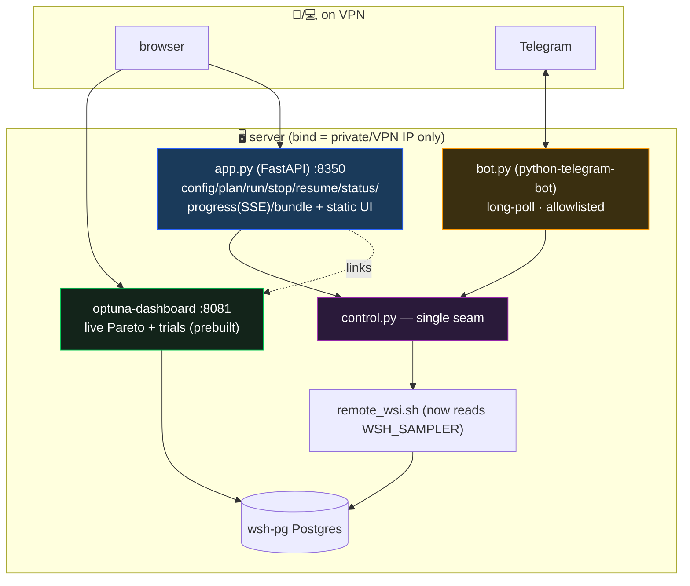

# Optimizer Control & Visualization Dashboard — build report

> Spec: `optimize/dashboard/SPEC_optimizer_dashboard.md` · Plan: `PLAN_optimizer_dashboard.md` ·
> Tracker: `WORKSTREAM_optimizer_dashboard_TRACKER.md`.

## 1. What was built (P-A…P-E)



| Phase | Built | Files | Tests |
|---|---|---|---|
| **P-A** | deps + launcher + env template + gitignore | `requirements.txt`, `run_dashboard.sh`, `dashboard.env.example`, `.gitignore` | deps import OK |
| **P-B** | control seam + `remote_wsi.sh` `--sampler` + FastAPI API | `control.py`, `app.py`, `remote_wsi.sh` | `test_control.py` 10/10 · `test_app.py` 9/9 |
| **P-C** | control web UI (vanilla, cloned theme/math/fetch patterns) | `static/index.html` | live uvicorn serve HTTP 200; TestClient `/` |
| **P-D** | data bundle (full \| lite) build + download | `control.build_bundle`, `app.py` `/api/bundle` | covered in `test_app.py` |
| **P-E** | Telegram bot (notify + control, allowlist) | `bot.py` | `test_bot.py` 7/7 |

**Total: 26 dashboard tests green; golden 6/6 unchanged** (the only engine-adjacent change — `remote_wsi.sh`
`--sampler` — is additive/default-off, verified unset→unchanged).

## 2. Key behaviors (as built)
- **`control.py` is the single seam**: `_run_remote` wraps `remote_wsi.sh`; everything else (config/plan/
  start/stop/resume/status/tail_logs/follow_logs/build_bundle) is pure + mockable. The API and bot are thin.
- **Pause = stop** (`/api/stop` → `remote_wsi.sh stop`); **Resume** relaunches (watchdog continues target−completed).
- **Sampler picker (P2)** flows via `WSH_SAMPLER` → `remote_wsi.sh --sampler` (default unset ⇒ nsga3 unchanged).
- **Engine picker**: `engine=single` → `remote_wsi.sh run` (NSGA-III watchdog path); **`engine=two_stage`
  (P3) → `remote_wsi.sh two-stage <tfs>`** — a separate detached, **non-watchdog** launch (two-stage runs
  finite in-memory studies with no trial-count target, so it is launched once with no respawn; stage-B/
  trials/top-K tunable via `WSH_STAGE_B`/`WSH_STAGE_A_TRIALS`/`WSH_STAGE_B_TRIALS`/`WSH_TOP_K`).
- **Plan preview** gates the Start button (must POST `/api/plan` first → dims → recommended trials).
- **Live log** via SSE (`/api/progress?tf=`); **status cards** poll `/api/status` (`stats --json`).
- **Data bundle**: server builds `.tar.gz` (full = +`pg_dump`; lite = results+logs+Pareto), browser downloads.
- **Telegram**: `/status /stop /resume /pull`, **chat-id allowlist** enforced; `new_champions()` diff drives alerts.
- **VPN-only**: `run_dashboard.sh` binds every service to `DASH_BIND_IP` (private), never `0.0.0.0`.

## 3. Deviations from the plan (and why)
- ~~**Two-stage engine NOT routed through `remote_wsi.sh`**~~ — **RESOLVED (2026-06-17, follow-up #3).** Added a
  dedicated `remote_wsi.sh two-stage <tfs>` command: a detached, **non-watchdog** launch of
  `python3 -m optimize.two_stage` per TF (one finite run, no respawn — the watchdog's trial-count target
  doesn't apply to two-stage's in-memory studies). `control.start()` now branches on `engine`: `single` →
  `run`, `two_stage` → `two-stage`. `cmd_stop` kills both. New test
  `test_start_two_stage_routes_to_two_stage_cmd` (27 dashboard tests total); golden 6/6 unchanged (additive).
  Note: two-stage still does NOT surface in optuna-dashboard (in-memory studies) — progress is the per-TF log
  the SSE already tails; the final champion prints at the end of that log.
- **Per-task commits skipped**: per the standing "commit only when asked" rule — all work is uncommitted on `dev`.

## 4. Remaining (deploy-time — needs the AMD server over SSH)
- **P-A.3:** `pip install` deps into `REMOTE_VENV`; create `dashboard.env` (real `WSH_STORAGE_URL` from
  `$WSI/pg.env`, `DASH_BIND_IP`); launch optuna-dashboard and **confirm the bind IP reachable from the phone
  over VPN** (LAN `private_ip` vs OpenVPN tun IP).
- **Server smoke:** `run_dashboard.sh` → start a tiny run from the UI → trials show in optuna-dashboard → Pause/
  Resume → both bundles download + `pg_restore` the full one locally → bot `/status` replies + champion alert.
- **P-F (later):** docker-compose for one-command redeploy (spec D5).

## 5. How to launch (on the server)
```bash
cp optimize/dashboard/dashboard.env.example optimize/dashboard/dashboard.env   # fill bind IP, storage URL, bot token
bash optimize/dashboard/run_dashboard.sh        # optuna-dashboard :8081 + control :8350 + bot
# phone on VPN → http://<DASH_BIND_IP>:8350 (control)  ·  :8081 (live graphs)
```
