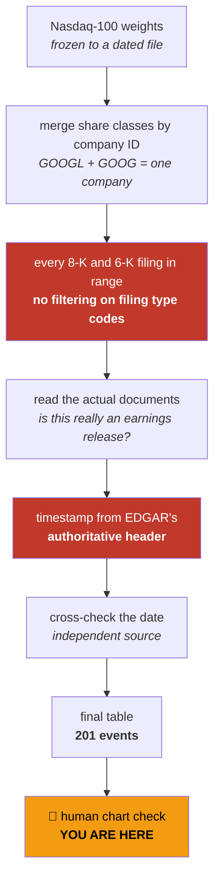
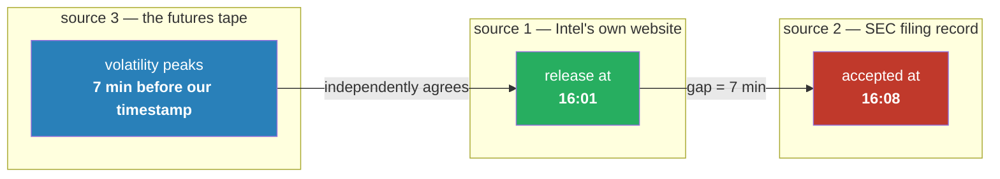
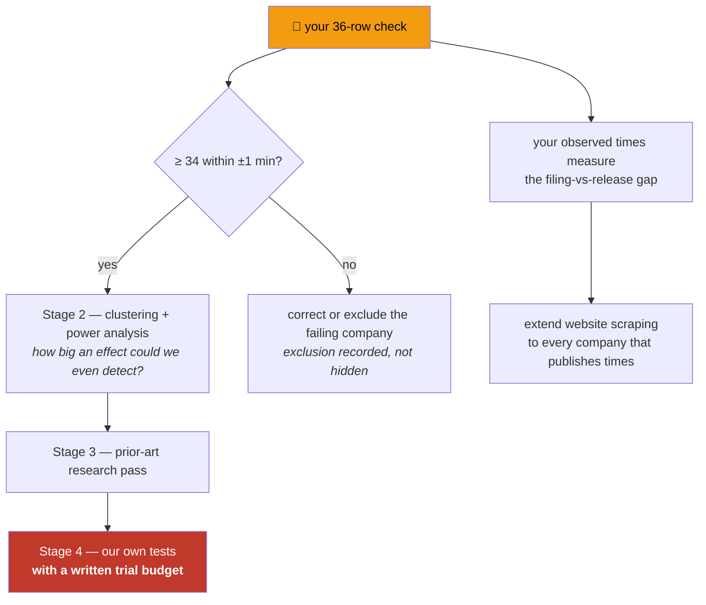

# WS-EARN Stage 1 — full report

**The earnings announcement timestamp table.** Everything built, everything found, everything still
unknown — and the 36 rows I need you to check.

---

## 1. In plain language, what this is

We want to know whether earnings announcements by the biggest Nasdaq companies move the Nasdaq price in
a way we can predict or trade. Before any of that can be asked, we need to know **exactly when each
announcement happened** — to the minute. Get that wrong and every later measurement is measuring the
wrong moment.

That is all Stage 1 does: build the clock. No trading logic, no strategy, no prediction.

**It is not finished.** Everything below is machine-verified. The one thing a machine cannot do is
confirm that a timestamp is the moment the market actually reacted. That is section 10, and it is yours.

---

## 2. What you asked for, and what you got

| you asked for | delivered |
|---|---|
| top 12 of the Nasdaq-100 | **top 20 collected**, so the 12 can be sliced either by today's weights or point-in-time later, without re-collecting |
| earnings date **and time** | **to the second**, not the minute |
| within 1 minute error margin | precision achieved; **accuracy still needs your check** — see §7, this turned out to be the hard part |
| a table to verify against TradingView | 36-row worksheet, §10 |

**Companies:** 19, not 20. `SPCX` (SpaceX) sits at rank 7 with 3.73% of the index but only recently went
public — it has **no earnings history** in our window. Excluded, and the exclusion is recorded rather
than quietly dropped.

---

## 3. The numbers

| | |
|---|---|
| **earnings announcements** | **201** |
| companies | 19 |
| span | 2024-01-01 → 2026-08-04 |
| timestamp precision | **to the second**, US-Eastern wall-clock |
| events with NQ price data | 184 |
| top-12 subset | 127 events / 115 with price data |
| **effectively independent 60-minute windows** | **154** |
| when they happen | **180 after the close, 20 before the open, 1 mid-session** |

### Why 154 matters more than 201

Several companies report on the same evening — Amazon, Meta and Apple all reported within one hour on
2024-02-01. When that happens the Nasdaq's reaction is **one** event, not three. Counting it as three
would inflate our sample and make weak findings look strong.

Collapsing overlapping events gives **154 genuinely independent observations**.

> **For scale:** the indicator search that occupied this project for months had roughly **5** independent
> trials to work with. This question has **154**. It is genuinely powered in a way that one never was.

⚠️ **The trap that comes with that.** The plan mentions trying ~2,000 approaches. Two thousand attempts
against 154 observations is the *same* multiple-testing failure that produced 1 pass in 8 pre-registered
criteria — just wearing different clothes. The search budget and the correction for multiple testing
must be fixed **in writing before Stage 5 runs**, not chosen afterwards.

---

## 4. How the table is built

The two red boxes are where the bodies were buried. Both are explained below.

---

## 5. Six defects found — none of which announce themselves

Every one of these produces a plausible-looking table. Nothing errors, nothing warns.

### 5.1 🔴 The government's own data feed is inconsistent

The SEC publishes filing times through a modern JSON feed, tagged with a `Z` meaning "this is UTC time".
**For some filings it is not UTC — it is New York time with a `Z` incorrectly attached.**

| filing | JSON feed says | SEC's authoritative header says | so the JSON is |
|---|---|---|---|
| Microsoft | `16:04:53Z` | `160453` | **New York time** — same digits |
| Apple | `20:30:28Z` | `163028` | **real UTC** — 4 hours apart |

Both companies release just after the 16:00 close, and the authoritative header puts both there
correctly. Trusting the JSON put **Microsoft's earnings at 12:04 in the afternoon** — four hours early,
in the middle of the trading day instead of after the close.

**Why it matters concretely:** you would measure ordinary lunchtime trading and call it the earnings
reaction, while the real reaction sat outside your window entirely. **22 of 201 events affected** (all
of Microsoft, all of Lam Research).

**How it was caught — this is the part worth remembering.** Not by reading the data. By a consistency
check: Microsoft's average release time came out as *12:03 with a ±60 minute spread*. Companies release
earnings on a schedule; that is not what a schedule looks like. Apple's was 16:30:28 with **zero**
spread. A check built to flag odd *events* flagged a broken *pipeline* instead.

**Fixed:** every timestamp now comes from the SEC's authoritative header. No special-casing — the
unreliable field is not used anywhere.

### 5.2 Applied Materials filed a whole quarter under the wrong code

Every earnings filing is supposed to carry code **2.02**. Applied Materials filed its Q2-2024 earnings
under code **2.01** — "Completion of Acquisition or Disposition of Assets".

The filing plainly contains `exhibit991q22024earningsre.htm` — a 478 KB "Q2 2024 earnings release" — and
sits exactly in Applied Materials' usual 16:03–16:05 slot, filling a 182-day hole in their history.

Filtering on the code silently deleted that quarter. **Fixed** by reading documents instead of trusting
codes. A scan of all 541 filings found this was the **only** such mis-tag — but one is enough.

### 5.3 Tesla files the same code for something that isn't earnings

Tesla publishes **quarterly vehicle production and delivery numbers** under the same 2.02 code as its
earnings. Eleven of each. Both move the stock hard; only one is an earnings release.

Reading headlines cannot separate them — Tesla's delivery release is titled *"Tesla Vehicle Production
& Deliveries **and Date for Financial Results & Webcast**"*.

**Fixed** by asking a different question: does the document contain actual financial statements —
earnings per share, net income, consolidated statements? An earnings release does. A delivery report
counts vehicles and contains none of it.

### 5.4 Foreign companies file a different form entirely

ASML is Dutch and files Form 6-K, which carries **no codes at all**. Nothing to filter on. Resolved by
document reading. ASML's two statutory *annual reports* were also excluded — they are full of financial
statements, but the results had already been announced weeks earlier, so counting them would double-count
the year and insert an event on a day when nothing happened.

### 5.5 I read the SEC's index pages as if they were filings

A bug of mine, not the data's. EDGAR's own navigation pages sit in the file list and end in `.htm`, so my
document-picker sometimes read the index page instead of the press release. Index pages contain no
financial language, so those filings scored "not earnings" — **silently zeroing Lam Research from 11
events to 0.**

### 5.6 SpaceX has no earnings history

Rank 7, 3.73% of the index, but only 6 filings ever and a record dominated by private-placement
paperwork. Recently public. **Excluded and recorded.**

---

## 6. Verification — five independent checks, all passed

| check | what it tests | result |
|---|---|---|
| **structural** | duplicates, regular quarterly rhythm, period alignment | ✅ 0 duplicates; **19/19** companies on a regular cadence |
| **the filing's own words** | prose like *"On January 28, 2026, Tesla released its financial results"* | ✅ **43/43 agree (100%)** |
| **price-tape alignment** | is the whole set grossly misaligned? | ✅ **3.05×** normal volatility at the announcement minute vs **~1.00×** an hour or four hours away |
| **classification audit** | random sample of 12, each shown with its deciding evidence | ✅ clean |
| **re-fetch elsewhere** | same fact from a different SEC endpoint | ✅ **60/60 identical** |

### ⚠️ Two of these checks were wrong when I first ran them

Recorded deliberately. A check that passes only after being fixed deserves more suspicion than one that
passed immediately.

1. **The "filing's own words" check** first reported 62 disagreements — it was reading Apple's *dividend
   payment* sentence, which falls exactly 14 days after the announcement. The dangerous output was not
   the failure; it was the confident-looking **"67% agreement"** it produced while measuring the wrong
   sentence entirely.
2. **The price-tape check** compared 06:00 pre-market events against an average that included the busy
   mid-session. That made pre-market earnings look like a **1.06× non-event**. Measured against normal
   activity *at the same time of day*, the same events read **1.36×**.

> **Carry #2 into Stage 4: the baseline must be time-of-day matched.** A flat baseline will
> systematically understate every pre-market event.

---

## 7. 🔴 The discovery that changes Stage 1's meaning

Everything above verifies that we recorded the **SEC filing time** accurately. Then we tested whether the
filing time *is* the announcement time.

**Often it isn't.**

Four companies publish their own release times on their websites. Comparing those to our filing times:

| company | its own website | our SEC filing time | gap |
|---|---|---|---|
| **AMD** | 16:15:00 every quarter | 16:16–16:17 | **+1.5 minutes** |
| **Intel** | 16:01:00 every quarter | 16:04–16:13 | **+7 minutes** |

Then the **price tape** — which has no connection to either the SEC or a corporate website — was asked
where the volatility actually peaks:

**Intel's tape peak lands at exactly −7 minutes**, matching the gap measured from Intel's own website.
A corporate content system and the futures market share nothing, and they agree.

**The concrete consequence:** at our recorded Intel timestamps, the analysis would sample a nearly quiet
minute (**1.32×** normal) and **miss the real event at 3.22×**.

### What this does and does not mean

**It does not invalidate the table.** The table is a correct, five-ways-verified record of *SEC filing
times*. But for measuring market reaction, **filing time ≠ announcement time**, and the gap is
company-specific and material.

**No timestamp has been shifted.** The tape corroborates; it is never a source. Moving timestamps to fit
observed volatility would make the eventual finding circular — we would "discover" a spike exactly where
we had defined it to be. **For the 15 companies that publish no times, the gap is simply unmeasured.**

---

## 8. What the tape already shows (early, and not a result)

Volatility at each company's announcement, measured against a normal bar at the same time of day:

| index weight | company | peak | at our timestamp |
|---:|---|---:|---:|
| 12.29% | **NVDA** | **18.10×** | 14.01× |
| 11.08% | GOOGL | 7.29× | 3.69× |
| 10.83% | AAPL | 6.95× | **6.95×** |
| 8.82% | MSFT | 6.78× | 3.69× |
| 7.22% | AMZN | 3.45× | 3.04× |
| 4.72% | AVGO | 4.77× | 2.41× |
| 3.60% | META | 5.16× | 4.54× |
| 2.02% | AMD | 4.09× | 2.99× |
| 1.19% | INTC | 3.22× | **1.32×** |
| 1.15% | CSCO | 1.10× | 0.76× |
| 1.04% | AMAT | 1.54× | 0.99× |

**Nvidia's earnings move the Nasdaq eighteen times a normal minute.** Cisco's are indistinguishable from
noise. Effect size tracks index weight closely.

⚠️ **Three warnings before anyone gets excited.**

1. **This is not tradeable yet.** A volatility spike is not a direction. Knowing the market will move
   tells you nothing about *which way* — and the project's standing finding is that a fat per-trade tail
   (±$1,600) defeats most edges after costs.
2. **The "peak offset" for weak companies is noise.** Picking the largest of 26 candidate offsets with
   only ~10 events per company will find a peak whether or not one exists. For Nvidia at 18× the peak is
   real; for Cisco at 1.10× "peak at −14 minutes" means nothing at all.
3. **Volatility is the easy half.** Stage 4 has to show something *directional* and *net of costs*.

---

## 9. What went well, and what went wrong

### Went well

- **The sample is real.** 154 independent windows against ~5 for the indicator search.
- **A consistency check caught a bug no amount of staring would have found.** The Microsoft timezone
  defect was invisible in the data and obvious in the summary statistic.
- **Pre-registration did its job.** Writing the criteria before collecting is what made "C3 cannot be
  run" a reportable outcome instead of a quiet omission.
- **Everything is auditable.** Every row records the literal text that classified it.

### Went wrong

- **I trusted a metadata field.** The SEC's JSON feed looked authoritative. It cost a rebuild of the
  entire timestamp layer.
- **I read a background job's output before it finished** and reported "2 of 8 sites usable" when the
  true figure was 4 of 19 — and, worse, concluded scraping was not worthwhile when it went on to find
  the Intel defect. This project has an explicit rule against concluding from truncated output. I broke
  it.
- **Two of my own verification checks were wrong**, and one of them produced a plausible 67% number
  rather than an obvious failure.
- **I invented accession numbers twice** when constructing test URLs instead of reading them from the
  data.

The pattern in all four: **plausible-looking output is the enemy, not error messages.**

---

## 10. 🧑 What I need from you

**36 rows.** Open TradingView, symbol **NQ1!** (Nasdaq-100 futures — it trades after the 16:00 close, so
it covers after-market earnings; regular-hours data would miss every one of them). Set the interval to
**1 minute**, jump to each timestamp, and look for a sudden expansion in volume and price range.

### ⚠️ Please write the time you actually see — even when it matches

The **observed spike time** column is now the most valuable thing in this document. Since we discovered
that filing time is not announcement time, your observations are the only way to measure that gap for
the 15 companies that publish nothing themselves. **A row that matches is data, not a non-event.**

🚫 **Do not adjust our timestamps to match what you see.** Record both. Moving timestamps to fit the
price would make the whole later analysis circular.

**Pass mark, fixed in writing before any of this was collected: ≥ 34 of 36 within ±1 minute.**

### What to expect per company (context, not an answer key — if you disagree, you win)

| company | expected gap | how we know |
|---|---|---|
| **AAPL** | **0 min** — filing time *is* the release | tape peaks exactly at our timestamp |
| **AMD** | ~1.5 min early | AMD's website + tape agree |
| **INTC** | **~7 min early** ⚠️ | Intel's website + tape agree |
| MSFT, NVDA | ~1 min early | tape only — not documented |
| META | ~3 min early | tape only — not documented |
| AMZN | possibly ~8 min early ⚠️ | tape only — **worth close attention** |
| GOOGL, AVGO, TSLA, MU, WMT, ASML | **unknown** | nothing published, not yet measured |

### The 36 rows

| # | ticker | date | our time (ET) | session | flag | NQ bar | **observed spike time** | Δ |
|---|--------|------|---------------|---------|------|--------|------------------------|---|
| 1 | **NVDA** | 2024-02-21 | **16:22:09** | AMC |  | ✅ |  |  |
| 2 | **NVDA** | 2025-05-28 | **16:21:30** | AMC |  | ✅ |  |  |
| 3 | **NVDA** | 2026-05-20 | **16:21:19** | AMC |  | past our data |  |  |
| 4 | **GOOGL** | 2024-01-30 | **16:01:26** | AMC |  | ✅ |  |  |
| 5 | **GOOGL** | 2025-04-24 | **16:01:26** | AMC |  | ✅ |  |  |
| 6 | **GOOGL** | 2026-07-22 | **16:01:36** | AMC |  | past our data |  |  |
| 7 | **AAPL** | 2024-02-01 | **16:30:30** | AMC |  | ✅ |  |  |
| 8 | **AAPL** | 2025-05-01 | **16:30:21** | AMC |  | ✅ |  |  |
| 9 | **AAPL** | 2026-07-30 | **16:30:28** | AMC |  | past our data |  |  |
| 10 | **MSFT** | 2024-01-30 | **16:03:17** | AMC |  | ✅ |  |  |
| 11 | **MSFT** | 2025-04-30 | **16:06:03** | AMC |  | ✅ |  |  |
| 12 | **MSFT** | 2026-07-29 | **16:04:53** | AMC |  | past our data |  |  |
| 13 | **AMZN** | 2024-02-01 | **16:06:02** | AMC | ⚠️ check closely | ✅ |  |  |
| 14 | **AMZN** | 2025-05-01 | **16:15:00** | AMC | ⚠️ check closely | ✅ |  |  |
| 15 | **AMZN** | 2026-07-30 | **16:06:23** | AMC | ⚠️ check closely | past our data |  |  |
| 16 | **AVGO** | 2024-03-07 | **16:18:09** | AMC |  | ✅ |  |  |
| 17 | **AVGO** | 2025-06-05 | **16:27:02** | AMC |  | ✅ |  |  |
| 18 | **AVGO** | 2026-06-03 | **16:21:35** | AMC |  | past our data |  |  |
| 19 | **META** | 2024-02-01 | **16:10:29** | AMC |  | ✅ |  |  |
| 20 | **META** | 2025-04-30 | **16:16:00** | AMC |  | ✅ |  |  |
| 21 | **META** | 2026-07-29 | **16:03:23** | AMC |  | past our data |  |  |
| 22 | **TSLA** | 2024-01-24 | **17:24:27** | AMC | ⚠️ **OUTLIER** | **no bar exists** |  |  |
| 23 | **TSLA** | 2025-04-22 | **16:10:12** | AMC |  | ✅ |  |  |
| 24 | **TSLA** | 2026-07-22 | **16:35:52** | AMC |  | past our data |  |  |
| 25 | **MU** | 2024-03-20 | **16:00:45** | AMC |  | ✅ |  |  |
| 26 | **MU** | 2025-06-25 | **16:03:10** | AMC |  | ✅ |  |  |
| 27 | **MU** | 2026-06-24 | **16:02:01** | AMC |  | past our data |  |  |
| 28 | **WMT** | 2024-02-20 | **06:59:55** | BMO |  | ✅ |  |  |
| 29 | **WMT** | 2025-05-15 | **06:58:44** | BMO |  | ✅ |  |  |
| 30 | **WMT** | 2026-05-21 | **06:59:53** | BMO |  | past our data |  |  |
| 31 | **AMD** | 2024-01-30 | **16:16:19** | AMC |  | ✅ |  |  |
| 32 | **AMD** | 2025-05-06 | **16:16:45** | AMC |  | ✅ |  |  |
| 33 | **AMD** | 2026-05-05 | **16:16:06** | AMC |  | ✅ |  |  |
| 34 | **ASML** | 2024-01-24 | **06:01:45** | BMO |  | ✅ |  |  |
| 35 | **ASML** | 2025-04-16 | **06:02:40** | BMO |  | ✅ |  |  |
| 36 | **ASML** | 2026-07-15 | **06:05:47** | BMO |  | past our data |  |  |

**Notes on specific rows.**

- **Row 22, Tesla 17:24:27** — the only event of all 201 with **no price bar at all**, because it falls
  inside the futures market's 17:00–17:59 daily maintenance halt. That is real, not an error. You will
  see a gap.
- **"past our data"** means after 2026-05-19, where our local price file ends. **TradingView still has
  it**, so check normally — those rows just are not usable for analysis yet.
- **Intel is not in this 36.** It ranks 14th and the sample covers the top 12. Given what we found, it is
  worth a look on its own if you have the appetite — its filings are ~7 minutes late.

### Three extra rows, deliberately outside the pass mark

These sit far from their company's usual release time and are the most informative rows in the table.
They are listed **separately on purpose**: the pass mark was fixed at 36 rows in advance, and quietly
enlarging the sample afterwards would change the denominator of a test that was set beforehand. Check
them because they are interesting; the result counts neither way.

| ticker | date | time (ET) | min from that company's normal time | note |
|---|---|---|---|---|
| **TSLA** | 2024-01-24 | **17:24:27** | 74 | inside the maintenance halt — no bar exists |
| **ASML** | 2024-10-15 | **11:34:59** | 332 | the only mid-session event in all 201 |
| **META** | 2025-01-29 | **16:47:14** | 39 | |

---

## 11. What happens next

**Stage 1 does not pass until your check returns.** Precision is proven; accuracy is not.

---

## 12. Honest limitations

- **Only 2.6 years.** A 16-year Nasdaq history (and a second-by-second archive) exists on the server; you
  chose local-span-only, which is self-contained but shorter. Worth revisiting if Stage 2 says we are
  underpowered.
- **Today's top 20 applied to the whole period.** Mild over 2.6 years, severe over 16. The wider top-20
  collection exists so a point-in-time universe can be rebuilt without re-collecting.
- **15 of 19 companies have an unmeasured filing-vs-release gap.**
- **No independent minute-level source exists at scale.** Measured, not assumed: 18,657 of 18,786 vendor
  rows say `time-not-supplied`.
- **Nothing here is tradeable.** It is a clock, not a strategy. Volatility is not direction.

---

## Files

| file | what |
|---|---|
| `data/earnings_timestamps_FINAL.csv` | the 201-event table |
| `TRADINGVIEW-VERIFICATION.md` | the worksheet, standalone |
| `SOURCES.md` | every source, rule and limitation |
| `VERIFICATION-ROUND-2.md` | the five checks in full |
| `data/ndx_weights_2026-08-04.csv` | the frozen company universe |

Issues **#109** (programme) and **#110** (this stage). Commits `1c9ae1e`, `0d91592`, `4895a6c` on
`research/legacy-18-baseline`.
