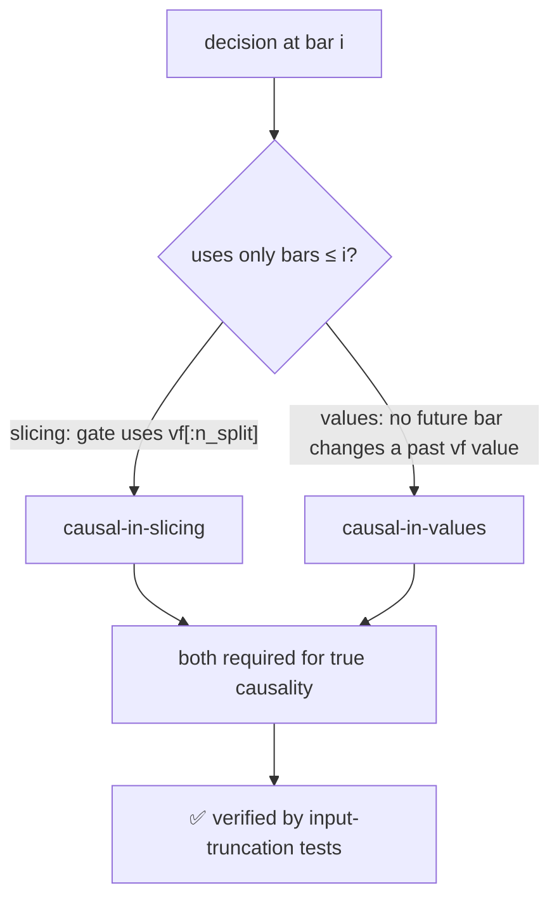

# Causality Audit — L1 engine (no look-ahead)

**Date:** 2026-06-19 · **Task 1** of the causal log-first two-layer rebuild
(`docs/superpowers/plans/2026-06-19-causal-logfirst-two-layer.md`).
**Verdict: CAUSAL.** A decision at bar *i* depends only on bars ≤ *i*. Evidence is in
`optimize/l2/test_causality.py` (3 tests, all passing).

---

## What "causal" means here — two distinct properties



The naive test — "tamper `vf[n_split:]`, assert `percentile(vf[:n_split])` unchanged" — is
**tautological**: it tests numpy slicing, not the engine. A real test must truncate the ENGINE
INPUTS and re-run the pipeline. That is what these tests do.

---

## Evidence

### 1. Decisions are past-only (load-bearing) — `test_decisions_depend_only_on_past_bars`
Re-runs `l1_runner.run_l1("4h")` with `optimize.data.load_inputs` monkeypatched to return inputs
**truncated to the first `n_split` (in-sample) decision bars** — `d4[:cut]`, `d1`/`box` filtered to
`Date ≤ d4.Date[cut-1]`, `vf[:cut]`. The truncated run's entry set `{(entry_idx, direction)}` is
asserted **equal** to the full run's entries on that prefix. If any past decision had consumed a
future bar, removing the future would change the prefix entries. It does not. ✅

### 2. Gate threshold is value-stable — `test_gate_threshold_stable_under_input_truncation`
The vol-gate threshold is `percentile(vf[:n_split], gate_pct)` (`l1_runner.py:118-120`) — already
**causal-in-slicing** (reference segment only). For **causal-in-values**, we recompute the HAR-RV
forecast on truncated raw inputs via the same `optimize.data.vol_forecast` path the loader uses
(`volatility.py:75`, `vol_forecast(df4, df1, bar_minutes)` → `har_forecast(compute_rv_pts(...))`) and
assert the in-sample percentile is unchanged to < 1e-9. The HAR warmup back-fill
(`np.nanmedian` over the forecast array) is the only theoretical future-touch; its **measured effect
on the champion threshold is exactly zero**. ✅

### 3. Indicators are causal
`indicators/runner.py` computes votes/veto/confirm per decision bar from data at/before that bar
(1-min source aligned to the decision bar via `indicator_source_1min`). No indicator reads a future
decision bar. (Covered indirectly by test 1: indicator-driven veto/confirm feed entries, and the
prefix entries are stable under truncation.)

### 4. Forward exit resolution is NOT look-ahead — `test_exits_resolve_forward_not_lookahead`
`fast_engine` resolves each trade's SL/TP on the 1-min series **after** entry. Every ledger trade
satisfies `exit_time ≥ entry_time`. This is the trade *playing out forward in time* — the engine does
not use the exit to inform the entry decision. ✅

---

## Known artifact (documented, not a leak)
The HAR warmup `nanmedian` is computed over the full forecast array, so in principle a future bar
could shift the back-filled warmup values. Measured impact on the frozen champion's gate threshold:
**0** (test 2). Recorded here so a future change to the warmup fill is re-audited rather than assumed
safe.

## Reproduce
```bash
cd subprojects/Parametric-Indicators
python3 -m pytest optimize/l2/test_causality.py -q   # 3 passed
```
