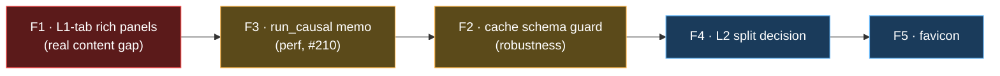

# Unified Dashboard — Follow-ups (detailed)

Open items after the STEP 0–7 unified-dashboard rebuild. None block using the dashboard today. Ordered
by importance. Each entry: **what it is · why it matters · current state · proposed fix · effort/risk ·
recommendation.**

---

## F1 — L1-only non-card panels  ✅ RESOLVED

**Resolved** (frontend rewire, browser-verified): the unified **L1 tab now fetches the rich engine
view** (`/api/backtest_causal` with the L1 form params) instead of the leaner causal `view=l1`. It
therefore carries `strategy.build_payload`'s full payload — the **SMC `gen_report` panel** (10 structure
cards) + the **rich event log** with would-be-P/L on skips and **per-indicator vote chips** — while the
18 boxes stay log-derived and **equal to the engine summary** ($149,989, verified). L2/Combined keep the
causal path (no richer source). Browser check: L1 18 cards / $149,989 / gen_report visible / 162
chip blocks; L2 20 / Combined 17 unchanged. The original analysis is kept below for the record.

---

### (original) L1-only non-card panels not yet carried into the unified L1 tab

**What it is.** The old `index.html` (now deleted) showed two L1 things that are NOT metric cards and so
were *not* covered by the 18/20/17 card golden:
1. the **Phase-1 SMC structure-generation report** panel (`gen_report`: bars, swing/golf/FVG/OB counts);
2. a **rich event log** — every entry/skip with the **would-be P/L** on a breaker skip and the
   **per-indicator vote chips** (which indicators confirmed/vetoed).

**Why it matters.** These are real content from `index.html`. The "never drop a box" rule is about not
losing information; the card golden proved the 18 cards survive, but these two panels are a genuine,
documented degradation of the L1 tab vs the old page. This is exactly the risk both council rounds
flagged (the additive-audit's "non-card panels" + the event-log fidelity note).

**Current state.** The unified L1 tab calls `/api/causal_backtest?view=l1` (the *causal* projection),
whose event log is the leaner one from `optimize/l2/charts.py` — entries + breaker-locked skips, **no**
would-be-P/L, **no** indicator chips — and it has **no** `gen_report` panel. The backend richer path
already exists and is unused by the unified page: `build_view_payload(view='l1', l1_engine=<strategy
params>)` returns `strategy.build_payload`'s full payload (vol/state/drawdown/events **with** would-be-P/L
+ chips, plus `gen_report`) **and** the causal log + log-derived boxes (asserted equal).

**Proposed fix.** Make the unified L1 tab fetch the rich path: send the L1 form as strategy-schema
params with `l1_engine` (or hit `/api/backtest_causal`, the unified-L1 route) for the **L1 tab only**;
keep `view=l2`/`view=combined` on the causal path. Then render the `gen_report` panel + the rich event
log on the L1 tab. L2/Combined keep `charts.py` events (they have no richer source — that's expected).

**Effort / risk.** Medium frontend + a small render branch; low risk (additive; the rich path is
already tested). The box numbers are unaffected (boxes are log-derived and already equal).

**Recommendation.** Do this next if L1-tab parity with the old `index.html` matters to you. Until then,
the L1 tab is fully correct on numbers + charts, just leaner on the event-log detail + missing the SMC
panel.

---

## F2 — L1 disk-cache has no schema-version guard

**What it is.** `run_l1_cached` pickles the frozen `L1Result` to `/tmp/wsh_l1_cache/*.pkl` so repeat
processes load in ~1s instead of the ~38s 1-min-indicator recompute.

**Why it matters.** When STEP 3b added the `vf_seed` field to `L1Result`, the *old* pickle unpickled
with `vf_seed = None` (the dataclass default). `charts.py`'s gate-seed test caught it; the code's
`vf_seed is not None else vf[:n_split]` fallback kept `window=full` correct, but a future field added to
`L1Result` could again silently load a stale pickle and be wrong in a case the fallback doesn't cover.

**Current state.** Worked around for STEP 4 by clearing the cache once. No permanent guard.

**Proposed fix.** Put a schema version in the cache key/filename (e.g. bump a `_L1_CACHE_VER` constant
whenever `L1Result` fields change, and include it in `_l1_cache_file`), OR validate the unpickled object
has the expected attributes and recompute on mismatch. ~10 lines.

**Effort / risk.** Trivial; low risk. Prevents a whole class of "stale pickle" bugs.

**Recommendation.** Cheap insurance — do it whenever `L1Result` next changes (or now).

---

## F3 — `run_causal` runs three times per Run (perf; ties to #210)

**What it is.** The unified page's "one Run fans out" fires three calls (`view=l1`/`l2`/`combined`),
each of which calls `logbook.run_causal(...)`. So `run_causal` runs **3×** per Run.

**Why it matters.** The expensive 1-min-indicator pass is inside `run_l1`, which IS disk/in-process
cached — so the 3× cost is the *projection* (`run_causal`'s per-candle loop + `engine.run_l2`), not the
38s indicator pass. At 4h that's a few seconds × 3; at fine timeframes the per-candle log dominates and
3× is wasteful. "One causal pass" is currently true *conceptually* (all views derive from the same
logic) but not *literally* (three passes).

**Current state.** Acceptable at 4h; not optimized. Related to the standing perf task **#210**
(1-min-indicator compute bottleneck).

**Proposed fix.** Memoize `run_causal` in-process by a `(l1_params, l2_params, tf)` hash (a small
last-N dict), so the three view-calls within one Run share ONE pass. Optionally, add a single fan-out
endpoint that returns all three views from one `run_causal`. Either makes "one Run = one literal pass."

**Effort / risk.** Small (memo) to medium (fan-out endpoint); low risk. Measure payload size at the
**finest** TF before choosing the mega-response shape (the per-candle log is the cost driver there).

**Recommendation.** Memo first (biggest win for least code). Revisit the single-endpoint shape only if
fine-TF latency becomes a problem.

---

## F4 — L2 split SL/TP is plumbed but semantically unresolved

**What it is.** STEP 5 wired `long_*/short_*` split SL/TP through **both** `run_l1` and `run_l2`. For L1
it's a clean per-side override. For **L2** the meaning is unclear: `run_l2`'s `force_close_on_l1_entry`
recomputes P/L single-direction at the L1-entry bar, and L2's direction can be flipped — so per-side
SL/TP composes with flip + force-close in ways the $78,391/80 anchor (split-off) doesn't exercise.

**Why it matters.** The lever exists in the L2 form, but turning it on is a research decision, not a
proven feature. The council recommended L2 split stay **opt-in** until validated.

**Current state.** OFF by default (the l2v1 champion sets no split ⇒ all `None` ⇒ shared ⇒ byte-
identical). The test only proves the path is *safe* (a force-closed L2 trade still runs), not that the
numbers are *meaningful*.

**Proposed fix.** If you want L2 split: add a focused parity/behaviour study (a force-closed L2 trade
with asymmetric per-side SL/TP, compared against a hand-computed expectation) and document the
semantics; otherwise hide the L2 split toggle to avoid implying it's validated.

**Effort / risk.** Low to wire a study; the risk is *using* it without the study (misleading numbers).

**Recommendation.** Leave OFF. Decide explicitly before exposing it as a "supported" L2 lever.

---

## F5 — favicon 404 (cosmetic)

**What it is.** The browser auto-requests `/favicon.ico`; the server returns 404, which shows as the one
console error in verification.

**Why it matters.** Purely cosmetic; zero functional impact.

**Proposed fix.** Add a `frontend/favicon.ico` (or a 1-line server route returning 204 for it).

**Effort / risk.** Trivial; none.

**Recommendation.** Optional polish.

---

## Priority

**F1** is the only one that touches user-visible parity (it's why I'm flagging it loudly after deleting
`index.html`). F2/F3 are robustness/perf hygiene. F4/F5 are decisions/polish.
