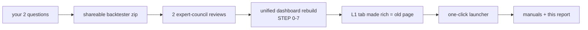
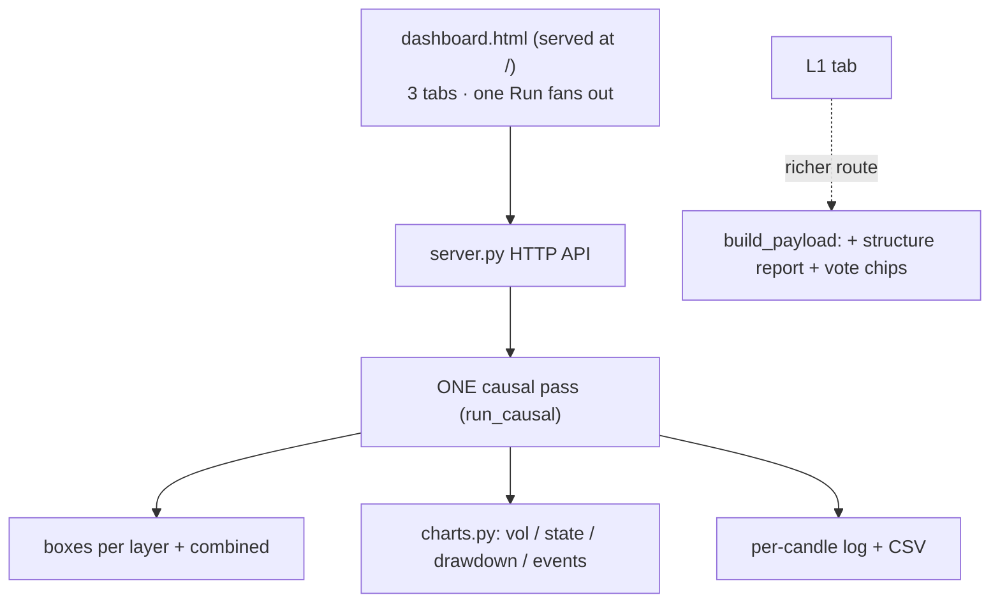
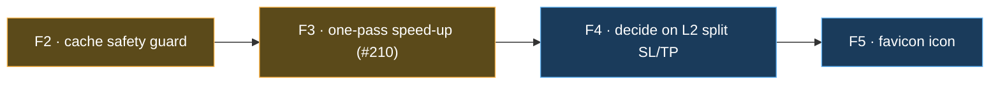

# What we achieved · what's left open  (detailed + plain-language)

A full account of this work-stream — what was built, why, and what remains — with a 🍼 **plain-words**
note under each part so it's readable without the jargon.

---

## 0. The big picture

We have a **two-layer NQ trading backtester** with a web dashboard. Layer 1 (L1) is the main strategy;
Layer 2 (L2) trades the chances L1 throws away. This session we **merged three separate dashboard pages
into one**, added missing features, made a one-click launcher, packaged a shareable copy, and wrote the
manuals — all while never changing the proven profit numbers.

> 🍼 We had three separate web pages for the same trading robot. We glued them into ONE page with three
> tabs, fixed the broken bits, and made it start with a single command — without breaking the money math.



---

## 1. The numbers that never moved (the safety anchor)

Every change was gated so these stay **byte-for-byte identical**:

| Layer | Profit | Trades | Worst drawdown |
|---|--:|--:|--:|
| **L1** | $149,989 | 255 | $15,491 |
| **L2** | $78,391 | 80 | $8,961 |
| **Combined** | $228,380 | 335 | $20,303 |

> 🍼 These three profit numbers are our "is it still correct?" alarm. We checked them after every single
> change. They never moved, so we know we didn't break the strategy.

---

## 2. What we achieved (one by one)

### A. Answered your two questions
- **"Why doesn't one Run fill all three tabs?"** → they were three separate web pages, each with its own
  Run. Now one page, one Run fills all three tabs.
- **"Why do boxes go blank after a Run?"** → the L1 page wiped its warm-up cards on every Run and never
  refilled them. Fixed; they now always show a value (even "0 candles" when there's nothing to warm up).

> 🍼 Your two complaints are fixed: one button now fills everything, and no card goes blank.

### B. Shareable backtester (`shareable/two_layer_causal_backtester.zip`)
A self-contained Python package that reproduces L1/L2/Combined from a clean unzip (verified: exactly the
three anchor numbers). Ships a README + a PLAYBOOK (with diagrams) + the data instructions.

> 🍼 A zip anyone can unzip and run to get the same results, with instructions inside.

### C. The unified dashboard rebuild — STEP 0 → 7
All committed, all parity-gated green:

| Step | Plain-words what it did |
|---|---|
| 0 | Wrote the "alarm test" that locks the three profit numbers. |
| 1 | Fixed the blank cards (your Q2). |
| 2 | Cleaned up one piece of math (the volatility gate) so the next step couldn't break it. |
| 3 | Taught the engine to backtest a chosen **time window** (2024 / 2025 / 2026 / +20 days). The tricky part: making sure Layer 2 still measures volatility against the *training* year, not the test year — a subtle trap we caught and closed. |
| 4 | Built the **charts** (volatility, engine state, drawdown, event log) for the L2 and Combined tabs — they never had them before. |
| 5 | Added **split long/short stop-loss / take-profit** (different exits for buys vs sells). |
| 6 | Built the **one page, three tabs** app; one Run fans out to all three, switching tabs is instant. |
| 7 | Made it the home page (`/`) and retired the three old pages. |

> 🍼 We rebuilt the dashboard step by step, testing the alarm after each step, then deleted the three old
> pages and served the new one at the front door.

### D. F1 — the L1 tab now equals the old page exactly
After deleting the old L1 page, its richest bits (the "structure report" panel + the detailed event log
with per-indicator vote chips) were briefly missing from the new L1 tab. We pointed the L1 tab at the
full engine route, so it's **identical to the old page again** — and still shows $149,989.

> 🍼 The new L1 tab was missing two detail panels the old page had. We put them back. Nothing lost.

### E. One-click launcher (`run_dashboard.sh`)
`./run_dashboard.sh` starts the server (detached, survives the terminal), opens the browser, and is
idempotent. Also `stop` / `restart` / `status`.

> 🍼 One command starts everything. No more asking.

### F. The safety process (why we trust it)
- **Two expert-council reviews** before coding caught **3 factual errors** in the first plan (a fake API,
  a no-op setting, charts that didn't exist) — fixed before a line was written.
- A **per-window parity test** proves the new windowed engine matches the old one for every window.
- **Browser robot checks** (Playwright) confirmed the live page: exact card counts 18 / 20 / 17, correct
  numbers, no blank cards.

> 🍼 Before building, we had a panel of expert-reviewers poke holes in the plan. Then a robot opened the
> real page and counted everything to confirm it works.

---

## 3. The shape of the system now



---

## 4. What's left open (nothing is broken — these are extras)



| ID | What | Plain words | Effort | Risk if ignored |
|---|---|---|---|---|
| **F2** | L1 disk-cache schema-version guard | The fast-start cache can load an *old* saved result after we add a new field. Add a version stamp so it refreshes itself. | ~10 lines | low (we work around it by clearing the cache) |
| **F3** | `run_causal` runs 3× per Run | "One Run" actually does the calculation three times (one per tab). Remember the result so it runs once. Speeds up Runs, ties to the standing speed task #210. | small | none (just slower than ideal) |
| **F4** | L2 split SL/TP is wired but unproven | We *can* set different buy/sell exits for Layer 2, but its force-close logic makes the meaning unclear. Either run a study to validate it, or hide the toggle. | study | low (it's OFF by default) |
| **F5** | favicon 404 | The little browser-tab icon is missing → one harmless console message. | trivial | none |

Full detail (what / why / current state / proposed fix / recommendation) is in
**`FOLLOWUPS_unified_dashboard.md`**. F1 there is already ✅ done.

> 🍼 Four leftover nice-to-haves: a self-cleaning cache, a small speed-up, a decision about an advanced
> Layer-2 option, and a tiny browser icon. None of them break anything.

### Bigger pre-existing items (not part of this work-stream)
- **#210** — the 1-minute-indicator backtest is the main speed bottleneck (~38 s cold). F3 helps; a
  deeper speed-up is its own task.
- **#218 / wsh6** — optimizer next-run items, unrelated to the dashboard.

---

## 5. How to use it right now

```bash
cd <repo>/subprojects/Parametric-Indicators
./run_dashboard.sh            # → opens http://localhost:8200/
```
Click **Run** once → all three tabs fill → switch tabs freely. For agents/automation, see
**`SERVER_AGENT_MANUAL.md`**.

> 🍼 Type one command, click Run once, look at the three tabs. Done.

---

## 6. Where everything lives (map)

| Thing | Path |
|---|---|
| The app (served at `/`) | `frontend/dashboard.html` |
| The server | `server.py` (start: `run_dashboard.sh`) |
| The engine (one causal pass) | `optimize/l2/logbook.py` · `aggregate.py` · `charts.py` · `engine.py` · `l1_runner.py` |
| Parity alarm tests | `optimize/l2/test_parity_anchor.py` · `test_charts.py` · `test_split_sltp.py` |
| Agent manual | `SERVER_AGENT_MANUAL.md` |
| This report · follow-ups · rebuild report | `optimize/l2/REPORT_achievements_and_open.md` · `FOLLOWUPS_unified_dashboard.md` · `REPORT_unified_dashboard.md` |
| Shareable backtester | `shareable/two_layer_causal_backtester.zip` |
| Config template | `.env.example` |
