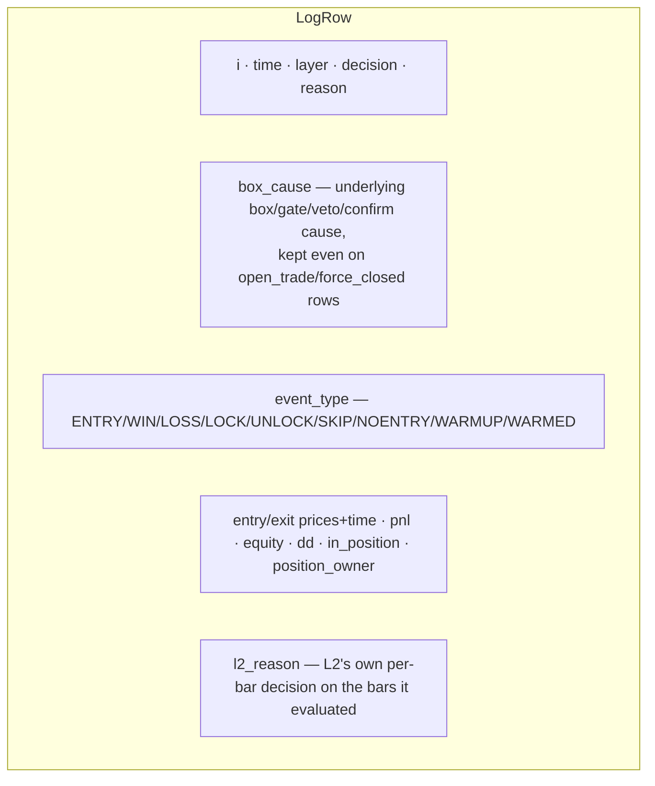
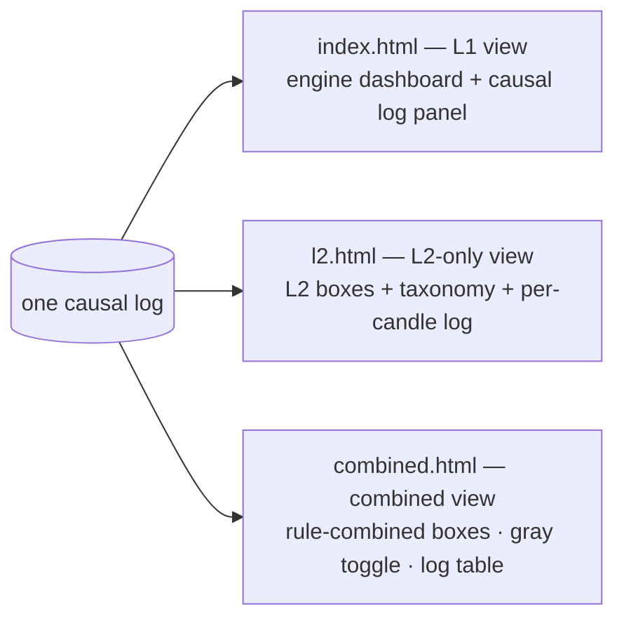

# Causal Log-First Two-Layer System — Final Report

**Date:** 2026-06-20
**Plan:** `docs/superpowers/plans/2026-06-19-causal-logfirst-two-layer.md` (council-reviewed, GO_WITH_EDITS).
**Status:** Built, tested, and browser-verified end-to-end. Parity to the dollar; golden **6/6**.

---

## What this is

One causal pass over decision candles produces **ONE per-candle log** — the single source of truth — from
which every dashboard box, chart and CSV is derived. Three views (L1-only / L2-only / combined) are
projections of that one log.

```mermaid
flowchart LR
    F[3 dashboards] -->|POST l1,l2,view| R[/api/causal_backtest/]
    R --> P[payload.build_view_payload]
    P --> C[logbook.run_causal]
    C -->|projects the oracle| O[l1_runner.run_l1 + engine.run_l2<br/>single account · L1 priority · force-close]
    C --> LOG[(per-candle LogRow[])]
    LOG --> A[aggregate: boxes_for_layer / combined_boxes]
    LOG --> CSV[/api/causal_log.csv/]
    A --> F
```

**Parity by construction:** the trades come from the existing oracle engines, so L1/L2 P/L, DD, counts and
the force-closed subset equal the legacy path exactly. The audit (`AUDIT_causality.md`) proves the engine
is causal (a past decision never depends on a future bar).

---

## The single source of truth: LogRow

`LogRow` (logbook.py) is a strict **superset** of today's `strategy.py` event fields (additive rule):



Deferred display fields (`text`, `indicators`, `veto_flip`, `would_be_pnl`) exist in the schema (superset
frozen) and are documented as populated during dashboard wiring — nothing was removed.

---

## Boxes are computed FROM the log

`aggregate.boxes_for_layer(result, layer, bar_seconds)` reproduces the standalone dashboard box set from
the log filtered to one layer — verified equal to the legacy values for the frozen champion:

| box | L1 (from log) | legacy |
|---|---|---|
| P/L | $149,989 | $149,989 |
| trades | 255 | 255 |
| max DD | $15,491 | $15,491 |
| box-silence total | 1,290 candles | 1,290 |
| no-entry streak | 35 sig · from 2025-04-02 | 35 |

The `*_total` boxes count `box_cause` over **all** bars (incl. in-position), matching legacy `pause_totals`.
The taxonomy is **layer-aware**: L1 reads `box_cause`; L2 reads its own `l2_reason` (so L2's box-silence
total is 0 — it never sees box-silence, only L1's dropped signals).

## Combined per-box rules (the user's spec)

```mermaid
flowchart TD
    S[SUM<br/>P/L · trades · n_candidates · breaker locks] --> CB[combined_boxes]
    RC[RECOMPUTE from the combined book<br/>max-DD merged EXIT-ordered · win · PF · exposure] --> CB
    MX["MAX(L1,L2) + layer tag<br/>streaks · warmup · indicator-req"] --> CB
    GD[GUARDRAILS kept<br/>l1_only_dd · uplift · dd_not_worse · L1-entry force-closes] --> CB
    TT[TOTALS — deferred from combined<br/>kept only in the individual views] -.x CB
```

Combined max-DD is recomputed from the merged equity in **exit-time order** and asserted **equal** to the
legacy `metrics.combined` oracle (your catch: it is smaller than L1 DD + L2 DD).

---

## Three consistent views (browser-verified in headless Chrome)



- **Combined:** rule-combined boxes with `· L1/L2` tags; the **Both / L1 / L2 toggle grays** the opposite
  layer (verified: L1 → L2 equity recolors to muted `#787b86`; Both → restores orange — never hidden).
- **L2:** L2-only boxes + L2's own taxonomy (80 trades / $78,391 / $8,961); the combined-book group moved
  to the combined dashboard per "L2 reports only L2 values".
- **L1:** the full engine dashboard is **kept intact** (vol/state/drawdown charts, event log, split SL/TP,
  TF/window) and **gains** a causal per-candle-log panel — additive. The causal L1 projection matched the
  engine view exactly ($7,735 / 66 for the loaded preset).

### Before / after box samples (sanctioned changes)

| view | before | after |
|---|---|---|
| combined | 3 stacked groups (L1-alone / L2-alone / combined-book) | one rule-combined set + kept guardrails; totals → individual views |
| l2.html | L2 group + combined-book guardrail group | L2-only (financials + L2 taxonomy + dropped context) |
| index.html | engine dashboard | engine dashboard **unchanged** + new causal-log panel (nothing removed) |

A real bug was caught only by browser verification: the prior `combined.html` had a duplicate `const dc`
that threw a SyntaxError and blanked the page — fixed in the rewrite.

---

## Verification

- **32 L2 tests** pass (causality, logbook, aggregate, payload, engine, server) — parity assertions are
  structural (entry sets, counts, DD, force-closed subset), not rounded dollars.
- **golden 6/6** byte-exact (the engine refactor was additive/behavior-preserving).
- **Headless-Chrome** verification of all three dashboards (no console errors; numbers match the oracle;
  gray toggle proven).
- Legacy `l1_runner`/`engine`/`metrics` retained as the parity oracle (Task 13 retirement is gated on
  explicit permission).

## Reproduce
```bash
cd subprojects/Parametric-Indicators
python3 -m pytest optimize/l2/ -q          # 32 passed
python3 perf/check_golden.py               # 6/6
python3 server.py --port 8200              # open /combined.html /l2.html /index.html
```
