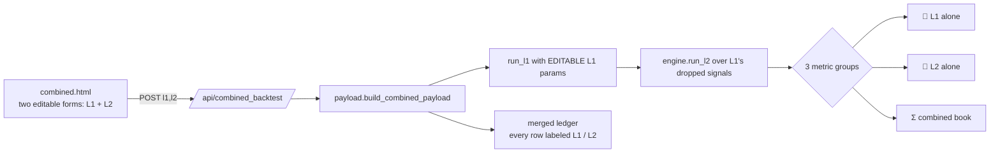

# Combined L1 + L2 Dashboard

**Date:** 2026-06-19
**What:** a standalone dashboard (`frontend/combined.html`) that runs the **best L1** and **best L2**
profiles in parallel on the same data and reports **both layers plus the combined book** in every box,
chart and log row. The existing L1 (`index.html`) and L2 (`l2.html`) dashboards are unchanged.

---

## How it works



Both layers are **fully editable** (the answer chosen for this build): `run_l1(tf, params=...)` now takes
an arbitrary L1 profile (`params=None` keeps the frozen lean champion → golden stays 6/6 byte-exact and
the disk cache is untouched). L1 and L2 share the **same** parameter schema, so the two settings forms are
identical and `metrics.score()` runs on either ledger.

---

## The five requirements, as built

| # | Requirement | Where |
|---|---|---|
| 1 | **Apply both profiles in parallel**, report dual | `build_combined_payload(l1_params, l2_params)` → `summary = {l1, l2, combined}` |
| 2 | **Boxes in 3 groups** — L1 alone / L2 alone / combined | `#cards` renders the 3 groups. **The L1 group is the standalone L1 dashboard's COMPLETE box set, copied verbatim** — financials (P/L, max DD, win, PF), streaks (no-entry streak, box-silence, position-hold, gate non-entry, indicator non-entry), totals (cumulative candle counts for the same five), counts (trades+exposure, breaker locks, warmup, longest indicator requirement). L2 group = the L2 dashboard's L2-standalone boxes + dropped counts + warmup. Combined = combined P/L, max DD, L1-only DD, uplift, DD guardrail. |
| 3 | **Charts full L1+L2, with a button to gray out L1 / L2 / both** | `Both ‖ L1 ‖ L2` segmented toggle in the header → `applyLayer()` re-draws markers/lines + equity series visibility for ALL charts, no re-fetch |
| 4 | **Settings panel = two pages (L1 / L2) with a nav bar** | `.navtabs` (🍃 L1 settings ‖ 🔁 L2 settings) switch `.layerpane`s; each is a full form + profile dropdown + indicator panel |
| 5 | **Logs label every entry L1 / L2, separable in the CSV** | merged `ledger` carries a `layer` column; the table shows an L1/L2 badge; `combined_ledger.csv` keeps the `layer` column as the first field |

## Verified end-to-end (live HTTP, port 8222)

Best L1 (lean champion) + best L2 (extend champion):

| group | P/L | max DD | n | win | PF |
|---|---:|---:|---:|---:|---:|
| 🍃 L1 alone | $149,989 | $15,491 | 255 | 67.8 % | 1.56 |
| 🔁 L2 alone | $78,391 | $8,961 | 80 | 87.5 % | 3.97 |
| **Σ combined** | **$228,380** | **$20,303** | 335 | — | — |

- **L1 editable proven:** flipping L1's direction changed its book $149,989 → −$127,804 over HTTP.
- **Merged ledger:** 335 rows = 255 `L1` + 80 `L2`, sorted by exit, each labeled.
- **Bad param → HTTP 400** (`gate_pct=150` rejected, never silently clamped).

---

## Also in this change

- **Fixed the profile-fill bug.** Selecting/loading a saved profile now auto-fills the form: the shared
  framework gained `cfg.autoFillSelected`, and `l2.html` opts in — so the imported L2 champion's values
  appear in the boxes on load instead of the stale defaults.
- **Kept the dashboards DRY.** `dashboard_common.js` now exposes panel-scoped indicator helpers
  (`DB.buildPanel(host, schema, onChange)`, `DB.specsOf(host)`, `DB.applySpecsTo(host, specs)`); the old
  single-panel path (`index.html`, `l2.html`) delegates to them, and `combined.html` builds two panels
  (L1 + L2) from the same code. Future indicator-panel changes update all three dashboards at once.

## Tests

- `optimize/l2/test_payload.py` — +4 (custom-L1 differs/memoised, combined 3-groups + labeled ledger,
  L1-default schema, L1 profile roundtrip).
- `optimize/l2/test_l2_server.py` — +1 (`test_combined_routes_smoke`: config + combined backtest + L1
  editability + 400 path).
- Full L2 suite **29 passed**; golden **6/6** byte-exact (the `run_l1` change is additive).

## Run it

```bash
cd subprojects/Parametric-Indicators
python3 server.py --port 8200
# open http://localhost:8200/combined.html   (also linked from index.html and l2.html headers)
```
