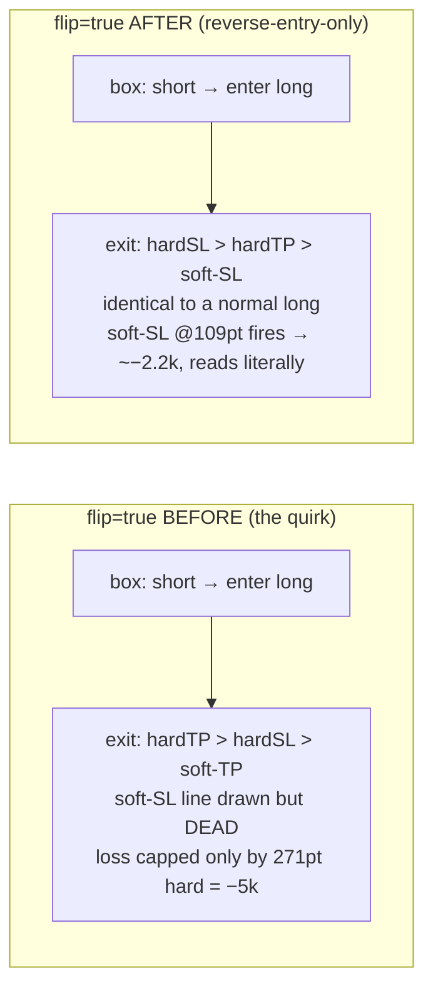

# Flip semantics → reverse-entry-only (audit + change report)

**Date:** 2026-06-22 · **Spec:** `docs/superpowers/specs/2026-06-22-flip-semantics-reverse-entry-only-design.md`
· **Plan:** `docs/superpowers/plans/2026-06-22-flip-semantics-reverse-entry-only.md`

## The problem — "one stop loss of −5k, impossible for the watcher eye"

A log audit (task #251) found the L2 champion (`flip=true`) **never** produced a soft stop-loss, while the
dashboard still drew the orange `sl_soft` line and listed `sl_soft=109` (~$2,189) as a stop. Reason: the
old `flip` rule did two things — reverse the entry direction **and** swap "soft" to the take-profit side,
leaving the soft **stop-loss** line computed but never enforced. The only real loss cap was the hard stop
(271 pt = **−$5,429**). So price visibly sailed through the 109-pt line, nothing happened, and then a −5k
hard stop fired — logically impossible to a reader who trusted the displayed stop.

## Old vs new rule



**Rule now:** `flip` reverses the entry direction only; the normal exit model
(`hard-SL > hard-TP > soft-SL`) then applies to the entered direction. "soft" always means **stop-loss**;
there is no soft take-profit (same as normal mode has always been).

## Invariant (the regression lock)

```
flip=True on signal S   ≡   flip=False on the reversed signal ¬S      (byte-for-byte, both engines)
```

Locked by `optimize/test_flip_equivalence.py` (4 parametrized cases + a behavioral check that a flip run
yields no `TAKE_PROFIT_SOFT` and ≥1 `STOP_LOSS_SOFT`). `optimize/test_fast_parity.py` keeps `engine.py`
and `fast_engine.py` trade-for-trade identical across all flip/non-flip cases.

## Effect on the L2 flip champion (verified through the server)

| exit reason | BEFORE | AFTER |
|---|---|---|
| TAKE_PROFIT_HARD | 65 | 62 |
| STOP_LOSS_HARD (271 pt, −$5,429) | 3 | **0** |
| **STOP_LOSS_SOFT (~109 pt, ~−$2,189)** | **0** | **15** |
| TAKE_PROFIT_SOFT | (some) | **0** |
| L1-entry (force-close) | 12 | 7 |
| **total trades** | 80 | 84 |

The −5k phantom is gone: soft-SL now caps losses ~109 pt before the hard stop can ever fire. Trades rose
80 → 84 because positions close sooner (soft-SL), freeing the account for more subsequent entries.

## Blast radius

- **L1 lean champion** (`flip=false`, $149,989 / 255 / $15,491) — **byte-identical, anchor locked.** It
  never used the flip branch.
- **L2 + Combined anchors** ($78,391 / $228,380) — **retired** (xfail) pending re-optimization; the
  flip champion was tuned around the old quirk, so its `sl_soft` was inert and its numbers are no longer
  meaningful under the clean rule.
- **WS-I 1h & 2h champions** (`flip=true` in `wsi_champions_full.json`) — their stored stats are now
  **stale** and should be regenerated. Not in the active anchors; flagged, not yet done.
- Retired/xfail tests: `test_parity_anchor::{test_l2_anchor,test_combined_anchor}`,
  `test_aggregate::test_l2_boxes_from_log_for_champion`, `test_charts[L2]`, `test_charts[combined]`,
  `test_logbook::test_causal_l2_matches_legacy_engine` (cross-engine parity still holds there; only the
  hardcoded l2v1 numbers are stale).

## l2v2 re-optimization — DONE (2026-06-22)

Re-optimized on the AMD server (28 parallel workers, one shared Postgres study, 616 trials, `min_trades=10`
after round 1 @5 gave a thin 8-trade overfit and round 2 @20 gave 0 feasible). New champion
(`optimize/results/l2v2_4h_champion.json`):

- **in-sample +$24,479 (25 trades) → OOS +$904 (9 trades)** — positive OOS (round 1 was −$3,465).
- `flip=True · sl_soft 110.4 · sl_hard 178.4 · tp 57.4 · gate 66.7% · dd_limit $1,881 · cooldown 1 · k=3`;
  indicators ema_trend, macd, keltner, obv, rsi, mfi, order_block.

**New parity anchors (re-locked, all xfail markers removed):**

| | l2v2 (honest) | l2v1 (retired) |
|---|---|---|
| L1 | $149,989 · 255 · $15,491 | same (byte-identical) |
| L2 | **$25,383 · 34 · $7,136** | $78,391 · 80 · $8,961 |
| Combined | **$175,372 · 289 · $14,342** | $228,380 · 335 · $20,303 |

The combined dropped $228k → $175k **because the old number was inflated by the flip quirk** (riding losers
to the hard stop + a soft take-profit). Under the corrected semantics — soft-SL caps losses ~110 pt, no
soft-TP — the honest L2 is ~$25k over 34 trades and holds up out-of-sample. Re-locked in
`test_parity_anchor.py`, `test_aggregate.py`, `test_charts.py`, `test_logbook.py` (23 tests green).

**Still open:** the production *default* L2 (dashboard / `l2_profiles.json` / `payload.py`) still points at
l2v1 — swapping it to l2v2 is a separate, more invasive change (left for a follow-up decision). Also: the
WS-I 1h/2h (`flip=true`) champion stats remain stale.
