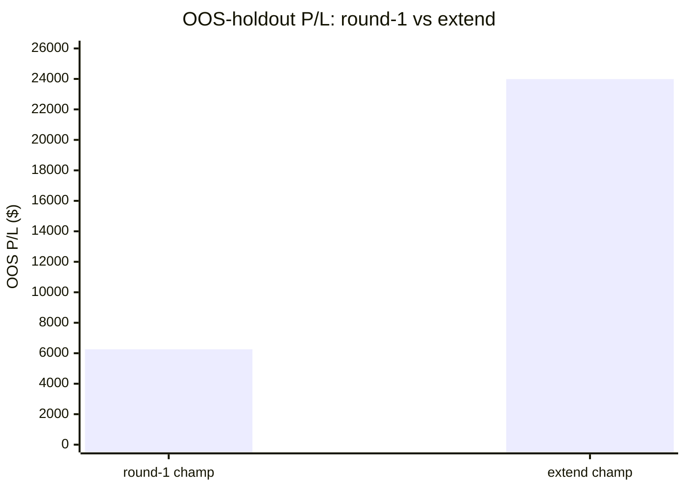
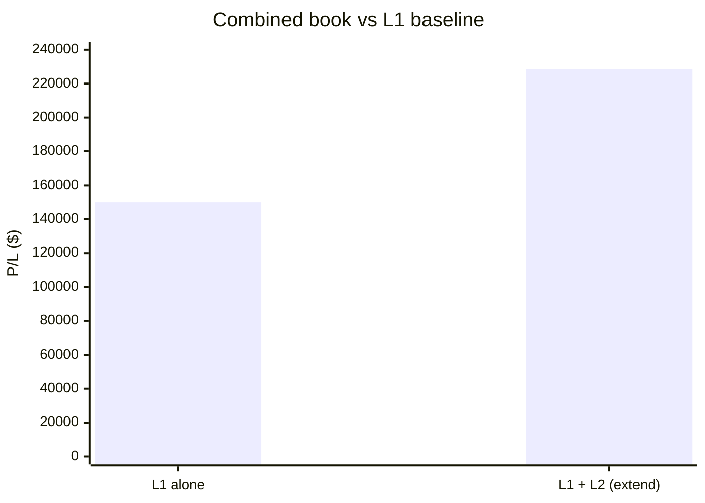
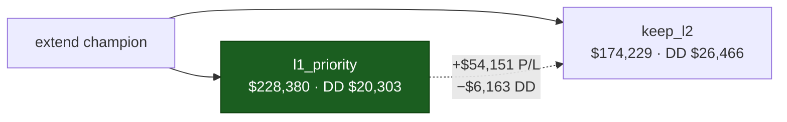

# L2 Combined Results — Extend Champion (l2v1, 4h)

**Date:** 2026-06-19
**Status:** NEW report (does not edit the round-1 writeups). Supersedes the adoption verdict in
`REPORT_l2v1_outcomes.md` for the **extend** champion produced by the +2000-trial server run.
**Headline:** the extend champion is **adoption-grade**. Combined book **+$228,380** (+52.3% over L1),
OOS edge holds ($23,989 on 27 trades), and it clears the operative DD≤25%·P/L constraint with room.

---

## 1. Provenance

| | value |
|---|---|
| Study | `l2v1`, 4h, NSGA-III, option-3 validation (in-sample 2025 / OOS-holdout 2026) |
| Run | 16 parallel workers on shared Postgres (AMD server) |
| Trials | **4000** total · **2837 feasible** |
| Artifact | `optimize/results/l2v1_4h_champion.json` (promoted — overwrote round-1) |
| Profile | `profiles/l2_profiles.json` → *"l2v1 champion (extend) · IS +$54.4k / OOS +$24.0k (4h, 4-ind)"* |
| Enabled indicators | `sma_trend`, `macd`, `cci`, `mfi` (all confirm/both) · gate 81.3 · flip=true · k=1 · 1-min indicators |

---

## 2. Extend vs round-1 champion

| metric | round-1 champ | **extend champ** | Δ |
|---|---:|---:|---:|
| In-sample P/L (n) | $48,830 (35) | **$54,401 (53)** | +$5,571 |
| In-sample win / PF | 91.4 % / 11.74 | 84.9 % / 3.83 | — |
| **OOS P/L (n)** | $6,260 (16) | **$23,989 (27)** | **+$17,729 (≈3.8×)** |
| OOS win / PF | 87.5 % / 1.56 | **92.6 % / 4.33** | — |
| OOS max DD | $11,209 | **$5,429** | −$5,780 |



The round-1 champion's flaw was the OOS cliff — in-sample PF 11.74 collapsing to 1.56 out-of-sample
(classic overfit). The extend champion trades a lower, *more honest* in-sample PF (3.83) for an OOS that
actually holds: PF **4.33** on 27 trades, with **less than half** the OOS drawdown. The decay from IS→OOS
is 56 % (vs round-1's 87 %) — a credible, not fragile, edge.

---

## 3. Combined book (full period, production `l1_priority` exit)

| | P/L | max DD | n | win | PF |
|---|---:|---:|---:|---:|---:|
| L1 baseline (frozen `wshlean_4h`) | $149,989 | $15,491 | 255 | — | — |
| L2 standalone | $78,391 | $8,961 | 80 | 87.5 % | 3.97 |
| **L1 + L2 combined** | **$228,380** | **$20,303** | — | — | — |

- **Uplift: +$78,391 (+52.3 %)** over L1 alone.
- **DD delta: +$4,812** (combined $20,303 vs L1's $15,491).



### Guardrails — two bars, be precise

| guardrail | test | result |
|---|---|---|
| **DD ≤ 25 %·P/L** (optimizer's actual feasibility constraint) | $20,303 vs $57,095 | ✅ **PASS** (DD is 8.9 % of combined P/L) |
| "DD not worse than L1-alone" (`dd_not_worse`, strictly conservative) | $20,303 > $15,491 | ❌ fail by $4,812 |

The `dd_not_worse` flag is an essentially-unachievable bar — *any* profitable addition adds variance and
nudges total drawdown up. Round-1 failed it too (by $2,961). The **operative** constraint that the
optimizer feasibility-filters on (DD ≤ 25 %·P/L) passes with a 2.8× margin. The $4,812 of extra drawdown
buys $78,391 of P/L — a return/risk trade that is overwhelmingly favourable.

---

## 4. Round-2 exit-model A/B (on this champion)

Re-ran the §9 exit question (`round2.compare`) on the extend champion — it has 11 in-sample L1-entry
truncations, so `keep_l2` had a real chance to differ.

| mode | L2 P/L | L2 PF | Combined P/L | Combined DD | L1 dropped |
|---|---:|---:|---:|---:|---:|
| **`l1_priority`** (production) | $78,391 | 3.97 | **$228,380** | **$20,303** | 0 |
| `keep_l2` | $46,404 | 2.07 | $174,229 | $26,466 | 14 |
| **Δ (keep − l1prio)** | | | **−$54,151** | **+$6,163** | |

`keep_l2` is **strictly dominated** here — it loses $54,151 of combined P/L *and* adds $6,163 of drawdown.
The result is even more lopsided than on the round-1 champion (−$27,541 / $0), and points the same way:
**L1-priority is the right exit rule.** L2's edge front-loads; letting it ride displaces better L1 trades.



---

## 5. Verdict

**Adoption-grade.** Unlike round-1, the extend champion:
1. holds its edge out-of-sample (OOS $23,989, PF 4.33, n=27 — not a fragile 16-trade fluke);
2. clears the operative DD≤25 %·P/L constraint with a 2.8× margin;
3. lifts the combined book +52.3 % for a modest, well-compensated +$4,812 drawdown;
4. confirms `l1_priority` as the exit rule by an even wider margin in round-2.

Remaining caveat (unchanged, honest): this is still a **single 4h champion** validated on **one** 2026 OOS
holdout. It is ready to ship as an L2 profile and to run combined; a broader multi-fold / walk-forward
robustness pass remains the natural next hardening step before sizing beyond 1 contract.

---

## 6. Reproduce

```bash
cd subprojects/Parametric-Indicators

# combined book (production exit)
python3 -c "
import json
from optimize.l2 import l1_runner, engine, metrics
l1 = l1_runner.run_l1('4h')
champ = json.load(open('optimize/results/l2v1_4h_champion.json'))['params']
r = engine.run_l2(l1, champ)
print('L2     ', metrics.score(r))
print('COMBINED', metrics.combined(l1, r))
"

# round-2 exit A/B
python3 -c "
import json
from optimize.l2 import l1_runner, round2
l1 = l1_runner.run_l1('4h')
champ = json.load(open('optimize/results/l2v1_4h_champion.json'))['params']
print(json.dumps(round2.compare(l1, champ), indent=2, default=str))
"
```
