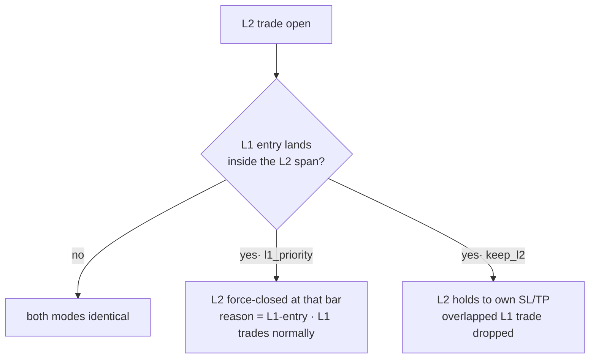
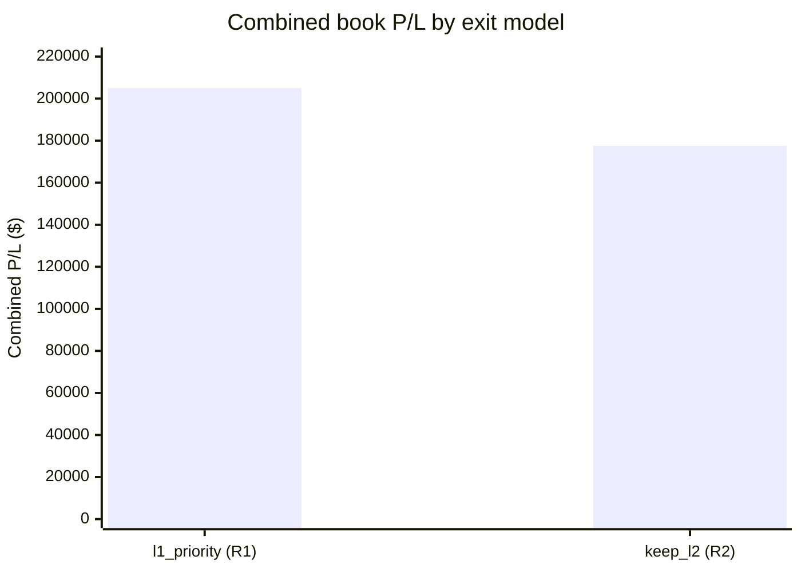

# L2 Round-2 — Exit-Model A/B (L1-priority vs keep-L2)

**Date:** 2026-06-19
**Scope:** Spec §9 round-2 question — when an L1 entry lands *inside* an open L2 trade, who yields the (single) account?
**Subject:** the l2v1 champion (`optimize/results/l2v1_4h_champion.json`) over the full 4h dataset.
**Verdict:** **Round-1's `l1_priority` exit wins.** `keep_l2` sacrifices **−$27,541** of combined P/L for **$0** drawdown benefit.

---

## The two exit models

Only one position can be live (single account). The models differ in who concedes when L1 fires mid-L2-trade:

| mode | behaviour when L1 enters during an open L2 trade | who keeps the account |
|------|---------------------------------------------------|-----------------------|
| `l1_priority` (round 1, default) | L2 **force-closes** at that bar's close (reason `L1-entry`); L1 takes its normal trade | **L1** |
| `keep_l2` (round 2) | L2 **runs to its own SL/TP**; the overlapping L1 trade is **dropped** from the combined book | **L2** |

`keep_l2` is implemented as an additive `exit_mode` branch in `engine.run_l2` (skips `force_close_on_l1_entry`); the combined-book accounting that drops the overlapped L1 trades lives in `round2.compare`. **No frozen-engine bytes changed → golden 6/6 byte-exact.**



---

## Results (champion, full period)

| metric | `l1_priority` (round 1) | `keep_l2` (round 2) | Δ (keep − l1prio) |
|--------|------------------------:|--------------------:|------------------:|
| **L2 standalone P/L** | $55,089 | $36,227 | **−$18,862** |
| L2 win-rate | 90.2 % | 92.2 % | +2.0 pp |
| L2 profit-factor | 4.50 | 2.62 | −1.88 |
| L2 trades | 51 | 51 | 0 |
| **Combined P/L** | **$205,078** | **$177,538** | **−$27,541** |
| Combined max DD | $18,452 | $18,452 | **$0** |
| L1 trades dropped | 0 | 6 | +6 |



---

## Why `keep_l2` loses

The intuition that "letting L2 ride to its target" should help is wrong here, for two compounding reasons:

1. **L2's force-closed trades were winners anyway.** Under `l1_priority` the 6 `L1-entry` truncations book the partial gain at the L1-entry bar. Letting them run (`keep_l2`) drops L2 standalone P/L by $18,862 — those extensions were on average *worse* than the forced exit, i.e. L2's edge front-loads.
2. **The yielded L1 trades were better than the L2 holds that displaced them.** `keep_l2` drops 6 L1 trades to make room; those 6 L1 trades carried more combined P/L than the marginal L2 hold retained. Net combined cost: −$27,541.
3. **No DD compensation.** Both modes hit the *identical* $18,452 combined max-DD — so there is not even a risk-reduction argument for `keep_l2`. It is a strictly dominated choice for this champion.

Win-rate ticks up (+2 pp) under `keep_l2`, but that is the classic "fewer-but-larger losers" illusion — PF collapses 4.50 → 2.62 and total dollars fall. **Win-rate is not the objective; combined P/L at equal DD is.**

---

## Decision

- **Keep `l1_priority` as the production exit model** (it is the default; no change needed).
- `keep_l2` stays in the engine as an opt-in `exit_mode` for future A/Bs on *other* candidate profiles — the result above is champion-specific (n=1) and could in principle flip for a profile whose edge back-loads. The harness (`round2.compare`) makes that a one-call check.
- This does **not** change the standing l2v1 adoption posture: the champion remains *not adoption-ready* (combined-DD guardrail breach + mild OOS overfit per `REPORT_l2v1_outcomes.md`). Round 2 only settles the exit-rule question, in favour of what we already ship.

---

## Reproduce

```bash
cd subprojects/Parametric-Indicators
python3 -c "
from optimize.l2 import l1_runner, payload, round2
import json
l1 = l1_runner.run_l1('4h')
champ = json.load(open('optimize/results/l2v1_4h_champion.json'))['params']
print(json.dumps(round2.compare(l1, champ), indent=2, default=str))
"
```

Golden net (must stay 6/6 — engine change is additive):

```bash
python3 perf/check_golden.py
```
