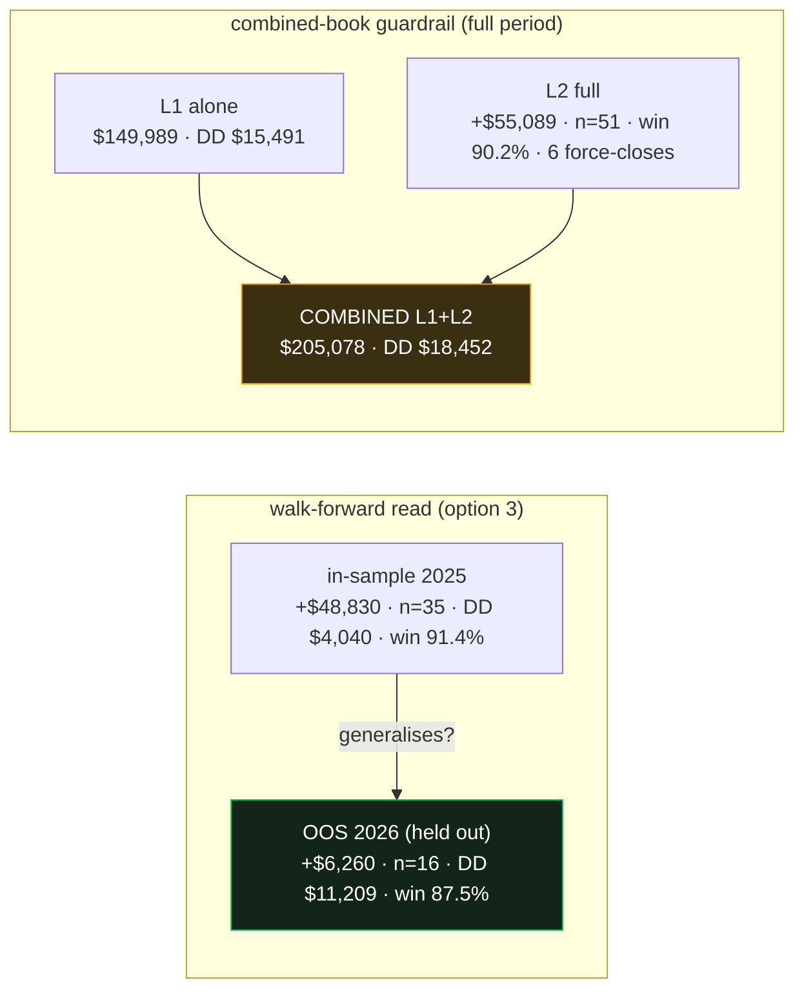

# L2 `l2v1` optimizer run — outcomes report (round 1)

> **Date:** 2026-06-19 · **Study:** `l2v1_4h` (Postgres, AMD server) · **Validation:** option 3 (full-period
> in-sample 2025 + OOS holdout 2026) · **Spec:** `docs/superpowers/specs/2026-06-17-second-layer-nonentry-design.md`
> · **Champion:** `optimize/results/l2v1_4h_champion.json`. Honest read — promising edge, real caveats, **not
> adoption-ready**.

## 1. The run
- **NSGA-III**, 16 parallel workers on the shared Postgres study, `min_trades=5`, DD≤25%·P/L feasibility.
- **1687 trials · 637 feasible.** Per-trial ≈ 25s (1-min indicator votes, #210); ~1 hr wall on 16 cores.
- Objective on the **standalone L2 book**, in-sample 2025 only; OOS 2026 scored *after* (overfit read).
- Champion = best feasible by **in-sample P/L**.

## 2. The champion
| lever | value |
|---|---|
| indicators ON | **ema_trend, sma_trend, macd, mfi** (4) |
| K | 1 |
| gate_pct | 71.3 |
| sl_soft / sl_hard / tp | 118.2 / 280.2 / 62.4 |
| dd_limit / cooldown | 3304 / 1 |
| flip | **True** (L2 enters *opposite* the box — it **fades** the signals L1 dropped) |
| ind_1min | True (matches the lean-L1 regime) |

## 3. Results — three lenses

**(a) Walk-forward (train → OOS):** positive **both** periods → the L2 premise holds (it extracts real
expectancy from L1's dropped signals, out-of-sample). **But it degrades:** OOS P/L ≪ in-sample, and
**OOS DD ($11,209) ≈ 3× in-sample DD ($4,040)**. The worst L2 drawdown lives in the held-out year.

**(b) Combined-book guardrail (the adoption test):** stacking L2 on the frozen L1 lifts portfolio P/L
**+$55,089 (+37%)** to **$205,078**, but raises max drawdown **+$2,961** ($18,452 vs $15,491). The strict
guardrail *"combined DD must not exceed L1-only DD"* → **FAILS**. The *return/risk* of the trade-off
(+$55k for +$3k DD) is, however, favourable.

**(c) Trade shape:** `tp 62 / sl_hard 280` + `flip=True` ⇒ many small fade-wins, rare large losses →
**90%+ win-rate but fat-tailed**. The high win-rate and the OOS DD blow-out are the same coin.

## 4. Verdict (overfit judgement, per the locked policy)
- ✅ **Edge is real and generalises directionally** (positive OOS on a frozen holdout) — the second layer
  *works in principle*.
- ⚠️ **Mild overfit / regime sensitivity:** OOS return collapses vs train and OOS DD triples; only 16 OOS
  trades; a high-win/wide-stop profile is exactly the kind that looks great until the tail hits.
- ⚠️ **Guardrail breached:** adding L2 worsens combined drawdown (~$3k). Acceptable only if the +$55k
  return justifies the extra risk — a portfolio risk-tolerance call, **not** an automatic adopt.

**Recommendation: do NOT deploy yet.** Treat as a promising candidate. De-risk first: round-2 exit A/B
(keep-L2-open vs L1-priority), extend the study for a richer/feasibly-lower-DD front, and inspect the few
large OOS losses. Imported as a **selectable L2 dashboard profile** for manual inspection (not a champion swap).

## 5. Numbers (exact)
| metric | in-sample 2025 | OOS 2026 | L2 full | L1 alone | combined |
|---|--:|--:|--:|--:|--:|
| P/L | $48,830 | $6,260 | $55,089 | $149,989 | $205,078 |
| max DD | $4,040 | $11,209 | $11,209 | $15,491 | $18,452 |
| trades | 35 | 16 | 51 | 255 | — |
| win % | 91.4 | 87.5 | 90.2 | — | — |
| L1-entry force-closes | — | — | 6 | — | — |

## 6. Next
Round-2 (keep-L2-open/discard-L1 A/B) · extend `l2v1` · combined-guardrail-aware objective (penalise DD
uplift) · index.html JS shared-module migration (DRY follow-up). The study is persistent/resumable.
